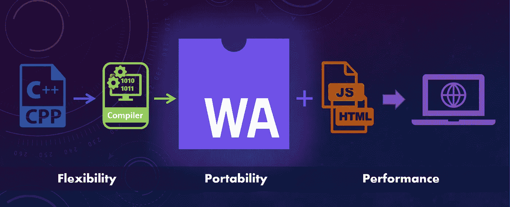

# 用网络组装提升你的游戏

> 原文：<https://medium.com/globant/step-up-your-game-with-web-assembly-3f787fe6e95?source=collection_archive---------0----------------------->

## 又名 WASM

Flexibility + Portability + Performance = WASM

如果我告诉你，就性能而言，有一种语言比 Javascript 高一截，等待你去探索，那会怎么样？它足够谦逊，可以快速处理 Javascript，但同时在性能方面会超越它。

考虑把用 C/C++编写的非 web 应用程序翻译成适合 web 的二进制模块的可能性。听起来很神奇，不是吗？

> 进来吧，网络大会！

WebAssembly(又名 WASM)是一种在 web 浏览器上运行的二进制格式。它以接近原生的**性能**运行，为您的应用程序带来整体提升。

它受汇编语言的启发，但它不是汇编语言。这使得**成为便携式**，可以独立于任何特定的机器使用。

正如我上面提到的，你可以用 C，C++和其他语言编写应用程序。这给了开发人员用他们喜欢的语言编写代码的**灵活性**。

# WASM 和 JAVASCRIPT 的区别是什么？

Javascript 曾经是一种解释语言，现在，在所有主要的 JavaScript 实现中，它都被 JIT 编译成本机代码。所以 JS 在执行之前是经过解析、编译、优化的。而 WASM 已经是二进制格式，在 WASM 被解码和编译，执行速度更快。当 wasm 文件很大并且需要时间加载时，Javascript 可以更快；但是，文件中已经存在的 javascript 函数可以直接执行，因为它不需要单独加载。

> *好吧好吧，你说，“这是真的吗？给我看看证据！”。那么，让我们看看一些目前正在使用 WASM 的应用程序。*

## **谷歌地球**

它是一个用 C++编写的可安装的桌面应用程序，然后被移植到 Android 和 IOS 上。后来，在 WebAssembly 的帮助下，使用相同的 C++代码将它移植到 Web 上。

## **AutoCad**

发布于 1982 年 12 月，是一个图形密集型桌面应用程序。开发团队使用 emscripten，能够将 35 年前的代码移植到网络上。

## **VLC**

js 是一个移植到 WASM 的 Vlc:一个完整的多媒体框架和 web 浏览器播放器。

## **张量流**

Tensorflow.js 还引入了一个新的后端，现在可以更快地进行预测。

还有很多像 Sql.js，sketup，openCV…

你可以在这个链接上找到完整的名单—[https://madewithwebassembly.com/](https://madewithwebassembly.com/)

# 那么，你如何将 WASM 加入到你的下一个网络应用程序中呢，

1.  Emscripten —编译您的 C 或 C++代码，并在所有浏览器中运行它。此外，您可以将 OpenGL 转换为 WebGL。
2.  Rust——Rust 编译成 rust generated wasm，它不包括额外的膨胀，就像垃圾收集器一样。高级优化和树抖动删除死代码。
3.  BlazorWASM —使用创建您的单页应用程序。Net 和 C#而不是 Javascript。如果您必须进行全栈开发，那么这是您必须要看一看的！
4.  AssemblyScript——如果你想坚持使用 javascript/typescript，那么 Assembly script 就是适合你的！它是 typescript 的一种变体，可以很容易地编译成 wasm，而无需学习新的语言。
5.  Kotlin/Native——kot Lin/Native 是一种将 kot Lin 代码编译成本机二进制文件的技术，可以在没有虚拟机的情况下运行。

# 问:这是否意味着 WASM 将取代 Javascript？

答:没有！WASM 将使用 Javascript。Javascript 将 WASM 模块粘合到 html 中。它应该用在需要大量操作的地方，否则 javascript 也能很好地工作。在某些情况下，已经看到，最初 javascript 函数可能需要时间，但是在后续执行中会更快，而 WASM 执行时间在每次后续执行中是相同的。

## **问:现在我们知道 WASM 使用 Javascript，但是我们能把它用于流行的 Javascript 框架吗？**

答:是的，您可以将 wasm 与 Angular、Vue 和 ReactJS 一起使用。您可以添加 wasm 加载器包，它可以在您的应用程序中加载 wasm 模块并访问功能。你可以在我的下一篇文章中读到: [**用 Web Assembly 组装 React 应用**](/globant/assembling-react-application-with-web-assembly-d683274d0afe) 。

> 此外，WASM 不仅仅是浏览器

不久前，Mozilla 宣布了一个名为 WASI(WebAssembly System Interface)的项目，以标准化 web assembly 代码如何在浏览器环境之外与操作系统交互。通过结合对 WebAssembly 和 WASI 的浏览器支持，编译后的二进制文件将能够在浏览器内外、跨不同设备和操作系统以接近本地的速度运行。你可以在这里找到更多关于它的信息。

# **注意要点，**

WASM 给了你用你喜欢的语言编码的灵活性。

JavaScript 没有被 WASM 取代，事实上，你需要它来加载 WASM。

它受到所有主流浏览器的支持，可以在所有平台上运行。

> “现在是你设置游戏的时候了！”
> 
> **希望这对您有所帮助！👏**