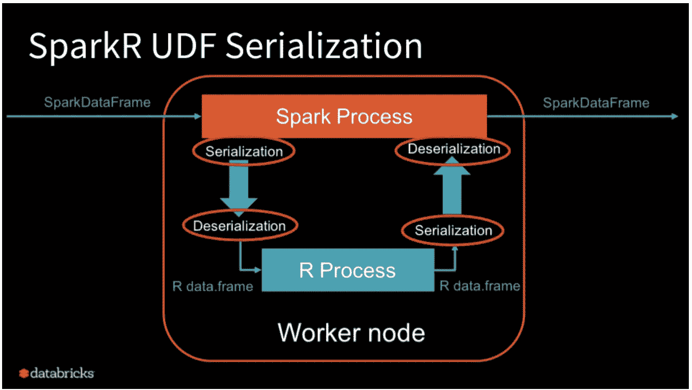

# 从 R 到 SparkR 的 STL 和 Holt

> 原文：<https://medium.com/walmartglobaltech/stl-and-holt-from-r-to-sparkr-1815bacfe1cc?source=collection_archive---------2----------------------->

用 SparkR 扩展 R 中的机器学习算法


为了扩展我们目前在 R 中运行的机器学习算法，我们最近在 SparkR 中进行了重写整个数据预处理和机器学习管道的活动。

我们使用时间序列模型 STL 和 Holt 进行预测。对数据进行预处理，以生成具有日期数据类型、插补、标准化的日期列，并最终对 w.r.t .相关列进行排序，为 ML 算法准备输入。由于我不熟悉 R，主要的挑战是理解当前设置中执行的数据操作，并在 SparkR 中找到相应的转换。这篇文章旨在分享我在这个过程中的学习。

## **入门**

1.  加载 spark 库并初始化 spark 会话

```
*library*(SparkR, lib.loc = "/usr/local/spark/R/lib")
sparkEnvir <- *list*(spark.num.executors='5',spark.executor.cores='5')*# initializing Spark context* sc <- *sparkR.init*(sparkHome = "/usr/local/spark",
                  sparkEnvir = sparkEnvir)*# initializing SQL context* sqlContext <- *sparkRSQL.init*(sc)
```

2.读取 CSV 文件

我们可以使用推断的 schema = "true "(即我们允许 Spark 推断 DF 中每一列的数据类型)来读取 CSV 文件，因为这减少了程序员将列显式转换为其数据类型的工作量。如果没有推断出模式，则每一列都被读取为字符串数据类型。我们还可以提供一个定制的模式。

```
# sales_training_file : location of the file sales_df <- *read.df*(sales_training_file, "csv", header = "true", inferSchema = "true", na.strings = "NA", integer64 = "numeric")*# number of rows in the dataframe
nrow*(sales_df)#list the columns of a df 
columns(sales_df)# show the first 5 rows 
head(sales_df, num = 5)# schema of the dataframe
schema(sales_df)# visualisation of starting data in the spark dataframe 
*str*(sales_df)*# 'SparkDataFrame': 4 variables:
# $ _c0            : int 1 1 4 7 5 6
# $ audit_date: POSIXct 2017-02-07 2017-03-07 2017-04-07 2017-05-07 2017-06-07 2017-07-07
# $ sales      : int 17 20 21 32 20 72
# $ price          : num 15.02 9.04 15.10 12.61 13.17 21.11*# rename a column 
sales_df <- *withColumnRenamed*(sales_df, "_c0", "product_id")# add a new column "count" with 0 as default value
sales_df_with_count <- withColumn(sales_df, "count", 0)# create custom schema, and pass to load callcustomSchema <- structType(
 structField("product_id", type = "integer"),
 structField("audit_date", type = "string"),
 structField("sales", type = "integer"),
 structField("price", type = "double"))sales_df_custom_schema <- read.df(price_training_file, "csv", header = "true", customSchema, na.strings = "NA", integer64 = "numeric")
```

3.数据操作

R 中的 data.table 和 data.frame 为我们提供了丰富的功能，包括选择、使用数据类型转换列、过滤、填充空值、排序、聚合，甚至跨数据框的连接。有了 spark，我们可以利用 spark-sql 来执行所有这些操作。

```
# cast column *audit_date to data type string*
sales_df$*audit_date* <- *cast*(sales_df$*audit_date*, dataType = "string")*# create a view on price_df
createOrReplaceTempView*(sales_df, "sales_table")sales_select <- sql("select product_id, audit_date, price from sales_table where price >= 15 order by audit_date")sales_grouped <- sql("select sum(sales),product_id from sales_table group by product_id")
```

除此之外，我们还可以使用 spark 数据框方法进行上述变换。

```
# fill all null entries of audit_date with "2016-02-07"
sales_df_cleaned <- *fillna*(sales_df, *list*("audit_date" = "*2016-02-07*"))# update price to 0, if price is less than 0
sales_df_cleaned$price <- *ifelse*(sales_df_cleaned$price < 0, 0, sales_df_cleaned$price)# filter all rows with price greater than 10
sales_df_filtered <- filter(sales_df, sales_df$price > 10)# group by audit_date and sum 
sales_df_grouped <- *groupBy*(sales_df, sales_df$audit_date)

sales_df_agg <- *agg*(sales_df_grouped, tot_sales=*sum*(sales_df$sales))
```

4.SparkR 数据帧到 R 数据帧，反之亦然

```
# SparkR data frame to R
sales_R_df <- collect(sales_df)# R to sparkR dataframe
sales_spark_df <- createDataFrame(sales_R_df)
```

*注意:我们应该小心使用 collect()，因为整个数据集都是在驱动程序中收集的。在大量数据的情况下，如果 Spark 驱动程序没有足够的内存，我们可能会面临 OOM。*

## **使用带火花的 R 包**

除了对数据帧的基本操作之外，R 还有一个丰富的包库，用于数据的统计分析。这些函数需要一个 R 数据帧或数据表，而**不支持 Spark 数据帧**。

[SparkR 用户定义函数](http://spark.apache.org/docs/latest/api/R/dapply.html) (UDF) API 为运行在 [Apache Spark](https://databricks.com/spark/about) 上的大数据工作负载提供了拥抱 R 丰富的软件包生态系统的机会。

SparkR UDF API 在 Spark JVM 和 R 进程之间来回传输数据。在 UDF 函数中，我们可以使用 R 数据框架来访问整个 R 生态系统。

SparkR 提供了四个 API，它们在 R 中运行一个用户定义的函数到 SparkDataFrame

*   *dapply()*
*   *dapplyCollect()*
*   *gapply()*
*   *gapplyCollect()*

下图阐释了在 UDF 执行期间执行的序列化和反序列化。数据被序列化两次，总共被反序列化两次。



[https://databricks.com/blog/2018/08/15/100x-faster-bridge-between-spark-and-r-with-user-defined-functions-on-databricks.html](https://databricks.com/blog/2018/08/15/100x-faster-bridge-between-spark-and-r-with-user-defined-functions-on-databricks.html)

**gapply()**

该函数将应用于`SparkDataFrame`的每个组，并且应该只有两个参数:分组键和对应于该键的 R `data.frame`。这些组是从`SparkDataFrames`栏中选择的。函数的输出应该是一个`data.frame`。模式指定了结果`SparkDataFrame`的行格式。它必须代表基于 Spark [数据类型](https://spark.apache.org/docs/latest/sparkr.html#data-type-mapping-between-r-and-spark)的 R 函数的输出模式。

如果我们想在结果上调用 *collect()* ，那么`gapplyCollect`是一个快捷方式。但是，不要求传递模式。请注意，如果在所有分区上运行的 UDF 的输出不能被拉至驱动程序并适合驱动程序内存，则`gapplyCollect`可能会失败。

r 代码

```
# *library*(energy)
sales_df[, p_value := *poisson.mtest*(sales,
                                                 R = 100)$p.value, by = *.*(product_id)]
```

等效火花码

```
sales_result_schema <- *structType*(
  *structField*("product_id", "integer"),
  *structField*("p_value", "double"))

poisson_sales <- *gapply*(sales_df, *c*("product_id"), function(key, x) {
  *library*(energy)
  y <- *data.frame*(key, *poisson.mtest*(x$sales, R = 100)$p.value)
}, sales_result_schema)
```

**dappy()**

对一个`SparkDataFrame`的每个分区应用一个函数。应用于`SparkDataFrame`的每个分区的函数应该只有一个参数，每个分区对应的`data.frame`将被传递给该参数。函数的输出应该是一个`data.frame`。Schema 指定了结果`SparkDataFrame`的行格式。它必须与返回值的[数据类型](https://spark.apache.org/docs/latest/sparkr.html#data-type-mapping-between-r-and-spark)匹配。

像`dapply`一样，我们可以使用`dapplyCollect`将一个函数应用到`SparkDataFrame`的每个分区，并将结果收集回来。该函数的输出应该是一个`data.frame`。但是，不要求传递模式。`dapplyCollect`如果在所有分区上运行的 UDF 的输出不能被拉至驱动程序并适合驱动程序内存，则可能失败。

## 用 SparkR 运行 STL 和 Holt

**将 STL 转换为 SparkR**

执行自定义函数 *stl_forecast()* 的 r 代码，该函数在内部使用来自*库(forecast)的函数 *stlf()* 。*对 *stl_forecast()* 的参数是 R data.table。

```
sales_R_df %>%
  *group_by*(product_id) %>%
  *do*(*stl_forecast*(*data.table*(.))) %>%
  *data.table*(.) -> dt_stl
```

对于 SparkR，我们首先需要创建一个将被映射到结果数据框的方案。

```
df_stl_schema <- *structType*(
  *structField*("product_id", "integer"),
  *structField*("audit_date", "date"),
  *structField*("stl_forecast", "double"),
  *structField*("stl_forecast_std", "double")
)
```

使用 gapply 对 SparkR 数据框执行 *stl_forecast()* 。

```
df_stl <- *gapply*(sales_df, *c*("product_id"), function(key, x) {
  *library*(data.table)
  *library*(lubridate)
  *library*(dplyr)
  *library*(forecast)
  *library*(TTR) # gapply passes R data frame, change to data table and pass as arg to stl_forecast() sales1 <- *data.table*(x)
  y <- *data.frame*(key,*stl_forecast*(sales1))
}, df_stl_schema)
```

**将霍尔特转换为火花**

类似地，我们有一个自定义方法 holt_forecast()，它需要一个 R 数据表。

```
sales_R_df %>%
  *group_by*(product_id) %>%
  *do*(*holt_forecast*(*data.table*(.))) %>%
  *data.table*(.) -> dt_holt
```

SparkR 中的实现

```
dt_holt_schema <- *structType*(
  *structField*("product_id", "integer"),
  *structField*("audit_date", "date"),
  *structField*("holt_unit_forecast", "double"),
  *structField*("holt_unit_forecast_std", "double")
)

dt_holt <- *gapply*(sales_df, *c*("product_id"), function(key, x) {
  *library*(data.table)
  *library*(lubridate)
  *library*(dplyr)
  *library*(forecast)
  sales <- *data.table*(x)
  y <- *data.frame*(key,*holt_forecast*(sales))
}, dt_holt_schema)
```

## **观察结果**

我们预计精度会有一些差异，这可能是由于 Spark JVM 和 R 环境之间的多次数据传输造成的。但是在我们对生成的数据集进行验证期间，**我们观察到** **使用 SparkR UDFs 的预测与之前在 R.** 中生成的结果完全匹配

[1]:通过 Databricks 上的用户定义函数将 Apache Spark 和 R 之间的桥接速度提高 100 倍[https://data bricks . com/blog/2018/08/15/100 x-fast-Bridge-Spark-and-R-with User-Defined-Functions-on-data bricks . html](https://databricks.com/blog/2018/08/15/100x-faster-bridge-between-spark-and-r-with-user-defined-functions-on-databricks.html)

[2]: SparkR 文档[https://spark . Apache . org/docs/latest/SparkR . html # spark data frame](https://spark.apache.org/docs/latest/sparkr.html#sparkdataframe)