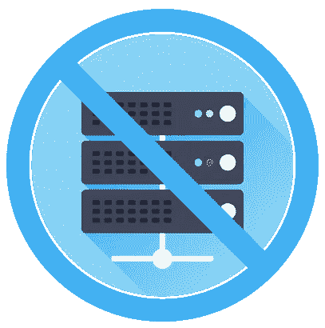

# 停止使用服务器来处理网络钩子

> 原文：<https://medium.com/square-corner-blog/stop-using-servers-to-handle-webhooks-675d5dc926c0?source=collection_archive---------2----------------------->

> 注意，我们已经行动了！如果您想继续了解 Square 的最新技术内容，请访问我们的新家[https://developer.squareup.com/blog](https://developer.squareup.com/blog)

Webhooks 正日益成为从不同服务获取实时数据的主要方法。 [GitHub](https://developer.github.com/webhooks/) 、 [Slack](https://api.slack.com/custom-integrations/outgoing-webhooks) 、 [SendGrid](https://sendgrid.com/docs/API_Reference/Webhooks/index.html) ，甚至 [Square](https://docs.connect.squareup.com/api/connect/v1#webhooks-overview) 都使用 webhooks 让你看到数据或者得到你账户上发生的事件的通知。Webhooks 非常棒，因为它们非常容易处理，并且可以避免开发人员不得不构建一些陈旧的轮询系统，这些系统最终会在网络请求和检索到的实际有用数据之间造成相当大的浪费。

当创建一个服务来处理 webhooks 时，您有几个选择:您可以扩展我们的应用程序来处理来自定义的 URL 的输入数据，您可以创建一个微服务，或者您可以创建一个函数作为服务(FaaS)函数来处理我们的 webhooks。我们将简要介绍每个选项和可能的权衡，然后总结一个 Square 的 FaaS webhook 处理程序的示例实现。

## 扩展您的应用

Source: [Giphy (CCTV Servers)](https://giphy.com/gifs/fj-cctv-servers-128kpIwiArqvUk)

扩展应用程序的好处是可以利用应用程序中已有的任何助手或其他库。您的助手(或其他应用程序工具)可以帮助处理这些传入的数据，并可能使其更容易管理。您的应用程序可能会一直运行，所以让它处理 webhooks 的传入数据是没有问题的。然而，这种方法可能是一个缺点，因为您可能会扩展您的应用程序来处理一些不是核心功能或者不应该与之耦合的东西。扩展如何工作实际上取决于您自己的应用程序是如何构建的，但是最好将 webhooks 的处理方式与应用程序之外的事情分开。

## 微服务

Source: [Giphy (Computer Ants)](https://giphy.com/gifs/computer-ants-rthingsforants-I5xVaRw3WqYBG)

与此同时，微服务方法可能会帮助您远离应用程序，并允许它简单地通信或处理这些新数据，供应用程序稍后使用。不幸的是，我们仍然有可伸缩性和供应的缺点，因为我们仍然需要不断地监听发送到 webhook 处理程序的新数据。尽管完全有可能估计有多少数据可能会进入我们的 webhook 处理程序并相应地进行配置，但仍然很可能会有大量的停机时间，因为它只是在等待服务请求。

## 作为服务发挥作用

Source: [Giphy (Saturday Night Live GIF)](https://giphy.com/gifs/snl-ryan-gosling-3o7aD6igymCUmBOorm)

在这一点上，我知道很明显，我将支持使用 FaaS 处理 webhooks 的所有好处，尽管我也承认有一些相当恼人的权衡。首先是好处。使用 FaaS 处理 webhook 数据的一个优点是，它允许几乎无限的可伸缩性，因此您不必担心供应过多或不足。您的函数只在新事件发生时运行，因此您不必为了处理 webhook 数据而连续运行服务器，从而节省了基础设施成本。另一方面，使用 FaaS 的缺点通常是可维护性、测试和冷启动。有一些[工具](https://serverless.com/framework/)帮助维护你的功能版本，部署功能，以及[保持功能温暖](https://serverless.com/blog/keep-your-lambdas-warm/)。由于 webhooks 不直接为用户服务，而且大多数 webhooks 提供者对所需的响应时间都相当宽容，所以 FaaS 非常适合处理 web hooks，尽管存在冷启动问题。

## 工作示例

因此，这在理论上是好的，但最好展示一个我们如何在 FaaS 平台上实现 webhook 处理程序的例子。这个例子将在使用他们的[谷歌云功能](https://cloud.google.com/functions/)的[谷歌云平台](https://cloud.google.com/)上，但是我们涉及的大部分内容将跨平台翻译，因为我们使用的是 JavaScript。

首先，我们希望确保尽可能快地为 webhook 请求提供服务，因为我们不希望它超时。如果我们的 webhook 处理程序重复服务请求的时间太长，并且超时，许多 webhook 系统将停止服务我们的 webhook URL，并认为它不再工作。我们的目标是在发送回我们的 200 响应之前最小化处理时间，以确保我们可以考虑到我们的函数可能存在的任何[冷启动](https://dzone.com/articles/aws-lambda-performance-and-cold-starts)滞后时间。

为了使事情变得简单和工作更快，我们将把我们为 webhook 得到的 JSON 响应写入一个 JSON 文件，并上传到 Google 云存储中。这将允许我们的 webhook 处理程序快速响应请求，我们可以定期检查这个桶中的新事件，甚至编写另一个 Google Cloud 函数来处理新的 JSON 文件。

如果你对 FaaS 完全陌生，一个简单的开始方法是使用[无服务器](https://serverless.com)。它是一个帮助云提供商创建和部署功能的工具。您可以使用他们的[快速入门指南](https://serverless.com/framework/docs/providers/google/guide/quick-start/)来生成一个模板，他们也有关于为每个提供商设置凭据的指南。在这里，我们将为我们的 webhook 处理程序展示一个稍微填充的无服务器模板的样子:

We’re omitting over a few things here, so don’t expect the above to work.

我们的例子给出了最终 webhook 处理程序如何运行的简化版本。我们正在字符串化我们的 JSON，使用`fs`模块将其写入`/tmp/`目录。然后，我们使用他们的 NodeSDK 将它发送到 Google 云存储中。最后，我们清理本地创建的临时 JSON 文件，并在发送我们的`200`响应之前记录我们的成功。

Now we have something that could be used to process our webhooks.

上面的 webhook 处理程序显示了如何处理来自我们的 Square 帐户的事件。我们添加了对`X-Square-Signature`报头的验证，以验证它是来自 Square 的有效载荷。确保 webhook 服务提供某种方法来验证正在发送的数据总是值得的，因为不良行为者有可能通过向您的 webhook 处理程序发送恶意数据来中断或操纵服务。

在这里验证我们的头可以确保我们没有将任意的有效载荷存储到我们的 Google 云存储桶中。从这里，您可以选择创建另一个函数来处理新数据，因为新数据来自另一个 Google Cloud 函数，或者您可以简单地让您的应用程序定期检查这个存储桶来处理新事件。

例如，您可以让它检查退款是否超过某个限制，监控库存中是否有太低的商品，或者查看高价值商品何时售出。你可以使用 Square 的 webhooks [这里](https://docs.connect.squareup.com/api/connect/v1/#webhooks-overview)找到更多关于你可以跟踪的事件的信息。

我强烈推荐尝试一下[无服务器](https://serverless.com/framework/docs/)，创建你自己的 webhook 处理程序，作为对你的 Square 账户中不同事件做出反应的一种方式。如果您还没有 Square 帐户，请务必在 https://squareup.com/developers[注册。请在评论中告诉我们你是如何使用 FaaS 或 webhooks 的，我们希望听到更多！](https://squareup.com/developers)

*想要更多？* [*注册*](https://www.workwithsquare.com/developer-newsletter.html?channel=Online%20Social&sqmethod=Blog) *获取我们每月的开发者简讯。*