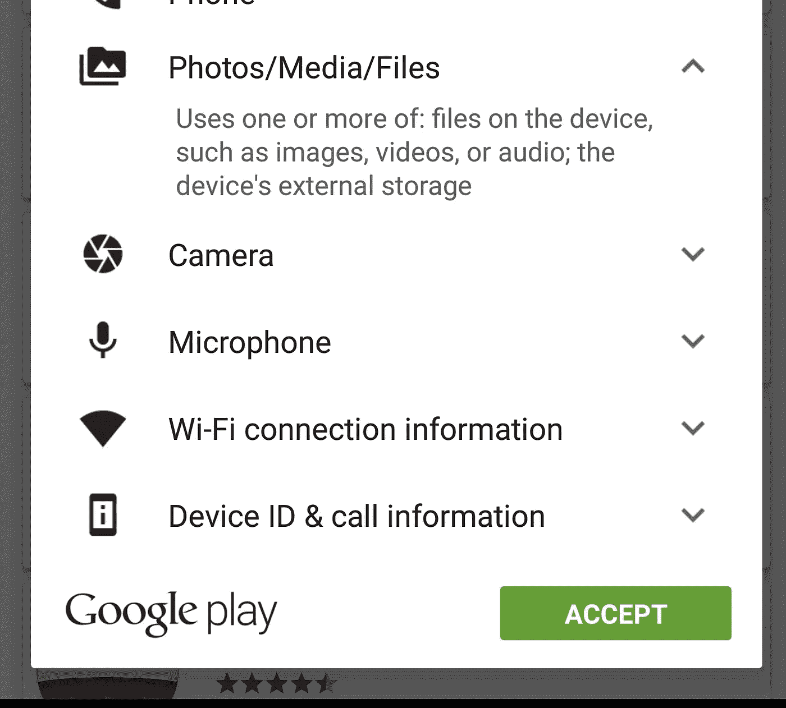

# 谷歌地图不再需要存储权限！

> 原文：<https://medium.com/google-developer-experts/storage-permission-with-google-maps-on-android-d2bc7ead412a?source=collection_archive---------2----------------------->

**更新:**随着 Google Play Services 8.3 的发布，完全不再需要存储权限。现在，您可以安全地完全删除该权限。以下是官方文档:

> 如果你的目标是 Google Play services SDK 的**版本 8.3 或更高版本**，你不再需要 WRITE_EXTERNAL_STORAGE 权限来使用 Google Maps Android API。

一直以来，谷歌地图 Android SDK 都要求我们拥有 **WRITE_EXTERNAL_STORAGE** 权限。当他们第一次发布 SDK 时，情况并非如此。大约 2 年前，我在我的应用程序中使用 Maps fine，突然有了一个更新，我出现了以下崩溃:

```
java.lang.RuntimeException: Unable to start activity ComponentInfo{com.tasomaniac.example/com.tasomaniac.example.MapActivity}: java.lang.SecurityException: The Maps API requires the additional following permissions to be set in the AndroidManifest.xml to ensure a correct behavior:
    <uses-permission android:name="android.permission.WRITE_EXTERNAL_STORAGE"/>
            at android.app.ActivityThread.performLaunchActivity(ActivityThread.java:2416)
.
.
```

我不想先获得存储许可。事实上，我很努力去避免。我不顾一切地添加了权限，但没有成功。更糟糕的是，它阻止了我们在 Google Play 中的自动更新，因为我们有了新的权限。

多年来，我们一直忍受着这一点。

权限描述说应用程序可以访问设备上的*文件，如图像、视频或音频*。



Play Store Dialog with WRITE_EXTERNAL_STORAGE permission

因此，我的应用程序中有很多星星。用户说“*你为什么要求访问我的照片和视频？*”。他们是对的！他们总是对的。我不想看你的照片，也不会看。我不得不得到那个许可。

一个 ndroid 棉花糖给我们带来了运行时权限。他们很棒！用户在安装或更新应用程序时看不到权限。用户对应用程序的功能有更多的控制权；例如，用户可以选择让相机应用程序访问相机，但不访问设备位置。

但是想象一下你有一个集成了谷歌地图的应用程序，想象一下你必须在运行时请求 WRITE_EXTERNAL_STORAGE。你如何向用户解释这一点？不明显且需要解释的运行时权限更糟糕。这是其中之一。

幸运的是，他们解决了这个问题，并取消了存储权限。但不是全部，只针对安卓棉花糖。

如果你使用*谷歌地图*并且你想瞄准*安卓棉花糖*，这是你需要做的:

*   首先你需要使用 *Google Play 服务 8.1.0*
*   其次，您需要在您的权限中添加 *maxSdkVersion* 属性，如下所示:

```
<uses-permission
        android:name="android.permission.WRITE_EXTERNAL_STORAGE"
        android:maxSdkVersion="22" />
<uses-permission
        android:name="android.permission.READ_EXTERNAL_STORAGE"
        android:maxSdkVersion="22" />
```

他们还在[文档](https://developers.google.com/maps/documentation/android-api/config#add_the_required_settings_to_your_apps_manifest)中说，他们将在下一个版本中完全删除它。

> 从 Google Play services SDK 的下一个版本开始，对 WRITE_EXTERNAL_STORAGE 权限的要求将从 Google Maps Android API 中完全删除。

# 结论

如果你有谷歌地图，并且想瞄准 Android M，请在你的应用程序中做所描述的改变！

当他们永久取消许可的必要性时，我会更新帖子。

**注:**下面是来自 Big Android BBQ 2015 的[伊恩·莱克](https://medium.com/u/51a4f24f5367?source=post_page-----d2bc7ead412a--------------------------------)关于存储权限的精彩演讲:【https://www.youtube.com/watch?v=C28pvd2plBA】T4

在 [Twitter](https://twitter.com/tasomaniac) 、 [Google+](https://plus.google.com/+SaidTahsinDane/posts) 和 [Medium](/@tasomaniac/) 上关注我。