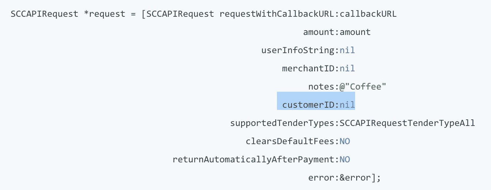
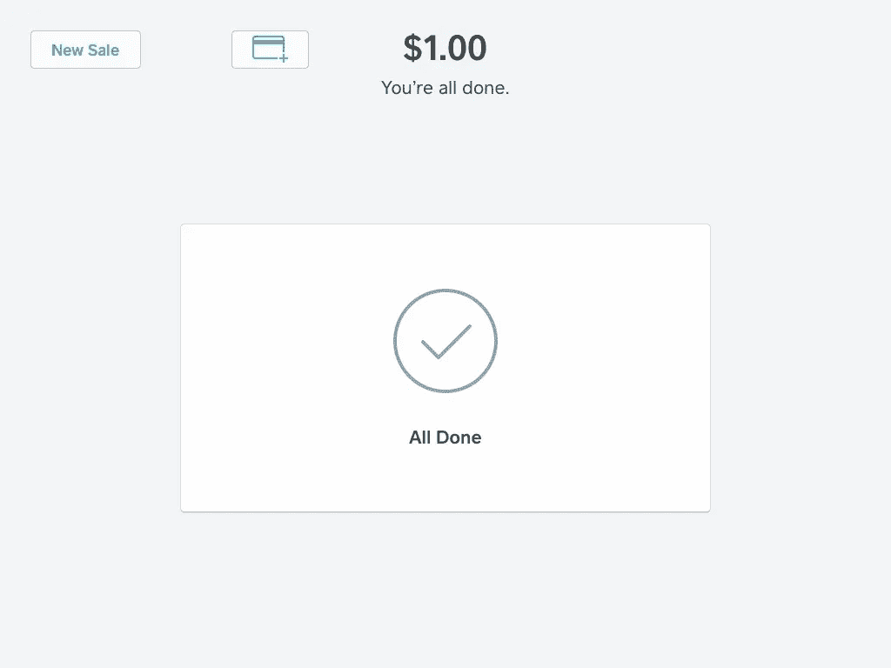

# 使用销售点 API 安全存储客户卡信息。

> 原文：<https://medium.com/square-corner-blog/storing-customer-card-information-securely-using-point-of-sale-api-9ee028b63190?source=collection_archive---------2----------------------->

## 您可以使用 Square 的销售点 API 直接从 Square 销售点应用程序将支付信息保存到客户档案中。一旦存储了一张卡，您就可以在将来使用交易 API 对此卡进行收费，从而实现快速远程计费，并为您的客户提供更好的体验。

> 注意，我们已经行动了！如果您想继续了解 Square 的最新技术内容，请访问我们在 https://developer.squareup.com/blog[的新家](https://developer.squareup.com/blog)

## 打开文件上的卡

您可以直接从 Square 销售点应用程序启用卡存档:

1.  打开 Square 应用程序，点击菜单图标。
2.  点击设置>客户管理。
3.  打开充值并将卡保存到客户档案，从应用内客户目录中保存客户的支付卡信息。
4.  要在销售后保存卡，请在结帐后打开“显示保存卡”按钮。

## **保存卡片**

在您的应用中使用[销售点 API](https://docs.connect.squareup.com/articles/point-of-sale-api-overview)使用与原生 Square 销售点应用相同的支付流程。这意味着在交易后为客户保存卡的流程与您单独使用销售点应用程序是一样的。由于您在设备上安装了销售点应用程序，因此您也可以直接通过销售点应用程序保存客户的卡。

你可以在本文中了解到所有关于将卡保存在文件中的信息，但在交易后添加卡的最简单方法之一是。如果您在启动交易时传入一个`customer_id`，那么您会在左上角的确认屏幕上看到一个将卡添加到文件中的按钮。要在您的事务中传递`customer_id`,您可以将以下字段添加到您的 iOS 代码中:



或者使用您的 Android 应用程序:

```
[**ChargeRequest.Builder**](https://docs.connect.squareup.com/api/point-of-sale/android/com/squareup/sdk/pos/ChargeRequest.Builder.html)**.**[**customerId**](https://docs.connect.squareup.com/api/point-of-sale/android/com/squareup/sdk/pos/ChargeRequest.Builder.html#customerId-java.lang.String-)(java.lang.String customerId)
```

然后，您的确认屏幕会有额外的“添加卡”按钮。



## **给文件上的卡充电**

现在，您已经为客户记录了该卡，您可以使用[收费](https://docs.connect.squareup.com/api/connect/v2#endpoint-charge)端点为后续服务或任何其他类型的订阅向客户收费。有一些现有的指南强调了代码的过程，但是在高层次上，您需要:

*   使用[检索/列出客户端点](https://docs.connect.squareup.com/api/connect/v2#navsection-customers)找到您要收费的客户。当您找到合适的客户时，需要注意的重要事情是他们的`customer_id`和您之前附上的卡的`customer_card_id`。根据您的用例，将`customer_id`和`cusomter_card_id`单独存储在您的用户数据库中可能是个好主意，这样您就可以在将来跳过这一步。
*   [通过将`customer_id`和`customer_card_id`提供给充电端点(而不是通常`card_nonce`)来对用户进行充电](https://docs.connect.squareup.com/api/connect/v2#endpoint-charge)。

参见[定期支付文档](https://docs.connect.squareup.com/articles/processing-recurring-payments-ruby)和[PHP 定期支付](/square-corner-blog/recurring-charges-with-php-and-card-on-file-60f2bcb9aeac)博客文章中关于信用卡收费的完整示例。如果你对这个帖子或其他帖子有任何问题/评论，请通过评论或联系 Twitter 上的[@ square dev](https://twitter.com/squaredev)让我们知道。