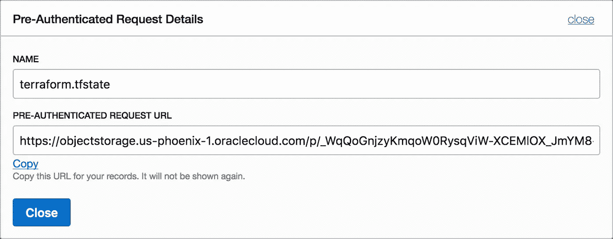
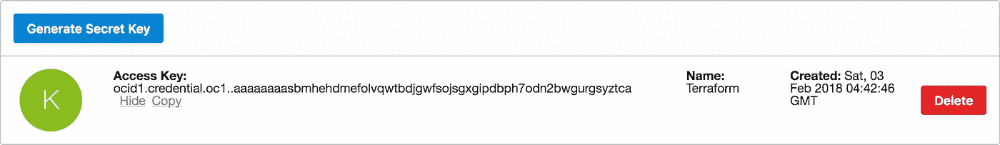
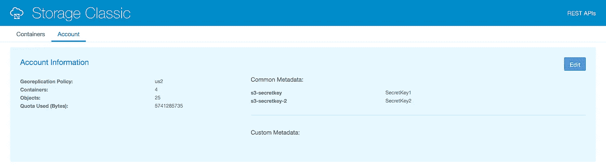
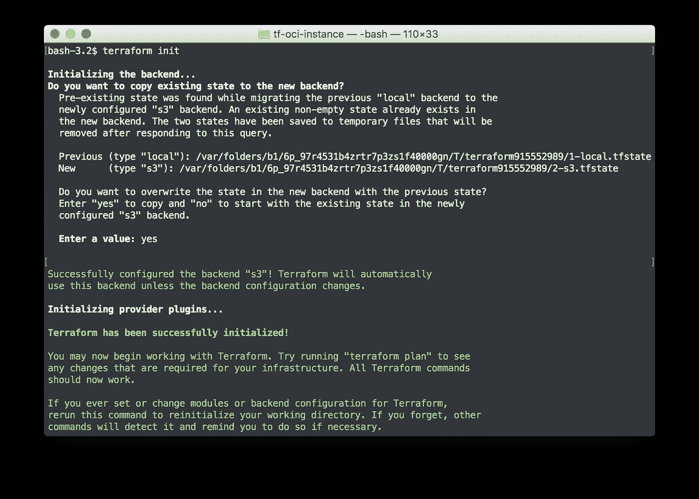

# 将 Terraform 远程状态存储到 Oracle 云基础架构对象存储

> 原文：<https://medium.com/oracledevs/storing-terraform-remote-state-to-oracle-cloud-infrastructure-object-storage-b32fe7402781?source=collection_archive---------0----------------------->

一旦您对 Terraform 的使用超出了简单的个人使用开发和测试环境的使用场景，您就需要考虑如何跨项目或团队保持和共享 Terraform 状态。

Terraform 的 [**远程状态**](https://www.terraform.io/docs/state/remote.html) 配置支持许多远程存储选项，尽管 Terraform 目前没有为 Oracle 云基础架构(OCI)提供特定的远程状态后端，但一些现有的后端选项与 Oracle 对象存储服务兼容。

在本文中，我们将了解三个与 [OCI 对象存储](https://cloud.oracle.com/en_US/infrastructure/storage/object-storage/features)和 [OCI 对象存储经典](https://cloud.oracle.com/en_US/storage-classic/object-storage/features)(以及客户云)服务配合使用的特定选项。

*   **带有 **HTTP** 远程状态后端的 OCI 对象存储**
*   **OCI 对象存储**与 **S3** 兼容的远程状态后端
*   **OCI 对象存储经典**与 **S3** 兼容**远程状态后端**

*Terraform 还支持其他几个远程状态后端存储选项，包括*[](https://www.terraform.io/docs/backends/types/artifactory.html)**[*etcd*](https://www.terraform.io/docs/backends/types/etcd.html)*，以及* [*领事*](https://www.terraform.io/docs/backends/types/consul.html) *。这些可能是以后文章的主题…***

**远程状态后端配置的选择与所使用的 Terraform 提供商无关，以下所有配置选项可用于 Oracle 云基础架构的`oci`提供商、Oracle 云基础架构 Classic 和 Oracle 云 at 客户的`opc`提供商或任何其他 Terraform 提供商。**

# ****使用 HTTP 远程状态后端****

**该选项与 **OCI 对象存储**服务一起工作，只需要创建一个对共享状态文件对象的读/写[预认证请求](https://docs.us-phoenix-1.oraclecloud.com/Content/Object/Tasks/managingaccess.htm#par) (PAR)，该共享状态文件对象位于将用于远程状态的存储桶中。在创建 PAR 之前，状态文件必须存在于 bucket 中。上传现有状态或初始状态的空文件。**

****

**然后在`[**http**](https://www.terraform.io/docs/backends/types/http.html)`后端配置中使用预认证的请求 URL。**

```
**terraform {
  backend "http" {
    update_method = "PUT"
    address       = "https://objectstorage.us-phoenix-1.oraclecloud.com/p/_WqQoGnjzyKmqoW0RysqViW-XCEMlOX_JmYM8-eBOh0/n/example/b/terraform-state/o/terraform.tfstate"
  }
}**
```

**为了安全起见，考虑在预认证请求上设置一个适当的到期日期，并定期更新 par。可以为支持密钥轮换策略对象创建多个解析器。**

**还可以用`http`后端来配置`[terraform_remote_state](https://www.terraform.io/docs/providers/terraform/d/remote_state.html)`数据源，以便跨项目共享状态。为了与其他配置共享远程状态，您可以使用相同的 PAR URL，或者考虑创建一个单独的只读 PAR**

```
**data "terraform_remote_state" "project_a" {
  backend = "http"
  config {
    address = "https://objectstorage.us-phoenix-1.oraclecloud.com/p/T-MwMoeU7Y03qTE30bO1IAMElJdbYmMGvAYblYg3f3c/n/oraclepts/b/terraform-state/o/terraform.tfstate"
  }
}**
```

# **使用 S3 远程状态后端**

**从`Terraform v0.11.3`开始， **OCI 对象存储**和 **OCI 经典对象存储**都提供与`[**s3**](https://www.terraform.io/docs/backends/types/s3.html)`后端兼容的 S3 API**

**使用 s3 后端需要一些额外的设置。首先，必须使用 s3 身份验证密钥启用对象存储帐户**

**对于 **OCI 对象存储**S3 兼容 API 密钥是按用户设置的，在 OCI 控制台生成密钥“标识>用户>用户详情>亚马逊 S3 兼容 API 密钥”。详见[管理用户凭证](https://docs.us-phoenix-1.oraclecloud.com/Content/Identity/Tasks/managingcredentials.htm#s3)**

****

**OCI console: Identity > Users > User Details > Amazon S3 Compatibility API Keys**

**对于 **OCI 经典对象存储**，S3 API 密钥在存储经典控制台“存储经典控制台>帐户”中的帐户级别设置。参见[使用兼容 S3 API 的客户端访问 Storage Classic](http://docs.oracle.com/en/cloud/iaas/storage-cloud/cssto/using-s3-api-compatible-clients-access-storage-classic.html)**

****

**Storage Classic console: Account**

**默认情况下，s3 后端会在`~/.aws/credentials`中查找存储帐户凭证。可以使用 s3 后端`[shared_credentials_file](https://www.terraform.io/docs/backends/types/s3.html#shared_credentials_file)`选项设置凭证文件的替代位置。**

****注意:*千万不要*直接在 Terraform 后端配置中设置** `access_key` **和** `secret_key` **属性，这是不好的安全做法。****

**用适当的对象存储凭证配置凭证文件中的`[default]`条目。凭证文件可以包含多个凭证配置文件，如果使用不同的配置文件名称，请确保在 Terraform 配置中也设置 s3 后端`[profile](https://www.terraform.io/docs/backends/types/s3.html#profile)`选项。**

**例如，对于 OCI 对象存储:**

```
**[default]
aws_access_key_id=**ocid1.credential.oc1..aaaaaaaasbmhehdmefolvqwtbdjgwfsojsgxgipdbph7odn2bwgurgsyztca**
aws_secret_access_key=**mSTdaWhlbWj3ty4JZClm0NUZV52elImWjayJLJ6OH9A=****
```

**其中`aws_access_key_id`和`aws_secret_access_key`是 OCI 控制台提供的用户特定值。**

**例如，对于 OCI 经典物件存储:**

```
**[default]
aws_access_key_id=**Storage-acme**
aws_secret_access_key=**SecretKey1****
```

**其中`aws_access_key_id`可以从我的服务控制台中显示的 Storage Classic REST 端点获得。将`aws_secret_access_key`设置为存储帐户上配置的 s3 键。**

```
**REST Endpoint https://**{foo}**.storage.oraclecloud.com/v1/Storage-**{bar}**
              \_________________ _________________/    \_____ _____/
                               v                            v
                            endpoint                  access_key_id**
```

**在 Terraform s3 后端配置中，以以下格式设置 OCI 或 OCI 经典对象存储`endpoint`:**

**OCI 对象存储:
`https://**{namespace}**.compat.objectstorage**.{region}**.oraclecloud.com`**

**存储经典:
`https://**{foo}**.storage.oraclecloud.com`**

****示例对象存储 S3 后端配置****

```
**terraform {
  backend "s3" {
    bucket   = "terraform-state"
    key      = "terraform.tfstate"
    region   = "us-phoenix-1"
    endpoint = "https://acme.compat.objectstorage**.**us-phoenix-1.oraclecloud.com" skip_region_validation      = true
    skip_credentials_validation = true
    skip_requesting_account_id  = true
    skip_get_ec2_platforms      = true
    skip_metadata_api_check     = true
    force_path_style            = true
  }
}**
```

**类似于 HTTP 后端的例子，s3 后端配置也可以用于`[terraform_remote_state](https://www.terraform.io/docs/providers/terraform/d/remote_state.html)`数据源，用于跨 Terraform 项目共享状态**

**配置完后端后，运行`terraform init`完成设置。如果您有一个现有的`terraform.tfstate`，那么 Terraform 将提示确认当前状态是否应该上传到远程状态。**

****