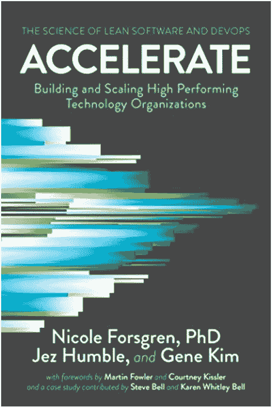

# 从项目中扼杀数据库客户端

> 原文：<https://blog.kotlin-academy.com/strangling-away-a-database-client-from-a-project-4b6f8b2d8b08?source=collection_archive---------1----------------------->

在我们基于 Vert-X 的 Kotlin 项目中，我们的团队使用 **Jetbrains/Exposed** 进行所有数据库交互。随着时间的推移，我们希望从 ORM 中迁移出来，转而使用**vietj/reactive-postgres-client**。


These vines would one day completely cover the wall, but it does so slowly, and step by step.

我们项目中所有与数据库相关的代码都封装在存储库类中。因此，我们只需要用使用 reactive-pg-client 驱动程序的新版本的存储库类替换它们，将更改推向生产，并以一品脱结束一天的工作。

很简单。我要补充的是，这是分层架构和 [SRP](https://en.wikipedia.org/wiki/Single-responsibility_principle) 的胜利。

然而，我认为这样一个简单的转换可能会带来一些问题:

1.  将**中的所有代码切换到**将意味着代码到主分支的延迟集成。如果有人和你在相同的代码区域工作，这也可能导致合并冲突和可能的返工。
2.  如果新的 reactive-pg-client 库在生产中没有按预期工作，您必须有一种方法通过切换特性来立即恢复到旧的实现。

第 1 点与 [*持续集成*](https://martinfowler.com/articles/continuousIntegration.html) (CI)的工程文化有关，第 2 点与拥有低 [*平均恢复时间*](https://en.wikipedia.org/wiki/Mean_time_to_recovery) *有关。*这两点在我极力推荐的一本书中都有广泛的论述，[](https://www.amazon.co.uk/Accelerate-Software-Performing-Technology-Organizations-ebook/dp/B07B9F83WM)**。**

**

## ***科特林代表***

*一种方法是[扼杀者无花果模式，](https://martinfowler.com/bliki/StranglerFigApplication.html)我们可以使用 Kotlin 代理来完成这项工作。要了解更多关于 Kotlin 代表的信息，请点击这里阅读。*

*简而言之，使用 Kotlin 委托，您可以定义一个接口的实现，其中我们可以将所有未被覆盖的*属性委托给另一个实现。**

*回到我的团队的用例，这将意味着我们将有一个现有存储库接口的新实现，它使用 reactive-postgres-client 库，并将所有未被覆盖的方法/功能委托给现有的公开存储库。代码将如下所示:*

*在上面的例子中，因为`saveGuest()`没有在`ReactivePgClientBasedRepository`中实现，这个类将使用在`DefaultRepository`类中定义的实现。是的，所有这些看起来确实非常像 [*装饰者*](https://sourcemaking.com/design_patterns/decorator) 设计模式。*

## *在代码中使用新的存储库*

*下一步是将新存储库的实例注入到需要它们的类中。如何做到这一点的确切方式取决于您的 DI 框架。然而，我们必须利用特性切换来选择必须注入哪个存储库实例——新版本还是旧版本。*

*这是为了在生产中事情不像预期的那样工作的情况下，我们将能够快速切换回旧的实现，而不必进行代码更改。*

*如果您正在使用 Spring 框架，并且如果特性标志是使用像环境变量这样简单的东西实现的，那么一种方法就是使用`@ConditionalOnProperty`注释。这里有一个例子。*

*`@ConditionalOnProperty`确保只有在定义了属性`featuretoggles.useReactivePgClientRepository`的情况下才会加载`ReactivePgClientBasedRepository` bean。`@Primary`确保存储库优先于旧的`ExposedBasedRepository`*

*因此，如果应用程序像这样启动，我们将使用新的存储库:*

```
*FEATURETOGGLES_USEPGREACTIVECLIENTREPOSITORY=true ./gradlew bootRun*
```

*如果在未定义环境变量的情况下启动旧的基于公开的存储库:*

```
*./gradlew bootRun*
```

## *重用现有的数据库集成测试*

*我们还希望为新的存储库类重用现有的集成测试，而不是编写新的测试。*

*如果您正在使用 JUnit5，您可以使用一个[参数化测试](https://www.baeldung.com/parameterized-tests-junit-5)将您的两个存储库实例传递到您的测试用例中，并让测试照常运行。*

*例如，您可能有这样的现有存储库测试*

*将它转换成参数化的测试，并对这两种类型的存储库运行断言*

*由于 JUnit5 的`@MethodSource`的工作方式，我们需要`@JvmStatic`。*

*这样，我们可以确保我们的新存储库与旧存储库完全一样。*

## *更快、更频繁地将代码合并到 master 中*

*由于我们使用了 Kotlin 委托，我们可以在实现新存储库中的每个方法时将代码合并到 master 中，我们不必等到所有方法都实现了。这允许团队的其他成员更快地看到最新版本的代码，这意味着合并冲突的机会更少，而且拉请求也更小，更易于管理。*

## ***总结***

*我希望这篇文章对你有用，如果你不得不这样做的话。*

*始终重视:*

1.  *在您的母版中拥有生产就绪代码*
2.  *经常整合以掌握*
3.  *重复使用现有的测试，以及*
4.  *利用这种语言(在这个例子中是 Kotlin)尽可能快速简单地做一些事情。*

## *链接:*

1.  *反应式 Pg 客户:【http://www.julienviet.com/reactive-pg-client/guide/java/ *
2.  *扼杀者模式:[https://docs . Microsoft . com/en-us/azure/architecture/patterns/stranger](https://docs.microsoft.com/en-us/azure/architecture/patterns/strangler)*
3.  *科特林的代表模式:[https://kotlinlang.org/docs/reference/delegation.html](https://kotlinlang.org/docs/reference/delegation.html)*
4.  *SpringBoot 中的简单特征-切换:[https://medium . com/@ abyu/feature-toggles-in-spring boot-kot Lin-app-56 E3 DBE F9 a 86](https://reflectoring.io/spring-boot-conditionals/)*
5.  *如何使用参数化测试:[https://www.baeldung.com/parameterized-tests-junit-5](https://www.baeldung.com/parameterized-tests-junit-5)*

# *单击👏说“谢谢！”并帮助他人找到这篇文章。*

*了解卡帕头最新的重大新闻。学院，[订阅时事通讯](https://kotlin-academy.us17.list-manage.com/subscribe?u=5d3a48e1893758cb5be5c2919&id=d2ba84960a)，[观察 Twitter](https://twitter.com/ktdotacademy) 并在媒体上关注我们。*

*如果您需要 Kotlin 工作室，请查看我们如何帮助您: [kt.academy](https://www.kt.academy/) 。*

*[](https://kotlin-academy.us17.list-manage.com/subscribe?u=5d3a48e1893758cb5be5c2919&id=d2ba84960a)*