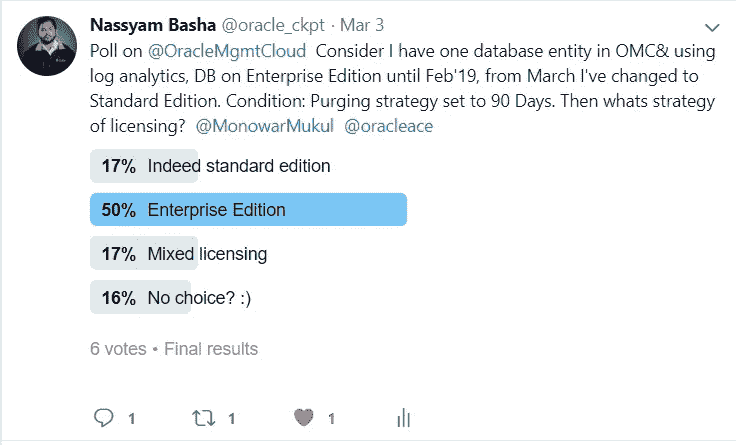
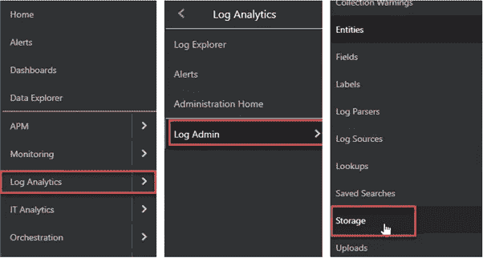
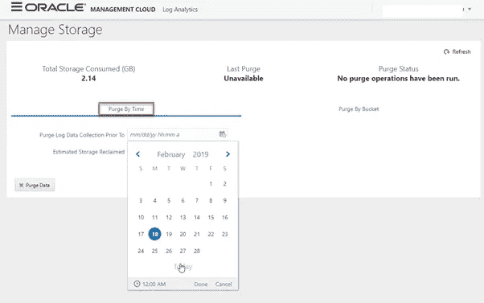
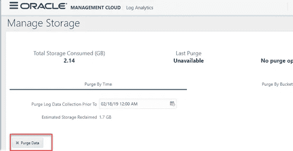
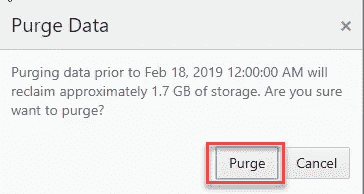
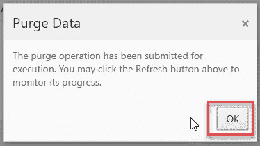
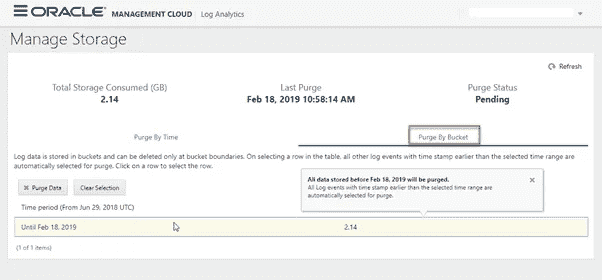
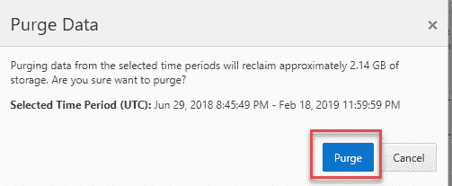
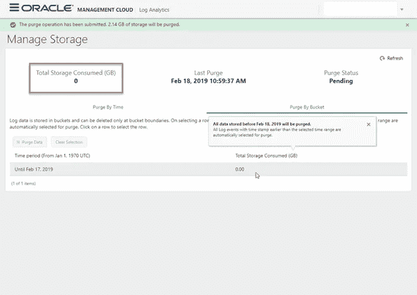

# 策略和清除日志分析数据— Oracle 管理云

> 原文：<https://medium.com/oracledevs/strategies-purging-log-analytics-data-oracle-management-cloud-41e1df7bae18?source=collection_archive---------0----------------------->

## 作者:[mono war Mukul](https://medium.com/u/3757393c69bd?source=post_page-----41e1df7bae18--------------------------------)(OCM)[NASS yam Basha](https://medium.com/u/ba3f0a72ff81?source=post_page-----41e1df7bae18--------------------------------)(甲骨文王牌总监，OCM)

## **简介**

清除是 IT 行业的标准和常规做法，通过清除旧的或不必要的日志或数据来节省存储。在本文中，我们将了解使用 Oracle 管理云清除日志分析数据的重要性。

## **为什么要清除日志分析数据？**

在清除日志分析数据之前，了解我们为什么必须清除以及如果我们没有正确计划清除会有什么影响是非常重要的。OMC 代理安装在目标上，它们将数据推送到 Oracle 管理云，这是 OEM 或 OMC 代理的常见行为。在 OMC，日志分析模块将对来自代理的分析数据进行索引，索引的大小会增长，OMC 的计费取决于日志分析的索引大小。因此，为了避免对旧索引数据进行过多或不必要的计费，需要准备一个更好的策略来根据客户要求并在适当测量后清除数据。

> ***测验— I:*** *清除日志分析数据会清除源文件吗？(例如:警报日志、跟踪文件、消息文件)？*
> 
> ***回答:*** *不会，不会碰源文件。OMC 仅清除可用的索引日志数据。*

**请注意**上述测验基于 2019 年 2 月 28 日举行的甲骨文在线研讨会“ ***网络广播:PRO4457 如何使用 Oracle Log Analytics*** 对数据库和数据库云服务器进行故障排除”中的一个有趣问题。

> ***小测验—二:***

Twitter Poll

## **吹扫方法**

根据数据保留的要求，日志分析索引数据可以通过两种方法清除。

1.  按时间戳清除
2.  时段/时间范围基于时段

我们将看到如何逐个清除索引数据。

## **按时间戳清除**

在 OMC 控制台的基于时间的清除中，我们可以选择特定的时间，以便在该时间戳之前清除所有索引日志数据，例如(mm/dd/yyyy hh:mi:ss AM/PM)。在下面的示例中，我们将访问日志分析，然后我们将在(02/18/19 12:00 AM)之前清除所有数据。清除的好处是，它将提供从 Oracle 管理控制台释放的估计大小。导航至“管理云+日志分析+日志管理+存储”

Navigation to Managing storage

我们可以切换到任何清除方法，单击“按时间清除”,然后选择在指定日期和时间之前清除日志数据收集的时间戳。

Purge By Time

通过选择日期和时间，我们可以在下面看到清除后要回收的估计存储量。

Purging Data — Purge by time

在清除之前最好进行双重检查，因为 OMC 一旦清除了分析过的数据就不能恢复原状，那么确认为"清除数据"后，OMC 会提示进行双重确认才能清除数据。

Confirmation to purge data

确认之后，请求将被提交，我们可以从控制台跟踪状态。

Purge Data status

## **用桶吹扫**

日志数据存储在特定时间范围的存储桶中，如果我们清除数据，则在选定的存储桶被清除之前。如果我们在下图中看到，我们可以看到时间段为“直到 2019 年 2 月 18 日”的存储桶清除的数据大小为 2.14 GB。

Purge By Bucket Range

选择下面突出显示的期间，OMC 将提示确认清除该期间的数据。

Purge Bucket based

清除后，我们可以看到清除操作已提交的状态。

Request Submitted — status

## **总结**

我们已经看到了清除数据以避免不必要的计费的重要性，以及各种可用于执行清除操作的方法，并提供了一些与清除和许可相关的有趣问答。

## **作者简介**

***Nassyam Basha*** 是数据库管理员。他有大约十年的 Oracle 数据库管理员工作经验，目前是 eprosed KSA 公司的数据库专家。他拥有马德拉斯大学的计算机应用硕士学位。他是 Oracle 11g 认证大师和 Oracle ACE 总监。他以超级英雄的身份积极参与甲骨文相关论坛，如 OTN，甲骨文支持被授予“大师”称号，并担任 OTN 版主，与 OTN 一起撰写了大量关于 Toad World 的文章。他维护着一个与甲骨文技术相关的博客，[www.oracle-ckpt.com](http://www.oracle-ckpt.com/)，可以通过[https://www.linkedin.com/in/nassyambasha/](https://www.linkedin.com/in/nassyambasha/)找到他

***Monowar Mukul*** 目前担任首席 Oracle 数据库专家。我是 Oracle 认证大师(Oracle 12c 认证大师管理、Oracle 12c 认证大师 MAA 和 Oracle 11g 认证大师管理)。他在 Oracle MAA 空间担任了 17 年的 Oracle 数据库管理员顾问，负责数据库云服务器和非数据库云服务器系统、Oracle 云空间和 SOA 中间件。他曾在澳大利亚的多个商业领域工作，包括高等教育、能源、政府、采矿和运输。作为一名首席 Oracle 数据库专家，他展示了高度发展的批判性思维和分析技能。你可以在 https://www.linkedin.com/in/monowarmukul/[找到更多关于他和他的工作成就的细节](https://www.linkedin.com/in/monowarmukul/)

## **参考文献**

 [## 使用 Oracle 日志分析

### Oracle Log Analytics 允许您清除由代理或按需上传加载的日志事件，以减少索引…

docs.oracle.com](https://docs.oracle.com/en/cloud/paas/management-cloud/logcs/purge-log-data.html)