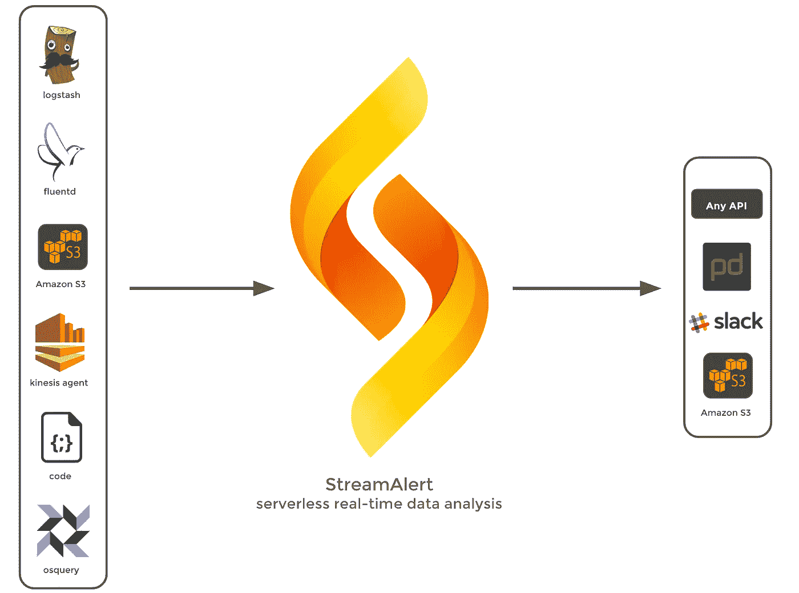
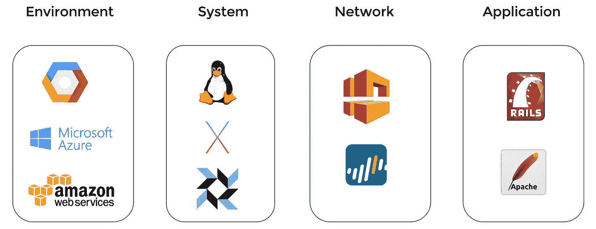
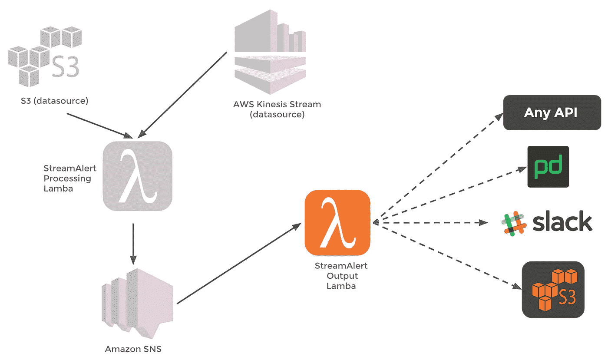

# StreamAlert:实时数据分析和警报

> 原文：<https://medium.com/airbnb-engineering/streamalert-real-time-data-analysis-and-alerting-e8619e3e5043?source=collection_archive---------0----------------------->

今天，我们非常兴奋地宣布 StreamAlert 的开源版本，这是一个具有时间点警报的实时数据分析框架。StreamAlert 的独特之处在于它无需服务器，可扩展至 TB/小时，基础架构部署是自动化的，并且默认情况下是安全的。

在这篇博文中，我们将介绍我们为什么要构建它，额外的好处，支持的用例，它是如何工作的等等！

# **为什么是 StreamAlert？**

Airbnb 需要一款产品，让工程师和管理员能够从各自的环境中实时获取、分析数据并发出警报。

随着我们对用例的推理和对可用选项的探索，我们整理了我们的需求:

*   对于任何 AWS 客户来说，部署都是简单、安全和可重复的
*   每天轻松从兆字节扩展到兆兆字节
*   基础架构维护最少，不需要开发运维专业知识
*   基础设施安全是默认的，不需要安全专业知识
*   支持来自不同环境的数据(例如:IT、PCI、工程)
*   支持来自不同环境类型(如云、数据中心、办公室)的数据
*   支持不同类型的数据(例如:JSON、CSV、键值、Syslog)
*   支持不同的使用案例，如安全性、基础架构、合规性等

我们找不到符合这些要求的产品，所以我们自己造了一个。因为我们的一个需求要求产品必须是环境不可知的，所以它很自然地成为了一个开源项目。

## **好处**

如上所述，StreamAlert 具有一些独特的优势:

*   无服务器— StreamAlert 利用 AWS Lambda，这意味着您不必管理、修补或加固任何新服务器
*   可扩展— StreamAlert 利用 AWS Kinesis 流，这将“每小时从兆字节扩展到太字节，每秒从数千个 PUT 记录扩展到数百万个”
*   自动化— StreamAlert 利用 Terraform，这意味着基础架构和支持服务以代码形式呈现，并通过自动化进行部署
*   安全— StreamAlert 使用安全传输(TLS)，在容器/沙盒中执行数据分析，根据您定义的环境对数据进行分段，并使用基于角色的访问控制(RBAC)
*   开源——任何人都可以使用或贡献给 StreamAlert

## **用例**

下图显示了 StreamAlert 可以分析的一些示例数据集:

StreamAlert 旨在尽可能做到不可知，以支持最广泛的数据分析和警报用例。

在高层次上，SteamAlert 支持:

*   任何来源——stream alert 可以接受来自 S3 存储桶或任何支持发送到亚马逊 Kinesis 流的代理/服务的数据。示例:fluentd、logstash、aws-kinesis-agent、osquery、Java、JavaScript、Ruby、PHP 或 AWS SDK 支持的任何语言
*   任何操作系统— StreamAlert 可以接受来自任何支持日志转发的设备的数据(Linux、MacOS、Windows 等)
*   任何环境— StreamAlert 可以接受来自任何具有互联网连接的环境(云、数据中心、办公室、混合环境)的数据

从数据的角度来看，StreamAlert 支持 JSON、CSV、Key-Value 和 Syslog 等文件格式。

如果您是 AWS 客户，这些数据格式的 gzip 版本在 S3 存储桶中受支持。因此，StreamAlert 支持 CloudTrail、AWS 配置和 S3 服务器访问日志。

如果您不是 AWS 客户，StreamAlert 可以支持以下数据:

*   主机日志(例如 Syslog、osquery、auditd)
*   网络日志(例如 Palo Alto Networks、Cisco)
*   Web 应用程序日志(例如 Apache、nginx)
*   SaaS 提供商(例如 Box、OneLogin)

应该注意的是，StreamAlert 并不用于分析、度量或时间序列用例。这一领域有许多优秀的开源和商业产品，包括但不限于 Prometheus、DataDog 和 NewRelic。

# 进入引擎盖下

## **数据分析**

规则包含数据分析和警报逻辑，并且是用 Python 编写的。下面是一个在 PCI 环境中使用 sudo 的例子:

StreamAlert Python Example

您可以灵活地执行简单或复杂的数据分析。这种方法的一些显著特征是:

*   规则是用原生 Python 编写的，不是专有语言
*   规则可以利用任何 Python 函数或库
*   如果需要，可以针对多个日志源运行规则
*   规则可以被隔离到定义的环境/集群中
*   规则警报可以发送到一个或多个输出，如 S3、页面负载或 Slack
*   规则可以进行集成测试

## **警戒**

如上所述，StreamAlert 附带了一个灵活的警报框架，可以与新的或现有的案例/事件管理工具集成。StreamAlert 使您的规则能够向一个或多个输出发送警报。

开箱即用，StreamAlert 支持 S3、PagerDuty 和 Slack。它还可以扩展到支持任何 API。在不久的将来，产出将更加模块化，以更好地支持额外的产出和公共贡献。

遵循默认安全原则，所有 API 凭证都使用 AWS 密钥管理服务(KMS)进行加密和解密。

## **建筑**

StreamAlert 利用以下服务:

*   AWS Kinesis 流—数据流；AWS Lambda 轮询此流(基于流的模型)
*   AWS Kinesis Firehose —将流数据加载到 S3 长期数据存储中
*   AWS Lambda(Python)-数据分析和警报
*   AWS SNS —警报队列
*   AWS S3 —可选数据源、长期数据存储和长期警报存储
*   AWS Cloudwatch —基础设施指标
*   AWS KMS —应用程序机密的加密和解密
*   AWS IAM —基于角色的访问控制(RBAC)

如果这看起来势不可挡，不要担心-请记住，基础架构部署是通过 [Terraform](https://www.terraform.io/) 自动完成的，确保您不必管理、修补或加固任何新服务器！

# **未来**

众包提醒的想法并不新鲜。Slack [做到了这一点](https://slack.engineering/distributed-security-alerting-c89414c992d6)，博客详细讲述了它的好处。在不久的将来，StreamAlert 将支持这种用例，允许您分散您的分类工作，将警报发送给那些具有最多上下文的人。我们的目标是 17 年的 Q1/Q2。

在不久的将来，StreamAlert 将支持将日志与传统的危害指示器(IOCs)进行比较，后者的数量从数千到数百万不等。这将以一种与提供商无关的方式构建，允许您使用 ThreatStream、ThreatExchange 或任何您想要的东西。我们的目标是 17 年的 Q1/Q2。

StreamAlert 还将支持通过 HTTP 端点接收数据。这适用于仅支持 HTTP 端点进行日志记录的服务提供商或设备。我们的目标是 Q2 17 年

对于历史搜索，StreamAlert 将使用 AWS Athena，这是一种无服务器的交互式查询服务，使用 Presto 来查询 S3 的数据。这将允许您使用 SQL 对特定查询和计划查询进行数据分析。我们的目标是 2017 年第 3/4 季度。

# **总结思路**

开源允许我们作为一个社区，在共同的需求和目标上共享、合作和迭代。现在有了将基础设施表示为代码的能力，这个目标可以进一步实现，同时降低开发和部署的成本。

我们希望 StreamAlert 可以作为一个例子，让部署变得简单、可重复和安全，这样任何人都可以轻松使用它。

信用和贡献:

*   [@jack_naglieri](https://twitter.com/@jack_naglieri) (核心架构师兼工程师)
*   [@mimeframe](https://twitter.com/@mimeframe) (概念、网站、文档、代码&内容审核)
*   [@strcrzy](https://twitter.com/@strcrzy) (规则装饰代码)
*   [@zwass](https://twitter.com/@zwass) (osquery kinesis 插件)
*   [@ hackgnar](https://twitter.com/@hackgnar)(osquery kinesis 插件 bug 修复)
*   [@austinbbyers](https://twitter.com/@austinbbyers) (代码审核)
*   [@emma_c_lin](https://twitter.com/@emma_c_lin) (代码审查)
*   [@awscloud](https://twitter.com/@awscloud) 团队(AWS 服务和支持)
*   [@hashicorp](https://twitter.com/@hashicorp) 团队(地形)

最后，如果您想开始使用 StreamAlert 或为其做出贡献，请访问 https://github.com/airbnb/streamalert

谢谢！

安全团队@ Airbnb