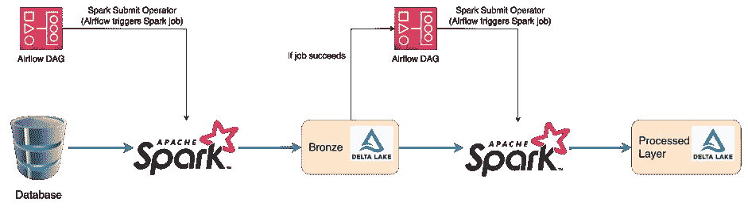
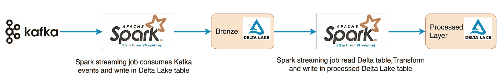
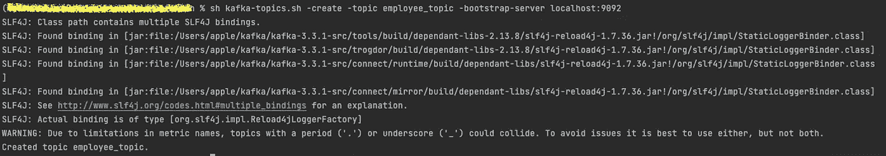
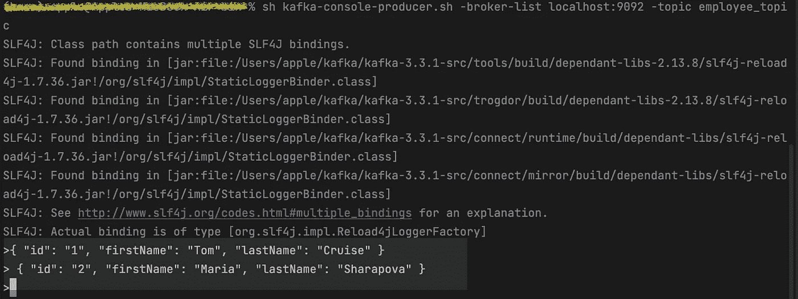

# 使用 Spark 结构化流传输增量表中的数据流

> 原文：<https://medium.com/globant/streaming-data-in-a-delta-table-using-spark-structured-streaming-19bd6f3ea37b?source=collection_archive---------0----------------------->

## 实时数据处理的解决方案


作为数据工程师，你必须和大数据技术打交道，比如[星火流](https://spark.apache.org/docs/latest/streaming-programming-guide.html)、[卡夫卡](https://kafka.apache.org/documentation/)、[三角洲湖](https://delta.io)。然而，当大规模地结合这些技术时，您会发现自己在寻找一个覆盖所有复杂生产用例的解决方案。在这篇博文中，我将分享如何通过结合这三种技术来构建实时数据处理和分析，从而利用数据平台的分析能力。

# **问题陈述**

这是一个普遍存在的问题，我们需要在您的数据平台中进行低延迟分析。通常，数据在三角洲湖中通过批处理作业进行处理，以生成着陆和最终处理的数据图层。由于批处理的性质，这会增加处理时间，并且数据会在下一个计划的作业中到达。

批处理会造成延迟，影响业务快速决策。此外，批处理过程的执行依赖于类似[气流](https://airflow.apache.org/docs/)的编排器。



Batch processing architecture

# **提议的解决方案**

Spark 流作业的理念是它总是在运行。它不断地从 Kafka 主题中读取事件，处理它们，并将输出写入 Delta Lake 表。这项工作不应停止。

正如事件驱动架构通过 Kafka 主题近实时处理数据一样，我们将使用 Delta Lake 表来桥接近实时数据处理管道。

# **架构**

基于卡夫卡事件的实时分析系统。以下架构中的第一个数据入口点是 Kafka，由 Spark 流作业使用，并以 Delta Lake 表的形式写入。让我们一个一个地看每个组件。



Event-driven Architecture

## **事件商店(卡夫卡)**

我们使用 Kafka 作为我们的事件存储来处理实时数据。Kafka 是一个社区分布式流媒体平台，每天能够处理数万亿个事件。它发布和订阅记录流，还用于容错存储。它存储、读取和分析流数据。它用于消息传递、网站活动跟踪和日志。

一个 Kafka 集群由一个或多个名为 [Kafka Brokers](https://developer.confluent.io/learn-kafka/apache-kafka/brokers/) 的服务器组成，在这些 Brokers 里面有 [Kafka Topics](https://developer.confluent.io/learn-kafka/apache-kafka/topics/#:~:text=As%20a%20developer%20using%20Kafka,is%20a%20log%20of%20events.) 。Kafka 主题包含正在生产和消费的数据。

## **Spark 结构化流媒体**

[结构化流](https://spark.apache.org/docs/latest/streaming-programming-guide.html)是一个基于 Spark SQL 引擎的可扩展和容错的流处理引擎。Spark SQL 引擎将不断递增地运行它，并随着流数据的不断到达更新最终结果。

在内部，默认情况下，使用微批处理引擎处理结构化流查询，该引擎将数据流作为一系列小批量作业进行处理，从而实现低至 100 毫秒的端到端延迟和[恰好一次](https://learn.microsoft.com/en-us/azure/hdinsight/spark/apache-spark-streaming-exactly-once)容错保证。然而，自 [Spark 2.3](https://spark.apache.org/docs/2.3.0/) 以来，引入了一种新的低延迟处理模式，称为连续处理，可以在至少一次保证的情况下实现低至一毫秒的端到端延迟。在不改变查询中的数据集/数据框操作的情况下，我们可以根据应用程序要求选择模式。

## **三角洲湖泊**

Delta Lake 是一个集中式存储库，允许您存储任何规模的所有结构化和非结构化数据。我们可以按原样存储我们的数据，而不必首先对数据进行结构化，并运行不同类型的分析，从仪表板和可视化到大数据处理和实时分析。

为什么我们需要三角洲湖？有几个原因:

*   数据在同一路径上“覆盖”,在作业失败时导致增量丢失。
*   数据在同一路径上“覆盖”,在作业失败时导致增量丢失。
*   编写 [AVRO](https://avro.apache.org/docs/) 和[拼花](https://parquet.apache.org/docs/)文件的普通火花码没有 [ACID](https://docs.delta.io/latest/concurrency-control.html) 事务。
*   在 Spark 中，不支持模式进化。如果我们尝试合并两个具有不同方案的数据框，作业将会失败。
*   不维护数据版本；一旦数据被删除，我们就无法回滚到较旧的数据。

以下是三角洲湖的主要特征:

*   ACID 事务——使用 Delta Lake，我们不需要编写任何代码——事务被自动写入博客。这个事务日志是关键，它代表了唯一的真实来源。
*   可扩展的元数据处理——激发分布式处理能力，轻松处理数十亿个文件的 Pb 级表的所有元数据。
*   统一的批处理和流——不再需要使用不同的体系结构来读取数据流和批处理数据。三角洲湖表是一个批处理和流式信源和信宿。
*   模式执行——如果您将一个模式放在一个 Delta Lake 表中，并试图向该表中写入与该模式不一致的数据，它将向您提供一个错误，并不允许您写入该数据，从而防止您写错。
*   模式演化——模式演化是一个特性，它允许用户轻松地更改表的当前模式，以适应随时间变化的数据。通过将`.option("mergeSchema", "true")`添加到我们的`.write`或`.writeStream` Spark 命令来激活模式进化。
*   增量插入和删除-增量允许我们非常容易地做增量插入或合并。我们可以将另一个数据框中的数据合并到您的表中，并进行更新、插入和删除。
*   Delta Lake 中的压缩——如果我们不断地向 Delta Lake 表中写入数据，随着时间的推移，将会累积许多文件，特别是当我们小批量地添加数据时。我们可以通过将一个表重新分区为数量较少的大文件来压缩它。

# 实施提议的解决方案

需要采取以下步骤。

**1。在 Kafka 集群上创建一个 T**[**opic**](https://kafka.apache.org/quickstart)**。** `--bootstrap.server`是以逗号分隔的主机和端口对列表，这些主机和端口对是 Kafka 客户端最初连接到的“bootstrap”[Kafka 集群](https://jaceklaskowski.gitbooks.io/apache-kafka/content/kafka-brokers.html)中 Kafka 代理的地址，用于引导自身。在我们写第一个事件之前，我们需要创建一个主题。让我们创建 employee_topic。打开终端会话并运行以下命令:

```
sh kafka-topics.sh –create –topic topic_name –bootstrap-server 
{bootstrap-server}
```



**2。发布数据到 Kafka 主题**。Kafka 客户端通过网络与 Kafka 代理通信，以写入(或读取)事件。一旦接收到事件，代理就会以持久和容错的方式存储事件，只要我们需要，甚至是永远。

在终端会话上运行控制台生成器客户端，将一些事件写入您的主题。默认情况下，您输入的每一行都会导致一个单独的事件写入主题。

```
sh kafka-console-producer.sh -broker-list {bootstrap-server} -topic topic_name
```

让我们将数据发布到 employee_topic。



JSON events in the Kafka topic

**3。模式**。Kafka 主题事件具有 JSON 格式。在我们以流的方式读取 Kafka 主题事件之前，我们只需要提供一个 schema.json 文件。该文件包含 Kafka 主题中可用的事件数据的元数据信息。让我们从一些导入开始，创建 Spark 会话并将 schema.json 加载到一个模式中。

```
from delta. tables import *
from pyspark.sql.functions import *
from pyspark.sql.types import *
from pyspark.sql import *

spark = SparkSession.builder.appName('job_name').getOrCreate()
schema_file = "schema.json"
data = open(schema_file)
schema = StructType.fromJson(json.load(data))
```

**4。Spark 流作业从 Kafka 主题中读取数据。**我们需要使用`format("kafka")`明确说明我们从哪里开始流式传输，并且应该提供 Kafka 服务器，并使用该选项订阅我们正在流式传输的主题。

Spark Streaming 使用 [SparkSession](https://sparkbyexamples.com/spark/how-to-create-a-sparksession-and-spark-context/) 上的`readStream()`从 Kafka 加载流数据集。选项`kafka.bootstrap.servers`将提供 Kafka 引导服务器的详细信息，在`subscribe` 中将提供 Kafka 主题名称。选项`startingOffsets earliest`用于在查询开始时读取 Kafka 中所有可用的数据；我们可能不会经常使用这个选项，默认值`startingOffsets`是`latest`，它只读取尚未处理的新数据。

```
data_df=spark.readstream.format("kafka")\
  .option("kafka.bootstrap.servers","{bootstrap-server}")\
  .option("subscribe","{topic_name}")\
  .option("failOnDataLoss","False")\
  .option("startingOffsets", "earliest")\
  .load()\
  .selectExpr(schema)

data_df.printSchema()
```

**5。将最后的** `**data_df**` **写成三角洲湖表**。使用结构化流，我们可以将数据流写入 Delta Lake 表。Delta 的事务日志保证每条消息将被精确地处理一次。它还支持将多个流或批处理作业并发写入同一个表。默认情况下，流中的消息将被追加到 Delta Lake 表中。

```
data_df.writeStream.format("delta")\
  .outputMode("append")\
  .option("checkpoint_location","{checkpoint-location}")\
  .trigger("processing=30 seconds")\
  .start("{Delta table path}")
```

6。将三角洲湖表读作溪流。当我们加载一个 Delta Lake 表作为流源并在流查询中使用它时，该查询处理表中存在的所有数据以及流启动后到达的任何新数据。

我们还可以通过设置`maxFilesPerTrigger`选项来控制任何微批量 Delta Lake 给定流的最大大小。这指定了每个触发器中要考虑的新文件的最大数量。默认值为 1000。流中的选项`ignoreChanges`不会因删除或更新源表而中断。

```
delta_df=spark.readStream.format("delta")\
  .option("maxFilesPerTrigger",5)\
  .option("ignoreChanges","true")\
  .load("{Delta table path}")
```

**7。将数据写入增量表**。我们可以使用结构化流将数据流写入增量表。Delta 的事务日志保证每条消息将被精确地处理一次。它还支持将多个流或批处理作业并发写入同一个表。默认情况下，流中的消息将被追加到增量表中。

```
delta_df.writeStream.format("delta")\
  .outputMode("append")\
  .option("checkpoint_location","{checkpoint-location}")\
  .trigger("processing=30 seconds")\
  .start("{Delta table 
```

# 结论

在本文中，我已经介绍了 Delta Lake 特性的实时数据处理。借助上述事件驱动架构，解决 Spark Streaming 和 Kafka 之间的集成问题是构建我们的实时分析仪表板的一个重要里程碑。

# 参考

*   美国[治疗-数据-三角洲-湖泊-铁锈-卡夫卡](https://www.databricks.com/dataaisummit/session/streaming-data-delta-lake-rust-and-kafka)
*   [德尔塔火花流](https://docs.delta.io/0.3.0/delta-streaming.html)