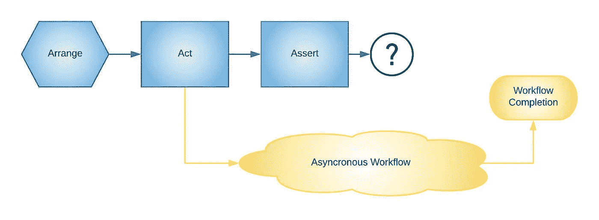
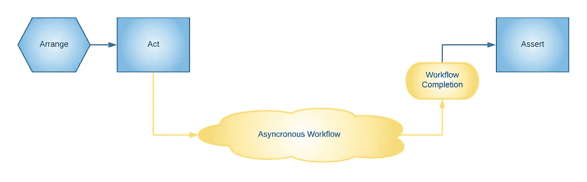

# 春云奔流

> 原文：<https://medium.com/walmartglobaltech/streaming-with-spring-cloud-24a001ad307a?source=collection_archive---------0----------------------->

Photo by [Michael Brunk](https://unsplash.com/@seattlevlad?utm_source=medium&utm_medium=referral) on [Unsplash](https://unsplash.com?utm_source=medium&utm_medium=referral)

编写异步消息传递应用程序和最终一致的系统有很多好处，包括:

*   吞吐量最大化—尤其是在不需要即时一致性的情况下
*   卸载工作流以向用户提供即时响应
*   能够根据需要以不同方式扩展工作流的各个部分
*   支持系统瓶颈周围的背压

现代平台和框架使得编写异步消息传递系统变得非常容易。最近，我花了一些时间探索 Spring Cloud Stream，我发现它比其他框架有很多优势。

> “Spring Cloud Stream 是一个框架，用于构建与共享消息传递系统相连的高度可扩展的事件驱动微服务。
> 
> 该框架提供了一个灵活的编程模型，该模型建立在已经建立和熟悉的 Spring 习惯用法和最佳实践的基础上，包括对持久发布/订阅语义、使用者组和有状态分区的支持([参考](https://spring.io/projects/spring-cloud-stream)

最近，Spring Cloud Stream 引入了几个新特性，使得它成为处理异步消息流的一个简单选项。有两个是我特别想关注的。

*   通过 spring-cloud-function 进行消息处理的函数范式
*   使用改进的测试活页夹简化测试

# 背景

Spring Cloud Stream 从 Spring Integration 项目演化而来，它拥抱了 Spring Boot 并进入了现代云时代。Spring Cloud Stream 依靠绑定器的概念来处理与消息或事件流框架的集成。在本文发表时，有 Apache Kafka、Kafka Streams、Rabbit MQ、Azure Event Hubs、Google Cloud PubSub 和许多其他应用程序的绑定器([见列表](https://cloud.spring.io/spring-cloud-static/spring-cloud-stream/current/reference/html/spring-cloud-stream.html#_binder_implementations))。

绑定支持现代消息传递/事件系统的核心功能:

*   发布/订阅(同一数据的多个消费者)
*   消费者群体(单个消费者的横向扩展)
*   分割
*   消息驱动的消费者
*   基于投票的消费者

## 粘合剂

绑定器处理与单个框架的集成。这种抽象允许您的代码是中间件中立的，只关注核心业务逻辑。应用程序核心只需要与规范的消息进行交互。

在输入和输出端都可以使用绑定器来与数据的生产者或消费者进行交互。如果一个应用程序有多个消息目的地，它可以使用多个绑定器。(注意，在 Spring Cloud Stream 中，术语*目的地*用于指消息的输入或输出源。第一次看的时候会很困惑。)

Spring 的[文档](https://cloud.spring.io/spring-cloud-static/spring-cloud-stream/current/reference/html/spring-cloud-stream.html#spring-cloud-stream-overview-binders)很好地解释了绑定器的概念以及如何配置。

每个绑定器实现都包含配置选项，用于设置特定于它的特性，比如并发性、分区和错误处理。如果需要这些信息，您应该查看特定的文档。

# 功能范式

Spring Cloud Stream 的一个关键概念是它的函数范式。数据的消费者、生产者和数据流可以用 Java 的[功能接口](https://docs.oracle.com/en/java/javase/11/docs/api/java.base/java/util/function/package-summary.html)来定义。将任意数量的`[Function](https://docs.oracle.com/en/java/javase/11/docs/api/java.base/java/util/function/Function.html)` [s](https://docs.oracle.com/en/java/javase/11/docs/api/java.base/java/util/function/Function.html) 、`[Consumer](https://docs.oracle.com/en/java/javase/11/docs/api/java.base/java/util/function/Consumer.html)` [s](https://docs.oracle.com/en/java/javase/11/docs/api/java.base/java/util/function/Consumer.html) 或`[Supplier](https://docs.oracle.com/en/java/javase/11/docs/api/java.base/java/util/function/Supplier.html)` [s](https://docs.oracle.com/en/java/javase/11/docs/api/java.base/java/util/function/Supplier.html) 定义为 Spring beans，这些可以分别配置为消息的 streamers、consumers 或 producers。这完全可以通过配置来完成(没有样板代码！).这些功能甚至可以组合在一起创建复杂的工作流，因为它是通过配置完成的，所以 Spring Cloud 允许这些功能随时更改！

Spring Cloud Stream 有一个很棒的[快速入门指南](https://cloud.spring.io/spring-cloud-static/spring-cloud-stream/current/reference/html/spring-cloud-stream.html#_quick_start)，我推荐给你，让你了解这个项目。

## 基本配置

Spring Cloud Stream 使得配置公共绑定属性变得非常容易，而不考虑代理。通过几行配置，应用程序可以支持:

*   跨多个节点的消费者群体
*   基于特定错误的重试逻辑，具有各种后退选项
*   并行消费者
*   数据转换

# 测试

从历史上看，测试异步应用程序(如消息处理器)是非常困难的。测试应该遵循 [3A 模式](https://xp123.com/articles/3a-arrange-act-assert/)(安排-行动-断言)，也经常被称为[给定-何时-然后](https://martinfowler.com/bliki/GivenWhenThen.html)。我们如何安排一个由异步工作流组成的自动化测试，它的完成将与测试执行并行发生？

This test will fail because the workflow is incomplete when the *Assert* block runs

> 目标是编写集成测试，以一种可靠、确定的方式测试应用程序与其框架和基础设施的集成。

试图测试异步消息传递系统不可避免地会导致两种妥协之一。第一个妥协是不通过模仿框架来测试与您选择的框架和/或平台的实际集成。这可能看起来像一个单元测试，调用以同步方式异步运行的代码。这当然是测试套件的重要部分。就其本身而言，这对于简单的工作流来说可能是好的。然而，大多数组织最终发现需要测试一个需要框架参与测试的场景，例如复杂的错误处理和重试场景、序列化和版本控制的复杂性，以及性能测试和调优。我们应该找到一种方法来自动化整个应用程序的测试，而不是仅仅希望这些工作在生产中进行或者求助于手工测试。

这最终导致了第二种妥协，用强制执行放弃并等待的代码进行测试，希望异步工作流在分配的时间内完成。通常，这将包括一个`Thread.sleep`,其中可能会有一些循环。这是一个反复试验的过程，在合理的时间框架内完成测试的同时，找到睡眠时间的恰当平衡。但是当工作流变得更长或者当测试在一个慢的机器上运行时会发生什么呢？测试突然中断，你重新调整。

目标是编写集成测试，以一种可靠、确定的方式测试应用程序与其框架和基础设施的集成。这意味着一套充分利用应用框架的集成测试，使用测试夹具来模拟依赖的基础设施，当测试的异步 *Act* 块完成时，它将向测试发出信号，以便 *Assert* 块可以开始。

This test succeeds because the Assert block waits for the completion of the workflow

Spring Cloud Stream 提供了一个[测试绑定器](https://cloud.spring.io/spring-cloud-static/spring-cloud-stream/current/reference/html/spring-cloud-stream.html#_testing),让这变得毫不费力。测试绑定器充当 JVM 内的消息代理，允许在没有联网的情况下使用真正的绑定器进行测试。有了测试类路径上的`test-jar`，Spring Boot 将自动配置一个`InputDestination`和一个`OutputDestination`，允许测试产生和消费消息，适合被测试的流。

这个测试绑定器的另一个优点是生产者被实现为一个`BlockingQueue`，允许工作流同步执行。这允许在没有任何额外代码等待结果的情况下执行断言，这满足了上述期望。

## 限制

这种方法的唯一限制是它阻止测试任何特定于 binder 实现的逻辑。这是因为特定的粘合剂被替换为`TestBinder`。这将包括诸如死信路由、批量消费、消息过期和仲裁等功能。

# 示例实现

考虑链接的[样本项目](https://github.com/bertsanders/spring-cloud-stream-demo)。它包含一个简单的流应用程序，从一个输入主题读取并生成一个输出主题。请注意以下特征:

*   名为`calculateNthPrime`的单个 Spring bean 是一个`java.util.Function`，它接受一个整数并返回一个`BigInteger`。
*   这个 bean 使用的函数调用另一个 Spring bean `primeNumberService`。这个 bean 公开了一个计算第 n 个质数的方法。这只是作为一个可能需要一些时间来完成的方法的例子，展示了`TestBinder`的阻塞性质。

`application.yml`用于设置应用程序读写主题。

*   `spring.cloud.function.definition`定义将在应用程序中使用的功能 bean。
*   `spring.cloud.stream.bindings`定义特定绑定。绑定名称前缀与函数名称匹配。
*   由于绑定中函数名后面有`-in`或`-out`，所以绑定被定义为输入或输出。
*   一个绑定也有一个序列号，允许链接多个绑定。
*   绑定定义了一个目的地。目的地是消息被读取或写入的主题。(记住，即使是消费者也称其话题为目的地。)
*   每个绑定还演示了一些基本的配置，比如使用者组、并发性、重试和回退。重试配置还定义了不应重试的特定异常。

注意，错误被路由到一个错误通道，在那里它们可以被特定的绑定器处理。

## 测试

该项目也有两个 Spring Boot 测试。

*   主要测试检查应用程序的基本流程。它为主题产生一组随机数，读入结果，并断言给定的数是质数。如果任何一个数字不是质数或者服务失败，测试将失败。

There is no need for waiting between the send and receive. The TestBinder takes care of that.

*   重试测试检查错误情况下会发生什么。它使用 Spring 的`MockBean`来模拟可重试和不可重试的异常，验证预期的行为是否发生。

Each test verifies that the primeNumberService is invoked the appropriate number of times to indicate whether the message was retried or immediately put into an error channel

查看完整的示例实现:[https://github.com/bertsanders/spring-cloud-stream-demo](https://github.com/bertsanders/spring-cloud-stream-demo)