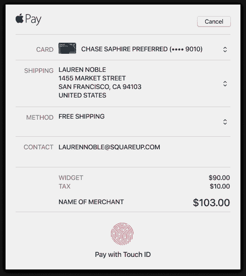

# 通过 Apple Pay 中的运输选项简化结账流程

> 原文：<https://medium.com/square-corner-blog/streamline-checkout-with-shipping-options-in-apple-pay-7f3836245950?source=collection_archive---------4----------------------->

## 使用 Apple Pay 来选择运输选项

> 注意，我们已经行动了！如果您想继续了解 Square 的最新技术内容，请访问我们的新家[https://developer.squareup.com/blog](https://developer.squareup.com/blog)

一年多以前，我们在我们的在线支付 API 中增加了对 Apple Pay 的支持，以帮助开发者轻松地将 Apple Pay 集成到他们的网站中。然而，我们知道电子商务结账并不仅限于付款，您还需要收集履行和运送订单的其他详细信息。

具体来说，您需要收集一个送货地址，并根据该地址提供不同的送货选项。你可以为那些需要更快送货的人提供免费送货和付费送货两种选择。尽管我们的在线支付 API 支持从 Apple Pay 内部收集送货地址，但您必须处理 Apple Pay 体验之外的送货选项。

随着今天的更新，Square 的 API 现在支持 Apple Pay 在网络上的整个结账体验，包括对送货选项的支持。你可以接受付款，询问和验证送货地址，并提供各种送货选项，所有这些都在 Apple Pay 的网络体验中进行。这加快了结账速度，反过来又增加了转化率，通过 Apple Pay 在网络上轻松使用结账流程。

# Apple Pay 运输选项的工作方式:

## 添加运输选项

您可以在 PaymentRequest 对象中定义任意数量的运输选项。第一个运输选项将是显示的默认值。

# 验证送货地址

当您的客户选择送货地址时，将调用 **shippingContactChanged** 回调。您可以使用此回调来验证送货地址，根据送货地址添加新的费用和/或税款，并更新送货选项。

*Errors shown when a shipping address isn’t supported by that merchant*

*Shipping options and taxes are updated when they choose a Canadian address*

一旦选择了运输选项，您还将有机会通过 **shippingOptionChanged** 回调来更新行项目和总数。最后，一旦付款被授权，您将在**cardNonceResponseReceived**回调中获得最终的送货地址和最终的送货选项。

我们对这一版本感到兴奋，并期待看到您在 web 应用程序中实现这一点。你可以在我们的[文档](https://docs.connect.squareup.com/payments/sqpaymentform/digitalwallet/applepay-setup)中阅读更多关于我们对 Apple Pay 中运输选项的支持。要了解有关 Square 开发者平台的更多信息，请访问 https://squareup.com/developers 的[或加入我们在 squ.re/slack](https://squareup.com/developers)的社区。

*注意:Square 只支持 Apple Pay 进行美元交易。*

附加阅读:

*   *与*[*SqPaymentForm*](https://docs.connect.squareup.com/payments/sqpaymentform/sqpaymentform-overview)集成
*   *与* [*结账 API*](https://docs.connect.squareup.com/payments/checkout/overview) 集成

如果你想及时了解我们的其他内容，请务必关注这个[博客](https://medium.com/square-corner-blog) &我们的[推特](https://twitter.com/SquareDev)账号，并注册我们的[开发者简讯](https://www.workwithsquare.com/developer-newsletter.html?channel=Online%20Social&sqmethod=Blog)！我们还有一个 Slack 社区，用于与其他实现 Square APIs 的开发者联系和交流。