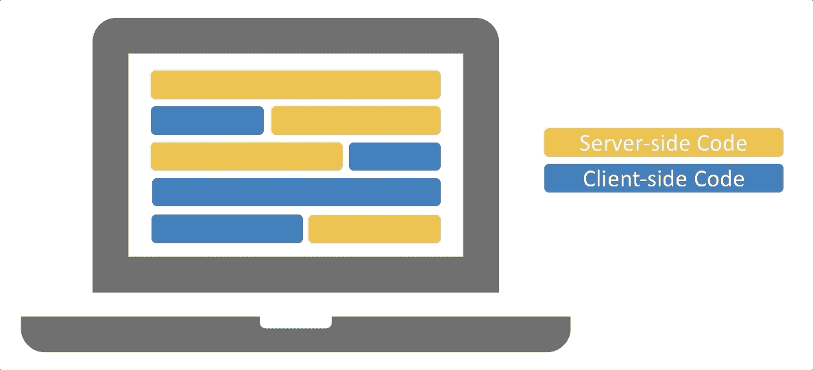

# 为后端团队简化前端即服务

> 原文：<https://medium.com/walmartglobaltech/streamlining-frontend-as-a-service-for-backend-teams-69d9223efcec?source=collection_archive---------2----------------------->

## 我们如何建立工作流程来加速产品交付

有经验的应用程序开发人员知道为一个应用程序构建一个简单直观的*前端*的挑战。用户体验(UX)设计、模型、原型和用户界面(UI)开发等前端活动需要大量的时间和精力，尤其是对于那些专注于*后端*的人来说。当一个典型的后端开发人员试图构建前端时会发生什么？嗯，你往往会得到难以使用的应用程序，不一致的风格(如图标，颜色，布局等。)和用户满意度差。


Photo by [Helloquence](https://unsplash.com/@helloquence?utm_source=medium&utm_medium=referral) on [Unsplash](https://unsplash.com?utm_source=medium&utm_medium=referral)

在我加入沃尔玛实验室的 UI/UX 团队之前，我所在组织的大多数团队都由后端工程师组成，他们也负责构建前端。其他有幸拥有前端工程师的团队缺乏 UX 设计。总的来说，这种组织结构导致了我们的工具平台上不一致和过于复杂的用户体验，这种情况今天仍然存在。

*看看我的第一篇关于* [*设计一个加载屏幕来适应你的应用*](/walmartlabs/designing-a-loading-screen-to-fit-your-app-f044bda4f6bf) *的博客。*

这就是 UI/UX(前端)团队组建的原因；将前端层从后端开发团队中分离出来，促进可伸缩性和一致性。我们建立了前端即服务(FaaS):为超过 5 个团队提供 UX 设计和 UI 开发服务。在最初的几个月里，我们遇到了许多不可预见的挑战，但是经过几次迭代，我们能够建立一个工作流程来最小化这些挑战并发现未知。


Frontend-as-a-Service Flow with Backend Teams

# 揭开未知

正如许多软件开发团队一样，每当我们开始一个新项目时，我们都会面临未知。我们通常支持两种类型的项目:新前端构建(从头构建)和前端改造(为现有应用程序重建)。

通常，当一个新项目开始时，我们会讨论功能需求，创建模型，在我们的团队开始 UI 开发之前，我会问这样一个问题:

> “你的 API 准备好了吗？”

大多数时候，他们会说是。大多数时候，他们不是。这些情况会阻碍我们团队的生产力，并延迟项目的时间表。我们通常面临两类挑战:API 设计和耦合的全栈代码问题。

## API 设计问题

API 代表应用程序编程接口，它是前端和后端服务器之间通信的桥梁。API 的目的是定义应用程序的功能，并充当将客户端请求(前端)传递给服务器端提供者(后端)的信使。


API Communication

有没有玩过游戏*电话*？如果你有过，那么你就知道当一条信息由于沟通或解释错误而被完全搞糟时会发生什么。设计不佳的 API 本质上就是这样——前端开发人员会误解如何使用它们。

*我发现了一个关于* [*API 设计指南*](https://hackernoon.com/restful-api-design-step-by-step-guide-2f2c9f9fcdbf) *的很棒的博客。*

我们在 API 设计中面临的一些常见问题是:

*   **缺少参数:**满足某些请求通常需要 API 中的参数。例如，如果您想从一个完整的设备列表中`GET`一个特定的设备，应该使用一个参数来查询一个特定的 ID。例如`/devices/{deviceID}`如果 API 没有设计必要的查询参数，那么呈现这些数据将成为一个更大的挑战。
*   **非最佳响应结构:****API 响应结构对于应用程序的整体性能非常重要。例如，如果我们想在 UI 中显示按型号分组的设备列表，但响应是以单字符串数组(随机顺序)编写的，查询和显示该数据将需要前端处理，这会降低应用程序的速度。以下示例显示了基于设备型号分组的最佳和非最佳响应结构。**

```
# Device arrays grouped by model (optimal)
"model1": [{mod1_details1}, {mod1_details2}]
"model2": [{mod2_details1}, {mod2_details2}]
"model3": [{mod3_details1}, {mod3_details2}]# Device list array (non-optimal)
"devices": [{mod1_details2}, {mod3_details2}, {mod1_details1}, {mod2_details2}, {mod3_details1}, {mod2_details1}]
```

*   ****完全遗漏:**这一点很容易理解，但是你会惊讶于我们经常在开始 UI 开发时发现 API 还没有开发出来。**

## **耦合的全栈代码问题**

**耦合的全栈代码问题只与*改造*项目相关。纸上谈兵听起来很容易；这款应用已经完全开发并投入生产。什么会出错？嗯，当前端代码与后端紧密耦合时，分离代码需要时间，特别是如果应用程序的功能没有很好地记录。我们面临的两个常见问题是:**

*   ****耦合编码结构:**全栈开发人员能够在后端编码应用功能，然后立即在前端可视化该功能。由于代码的两端都写在同一个文件中，这通常使得前端和后端很难独立共存。**

****

**Coupled Full-stack Coding Structure**

*   ****缺少文档**:开发人员使用耦合编码结构构建应用程序时，往往会跳过文档，因为应用程序已经可以工作了*。没有精心编写的文档，试图理解应用程序的功能就像没有翻译，试图学习另一种语言。你也许能理解它，但是你很可能理解错了。***

**现在你可能想知道，为什么我们不雇用所有的全栈工程师，避免前端后端的复杂性？答案很简单——很难找到同时精通前端和后端开发的全栈工程师。当你真的找到那些紫色独角兽时，它们稀少的数量使得规模扩张变得极其困难。(也许我会在以后的文章中详细阐述利弊。)**

# **构建简化的流程**

**我们的 FaaS 缺乏与后端团队的顺畅工作流程；我们经常遇到阻碍，来来回回地试图弄清楚我们需要什么。为了防止未知的问题，我们建立了一个简化的流程，在一个简化的流程中为我们的前端团队提供了更清晰的需求、记录良好的 API 和经过验证的模型。**

**虽然这个过程是为了支持前端-后端团队关系而开发的，但是全栈开发人员也应该考虑遵循这些步骤来加速大规模的产品交付。**

## **开发用户故事**

**第一步，也是产品管理的基础，是识别用户群和建立用户故事。对于每个项目，包括修改，我们都从这一步开始验证特性需求。我们发现，即使是现有的应用程序，在构建功能时也没有考虑用户基础，比如在主用户界面中包含基于管理的功能。通过开发用户故事，我们能够影响变化，区分需求的优先级，并确保 UI 与我们的目标用户一致。我们经常在整个开发生命周期中开发用户故事，因为我们不断地提炼和发现用户需求。**

## **建立数据契约**

**我们流程中最大的差距之一是后端代码缺乏清晰度和可见性。我们建立了一个数据契约来捕获相关信息，比如 API 端点的 URL、请求类型和 JSON 响应。这个契约强制文档和 API 的创建，将后端与全栈代码分开。通过预先构建数据契约，我们能够将数据类型与用户故事相结合，在开发生命周期的早期识别 API 设计问题，并确保 UX 设计与应用的功能相一致。数据契约一直是最小化未知问题和分离全栈代码的主要解决方案。**

****

**Exposing APIs by Establishing a Data Contract**

## **UX 设计:实体模型**

**在进行用户研究之后，我们利用用户故事和数据契约来开发模型。实体模型通过展示用户界面的外观和用户使用方式的设计视觉效果，将应用程序的需求变成现实。实体模型有不同的阶段:从草图，到线框，到静态彩色页面，最后到交互的东西(例如，可点击，可滑动，等等)。).模型提供了有形的工件，使我们能够容易地获得用户反馈，清楚地说明我们将构建什么，并使利益相关者能够接受。此外，模型验证数据契约，并在构建之前提供必要 API 的可见性。**

****

**Example Wire Framing Mockups**

## **获得利益相关者的认可**

**一旦我们有了模型，我们就能够向我们的利益相关者演示设计并获得验证。数据契约和模型为前端和后端团队提供了一种通用的*语言*,以清晰地交流并就应用需求达成一致。这通常是一个迭代过程，在这个过程中，我们不断地讨论提议的特性，同时根据需要细化数据契约和模型。**

## **UI 开发:编码**

**最后，但同样重要的是，我们终于为开发做好了准备。通过为我们的前端开发人员提供经过验证的模型、设计良好的 API 和数据契约，他们能够专注于编码，并将中断降至最低。**

**数据契约还使我们的前端开发人员能够为 UI 开发创建模拟数据。这意味着我们能够创建相同的 API 响应来构建 UI，即使后端团队仍然在处理它们。我们目前使用本地服务器来模拟数据，但也将探索创建可以与团队协作使用的模拟服务器库。**

***看看这篇关于* [*模拟服务器库*](/walmartlabs/midway-walmarts-mocking-journey-84c34fcc4593) *作者*[*himan Shu Jain*](https://medium.com/u/c979dc0c3fbc?source=post_page-----69d9223efcec--------------------------------)*。***

# **为所有人吸取教训**

**我们的新流程不仅加快了应用程序开发生命周期，还为最终用户带来了更好的整体体验。尽管我们的挑战和解决方案是基于我们与后端团队的关系，但学到的经验和整个旅程适用于任何多团队工作环境。**

****

**Photo by [rawpixel](https://unsplash.com/@rawpixel?utm_source=medium&utm_medium=referral) on [Unsplash](https://unsplash.com?utm_source=medium&utm_medium=referral)**

**任何成功的工作关系的关键是沟通，但是清晰的沟通只有在你们说着相同的语言时才有效。而且不，我不是指*英语；*我指的是团队之间必须创造的共同语言，以推动成功的沟通。在这种情况下，我们的共同语言是数据契约和模型，它们解决了我们与后端团队的大多数问题。你应该找到一种对你和你的团队都有用的共同语言。**

**我一直在寻找新的方法来改进我们的流程。如果你有什么建议或者有过类似的经历，请在下面的评论区分享。**

## **你觉得这有用吗？请大家推荐或分享，随意点击拍手键。👏🏻关注我以后的帖子。**

**沃尔玛实验室正在不断解决问题，以增强软件交付流程和用户体验。如果你有兴趣加入我们的使命，请查看我们的[职业页面](http://careers.walmart.com/technology/)。**