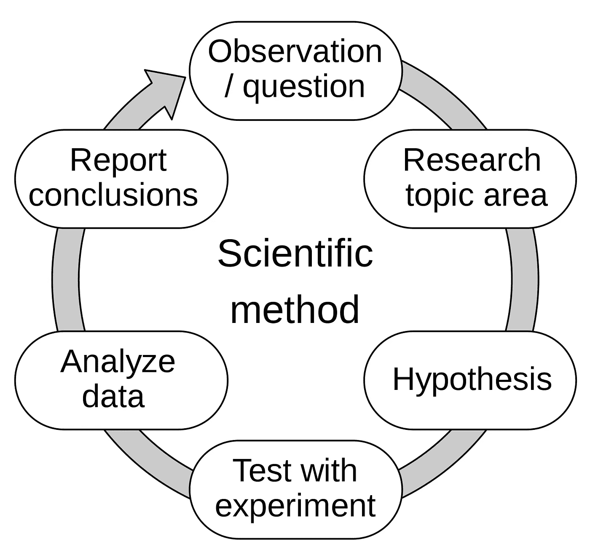
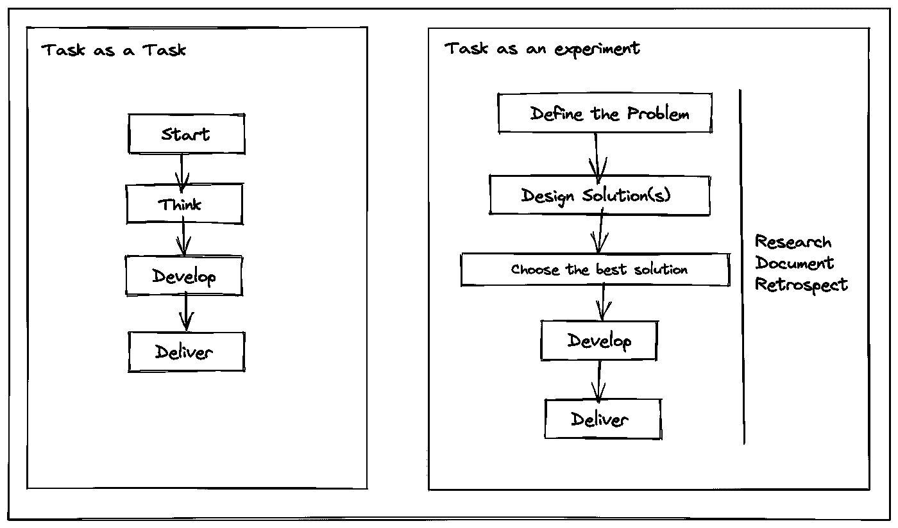
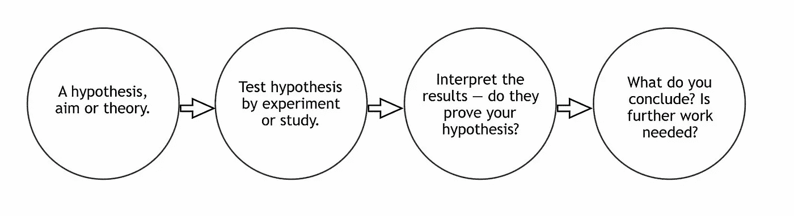

# 用科学的方法简化软件工程

> 原文：<https://medium.com/walmartglobaltech/streamlining-software-engineering-with-the-scientific-method-15015a43c6ed?source=collection_archive---------5----------------------->

科学方法是观察、记录和分享知识的最古老的定义明确的过程之一，其实践可追溯到 17 世纪。它被科学家、研究人员和学者广泛用于进行和记录实验以及撰写研究报告。我发现这个过程非常有趣，我觉得它可以用来简化任何工作，尤其是在软件工程中。这篇文章，我们来讨论一下如何。

# 科学的方法是什么？

简而言之，科学方法是一种通过观察并对照可测量的数据进行测试来验证和记录实验的方法或过程。这种方法被科学家在实验过程中广泛使用，以验证他们的观察结果是否正确。该方法涉及的典型步骤有:

1.  问题陈述/问题的表述
2.  做出假设
3.  用实验来检验假设
4.  结果分析
5.  交流结果

关于这一过程的细节有许多文章和科学期刊，所以我不会深入研究这些步骤是什么。让我们看看软件工程师如何在他们的工作中应用这些步骤。

Steps of the Scientific Method (Image Source: [Wikipedia](https://en.wikipedia.org/wiki/Scientific_method#/media/File:The_Scientific_Method.svg) Licensed under [CC BY-SA 4.0](https://creativecommons.org/licenses/by-sa/4.0))

# 将任务视为实验

一个工程师在一个典型的工作日里要做的任何任务都可以看作是一个实验。让我们举一个在软件中编码一些功能的例子。通常，工程师会在脑海中设计代码的结构，考虑如何存储和处理数据，如何实现业务逻辑，然后可能考虑如何将其与现有系统集成。将这项任务视为一项实验将包括正确定义它，如一个问题陈述或一个问题，记录进展，思考解决/回答它的多种方法，考虑所有的结果，根据事实验证它，最后在文档中交流结果。

Task vs. Experiment

这样，任务可以被记录下来，就像我们过去在学校科学实验室的实验室文件中记录实验一样。工程师可以展示他们对任务的发现，他们做出了哪些假设，他们考虑了多少种完成任务的方法，他们如何得出最佳方法，什么失败了，什么成功了，以及集成或部署的计划。

这将鼓励更好地正确定义任务及其范围。定义明确的问题比定义不明确的问题更容易解决。

# 假设和观察的假设检验

创建假设并测试它们是做任何事情的好工具。在软件设计中，我们要做出许多决定，我们必须在多个选项中进行考虑，选择最适合产品的选项。在发现这种决策时，假设检验会有很大的好处。例如，一名工程师想为他们的产品选择最好的数据库。他们必须仔细考虑所有可行方案的利弊，选择最适合自己的方案。他们可以创建一个假设，比如说，“SQL 应该用于事务性系统”。通过设计来测试这一假设将迫使他们考虑并记录所有可用的数据来支持这一假设。他们必须观察和记录可测量的基准。通过这种方式，在实验结束时，他们将获得问题的最终解决方案，并得到数据的支持，他们可以满怀信心地向他们的领导、管理层或任何其他利益相关者推销这些数据。

Hypothesis Testing (Attribution: [Brightyellowjeans](https://commons.wikimedia.org/wiki/File:4_stage_Scientific_Method.jpg), [CC BY-SA 4.0](https://creativecommons.org/licenses/by-sa/4.0), via Wikimedia Commons)

# 有价值的成果

沟通是工程中最重要的方面之一，也是最容易被忽视的方面之一。无论是通过电子邮件、JIRA 故事还是维基页面，工程师可以做的任何事情都应该清楚地传达。科学方法的最后一步是交流结果。科学家通常通过发表论文的研究期刊来交流成果。研究论文是最好的文档形式。即使是工程文档也应该这样创建。一个好的文档应该从定义要解决的问题开始，进行什么实验来解决它，以及这些实验的结果是什么。如果我们举一个为软件中的功能编写代码的例子，工程师应该创建一个描述以下内容的文档:

1.  **问题陈述:**需求是什么，是谁定义的
2.  **发现/研究:**使用了什么工具，集成了哪些系统，做出了什么假设
3.  **假设和测试:**考虑的设计决策，使用的数据结构，选择它们的原因都有可测量的数据支持
4.  **成果:**软件测试结果，性能洞察
5.  **结果:**最终交付成果

# 结论

虽然科学方法是为科学家设计的，但它激发了许多可以应用于日常软件工程的良好实践。还有更多这样的实践可以与工程互操作。如果你知道任何其他对你如何完成日常任务有帮助或启发的方法或过程，请在评论区告诉我。感谢您的阅读。