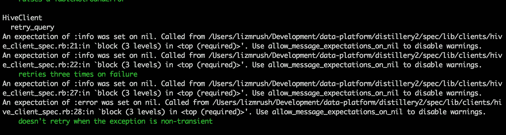

# 在 RSpec 中对零设置了更严格的期望测试

> 原文：<https://medium.com/square-corner-blog/stricter-tests-for-expectations-set-on-nil-in-rspec-1b33244ca75d?source=collection_archive---------3----------------------->

## 当期望值为零时，使 RSpec 测试失败。

*由* [撰写*莉丝奔*](https://medium.com/u/feb32780d540?source=post_page-----1b33244ca75d--------------------------------) *。*

> 注意，我们已经行动了！如果您想继续了解 Square 的最新技术内容，请访问我们的新家[https://developer.squareup.com/blog](https://developer.squareup.com/blog)

当我在 Square 开始编写第一批代码时，我的任务是确保数据平台团队的 Ruby 程序在遇到非暂时性错误时不会不断重试数据查询。我们的日志被关于多个查询的信息填满，甚至在一个错误之后——比如找不到表。无论我们重试多少次，都找不到那张表！因此，当我着手防止一些过度的查询时，我从我们的测试开始。

# 愚蠢的测试导致愚蠢的代码

当我的队友审查我的代码时，他们很快发现了一个错误:我一直在重构一些变量，在这样做的过程中，我忘记了确保我的实例变量被正确地实例化。我迫不及待地将我们的@logger 改成了我们正在讨论的类的 initialize 方法中的 logger。这是一个容易犯的错误，幸运的是，也是一个容易发现的错误。我们很快发现了代码审查中的错误，并疑惑为什么我们的测试仍然通过。我们又在本地做了测试。我浏览了与 PR 相关的构建输出。一切都是绿色的。

在几次“啊，这太奇怪了”之后，我们决定再运行一次测试，看看会发生什么。这次我们看了测试。果然，它们仍然是绿色的，但这一次我们看到了一些我们以前没有看到的屏幕输出。它们是来自 RSpec 的警告！



这暴露了测试中的两个常见问题。开发人员很懒:如果您必须向上滚动才能看到输出，您可能不会看到。
2。如果一切正常，测试中的问题就不会被发现。

# 为更好的代码进行更严格的测试

为了解决上述问题，我们认为当期望值为零时，强制测试失败是有益的。在 RSpec-mocks 中，已经有了在测试中设置一个标记来抑制警告消息的选项。我们希望我们的代码更加严格；当我们把期望值设为零时，我们希望测试失败。让我们抓住那些误报！

我们一开始只是简单地模仿已经存在的抑制警告信息的行为。您可以在测试中调用一个方法 allow _ message _ expectations _ on _ nil 来实现这一点。我们以完全相同的方式实现了一个 disallow _ message _ expectations _ on _ nil 方法[。在讨论如何实现这一点时，我们立即想到将它作为一个配置标志有多好，您可以简单地在您的 RSpec 配置中设置它，但是我们决定不立即这样做。由于这是库的一个小而新的特性，我们决定最好做最小可行的实现并公开一个 PR，这样我们可以从维护者那里得到反馈，看看他们是否想首先集成它。](https://github.com/lizrush/rspec-mocks/commit/e6cf52138a8d5ad32f24a4e21a0a53b1b9ebe660)

当然，维护者的第一个评论是，是的，他们希望包含这个特性，但是作为一个全局配置不是更好吗？有人建议我们像这样实现这个更严格的测试配置:

```
RSpec.configure do |config|
  config.mock_with :rspec do |mocks|
    mocks.allow_message_expectations_on_nil = false
  end
end
```

通过重构 allow _ message _ expectations _ on _ nil 标志，我们不仅能够将它移动到一个地方，在那里您不必再为每个需要该设置的测试调用该 API，而且我们还扩展了模拟应该如何表现的选项。以前，唯一的选项是允许警告或允许和禁止警告。

现在，我们有以下可以在 RSpec 模拟配置中设置的选项:

*   对配置标志不做任何事情，保留默认行为:
*   当期望值设置为零时，RSpec 将警告用户，但测试不会失败(原始行为)。
*   将 allow_expectations_on_nil 设置为 true:
*   RSpec 将抑制警告消息(原始行为)。
*   将 allow_expectations_on_nil 设置为 false:
*   当期望值设置为 nil(新行为)时，RSpec 将无法通过测试。

# 测试测试框架

这一改变的好处之一是我们能够重构一些已经准备好的警告代码。虽然以前它只是 ProxyForNil 类内部的一个方法，用硬编码的字符串调用 Kernel.warn('message here ')，但我们能够通过使用 ErrorGenerator 类来清理它，该类必须在以后的某个时间点创建。事实上，ProxyForNil 类已经实例化了 ErrorGenerator 的一个实例，但它没有被使用。现在，当调用默认行为 warning 或引发错误的新实现时，这两种方法都使用 ErrorGenerator 类。这不仅创建了一个更加一致的错误和警告实现，而且还允许框架本身的测试更加精确！

为测试框架做贡献的另一个主要挑战是用框架来测试自己。如果你用来测试的措辞和你正在测试的措辞是一样的，那么阅读测试就要困难得多。最终，我们在测试中加入了这一行，起初看起来有点令人难以置信:

```
expect { expect(nil).to receive(:foo) }.to raise_error(RSpec::Mocks::MockExpectationError)
```

在达到我们可以期望我们所有的期望以我们想要的方式运行的程度之后，另一个挑战是弄清楚如何测试框架的配置，而不从您的测试中改变整个套件的配置。这让我困惑了很长时间。当我们使用新特性来禁止对 nil 的期望时，我们可以通过我的测试，但是更严格的配置会使套件中的其他测试失败！

谢天谢地，在我们怀疑会遇到类似问题的其他测试中，我们在库的 spec_helper 文件中找到了一个方便的共享上下文:

```
context 'configured to disallow expectations on nil' do
       include_context 'with isolated configuration'
        it 'raises an error when expectations on nil are disallowed' do
          RSpec::Mocks.configuration.allow_message_expectations_on_nil = false
          expect { expect(nil).to receive(:foo)     }.to raise_error(RSpec::Mocks::MockExpectationError)
          expect { expect(nil).not_to receive(:bar) }.to raise_error(RSpec::Mocks::MockExpectationError)
        end
      end
```

通过包含隔离配置的共享上下文，测试测试框架变得容易了。当库的维护者像 Rspec 团队一样乐于助人、反应迅速、热情好客时，这也很有帮助——特别感谢[乔恩·罗](https://twitter.com/jonrowe)、[泽维尔·谢伊](https://twitter.com/xshay)、和[米隆·马斯顿](https://twitter.com/myronmarston)以及团队的其他成员！

# 合并了！

[请购单已成功合并](https://github.com/rspec/rspec-mocks/pull/983)并已到位供您使用。下次运行测试套件时，考虑通过禁止对 nil 的期望来强制进行更严格的测试，并查看有多少先前通过的测试是误报的。

[](/@lizmrush) [## 利兹·拉什-简介

### 答案，这些问题和答案直接相互映射。“你叫什么名字”可以被问一千次…

medium.com](/@lizmrush)