# Mendix 中的条带支付 API

> 原文：<https://medium.com/mendix/stripe-payment-api-in-mendix-f87afa228bf4?source=collection_archive---------4----------------------->

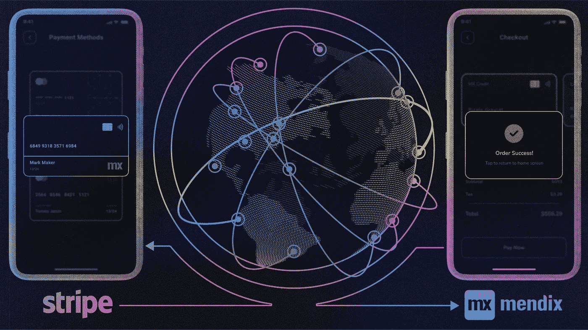

## 企业现在必须接受各种移动钱包，包括 Apple Pay、Google Pay 和支付宝。新法规(如欧洲的 PSD2)增加了 3D 安全的采用，使支付流程变得复杂。而且这只是在使用信用卡的情况下:80%的新互联网用户生活在非信用卡支付方式和定制支付流程成为标准的地区。

当你考虑到适应不断变化的浏览器标准、制作移动友好的支付形式并将其翻译成当地语言的成本时，维护高转化率和合规支付形式的成本很快就变得巨大且不断增长。

> 简而言之，Stripe 简化了创建基本结帐表单的过程。

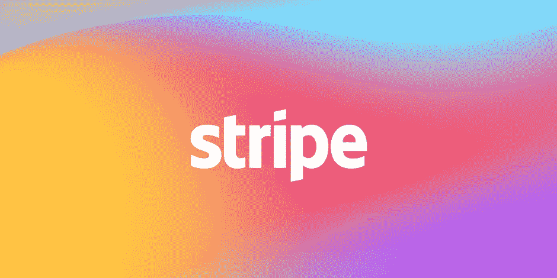

# 条带检验

这个预先构建的托管支付页面对于不想编写任何前端代码的人来说非常有用。虽然 Checkout 很容易使用(除非你打算自己支持所有的边缘情况，例如，与本机自动填充一起工作的地址自动完成，移动设备上的 3D Secure，桌面上的支付宝等)，但使用 Checkout 可能会增加你的收入，并节省你的大量工程时间。

## 如何在 Mendix 中实现这一点？

在这篇博客中，我将解释将 Stripe 与 Mendix 应用程序集成以实现 Stripe 支付的步骤。

要做到这一点，只需遵循这些简单的步骤。

**第一步:**先跟邮差测试一下。

要让 Stripe API 进入你的 Postman，只需观看这个 YouTube 视频，你就会熟悉 Stripe 的 API 头和参数。

**第 2 步:**使用以下链接创建一个新的 Stripe 帐户，使用您的凭据登录。

 [## 注册并创建一个条带帐户|条带

### 立即注册快速创建一个新的 Stripe 帐户，并在几分钟内开始接受付款。

dashboard.stripe.com](https://dashboard.stripe.com/register) 

**第 3 步:**访问您的 Stripe 账户的仪表盘，网址为:

 [## 条带登录|登录条带仪表板

### 登录 Stripe Dashboard，管理您帐户中的业务支付和操作。管理支付和…

dashboard.stripe.com](https://dashboard.stripe.com/test/dashboard) 

选择**新业务**并将您的应用命名为:

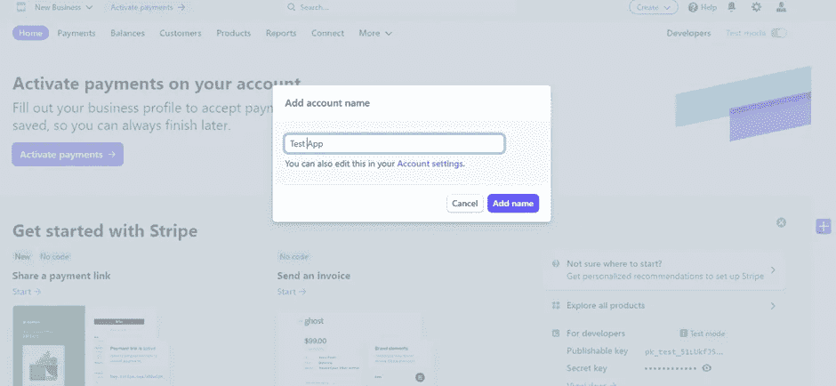

> 秘密密钥**和可发布密钥**将在仪表板中可见。

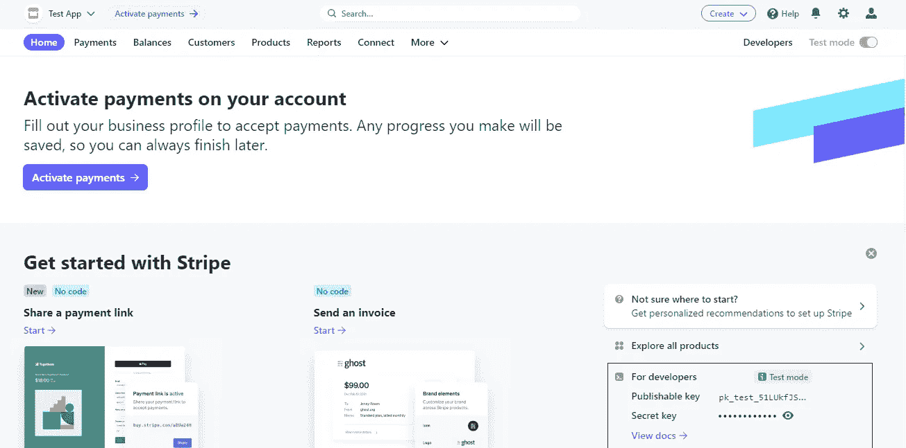

点按眼睛图标，然后点按值，以复制它。

**** *记下它以备将来参考。* ****

返回邮递员。导航到您的工作区并搜索 Stripe API。

如果你不确定如何分叉，回到**步骤 1** 。

**第四步:**通过选择 Stripe API，可以用自己的变量替换秘钥。

没有必要申请所有文件夹。它可以选择' ***从父节点*** 继承授权'(所以不要管它)

有几个可见的内置集合。

前往收银台，打开**步骤 1 视频中提到的“创建会话”。**

返回 Mendix Studio Pro。

**步骤 5:** 用 **POST** 方法创建一个微流并包含**一个调用 rest-activity** 。

```
**Location URL**: [https://api.stripe.com/v1/checkout/sessions](https://api.stripe.com/v1/checkout/sessions)**HTTP authentication:** Enabled**Username**: ‘sk_test_Your_Secret_Key’**Password**: ‘ ’**Custom HTTP Headers** -‘Content-Type’ = ‘application/x-www-form-urlencoded’
```

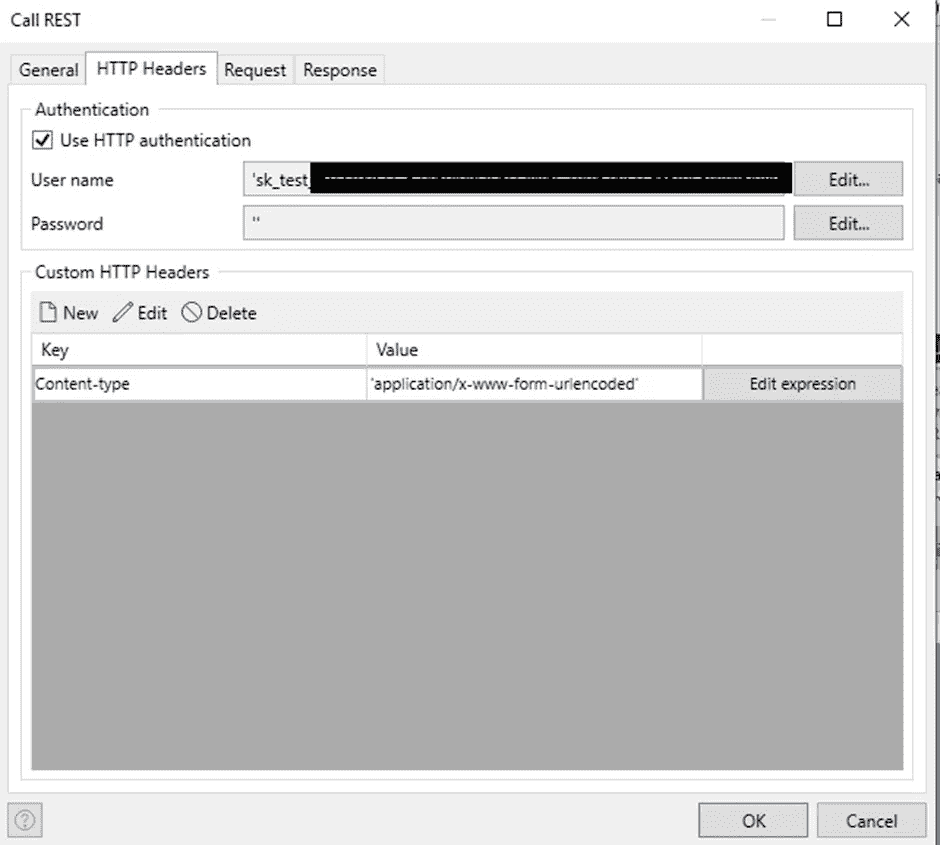

Add your secret key as User name and HTTP Header

**第六步:**通过在 Postman 中创建客户来获取**客户 ID** 。(如步骤 1 视频中所述)

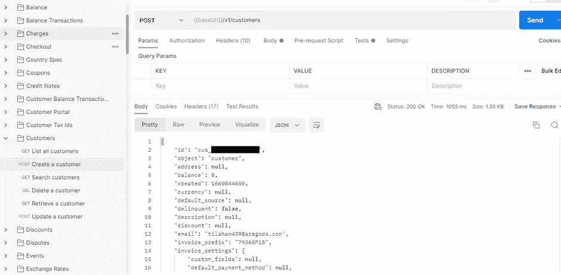

Response JSON while creating a customer

从请求选项卡中选择“**自定义请求模板**”，然后输入请求正文，如图所示。为了截取这个片段，我插入了一些静态值。您可以选择使用任何变量。

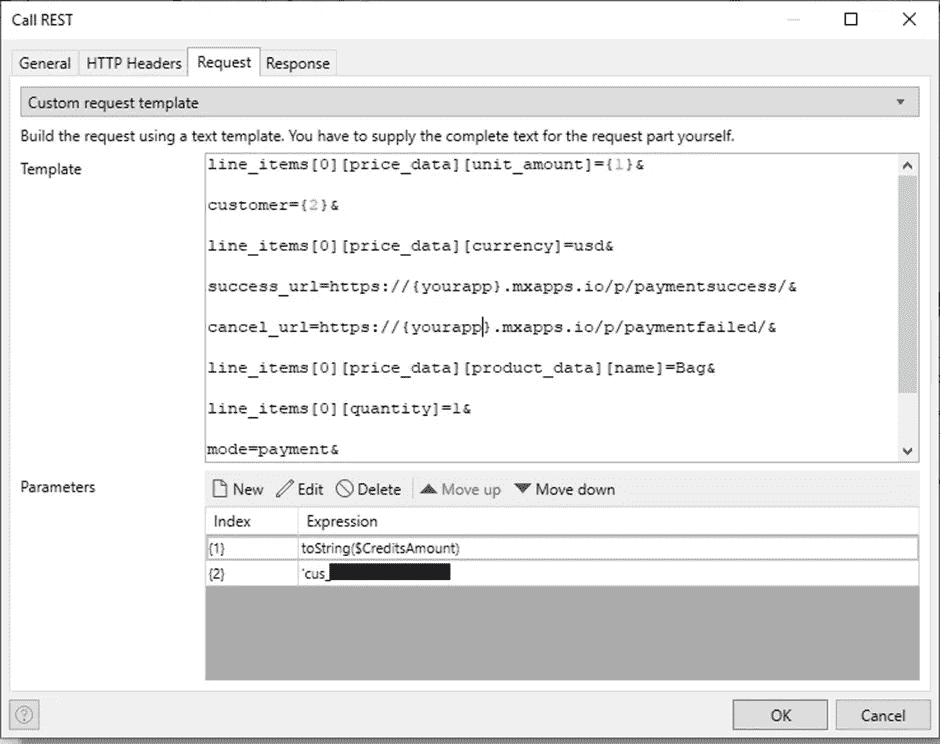

Request Structure

你可以在正文中添加更多的内容。如果您是使用 REST 服务的新手，请访问此链接，了解如何在 Mendix 中使用它们。

 [## 消费休息服务

### 描述如何从 REST 服务获取信息。

docs.mendix.com](https://docs.mendix.com/howto/integration/consume-a-rest-service/) 

然后，像往常一样，使用来自“create checkout”的 Postman 响应，使用返回的 JSON 构建一个新的导入映射。在“响应”选项卡中，使用新建立的导入映射(应用导入映射)

## **响应**

您将得到一个结尾带有 URL 的响应。

```
{
   "status":"open",
   "submit_type":null,
   "subscription":null,
   "success_url":"https.yourUrl":,
   "total_details":{
      "amount_discount":0,
      "amount_shipping":0,
      "amount_tax":0
   },
   **"url":"**[**https://checkout.stripe.com/pay/cs_test_a1QOlCTcQHgzAkk**](https://checkout.stripe.com/pay/cs_test_a1QOlCTcQHgzAkk)**...."** }
```

**第七步:**响应成功后，可以检索高亮显示的 URL，并将对象发送到页面。

在该页面上，您可以使用 **URL 重定向器小部件**并传递对象(下面截图中的 PaymentURL)。

该页面将重定向到支付页面，用户可以使用卡的细节进行支付。

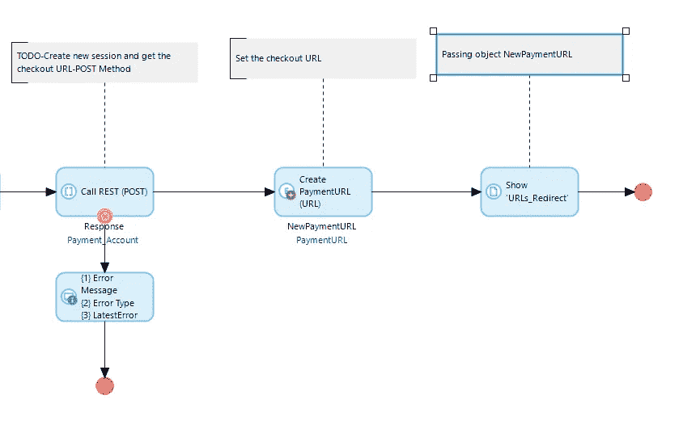

Redirect to checkout page

步骤 8: 在你的 Mendix 项目中创建两个页面，并配置页面 URL，如下所示。

**页面 1:** 支付成功页面网址

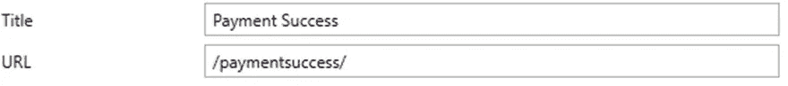

**第二页:**支付失败页面网址

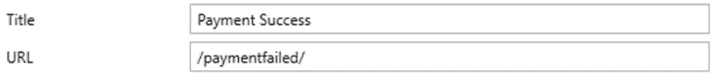

完成支付后，用户将重定向到您在请求正文中给出的 success_url，这同样适用于 cancel_url。

要验证支付或获取会话 id，只需将**{ {结帐会话 ID}** 附加到成功 URL 的末尾。

您将获得一个会话 ID，您可以使用它来检查支付状态，它是否完成，以及用户支付了多少。

前往条纹仪表板[https://dashboard.stripe.com/test/payments](https://dashboard.stripe.com/test/payments)和支付选项卡查看您的所有支付及其状态。

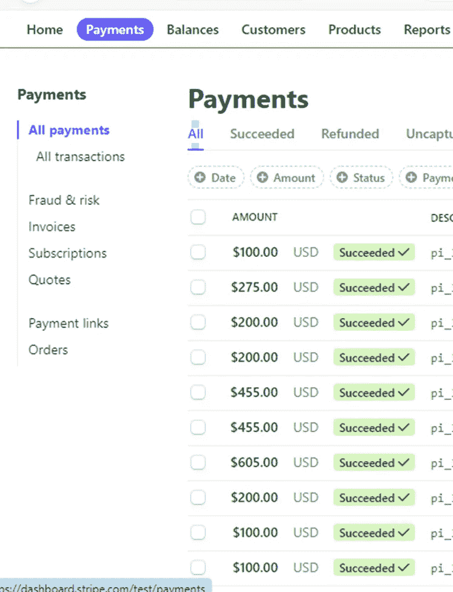

## 就这样，你完了。

希望有帮助。如果你有任何问题或者你有更好的主意，请在评论区留言。谢谢！

## 阅读更多

[](https://stripe.com/docs) [## 证明文件

### 浏览我们的指南和示例来集成 Stripe。

stripe.com](https://stripe.com/docs)  [## 消费休息服务

### 描述如何从 REST 服务获取信息。

docs.mendix.com](https://docs.mendix.com/howto/integration/consume-a-rest-service/) [](https://www.postman.com/) [## 邮差 API 平台|免费注册

### 超过 2000 万开发者使用 Postman。通过注册或下载桌面应用程序开始。什么是邮递员…

www.postman.com](https://www.postman.com/) 

*来自发布者-*

*如果你喜欢这篇文章，你可以在我们的* [*中页*](https://medium.com/mendix) *找到更多喜欢的。对于精彩的视频和直播会话，您可以前往*[*MxLive*](https://www.mendix.com/live/)*或我们的社区*[*Youtube PAG*](https://www.youtube.com/c/MendixCommunity/community)*e .*

*希望入门的创客，可以注册一个* [*免费账号*](https://signup.mendix.com/link/signup/?source=direct) *，通过我们的* [*学苑*](https://academy.mendix.com/link/home) *获得即时学习。*

有兴趣加入我们的社区吗？加入我们的 [*松弛社区频道*](https://join.slack.com/t/mendixcommunity/shared_invite/zt-hwhwkcxu-~59ywyjqHlUHXmrw5heqpQ) *。*