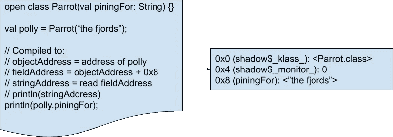

# 结构类重定义

> 原文：<https://medium.com/androiddevelopers/structural-class-redefinition-6fc0cbab9161?source=collection_archive---------0----------------------->

# **简介**

Android 11 中的 Android Runtime (ART)向 JVMTI API 引入了一个名为结构类重定义的扩展。这篇文章将涵盖结构重定义的能力，以及我们在实现该特性时遇到的一些考虑和权衡，以及我们如何解决它们。结构化类重定义是一个运行时特性，它扩展了 Android 8 中添加的类重定义功能。结构化类重定义允许工具(如 Android Studio Apply Changes)修改类结构本身，允许向类中添加新的字段和方法(旧的“普通”类重定义限制了对类中已有方法实现的更改)。

这可以被利用到强大的功能中，例如扩展应用更改以支持向应用添加新资源。你可以在这里[了解 Android Studio 的“应用更改”功能是如何工作的](/androiddevelopers/android-studio-project-marble-apply-changes-e3048662e8cd)，也可以在未来的博客文章中了解它是如何使用即将到来的结构类重定义进行扩展的。Android Studio 内置了更复杂、更强大的工具来利用这些新功能。

JVMTI 是一个标准的 API 开发工具，可以用来在非常深的层次上交互和控制运行时。它用于实现许多您可能熟悉的开发人员工具，从 Android Studio [网络](https://developer.android.com/studio/profile/network-profiler)和[内存](https://developer.android.com/studio/profile/memory-profiler)剖析器到调试器到模仿框架，如 [dexmaker-mockito-inline](/androiddevelopers/mock-final-and-static-methods-on-android-devices-b383da1363ad) 和[mock](https://mockk.io/)到新的[布局](/androiddevelopers/layout-inspector-1f8d446d048)和[数据库](/androiddevelopers/database-inspector-9e91aa265316)检查器。您可以从 [android 文档](https://source.android.com/devices/tech/dalvik/art-ti)中找到更多关于 Android JVMTI 实现以及如何将其用于您自己的工具的信息。

# **结构重定义**

结构化类重定义改进了 Android Oreo (8.0)中增加的对类重定义的支持。在 Oreo 中，只有现有方法的定义可以更改。对象布局和类定义的字段和方法集不能以任何方式更改。

结构类重定义允许在修改类时有更大的自由度，允许向现有类添加全新的方法和字段。对于可以添加什么类型的方法和字段没有限制。新添加的字段被初始化为 0 或 null，但是如果需要，代理可以使用其他 JVMTI 功能来初始化它们。与标准的类重定义一样，当前执行的方法将继续使用它们的旧定义，尽管对它们的后续调用将使用新定义。为了确保结构重定义可以具有清晰和一致的语义，不允许进行以下更改:

*   不能移除字段和方法，也不能更改它们的属性
*   类不能更改它们的名称
*   类层次结构(超类和实现的接口)不能改变

结合 Android Studio 的支持，结构类重定义可用于实现最常见编辑的应用更改。这篇文章的其余部分将介绍我们如何实现这个特性，以及我们在实现新的运行时特性时的一些考虑和权衡。

# **首先，不要伤害他人**

结构重定义的主要挑战是在不影响应用程序在发布模式下运行的情况下实现它。对于每个在可调试模式下运行代码并使用应用更改或调试器等工具的开发人员来说，有数百万用户在他们的手机上正常运行这些应用程序。因此，对于 ART 中任何新的开发人员功能，最重要的要求之一是当应用程序不可调试时，不要影响运行时性能。这意味着我们不能对运行时的核心内部进行重大修改。我们不能改变诸如对象的基本布局、分配或垃圾收集，如何链接和加载类，或者如何执行 dex 代码。

对象，包括 java.lang.Class 对象(在 ART 中包含它们的类的静态字段)，在加载时就确定了它们的大小和布局。这允许非常有效的执行，因为例如在下图所示的“Parrot”类中，我们总是知道“piningFor”字段包含在任何 Parrot 的偏移量“0x8”处。这意味着 ART 能够生成高效的代码，但是在对象被创建之后就不可能改变它们的布局，因为通过添加新的字段，我们不仅改变了该类对象的布局，而且改变了它的所有子类型的布局。为了实现这个特性，我们所做的是透明地、自动地用它们重新定义的对应物替换所有旧的类和实例。

为了以不降低性能的方式提供结构类重定义，我们需要深入到运行时的内部。基本上，对一个类进行结构重定义有 4 个主要步骤。

1.  使用新的类定义为所有被更改的类型创建新的 java.lang.Class 对象。
2.  用新定义的类型重新创建旧类型的所有对象。
3.  用相应的新对象替换/更新所有旧对象。
4.  确保所有编译的代码和运行时状态相对于新类型布局都是正确的。

# **追逐表演**

像许多程序一样，ART 本质上是多线程的，这是因为它运行的 dex 代码(潜在的)多线程本质，也是为了避免运行时暂停。在任何时候，运行时都可能同时做许多事情:运行 java 语言代码、执行垃圾收集、加载类、分配对象、运行终结器或许多其他事情。

这意味着用幼稚的方式做重定义有明显的种族。例如，如果在我们已经重新创建了所有旧对象之后，又创建了一个新实例，那会怎么样呢？因此，我们需要非常小心地执行每个步骤，以确保没有任何东西能够看到或创建不一致的状态。我们需要确保每个线程看到上图所示的转换是自动发生的，一次完成。

对此天真的解决方案是，一旦我们开始重新定义某个东西，就停止一切死亡。然后，我们以上述方式执行重新定义(创建新的类和对象，然后替换旧的)。这样做的好处是，我们不需要付出任何努力，就能获得我们需要的原子性。当观察到不一致时，所有代码都会暂停，所以什么也看不到。不幸的是，这种方法有几个问题。

首先，它会慢得吓人。可能需要重新创建大量的对象和重新加载大量的类(例如，可能需要编辑 java.util.ArrayList 类，该类通常一次可以有数千个实例)。一个更紧迫的问题是，在所有线程都停止的情况下，分配是不可能的。这是为了防止死锁，例如，我们在分配东西之前等待暂停的 GC 线程完成工作。这种限制深植于艺术及其 GC 的设计之中。简单地改变它来消除这个限制是不可行的，尤其是对于一个只在调试上下文中使用的特性。由于结构重定义的主要部分是重新分配所有重定义的对象，这显然是不可接受的。

那我们现在怎么办？我们仍然需要确保，就所有 Java 语言代码而言，变化会立即发生，但我们不能在这样做的时候让世界停下来。这里我们可以利用 Java 语言的限制，堆和重要的类加载状态不能被线程直接观察到，重要的 GC 管理线程永远不会分配或加载类。

这意味着我们需要暂停剩余运行时的唯一步骤是替换过程。我们可以在其他代码仍在运行时分配所有的类和新对象。因为这些线程都没有对新对象的任何引用，并且正在运行的代码仍然是原始的，所以看不到任何不一致。

对于任何有兴趣了解这一切是如何实际实现的人，我们已经链接到了实现的一些相关部分。这些链接到 [Android 代码搜索](https://android-developers.googleblog.com/2019/12/code-search-with-cross-references-for-aosp.html)界面，在那里你可以探索 Android 和 AOSP 是如何创建的。

因为我们允许应用程序代码继续运行，我们需要小心世界的状态不会从我们脚下改变。要做到这一点，我们必须小心地按顺序关闭运行时的各个部分，以确保我们可以收集我们需要的所有信息，并且它在运行时不会失效。为了实现这一点，在重定义的瞬间，我们需要有一个被重定义的类及其所有子类的 java.lang.Class 对象的完整列表，一个所有重定义的类对象的对应列表，一个该类的所有实例的完整列表和一个所有重定义的对象的对应列表。

由于加载新的类很少(我们需要新的类对象来分配重定义的实例)，我们可以从计算出被重定义的类的列表并为重定义的类型创建新的类对象开始。为了确保这个列表保持有效和完整，我们需要在创建这个列表之前[完全停止类加载](https://cs.android.com/android/platform/superproject/+/android-r-beta-2:art/openjdkjvmti/ti_redefine.cc;l=2476)。为此，我们既需要[阻止新类加载开始](https://cs.android.com/android/platform/superproject/+/android-r-beta-2:art/openjdkjvmti/ti_redefine.cc;l=2387;drc=android-r-beta-2)，又需要等待[正在进行的类定义完成](https://cs.android.com/android/platform/superproject/+/android-r-beta-2:art/openjdkjvmti/ti_redefine.cc;l=2397;drc=android-r-beta-2)。一旦完成，我们就可以安全地[收集](https://cs.android.com/android/platform/superproject/+/android-r-beta-2:art/openjdkjvmti/ti_redefine.cc;l=1901;drc=android-r-beta-2)和[重新创建](https://cs.android.com/android/platform/superproject/+/android-r-beta-2:art/openjdkjvmti/ti_redefine.cc;l=1953;drc=android-r-beta-2)所有重新定义的类对象。

现在我们已经收集了所有的类，我们需要找到并重新创建需要替换的实例。类似于我们对类所做的，我们需要[暂停分配](https://cs.android.com/android/platform/superproject/+/android-r-beta-2:art/openjdkjvmti/ti_redefine.cc;l=2484;drc=android-r-beta-2)并等待所有线程[确认它](https://cs.android.com/android/platform/superproject/+/android-r-beta-2:art/openjdkjvmti/alloc_manager.cc;l=197;drc=android-r-beta-2)，以确保我们的对象列表不会过时。再次像对待类一样，我们简单地[收集所有旧的实例](https://cs.android.com/android/platform/superproject/+/android-r-beta-2:art/openjdkjvmti/ti_redefine.cc;l=1727;drc=android-r-beta-2)和[创建它们的新版本](https://cs.android.com/android/platform/superproject/+/android-r-beta-2:art/openjdkjvmti/ti_redefine.cc;l=1765;drc=android-r-beta-2)。

现在我们有了所有的新对象，剩下要做的就是从旧对象中复制字段值，并实际执行替换。因为一旦我们开始给线程或对象引用替换，它们将不再是不可观察的，并且线程在运行时可以任意改变任何字段，所以在我们执行最后几个步骤之前，我们需要最终[停止所有线程](https://cs.android.com/android/platform/superproject/+/android-r-beta-2:art/openjdkjvmti/ti_redefine.cc;l=2508;drc=android-r-beta-2)。既然所有其他线程都已停止，我们可以[将字段值从旧对象复制到新对象](https://cs.android.com/android/platform/superproject/+/android-r-beta-2:art/openjdkjvmti/ti_redefine.cc;l=2783;drc=android-r-beta-2)。

一旦完成，我们就可以[实际遍历堆](https://cs.android.com/android/platform/superproject/+/android-r-beta-2:art/openjdkjvmti/ti_redefine.cc;l=2929;drc=android-r-beta-2)并且[用新的重新定义的实例](https://cs.android.com/android/platform/superproject/+/android-r-beta-2:art/openjdkjvmti/ti_heap.cc;l=1664;drc=android-r-beta-2)替换所有旧的实例。现在剩下的就是做一些杂七杂八的工作，以确保诸如反射对象和所有各种运行时解析缓存根据需要被更新或清除。我们还确保跟踪足够的数据，以允许所有代码在重定义开始时继续运行。

# **结论**

有了结构重定义的能力，许多全新的、更强大的调试和开发工具成为可能。我们已经讨论了对 apply-changes 的改进，Android 中的许多其他团队正在寻求使用它来制作其他优秀的工具。这只是我们在每个 Android 版本中添加的许多改进和新功能的一部分。你可能也想阅读我们最近的博客文章，关于我们如何使用 IO 预取来改善 Android 11 中应用程序的启动时间。

> [1]在此之前，我们执行了一些检查，以确保所有的类都有资格进行重定义，并且新的定义是有效的，但是这些验证并不十分有趣。
> 
> [2]从技术上讲，不相关的类继续加载是安全的，但是由于类加载的工作方式，没有办法在足够早的时候区分这些情况。
> 
> [3]同样，ART 中分配如何与跨线程同步交互的细节阻止我们仅暂停作为我们重新定义的类的实例的分配。