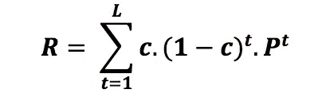

# 基于结构和属性的图划分

> 原文：<https://medium.com/walmartglobaltech/structure-attribute-based-graph-partitioning-9c3fabf8cc12?source=collection_archive---------1----------------------->

## **应用于沃尔玛分类分析**

沃尔玛为其顾客提供了种类繁多的产品。对于许多分析来说，将产品归入相似的可替代组比单独考虑它们更有用。一个这样的分析结果是一个树状结构，称为客户行为树(以下简称为 CBT ),以项目作为叶节点。“行为”在这里意味着分组不是基于明确的项目特征，而是基于顾客显示的偏好的隐含的项目相似性。树表示这样一种结构，其中同一父节点的子节点比不同父节点的子节点更具可替换性(最好用树状图表示)。该 CBT 可作为所有进一步分类和定价决策的有用分组。

虽然对数百万件商品进行分类本身就具有挑战性，但由于沃尔玛在美国有 4500 多家商店，90 多个部门，总计约 7200 个类别，为数百万顾客提供服务，因此复杂性成倍增加。除了沃尔玛的庞大规模，一些类别，特别是普通商品类别，没有足够的给定家庭的重复购买信息，导致市场购物篮分析和关联规则的可用性受到限制。毕竟，人们不会像购买酸奶或罐装豆子那样频繁地购买锤子或婴儿家具。

班加罗尔沃尔玛实验室的分类分析团队通过将销售点(PoS、交易)数据建模为适当的图形，并使用图形分区方法对商品进行聚类，解决了这一问题。对于给定的类别，使用过去几年所有商店中所有商品的交易信息创建结构图。每个物品被认为是一个顶点，当且仅当一对物品在所考虑的时期内至少被一个家庭购买过一次时，图中的一对物品之间才有一条边。每个边被赋予一个适当的权重(仅从销售数据的角度计算)，该权重可以被认为是可替代性的度量。

这篇文章将讨论划分聚类图的过程。但是，在此之前，先给出图划分方法的高级概述。

# 理解图表

图形是一种数学结构，表示为由“边”(线)连接的一组“顶点”(节点)，表示多个对象(节点)之间的关系。一个图可以是有向的或无向的，也可以是加权的或未加权的。

图划分问题旨在将给定的图划分成更小的组件，具有特定的属性(通常是相似的子图)。换句话说，图划分的目标是基于各种标准，如顶点连通性或邻域相似性，将大型图中的顶点划分成**簇**。

> **聚类的基本原理:**
> 
> **同一组(或群)中的对象比其他组(或群)中的对象彼此更相似(在某种意义上)**

**类似地，一个图的好的划分被定义为这样一个图，其中在分离的部分之间运行的边的数量很少。一种流行的分区算法是 Google 的 PageRank 算法。**

**通常，图划分问题属于 NP 难问题的范畴。这些问题的解决方案通常是使用试探法和近似算法得出的。**

# **图形划分**

**结构图划分的主旨是将一个图 G = (V，E)划分成 *k* 个子图，使得每个子图尽可能紧密连接，并且穿过划分的边的总权重最小。**

**由于这是一个 NP 难问题，实际的解决方案是基于启发式的。有两大类解决方案，本地和全球。**

**类似于贪婪算法的局部解决方案虽然更快，但严重依赖于起点。全局解决方案(主要基于最短路径)依赖于整个图的属性，因此对于大型和/或密集的图来说往往会变慢。**

**贪婪算法从随机顶点开始，在每一步贪婪地将具有最大边权重的边合并到它的路径中，从而遍历图；而全局解决方案总是查看任意两个顶点之间的最短路径，并使用该信息对图形进行聚类。**

**所有上述方法只考虑图的结构，因此假设顶点的特征是一致的。顶点的特征将取决于数据的明确性质，在该数据上创建图形。在沃尔玛的用例中，由于顶点是物品，它们的特征会强烈地依赖于物品的特征，比如属性(品牌、颜色、尺寸、材料、耐用性等)。)、价格、可用性、忠诚度等。基于属性的图划分的目标是将图 G = (V，E)划分为子图，使得给定子图中的所有顶点具有相似的属性并且不同于另一个子图的顶点。就我们的目的而言，理想情况下，我们希望拥有具有非常相似的项目属性的项目子组，这样它们就可以被视为替代品。**

# **计划方法**

**为什么我们不把这两种算法的优点结合起来，尝试根据图的结构和顶点属性来划分图呢？通过这种方式，我们可以从父图中获得子图，每个子图都由属性相似且密集连接的顶点组成。**

## ****高层算法解释如下:****

# ****算法****

****第一步:定义父图 G = (V，E，W)****

**考虑一个加权图 G = (V，E，W)，**

**在哪里**

**v:顶点集**

**边缘集**

**w:边权重矩阵(归结为**

**对于未加权或均匀加权的图)。**

***例如，考虑以下图形，具有 6 个顶点、8 条边和边权重 Wij:***

****

**Figure 1 : a graph with 6 vertices, 8 edges and edge weights Wij**

****第二步:定义属性图 G_a = (V，E，W，V_a，W_a)****

**在上面定义的图 G 中，V 中的每个顶点都具有关于 *n* 属性的信息，其中第 I 个属性具有 *k_i* 级别， *i* in 1，2，…，n**

**还知道每个属性的相对重要性(属性权重)，定义为 1，2，…，n 中的 *a_i* ， *i* 。**

**这里，V_a 是顶点的集合，用它们相应的属性值来标记，W_a 是属性权重的集合。**

***例如，考虑上面提到的具有 n = 2 个属性的图的属性信息，即属性 A(具有 2 个级别和属性权重* ***a*** *)和属性 B(具有 3 个级别和属性权重* ***b*** *)。***

****

**Attribute information as per above mentioned example**

***为了重新绘制上面的图形以及属性信息，我们有如下的，其中每个顶点都用它们的属性值标记:***

****

****第三步:将父图 G 与属性图 G_a 叠加，得到 G*_a = (V*_a，E*_a，W*_a)****

**现在，我们将不得不图形化地吸收来自**

**为了做到这一点，我们引入了*k _ 1*+*k _ 2*+…+*k _ n*个新顶点(以下称为属性顶点)，每个顶点对应于所有属性的不同级别。**

**所以，V * _ a = V U {属性顶点}**

**从每个属性顶点，定义到 G 的每个原始顶点的边(此后称为结构顶点)，如果所关心的顶点属于各自的属性(这样的边此后称为属性边)。因此，每个结构顶点将正好有 *n 个*属性边。**

**所以，E * _ a = E U {属性边}**

**如此定义的每个属性边的边权重将按照 G_a 中定义的属性权重。**

****

***使用上述例子形成的 G*_a 的图示将是:***

****

****步骤 4:将 G*_a 分割成子图****

**考虑 G*_a 上的随机行走，其中转移概率矩阵定义为 **P =((p_ij))** ，**

****

**定义统一邻域矩阵 **R = ((r_ij))** ，其中 **r_ij** 是从顶点 ***i*** 到顶点 ***j*** 的概率。**

**定义，**

***c* =随机漫步重启概率(用户定义)**

***L* =随机漫步的最大可能长度(用户定义，越大越好)**

**然后，**

****

**在某种程度上， **R** 是距离矩阵的反义词。为了从 **R** 中创建距离矩阵，可以如下创建距离矩阵 **R*** :**

****

**现在，可以在结构顶点上使用常见的聚类方法，如 **k-medoids、k-means** 或任何其他层次聚类技术**，以获得划分的子图。****

# **在一个例子上实现所提出的算法**

**上述算法在 ***图 1*** 中提到的图上演示。我们从 U(10，50)分布中随机生成了结构边权重，从 U(80，100)分布中随机生成了属性权重。**

**在获得的随机样本中，**

*****w _ 12***= 26.60983**

*****w _ 13***= 27.13616**

*****w _ 14***= 13.86644**

*****w _ 23***= 15.31082**

*****w _ 25***= 37.38426**

*****w _ 46***= 49.21425**

*****w _ 45***= 37.61334**

*****w _ 56***= 47.53184**

**和**

*****一*** = 81.42791**

*****b*** = 87.21310**

**获得的转移概率矩阵( **P** ):**

****

***c* = 0.01、 *L* = 200 的均匀邻域矩阵( **R** )为:**

****

**在对 **R*** = ((1/ **r_ij** ))的结构顶点子矩阵应用 k-means 和 k-medoids 之后，我们获得了最佳的聚类数为 2，如下所示。**

****

**对于沃尔玛中的商品分组问题，我们进一步将商品属性的味道注入到前面定义的结构图中，通过用对应的商品属性标记图的每个顶点，从而返回关于沃尔玛交易数据的包含属性的结构图。此后，在其上运行前述的图划分算法，以获得期望的 CBT。**

**这种项目分组在评估可替代组内的项目忠诚度、做出项目删除决策、理解现有项目缺货或添加新项目时项目间的客户需求转移、或理解相关项目的价格弹性方面具有重要作用。**