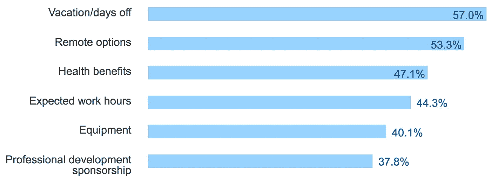

# 苦苦寻找优秀的高级 JavaScript 开发人员？导师是答案

> 原文：<https://medium.com/javascript-scene/struggling-to-find-great-senior-javascript-developers-mentorship-is-the-answer-d352ea3574eb?source=collection_archive---------0----------------------->

Dry Wraps — Vern (CC-BY-NC-2.0)

我越是研究导师制对我们合作团队的影响，就越是被它所带来的巨大变化所震惊。随着时间的推移，指导的成本以线性比例增加，但指导的影响以指数比例增加，复合生产率回报的数量级大于投入的时间和金钱。

由于根本不同的尺度(线性与指数)，我们很难想象在导师项目上投入更多会得到多少回报。我们的大脑似乎天生就以线性方式思考，让他们以指数规模和复合回报的方式思考令人沮丧地困难。

线性思维问题会导致我们犯下巨大的错误，比如整个软件行业在培训上投资严重不足。 结果是[没](https://haveibeenpwned.com/PwnedWebsites) [好](http://www.safetyresearch.net/blog/articles/toyota-unintended-acceleration-and-big-bowl-%E2%80%9Cspaghetti%E2%80%9D-code)。

通常，管理者会陷入一个错误的信念，即如果员工不忙着写代码，他们就没有被有效地利用。事实证明，这种想法根本没有事实支持。

*   根据 2016 年对超过 56，000 名程序员的 Stack Overflow 调查，导师项目与比大学学位更高的薪酬相关联——这反映了一个事实，即导师是一种极其有效的学习技能的方式。
*   根据 2017 年 Stack Overflow 调查，公司赞助的学习机会一直是员工在工作机会中寻求的最大好处之一。

*   88%的员工认为他们可以从更多的培训中受益。

## 对学员的指导益处

*   加速学习和成长
*   增强信心
*   更好地获取正面例子(如何按照专家的方式做事)
*   减少对贡献/协作/想法分享的恐惧
*   提高沟通技巧
*   学员感觉更投入、更受重视
*   改善向上流动——Sun Microsystems 公司的一项研究发现，学员获得晋升的可能性是其他学员的 5 倍
*   学员成为导师**并将所有这些利益传递给**

## 雇主的导师福利

*   招聘的额外津贴
*   提高开发人员的生产力和忠诚度
*   减少知识孤岛
*   提高[总线系数](https://en.wikipedia.org/wiki/Bus_factor) —降低继任风险
*   创造更加积极、有益、协作的团队文化
*   提高忠诚度
*   提高员工参与度和积极性，显著改善财务状况
*   改善领导识别和晋升渠道— **导师获得晋升的可能性增加 6 倍** ( [太阳微系统](https://www.forbes.com/sites/lisaquast/2011/10/31/how-becoming-a-mentor-can-boost-your-career/#34ec8a2a5f57))

该行业认识到技能缺口越来越大，并试图通过提供在线学习的免费订阅、免费书籍等来填补这一缺口，但这些资源没有被员工充分利用，因为:

*   员工通常不知道关注什么或者如何学习，当很难找到与他们的工作直接相关的资料时，在免费学习订阅中进行分类就像是巨大的时间浪费
*   员工担心他们的职业发展对公司来说不够重要，会扰乱他们的日常工作流程

导师与员工进行一对一的交流。一个好的导师应该能够快速、轻松地发现薄弱环节，帮助填补知识空白，而不用浪费任何时间去搜索随机的学习资源。

通过将导师制纳入员工的日常职责，您可以消除日常工作流程中的“干扰”,并正式分配时间供员工相互学习和交流。

# 将团队生产力提升 10 倍

研究的优势表明开发者之间的表现存在数量级的差异。引用史蒂夫·麦康奈尔(作者，[“代码完成”](https://www.amazon.com/Code-Complete-Practical-Handbook-Construction/dp/0735619670//ref=as_li_ss_tl?ie=UTF8&linkCode=ll1&tag=eejs-20&linkId=952cde4bfe49dde0dba31a960f2c8acb))的话:

> “程序员之间存在数量级差异”这一普遍发现已经被许多其他对职业程序员的研究所证实(Curtis 1981，Mills 1983，DeMarco 和 Lister 1985，Curtis 等人 1986，Card 1987，Boehm 和 Papaccio 1988，Valett 和 McGarry 1989，Boehm 等人 2000)。

这并不意味着一个优秀的开发人员会写出 10 倍多的代码或 10 倍多的功能。这意味着他们将交付 10 倍于**的组织价值。**(参见[“达到 10x”](/javascript-scene/getting-to-10x-results-what-any-developer-can-learn-from-the-best-54b6c296a5ef))。

相反，许多开发人员能够开发出交付组织价值的软件，但这样做的同时会招致大量的技术债务:编写难以或不可能维护的代码，或者错误百出。通常都是。

这样的开发人员可能会在短期内产生价值，但是随着时间的推移，**会对组织产生净负值**。

问题是，很难雇佣到高级开发人员:

**在美国，初级和高级开发人员的平均年薪相差 4 万美元** *【来源:Indeed.com】*，导致一些公司试图通过雇佣更多初级开发人员和更少高级开发人员来节省资金。

这种策略适得其反，因为如果没有正确的指导，初级开发人员在降低产品质量和生产率方面的成本通常比工资差要高得多。

> 如果你想省钱，就不要雇佣更便宜的开发者。培养更好的开发者。

**高级开发者难找难招。由于多年来技术岗位的增长一直快于市场上新开发人员的涌入，招聘高级开发人员的竞争非常激烈，薪水很容易超过除了资金最雄厚的公司之外的所有公司的预算。在撰写本文时，顶级公司通常会为顶级高级开发人员花费 14 万美元到 25 万美元以上(在采用黄金手环保留策略的公司中高达 40 万美元)。**

**到底什么是高级开发人员？**也许你听说过一万小时法则。掌握一门手艺需要大约 10000 小时的*刻意练习*。大约需要 6 到 10 年。但是拥有 1-5 年经验的开发人员经常被雇佣来填补“高级开发人员”的职位。显然，10k 小时的精通水平并不是当今业界用来定义“高级开发人员”的标准——这是有充分理由的。

我见过有 20 年经验的开发人员，我不会信任他们来开发 todo 应用程序，也见过有不到 1 年经验的开发人员，我会信任他们来开发任务关键型产品的架构。虽然经验是不可替代的，但在第一年之后，*经验远不如对这门手艺的热情和追求卓越的动力重要。*

1-3 年后，你开始真正看到致力于卓越和刻意实践的开发人员与那些只是为了 J-O-B 而从事 it 工作的开发人员之间的区别。“高级”开发人员不需要马上成为技术大师，但他们至少应该走上这条道路。

也就是说，真实的经历是无可替代的。你真的可以从那些经历过你要去的地方的人那里受益，他们有足够的时间来深入掌握所需的技能。不管你的训练有多好，至少有一个专家导师可以帮助你的团队是很棒的。

## 理想的专家导师属性(应具备以下大部分)

*   神入
*   耐心
*   优秀的沟通者和技术作家
*   6 年以上全职开发应用程序的经验(是的，在这种情况下，经验很重要——我们寻求精通。参见 10k 小时规则。)
*   对多种范例(OOP、FP 等)中的软件开发原则有深刻的理解
*   有使用多种编程语言的经验，最好来自不同的语系(C 语言，Lisp 语言，ML 语言等等)
*   体验与 20 多名开发人员和 1000 多万用户一起扩展应用
*   1-2 年的特定技术堆栈经验

最大的问题是，符合这种描述的员工很难找到，小公司也很难负担得起。(如果我刚刚描述了你，请[伸出手](https://paralleldrive.zendesk.com/hc/en-us/requests/new))。

目前大多数名为“高级 JavaScript 开发人员”的工作列表并不需要这种水平的专业知识。1-3 年的经验，1 年所需的技术和高质量的 JavaScript 培训就足够了。将他们与一个优秀的专家导师配对，他们将做出团队中最好的高级开发人员的水平(或非常接近的水平)的贡献。少数会脱颖而出，超出你的最佳预期。

# 我们如何雇佣 10 倍的开发人员？

我与试图建立伟大团队的技术领导者合作得越多，我就越想[是什么品质让一些开发人员比其他人好 10 倍](/javascript-scene/getting-to-10x-results-what-any-developer-can-learn-from-the-best-54b6c296a5ef)，是什么品质让一些团队比其他人好 10 倍。

普遍来说，10 倍的团队雇佣 10 倍的开发人员。我从未见过这条规则的例外。但是并不是每个拥有 10 倍开发人员的团队都会成为 10 倍团队。

有什么区别？

# 师徒文化

第一步是在你的团队中培养一种导师文化。最好的方法之一是保护您的代码回购分支，这样您就不能在没有代码审查的情况下合并到主干中。

大多数人认为这是为了防止错误，但当开发人员将它视为一种学习和知识共享的机制时，效果最好。当你看到可以简化的代码时，指出来。当您看到反模式时，指出替代方案。在每一行代码被合并之前，你应该至少有一个团队成员检查它。

这只是一个很好的副作用，这样做会导致更少的错误。花在代码审查上的每一个小时都可以节省 33 个小时的维护时间。(参见:[“跳过 TDD &代码评审的惊人成本”](/javascript-scene/the-outrageous-cost-of-skipping-tdd-code-reviews-57887064c412))

但这只是第一步。大部分在职开发人员(甚至是资深开发人员)都缺乏软件开发本质的基础:[构图](/javascript-scene/composing-software-an-introduction-27b72500d6ea)。所有的软件开发都是将问题分解成更小的部分，并将解决方案组合在一起形成应用程序的行为。你可以是故意的，有目的的，也可以是无意的，用胶带和疯狂胶水。

为了获得最佳结果，您的团队中需要有人在如何很好地组合函数和数据结构、理解什么去哪里以及如何将所有部分组合在一起方面具有坚实的基础。

我有一些坏消息要告诉你:

> 你的团队中几乎 100%的人都不合格。

我哪里知道？因为自 2010 年以来，我一直在定期面试 JavaScript 职位的候选人，我遇到过几乎没有候选人在面试时没有经过任何补充培训就合格的。

我这么说具体是什么意思？考生应能正确回答以下问题，并用代码演示原理:

*   “什么是函数构成？”
*   “什么是物体构成？”

这些共同构成了函数式编程和灵活对象重用的基石。

在 JavaScript 中，它们由两个非常重要的特性支持，我称之为“JavaScript 的两大支柱”:

*   原型遗传
*   函数式编程(特别是在 JavaScript 中，带有闭包的第一类函数支持这一点)

当我指导新员工时，首要任务是帮助他们理解函数式编程和灵活 OOP 的基础。

> "优先选择对象组合而不是类继承."~四人帮，[《设计模式:可复用面向对象软件的要素》](https://www.amazon.com/Design-Patterns-Elements-Reusable-Object-Oriented/dp/0201633612/ref=as_li_ss_tl?ie=UTF8&linkCode=ll1&tag=eejs-20&linkId=6c86dc08a560c481bf119c6616c7671c)

这些简单的支柱为构建应用程序提供了坚实的基础，具有以下所有特性:

*   较少代码
*   更少的错误
*   提高代码清晰度
*   降低维护成本

导师文化还能让有用的想法更容易在你的组织中传播。有巨大潜力影响关键业务绩效指标的想法，例如:

*   TDD 和改进的测试过程，[节省了大量的时间和金钱](/javascript-scene/the-outrageous-cost-of-skipping-tdd-code-reviews-57887064c412)
*   连续交付(通过 CI/CD 工具和工作流实现自动化)，降低了软件和预算估算风险
*   更好的代码组织，降低了软件维护成本

# 你应该在导师项目上投资多少？

好处是如此明显和有效，在你的开发者组织中实施导师制的问题不应该是你是否会做，而是你应该投资多少。

我的一般经验是，每个开发人员都应该和一个更有经验的导师配对——一个经历过你希望那个开发人员去的地方的人。

这条规则不仅适用于初级员工或新员工，也适用于你最资深的员工。

你应该指望在开发人员年薪的基础上再多花 30%来为该开发人员提供足够的指导。该成本主要是将开发人员与更有经验的指导者配对的成本(以工资形式支付给指导者)。只需 30%的低成本，您就可以获得高达 1000%的生产率提升。你一定是疯了或者不了解情况才会放弃那笔交易。

导师制应该包括培训特定技能和解决实际项目中的问题。

结对，你将有两个人一起工作，合作解决一个问题，两个人中的年轻人做大部分的驾驶工作——导师应该采取不干涉的方法，充当导航员。你不需要让开发人员全职结对来提供辅导，但你应该每周至少留出一个小时让导师和学员一对一地一起工作。初级开发人员将需要更多的配对时间。

这听起来很不错，直到你问这样一个问题，“谁来指导导师？”

> “谁来指导导师？”

根据我在具有导师文化的团队中的经验，即使是团队中最初级的开发人员也能很快达到团队中最熟练人员的技能水平，但是当他们达到这个水平时，改进就会碰壁，并且额外的进展非常缓慢。

为了消除这种人为的障碍，你需要接触更高层次的导师——不一定是团队成员的人。

我出去寻找一个导师平台来寻找合格的导师来做这件事，但我找不到，所以我联合创立了 [DevAnywhere.io](https://devanywhere.io/) 。我们开发了一个高级 JavaScript 课程，开始一对一指导开发人员，这个项目已经产生了一些惊人的结果。

如果您的团队领导和新员工需要导师，我们可以帮助您。

# 通过实时 1:1 辅导提升您的技能

DevAnywhere 是达到高级 JavaScript 技能的最快方法:

*   现场课程
*   弹性工时
*   一对一指导
*   构建真正的生产应用

[https://devanywhere.io/](https://devanywhere.io/)

***埃里克·艾略特*** *是* [*【编程 JavaScript 应用】*](http://pjabook.com) *(O'Reilly)的作者，也是*[*devanywhere . io*](https://devanywhere.io/)*的联合创始人。他为 Adobe Systems******尊巴健身*******华尔街日报*******【ESPN*******BBC****等顶级录音师贡献了软件经验******

**他和世界上最美丽的女人一起在任何他想去的地方工作。**

1.  ***根据 Sun Microsystems 的调查，与未参与的员工相比，学员的保留率高出 72%,导师的保留率高出 69%。***
2.  ***根据* [*Spherion 新兴劳动力研究*](https://www.spherion.com/executive-summary/study-overview.html) *，35%没有接受定期指导的员工会在 12 个月内寻找另一份工作***
3.  **高敬业度的公司在 12 个月的时间里增加了 19.2%的营业收入，而那些没有敬业度的公司同期的营业收入下降了 32.7%。 [*【啮合成功】*](http://dera.ioe.ac.uk/1810/1/file52215.pdf)**