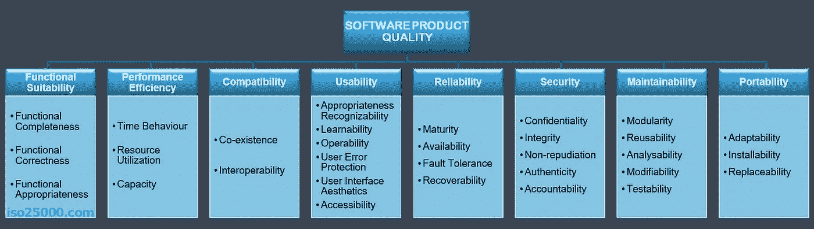
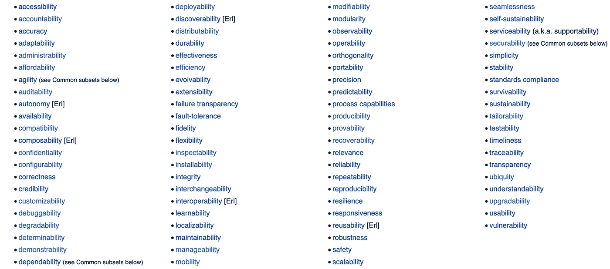
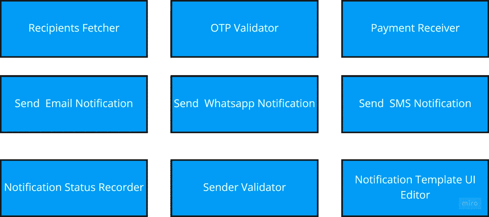
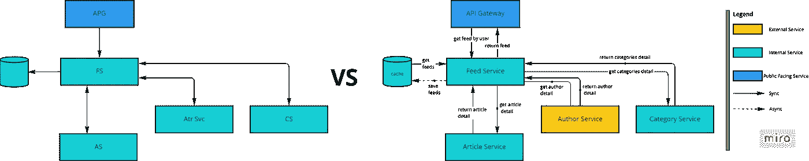
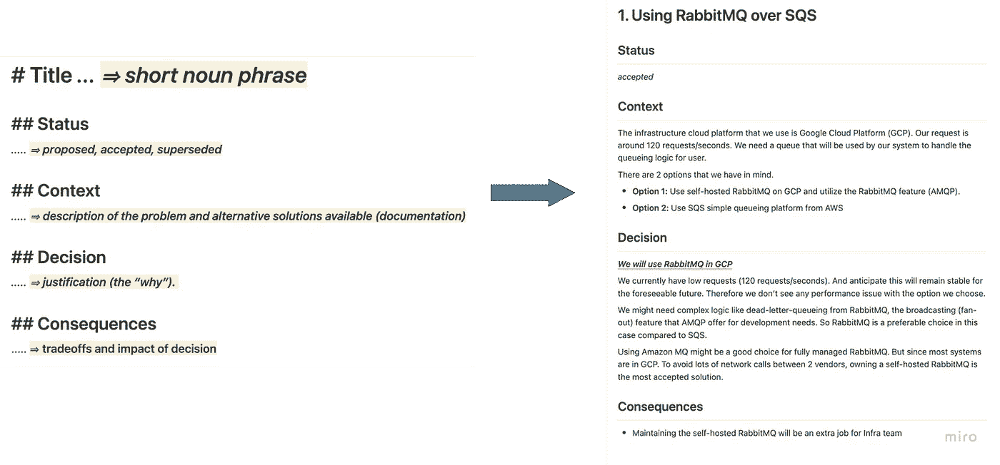

# Struktur dan Aspek Penting dalam Software Architecture

> 原文：<https://medium.easyread.co/struktur-dan-aspek-penting-dalam-software-architecture-4c73c95d5ffa?source=collection_archive---------0----------------------->

## Step-step yang penting ketika membuat design software architecture

Photo by [Christina @ wocintechchat.com](https://unsplash.com/es/@wocintechchat?utm_source=medium&utm_medium=referral) on [Unsplash](https://unsplash.com?utm_source=medium&utm_medium=referral)

Hey semua! Saya Iman Tumorang, kembali menulis disini sebagai diary saya sebagai (Aspiring) Software Architect.

Sebulan yang lalu di [Diary#1](https://notes.softwarearchitect.id/p/diary-1-a-glimpse-of-how-to-striving) , saya baru publish tentang ekspektasi yang diharapkan dari seorang software architect. Selanjutnya saya akan tulis tentang hal-hal penting yang harus seorang Software Architect ketahui ketika mendesign system architecture dari aplikasi yang dia kerjakan di tulisan ini.

Tulisan ini sudah lama saya draft, namun saya baru ada waktu untuk menulis ulang saat ini. Namun demikian, seharusnya konteksnya masih sama.

Suatu hari, sebut saja Iman Tumorang, lagi mengikuti pertemuan forum para Software Architect, sebut saja di salah satu komunitas di Indonesia. Dimana di forum tersebut, para Software Architects lainnya saling berdiskusi dan bertukar pandangan terkait software architecture mereka.

Lalu, salah seorang peserta pun bertanya kepada Iman,

“Hey Iman, boleh ceritakan sedikit tentang software architecture yang kalian gunakan?”

“Yeah, tentu saja. Kami menggunakan Microservice” jawab Iman.

“lalu..?” balas si penanya lagi.

“Lalu? Ya begitu, kami menggunakan microservice, terdapat beberapa services, API gateway, databases dsb” balas Iman mulai kebingungan. Karena normalnya ketika orang ditanya tentang software architecture, biasanya jawabannya pasti seputaran, Monolith, Microservice, Event Driven Architecure dan sebagainya. Tetapi si penanya malah bertanya lebih lagi, hal ini membuat Iman mulai kebingungan.

Ternyata banyak aspek yang perlu diketahui ketika berbicara tentang software architecture. Hal tersebut akan saya bahas selanjutnya dibawah. Ini juga hal yang baru saya pahami. Sehingga blog post ini juga saya gunakan sebagai catatan pribadi untuk referensi dimasa depan.

# Aspek Struktur Penting dalam Software Architecture

Suatu hal yang baru saya pelajarin adalah ternyata software Architecture itu terdiri dari 4 dimensi dan ketika membuat software architecture design, maka kita harus membuat ke 4 aspek dimensi struktur software architecture tersebut, yakni

*   Menentukan **Karakteristik** dari architecture kita
*   Menentukan **Komponen-komponen** yang saling berinteraksi di architecture kita
*   Memilih **Styles** dari architecture yang akan kita gunakan.
*   Dan membuat **Architecture Decision** yang akan menjadi bahan acuan saat pengembangan sistem.

Ke 4 dimensi tersebut haruslah sangat penting di definisikan saat membicarakan tentang software architecture. Saya akan coba jelaskan dengan bahasa saya sendiri, agar mungkin lebih mudah di pahami.

# 1\. Menentukan Karakteristik Software Architecture

Hal yang penting saat mendefinisikan architecture design kita adalah menentukan karakteristik software architecture yang kita inginkan baik eksplisit atau secara implisit.

Yang dimaksud dengan karakteristik disini adalah kualitas yang ingin dicapai dari software architecture yang kita design. Untuk kualitas itu sendiri tidak terbatas, namun demikian, sudah ada [standard ISO](https://iso25000.com/index.php/en/iso-25000-standards/iso-25010) yang bisa kita gunakan sebagai acuan dari karakteristik system kita contohnya dapat dilihat pada gambar dibawah.

Atau untuk lebih banyak opsi, berikut beberapa contoh dari [wikipedia](https://en.wikipedia.org/wiki/List_of_system_quality_attributes) .

Nah, ketika membuat design architecture, maka kita harus menentukan ke `-ibility-` an dari system yang akan kita bangun. Karakteristik yang paling umum biasanya antara lain, **reliability, scalability, availability, security, performance, elasticity** dsb.

Karakteristik ini akan berguna untuk menjadi acuan keputusan yang akan kita lakukan terhadap system kita. Misal, karakteristik yang saya pilih adalah scalability, maka ketika men-design software architecture, **scalability** harus menjadi hal pertama yang saya pertimbangkan, misal ketika memilih REST vs Event-based protocol, maka saya harus kedepankan opsi yang lebih scalable, lalu saya pun memilih Event-based protocol (misalnya). Atau jika karakteristik yang saya pilih **feasibility** , mungkin karena projectnya harus selesai dalam 2 bulan, maka hanya butuh MVP dan tidak perlu terlalu canggih, maka saya akan memilih REST.

Semua karakteristik bisa saja berkorelasi, atau pun bertentangan. Apapun itu akan mempengaruhi keputusan kita ketika membuat design architecture dari sistem yang akan kita bangun.

# 2\. Menentukan Komponen Software Architecture

Setelah menentukan Karakteristik software architecture yang akan di design, selanjutnya adalah kita pun dapat mulai menentukan komponen-komponen system yang akan kita kembangkan.

Komponen-komponen ini nantinya menggambarkan hal hal penting yang ada di keseluruhan sistem yang akan dikembangkan. Saat menentukan komponen-komponen system kita, kita tidak harus terpaut pada style seperti Monolith, atau Microservice, Event Driven dsb. Hanya benar benar murni komponen, seperti layangnya *building block* yang nantinya dapat kita bongkar pasang membentuk satu kesatuan sistem yang utuh.

Untuk sebuah contoh, saya akan berikan satu simulasi kecil. Sebut saja sebuah perusahaan Tumorang Finance, bergerak dibidang digital insurance, sistemnya sudah berjalan. Namun mereka ada kegundahan, mereka hendak memberikan pelayanan lebih baik ke user mereka untuk membuatkan sistem notifikasi ke user mereka. Notifikasi ini nanti akan dipergunakan untuk berbagai macam usecase, misal untuk reminder pembayaran premi asuransi, notifikasi pembayaran yang sudah berhasil, dan notifikasi OTP untuk login. Dan sistem notifikasi yang diharapkan dapat menyimpan status notifikasi yang dikirim, apakah sudah dikirim, gagal terkirim atau mungkin delay.

Dari studi kasus diatas, kita dapat ekstrak komponen yang mungkin ada di sistem yang ingin mereka harapkan.

Nah dari komponen-komponen tersebut, kita pun dapat melihat dengan jelas apa saja yang harus kita lakukan. Jika ternyata kita memilih untuk monolith, maka setiap komponen tersebut bisa kita buat jadi per module. Atau jika kita memilih membangun distributed system, maka setiap komponen *bisa saja* menjadi service tersendiri.

# 3\. Memilih Styles Software Architecture

Kemudian, setelah kita menentukan karakteristik, lalu komponen komponen dari software architecture kita, langkah selanjutnya adalah menentukan **Styles** dari software architecture kita.

Terdapat banyak styles dari software architecture yang dapat kita gunakan. Semua styles tersebut bukan lah binary option, melainkan multiple options. Sehingga kita dapat memilih gabungan beberapa styles untuk software architecture pada system kita.

Untuk klasifikasinya, terdiri dari 2 jenis klasifikasi, dimana kedua klasifikasi ini juga terbagi ke beberapa jenis lagi, sebagai berikut.

**1\. Monolithic**

*   Layered Architecture
*   Modular Monolith
*   Microkernel Architecture
*   Pipeline Architecture

**2\. Distributed**

*   Microservice Architecture
*   Service-Based Architecture
*   Event-Driven Architecture
*   Space-Based Architecture

Ketika pertama kali ditanya tentang styles software architecture, saya sangatlah kebingungan. Hingga saat Mark Richards (author [Fundamentals of Software Architecture](https://www.amazon.com/gp/product/1492043451) ) menyebutkan jenis-jenis styles software architeture seperti, Microservice, Monolith, Service Based, Event Driven Architecture dsb *yang saya sebutkan diatas.

Awalnya saya menyebut hal tersebut adalah software architecture pattern, namun surprisingly, Mark Richards, menjelaskan hal-hal yang tergolong pada pattern pada software architecture antara lain, Circuit Breaker Pattern, Event Forwarded Pattern, Command and Query Responsibility Segregation (CQRS) pattern, Backend For Frontend (BFF) Pattern dsb.

Kembali ke aspek software architecture, setelah kita membuat list komponen yang terdapat pada sistem kita (step sebelumnya), kita pun harus menentukan style software architecture yang ingin kita terapkan. Ketika menentukan styles, kita bisa mengombinasikan banyak styles sesuai keinginan. Contoh, karena systemnya hanya kecil misal hanya CMS saja, maka Layered Architecture style sudah cukup untuk digunakan. Atau sistemnya sangat kompleks, terdapat banyak domain yang tidak mungkin dijadikan dalam satu aplikasi monolith, maka kita dapat memilih Microservice architecture lalu dengan kombinasi Event Driven architecture. Tidak ada keharusan hanya boleh memilih satu, kita bisa kombinasikan per-setiap klasifikasinya (monolith ataupun distributed).

# 4\. Membuat Architecture Decision

Tahap terakhir dari aspek software architecture adalah membuat architecture decision yang menjadi bahan acuan untuk semua tim terlibat ketika mengembangkan sistem.

Decision bisa dilakukan secara konsensus (suara terbanyak), atau pun dilakukan secara individual (Software Architect). Namun untuk setiap keputusan itu, haruslah disimpan dalam bentuk dokumen yang dapat dibaca oleh semua orang.

Beberapa komponen penting yang perlu diperhatikan dalam membuat architecture decision antara lain:

**1\. Diagram yang jelas dan granular, tidak ada singkatan-singkatan yang tidak jelas.**

Sebagai contoh, coba kamu bandingkan ke 2 diagram dibawah.

Diagram manakah yang lebih mudah untuk dipahami? Tentu saja, orang normal akan memilih diagram ke 2\. Sehingga siapapun yang akan membaca ini, akan memahami sistem yang akan di kembangkan.

Untuk menggambarkan diagram architecture tidak ada keharusan styles dan teknik yang khusus. Kita dapat menggambarkan dengan gaya/bahasa kita, selama itu jelas dan mudah dimengerti. Namun, terdapat juga beberapa model yang banyak digunakan orang (para experts) lainnya, yaitu:

*   [**C4 Model**](https://c4model.com/) **(by Simon Brown)**
*   [**ArchiMate**](https://www.archimatetool.com/) **(by The Open Group)**

Kita dapat mengikuti ke 2 model tersebut. Keduanya sama-sama akan membantu menjelaskan tentang system design dari architecture kita secara terstruktur.

**2\. Menghindari Anti-Pattern saat membuat Architecture Decision**

Saat membuat Architecture Decision, maka akan terdapat banyak diskusi dan meeting untuk mencapai keputusan yang ideal terhadap architecture yang kita pilih. Semua orang akan terlibat, kapan saja waktu yang kosong, dimana saja, pasti orang akan berfokus pada decision tersebut. Berikut anti-pattern yang harus dihindari ketika membuat keputusan.

*   **Groundhog day anti-pattern** Ini terjadi ketika tidak ada yang mengerti mengapa suatu decision dibuat, sehingga para stakeholders dan software architects tetap meeting membahas hal yang sama secara berulang ulang. Misal, suatu flow sudah ditentukan bahwa sistem akan menggunakan Event Driven. Lalu 2 minggu kemudian, engineer pun bertanya lagi, “kenapa Event Driven, kenapa tidak REST api call saja secara sync?” Dan kembali pun mereka meeting diskusi membahas hal yang sama seperti sebelumnya.
*   **Slack (Email, or any communication platform) Driven Architecture** Ini terjadi misal ketika development sudah berjalan, tim engineer bertanya tentang misal, “Should we use RabbitMQ over SQS? Because of this reasons…. and this tradeoffs …” kepada Software Architect melalui chat di Slack. Diskusi ini terjadi secara improptu melalui aplikasi chating/communication platform lainnya.
    Apapun hasil dari diskusi mereka di Slack chat tersebut pasti akan ter-telan dengan banyaknya chat dikemudian hari. Sehingga, jika suatu saat engineer baru join dan melihat project tersebut dan bertanya ke tim, “Why we use RabbitMQ over SQS?” maka tim tersebut akan kewalahan. Karena keputusan itu dilakukan lewat chat, tanpa meeting dan tidak ada record menyatakan alasan kenapa keputusan itu dilakukan.

Kedua anti-pattern ini biasanya akan membuat pengembangan sistem terbengkalai dan mungkin dapat berimpact membuat timeline pengerjaan project ke-delay menjadi lebih lama.

**3\. Membuat Architecture Decision Record (ADR)**

Untuk menghindari anti-pattern tersebut diatas, maka seorang Software Architect, harus membuat Architecture Decission Record. Yang akan menjelaskan the “ **WHY?”** pada setiap keputusan yang telah disepakati **.
“** Kenapa keputusan itu dilakukan?”.
“Kenapa pakai RabbitMQ dan tidak SQS?”
“Kenapa MongoDB, kenapa tidak PostgreSQL?”
Dan banyak lagi pertanyaan yang akan muncul dikemudian hari.

Segala alasan dan jawab pertanyaan itu haruslah disimpan dalam record. Record yang menjelaskan mengapa sebuah keputusan diambil. Dan semua record ini haruslah mudah untuk diakses oleh semua orang yang berekemptingan, dalam hal ini para engineers. Sehingga jika dilain waktu, terdapat engineer yang baru bergabung dengan tim tersebut, mereka dapat membaca semua records decission yang sudah dilakukan tim tersebut.

Berikut contoh template ADR yang lumayan sering digunakan.

contoh ADR from notes.softwarearchitect.id

Terdapat

*   **Title:** Judul decision
*   **Status:** status decision di repository decision records (biasanya proposed, accepted, supersedes, superseded) dsb.
*   **Context:** menjelaskan kenapa decission ini ada? latar belakang dari decision ini muncul.
*   **Decision:** menjelaskan “decision” yang diambil dan disetujui oleh semua stakeholers. Disini juga harus menjelaskan kenapa keputusan itu dipilih. Point ini sangat penting, karena ini akan menjadi landasan para stakeholders, dan new hire untuk mengerti mengapa keputusan tersebut diambil.
*   **Consequences:** menjelaskan tradeoff yang akan terjadi. Dampak negative yang akan terjadi jika keputusan ini dilakukan. Ini penting agar pembaca *aware* tentang konsekuensi yang akan terjadi, sehingga mereka tahu untuk mengantisipasi apa yang tertera pada list konsekuensinya.

Misal untuk contoh diatas, adalah ADR untuk memilih RabbitMQ dibanding SQS. Sehingga jika suatu saat dikemudian hari, engineer baru datang dan bertanya tentang alasan mengapa memilih RabbitMQ daripada SQS, kita tinggal memberikan record ini.

Dan perlu diketahui juga, apapun keputusan yang dilakukan pada ADR, tidak ada salah atau pun benar. Mungkin saat keputusan itu dibuat, semua setuju dan merupakan keputusan terbaik pada masanya. Lalu 2 tahun kemudian, seiring berkembangnya teknologi dan bisnis, keputusan tersebut tidak relevant lagi. Sehingga tim terlibat dapat melakukan architecture design review lagi, dan memuat ADR yang baru.

Nah selanjutnya adalah mengulang semua step ini setiap kali hendak membuat design software architecture dari sistem yang akan kita kembangkan.

# Conclusion

Di artikel ini saya telah menjelaskan aspek penting yang perlu diperhatikan ketika membuat design software architecuture yakni, pertama kita harus **menentukan** **karakteristik** software architecture kita, lalu kemudian **membuat list komponen** dari keseluruhan sistem kita, dan selanjutnya **memilih styles** yang sesuai dengan kasus dan karakteristik yang kita pilih, dan terakhir **membuat architecture decission** yang menjadi acuan untuk setiap stakeholders dari architecture yang kita design.

Ke 4 aspek ini sangat lah penting, saya pun baru menyadarinya, karna selama ini saya ketika ditanya tentang software architecture yang saya gunakan, saya hanya jawab “microservice” saja. Saya tidak menjelaskan tentang karakteristiknya, lalu stylesnya ataupun the “ **WHY** ”nya yang tidak jelas dalam decision. Jawaban yang paling umum saya berikan adalah, “ *Why? Enggak tahu, ini sudah seperti ini dari dulu sudah legacy, jadi kami tinggal ikutin dan improve* ” Ini merupakan jawaban yang buruk ketika menjelaskan software architecure. Pasti ada alasan disetiap keputusan yang dibuat.

Dan saya juga berencana akan mulai mengasah ini dan menjadikannya kebiasaan ketika melakukan design review terhadap software architecture sistem yang akan saya kembangkan.

Demikian tulisan ini saya rangkumkan berdasarkan apa yang baru saya pelajarin dari Mark Richards (author [Fundamentals of Software Architecture](https://www.amazon.com/gp/product/1492043451) ). Semoga berguna kepada yang membaca khususnya teman teman software engineer yang ingin menempuh jalur software architect.

*Tulisan ini merupakan hasil republikasi dari* [*notes.softwarearchitect.id*](https://notes.softwarearchitect.id/p/diary2-struktur-dan-aspek-penting)