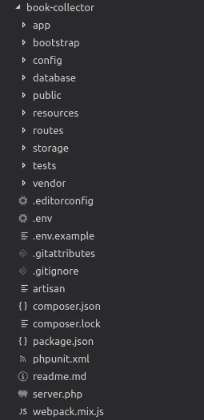

# Struktur Folder Laravel Framework

> 原文：<https://medium.easyread.co/struktur-folder-laravel-framework-299f0225cd55?source=collection_archive---------0----------------------->

## Part 4 — Folder Structure


Photo by [Iñaki del Olmo](https://unsplash.com/@inakihxz?utm_source=medium&utm_medium=referral) on [Unsplash](https://unsplash.com?utm_source=medium&utm_medium=referral)

# Laravel Series List

[**0\. Laravel Series — Belajar Laravel dari Awal yok!**](https://medium.com/easyread/laravel-series-belajar-laravel-dari-awal-yok-c21dc47863da)[**1\. Persiapan untuk Pengerjaan Proyek dengan Laravel**](https://medium.com/easyread/persiapan-untuk-pengerjaan-proyek-dengan-laravel-2f9a99146313)[**2\. Pengenalan Laravel Framework**](https://medium.com/easyread/pengenalan-laravel-framework-1c829b8164af)[**3\. Instalasi Laravel Framework**](https://medium.com/easyread/instalasi-laravel-framework-41eeec1551ef) **4\. Struktur Folder Laravel Framework — (You’re here)** [**5\. Apa itu Artisan CLI pada Laravel?**](https://medium.com/easyread/apa-itu-artisan-cli-pada-laravel-62a94232a29a)[**6\. Rancang Database-mu dengan Migration Pada Laravel**](https://medium.com/easyread/rancang-database-mu-dengan-migration-pada-laravel-28d419d0089e)[**7\. Mengarahkan Request dengan Router pada Laravel**](https://medium.com/easyread/mengarahkan-request-dengan-router-pada-laravel-a0df91142f51)[**8\. Olah Request dengan Controller pada Laravel**](https://medium.com/easyread/olah-request-dengan-controller-pada-laravel-a77b52235a4b)[**9\. Mudahnya Mengolah Data Menggunakan Model dan Eloquent pada Laravel**](https://medium.com/easyread/mudahnya-mengolah-data-menggunakan-model-dan-eloquent-pada-laravel-80af915c80b5)[**10\. Membuat Tampilan Web dengan Blade pada aplikasi Laravel — Part I**](https://medium.com/easyread/membuat-tampilan-web-dengan-blade-pada-aplikasi-laravel-part-i-c9f5ceee65e6)[**11\. Membuat Tampilan Web dengan Blade pada aplikasi Laravel — Part II**](https://medium.com/easyread/membuat-tampilan-web-dengan-blade-pada-aplikasi-laravel-part-ii-9e233233972a)

Setelah selesai instalasi, hal yang paling perlu kita pahami adalah struktur folder dari Laravel sendiri. Hal ini supaya kita tahu bagian-bagian folder dan *file* mana yang perlu penekanan selama pengembangan. Saya tidak akan menjelaskan secara keseluruhan, hanya yang menurut saya penting saja untuk pembuatan fitur minimal, seperti Create-Read-Update-Delete (CRUD).



*   Folder `**app**` , berikut adalah struktur folder `**app**`

```
.
├── Console
├── Exceptions
├── Http
│   ├── Controllers
│   └── Middleware
├── Providers
└── User.php
```

Pada folder `**app**` , terdapat dua bagian besar yang perlu diperhatikan, yaitu folder `**Http\Controller**` dan folder `**app**` sendiri. Untuk setiap `**controller**` yang akan dibutuhkan pada aplikasi akan diletakkan pada folder `**Http\Controller**` dan untuk `**model**` akan diletakkan pada pada folder `**app**` secara langsung. File `**User.php**` diatas adalah salah satu `**model**` yang sudah ter- *generate* secara otomatis ketika mulai membuat project Laravel baru.

Pada folder `**Http\Controller**` terdapat beberapa file `**controller**` yang juga sudah ter- *generate.*

```
.
├── Controllers
│   ├── Auth
│   │   ├── ForgotPasswordController.php
│   │   ├── LoginController.php
│   │   ├── RegisterController.php
│   │   ├── ResetPasswordController.php
│   │   └── VerificationController.php
│   └── Controller.php
├── Kernel.php
└── Middleware
```

*   Folder `**resources**` , berikut adalah struktur folder `**resources**`

```
.
├── js
├── lang
├── sass
└── views
    └── welcome.blade.php
```

Pada folder `**resources**` , hal yang perlu diperhatikan adalah folder `**resources\view**` karena kita akan menyimpan semua `**view**` kita pada folder ini. File `**welcome.blade.php**` adalah salah satu contoh `**view**` yang sudah ter- *generate* ketika pembuatan project Laravel baru.

*   Folder `**routers**` , berikut adalah struktur folder `**routers**`

```
.
├── api.php
├── channels.php
├── console.php
└── web.php
```

Pada folder `**routers**` , hal yang perlu diperhatikan adalah file `**web.php**` . Nantinya semua daftar `**router**` yang ada pada aplikasi akan kita tempatkan pada file `**web.php**` .

*   Folder `**database**` , berikut adalah struktur folder `**database**`

```
.
├── factories
│   └── UserFactory.php
├── migrations
│   ├── 2014_10_12_000000_create_users_table.php
│   └── 2014_10_12_100000_create_password_resets_table.php
└── seeds
    └── DatabaseSeeder.php
```

Pada folder `**database**` , hal yang perlu diperhatikan adalah folder *migration* . Apa itu *migration* ? Nanti akan saya jelaskan di part berikutnya.

*   Folder `**public**` , berikut adalah struktur folder `**public**`

```
.
├── css
│   └── app.css
├── favicon.ico
├── index.php
├── js
│   └── app.js
├── robots.txt
├── svg
│   ├── 403.svg
│   ├── 404.svg
│   ├── 500.svg
│   └── 503.svg
└── web.config
```

Bisa kita perhatikan file-file yang ada pada folder `**public**` terdapat file `**css**` dan `**js**` yang kita perlukan untuk *styling* aplikasi kita. Jika nanti kita menggunakan *assets* seperti `**css**` , `**js**` , dan `**image**` dari pengembang lain, maka semua *assets* tersebut akan ditempatkan di folder *public* .


Taken from me.me

Sampai jumpa di- *part* berikutnya!

Cappy Hoding! ❤️ = ☕️ + 💻