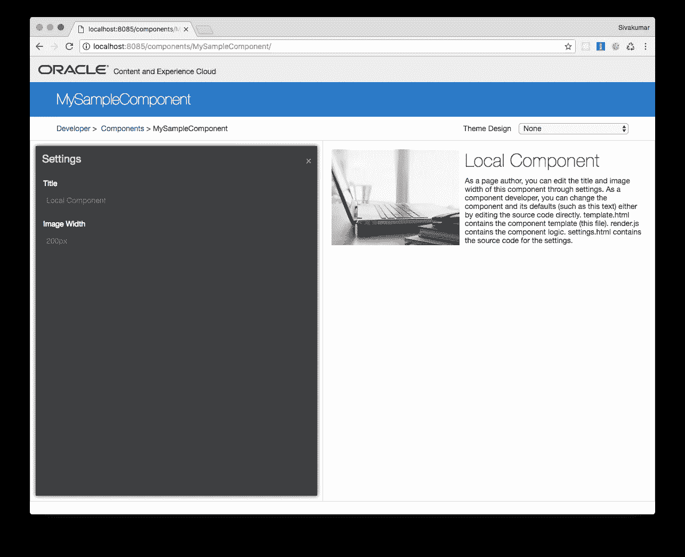
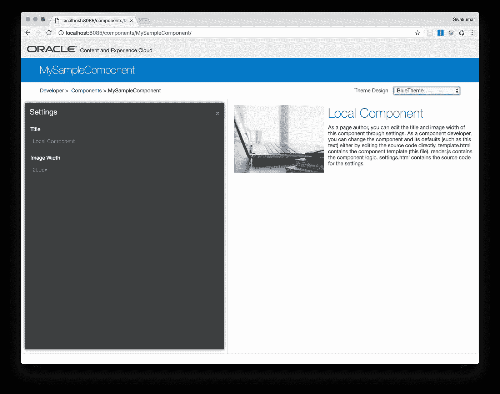
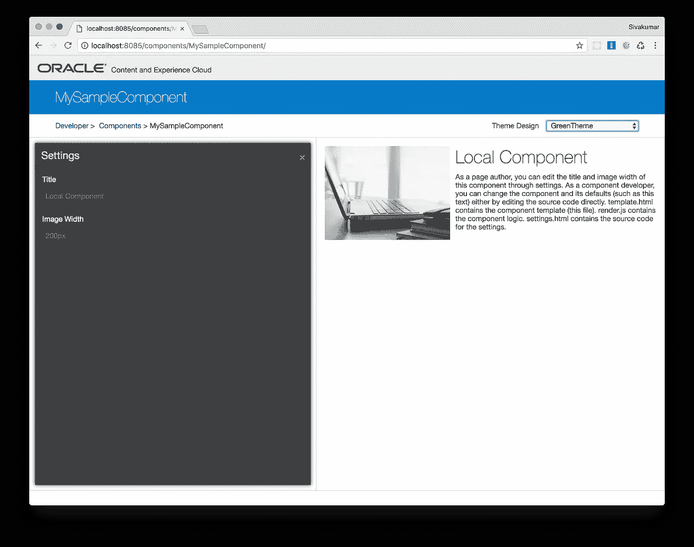

# 在内容和体验云中设计定制组件

> 原文：<https://medium.com/oracledevs/styling-custom-components-in-content-and-experience-cloud-c418bddedaa0?source=collection_archive---------1----------------------->

这篇文章解释了如何使用 Sites Toolkit 创建一个定制组件，对其进行样式化，并在本地测试工具中对其进行测试。请参考上一篇文章[使用站点工具包开发内容和体验云(CEC)](/oracledevs/developing-for-content-and-experience-cloud-cec-using-sites-toolkit-ed9e27d9a703),了解站点工具包和安装的介绍。本文假设*项目创建和安装*步骤已经完成。

# 创建自定义组件

您可以使用 cec 命令行实用程序来创建新组件。键入命令`cec create-component`查看可用启动器组件的列表。要创建本地组件，发出以下命令。

```
cec create-component MySampleComponent -f Sample-Text-With-Image
```

组件在`src/main/components/MySampleComponent`下创建

# 设计组件的样式

## 将组件的样式保留在自己的 design.css 中

让我们从给组件的 design.css 添加一个样式开始，这样以后我们可以将它与给主题的 design.css 添加样式进行比较

给它添加下面的样式。

```
.sample-component-container .paragraph-container h1 { *color*: red;}
```

**使用本地测试线束测试组件:**

导航到本地测试线束中的组件`MySampleComponent`。将“主题设计”选项设为“无”。您可以看到标题“本地组件”是红色的。问题是无论使用什么样的网站或主题，标题总是红色的。



## 在主题的 design.css 中保留自定义组件的样式

大多数时候你希望标题颜色与主题相匹配。例如，当此组件用于使用蓝色主题的站点时，此标题应为蓝色，而当此组件用于使用绿色主题的站点时，此标题应为绿色。所以，最好的地方是在`<theme_name>/designs/default/design.css`保持主题的`design.css`风格

这个 css 应该包含在每个页面布局 html 文件的`<theme_name>/layouts`中，如下所示:

```
<link rel=”stylesheet” type=”text/css” href=”/_themes/[!— $SCS_THEME_NAME—]/designs/[!—$SCS_DESIGN_NAME—]/design.css”>
```

因为 css 包含在页面布局中，所以它可用于页面中的所有本地组件。像远程组件一样，在 iframe 中呈现的组件应该以编程方式包含此 css，如下所示:

```
SitesSDK.getSiteProperty(‘themeDesign’, function (data) {// check if we got an themeDesign back
  if (data.themeDesign && typeof data.themeDesign === ‘string’) {// theme is loaded so dynamically inject theme
     SitesSDK.Utils.addSiteThemeDesign(data.themeDesign);
  }
});
```

一旦将样式添加到主题的 design.css 中，就可以使用本地测试工具来选择主题并测试组件。

**使用本地测试线束进行测试**

现在，让我们从组件的 design.css 中删除标题颜色，并将其添加到主题的 design.css 中。

1.  编辑`src/main/components/MySampleComponent/assets/styles/design.css`和**删除**以下样式:

```
.sample-component-container .paragraph-container h1 { *color*: red;}
```

2.创建两个模板`Blue`和`Green`，这样我们得到两个主题。运行以下命令。

```
cec create-template Blue -f StarterTemplate
cec create-template Green -f StarterTemplate
```

3.编辑`src/main/themes/BlueTheme/designs/default/design.css`并添加以下样式:

```
.sample-component-container .paragraph-container h1 { *color*: blue;}
```

4.编辑`src/main/themes/GreenTheme/designs/default/design.css`并添加以下样式:

```
.sample-component-container .paragraph-container h1 { *color*: green;}
```

5.测试蓝色主题。导航至测试线束中的组件，并选择`BlueTheme`进行“主题设计”。注意标题是蓝色的。



Component using Blue theme

6.测试绿色主题。现在选择`GreenTheme`进行“主题设计”。注意标题是绿色的。



Component using Green theme

## 最佳实践是在主题的 designs.css 中保留自定义组件样式

正如我们在上一节的示例中看到的，为了实现组件的主题特定样式，样式应该进入主题的 design.css。例如，当使用 BlueTheme 将 *MySampleComponent* 添加到站点时，标题是蓝色的。如果使用 GreenTheme 将同一个组件添加到一个站点，标题将是绿色的，不需要对组件进行任何更改。

## 在多个主题之间共享样式

在某些情况下，一组主题可能有一些共同的样式。与其在每个主题中重复这个，如何在所有这些主题中共享它呢？

创建一个主题来托管共享的 css 文件。假设共享主题的名称是 shared theme，将样式保存在 shared theme/assets/CSS/shared . CSS 中并发布主题。在依赖主题的页面布局中，包括如下 shared.css:

```
<link rel=”stylesheet” href=”/_themes/SharedTheme/assets/css/shared.css”>
```

_themes 在渲染过程中由 CEC 解析，并在路径中插入一个缓存键。此链接支持缓存破坏。这通常在缓存控制中指定最长期限为 15 天。每当 SharedTheme 更新和重新发布时，相关的主题也应该重新发布，这样缓存就失效了。

另一个选择是将这个共享 css 保存在 CDN 中，但是缓存和缓存破坏仍然需要处理。

# 更多阅读

*   要了解内置组件的样式，请参见 [Igor 的博客](https://igor-polyakov.com/2016/11/25/how-to-style-built-in-scs-components/)
*   [**为 Oracle 内容和体验云开发**](https://docs.oracle.com/en/cloud/paas/content-cloud/developer/index.html)

# 评论家

感谢**邦妮·沃恩**、**伊戈尔·波利亚科夫**、**卡迈勒·卡普尔**和**史蒂夫·伯恩斯**审阅本文。