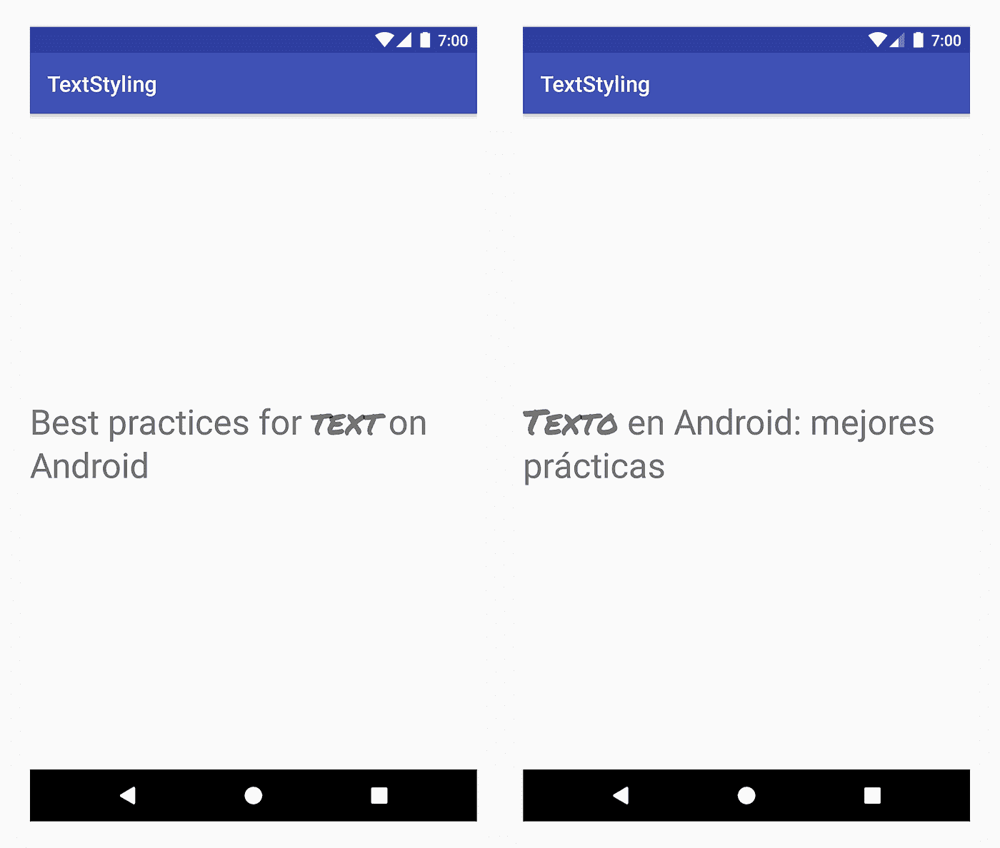

# Android 中国际化文本的样式

> 原文：<https://medium.com/androiddevelopers/styling-internationalized-text-in-android-f99759fb7b8f?source=collection_archive---------1----------------------->


Illustration by [Virginia Poltrack](https://twitter.com/VPoltrack)

在之前的一篇文章中，我们谈到了在 Android 中使用 spans 来设计字符或段落的样式。但是所有使用的例子都是基于硬编码的文本，我们确切地知道在哪个索引上应用 span。大多数时候，我们处理的文本来自资源，并且是国际化的。因此**我们需要设计的文本及其在句子中的位置可能会改变**。

例如，假设我们有英文和西班牙文的字符串"*Best practices for text on Android*"，我们想要对单词" *text* "进行样式化。

values/strings.xml

```
<resources>
<string name=”title”>Best practices for **text** on Android</string>
</resources>
```

values-es/strings.xml

```
<resources>
<string name=”title”>**Texto** en Android: mejores prácticas</string>
</resources>
```

我们最终不得不设计不同单词的样式，“T31]text 和“ *Texto* ”，这些单词在它们所属的字符串中有不同的位置，因此寻找特定单词的出现不是一项可行的任务。根据我们想要应用哪种样式，我们有多种方式来样式化国际化文本:通过使用 HTML 标签或者将注释 span 与注释标签一起使用。

# 使用 HTML 标签的基本文本样式

如果你只想应用基本的样式，在字符串资源或`[Html.fromHtml](https://developer.android.com/reference/android/text/Html#fromHtml(java.lang.String,%20int))`中使用 HTML 标签。支持以下样式:

*   加粗:`<b>`，`<em>`
*   斜体:`<i>`、`<cite>`、`<dfn>`
*   文本大小增加 25%`<big>`
*   文本尺寸减少 20%`<small>`
*   设置字体属性:`<font face=”font_family“ color=”hex_color”>`。可能的字体系列包括`monospace`、`serif`和`sans_serif`。
*   设置等宽字体系列:`<tt>`
*   删除线:`<s>`、`<strike>`、`<del>`
*   下划线:`<u>`
*   上标:`<sup>`
*   下标:`<sub>`
*   要点:`<ul>`，`<li>`
*   换行:`<br>`
*   分部:`<div>`
*   CSS 样式:`<span style=”color|background_color|text-decoration”>`
*   段落:`<p dir=”rtl | ltr” style=”…”>`

例如，要将单词" *text* "加粗，strings.xml 中的文本应该是这样的:

// values/strings.xml

```
<string name=”title”>Best practices for **<b>text</b>** on Android</string>
```

// values-es/strings.xml

```
<string name=”title”>**<b>Texto</b>** en Android: mejores prácticas</string>
```

在用户界面中，可以这样设置文本:

```
textView.setText(R.string.title)
```

# 带注释的复杂文本样式

如果您的样式需求超出了 HTML 标签所支持的能力，或者如果您想要使用自定义样式，比如自定义项目符号样式或者甚至全新的样式，那么我们需要另一种解决方案。标记要设置样式的单词，并使用 strings.xml 资源文件中的`[android.text.Annotation](https://developer.android.com/reference/java/text/Annotation)`类和相应的`<annotation>`标记。

注释标签允许我们在 xml 中定义定制的`<key, value>`对。当获取字符串资源为`SpannedString`时，这些对被 Android 框架自动转换为`Annotation`跨度，并带有相应的键和值。然后，我们可以解析附加到文本的注释列表，并为我们的文本添加正确的跨度。

确保在每个 strings.xml 文件中将`<annotation>`标记添加到字符串的所有翻译中。



Apply a custom typeface to the word “text”, in all languages

假设我们想要设置一个自定义字体，通过对单词“text”应用一个`CustomTypefaceSpan`。我们需要做的是:

1.  添加`<annotation>`标签并定义`<key, value>`对。在我们的例子中，键是`*font*`，值是我们要使用的字体类型:`*title_emphasis*`。

// values/strings.xml

```
<string name=”title”>Best practices for 
**<annotation font=”title_emphasis”>text</annotation>** on Android</string>
```

// values-es/strings.xml

```
<string name=”title”>
**<annotation font=”title_emphasis”>Texto</annotation>** en Android: mejores prácticas</string>
```

2.从资源中获取字符串，遍历注释并获取带有键`*font*`和相应值的注释。然后创建自定义范围，并将其设置为与注释范围位置相同的文本。

```
// get the text as SpannedString so we can get the spans attached to the text
val titleText = getText(R.string.*title*) as SpannedString// get all the annotation spans from the text
val annotations = titleText.getSpans(0, titleText.*length*, Annotation::class.*java*)// create a copy of the title text as a SpannableString 
// so we can add and remove spans
val spannableString = SpannableString(titleText)// iterate through all the annotation spans
for (annotation in annotations) {       // look for the span with the key "font"
    if (annotation.*key* == "font") {
        val fontName = annotation.*value* // check the value associated with the annotation key
        if (fontName == "title_emphasis") {             // create the typeface
            val typeface = getFontCompat(R.font.permanent_marker)             // set the span to the same indices as the annotation
            spannableString.setSpan(CustomTypefaceSpan(typeface),
                    titleText.getSpanStart(annotation),
                    titleText.getSpanEnd(annotation),
                    Spannable.*SPAN_EXCLUSIVE_EXCLUSIVE*)
        }
    }
}// now the spannableString contains both the annotation spans and the CustomTypefaceSpan
styledText.*text* = spannableString
```

你可以在这里找到这个例子[的完整代码。](https://gist.github.com/florina-muntenescu/08d751d843d55b75061039fee4e97931)

举一个更复杂的例子，在 Java 中，使用注释向文本添加图像并设置前景色，查看来自 [Plaid](https://github.com/nickbutcher/plaid/) 的 [this commit](https://github.com/nickbutcher/plaid/commit/951c361b0df28719b4a5bf83deade618135bb683) 。

如果您多次使用相同的文本，例如在一个`RecyclerView`中，并且您为每个项目重建了`SpannableString`，那么您需要记住一些性能和内存方面的问题:

*   该字符串被迭代多次:一次由框架添加`Annotation`跨度，一次由您手动添加跨度
*   为每个项目创建一个新的`SpannableString`实例。

为了解决这个问题，只构建一次文本，缓存然后重用`SpannableString`。

# 附加部分:`Annotation`跨度和文本打包

在上一篇文章中，我们提到当样式化的文本在同一个进程中(例如，通过`Intent`bundle)或者在进程间(通过复制文本)传递时，只有框架跨度被打包。

[](/google-developers/underspanding-spans-1b91008b97e4) [## 下跨跨度

### 跨度是强大的概念，通过提供对组件的访问，允许在字符或段落级别对文本进行样式化…

medium.com](/google-developers/underspanding-spans-1b91008b97e4) 

因为`Annotation`span 也是`ParcelableSpan`span，所以`<key, value>`对是打包的和未打包的，这使得`Annotation` span 成为一种将定制样式应用于打包的文本的方式，只要接收端知道如何解释注释。

因此，为了在将文本传递给 Intent Bundle 时保持您的定制样式，您首先需要将`Annotation` spans 添加到您的文本中。您可以通过如上所示的`<annotation>`标记在 XML 资源中实现这一点，或者通过创建一个新的`Annotation`并将其设置为 span:

```
val spannableString = SpannableString(“My spantastic text”)
val annotation = Annotation(“font”, “title_emphasis”)
spannableString.setSpan(annotation, 3, 7, Spannable.SPAN_EXCLUSIVE_EXCLUSIVE)// start Activity with text with spans
val intent = Intent(this, MainActivity::class.java)
intent.putExtra(TEXT_EXTRA, spannableString)
startActivity(intent)
```

从包中检索文本作为 SpannableString，然后解析附加的注释，如上例所示。

```
// read text with Spansval intentCharSequence = intent.getCharSequenceExtra(TEXT_EXTRA) as SpannableString
```

对于国际化文本的简单样式，更新您的字符串资源以使用 HTML 标记。但是当您的样式需求超出了所支持的 HTML 标签的限制时，请使用`Annotation` span 和相关的注释标签。作为一个额外的好处，`Annotation`跨度是可打包的，因此您可以轻松地设置文本样式，无论您如何处理它。

有关文本的更多最佳实践，请查看 Google I/O 2018 talk: