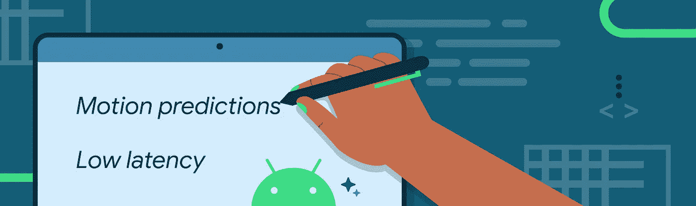
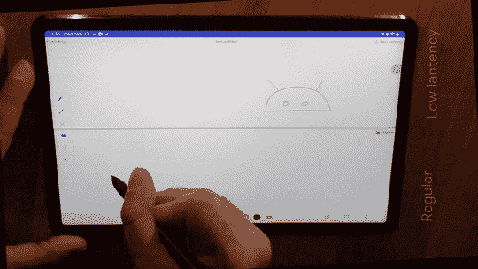
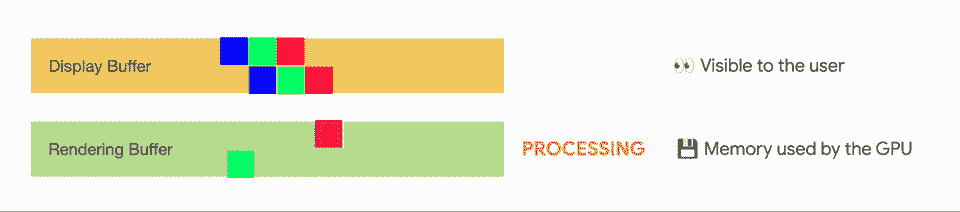
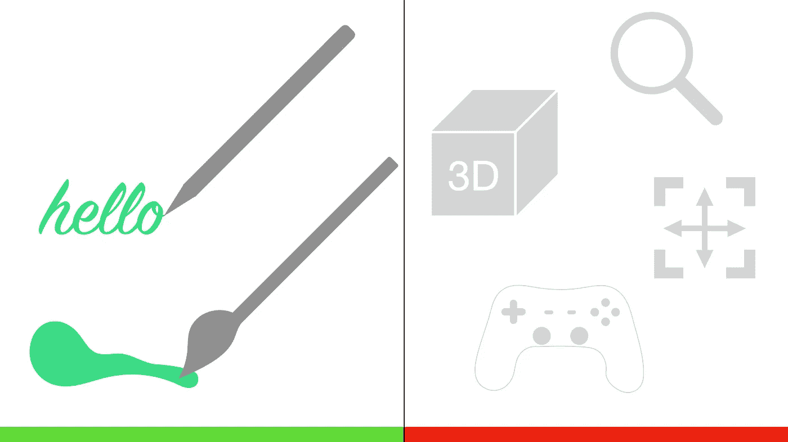

# 触控笔低延迟

> 原文：<https://medium.com/androiddevelopers/stylus-low-latency-d4a140a9c982?source=collection_archive---------4----------------------->

## *利用低延迟图形和运动预测 API 创建有机手写笔体验*

# 介绍

随着平板电脑和可折叠设备的日益流行，用户正在通过他们的设备采用新的行为。更大的屏幕区域带来了全新的体验，让以前只有笔记本电脑和台式机才能完成的工作变得更加高效。

使用手写笔进行手写、绘图和草图绘制可以解锁精确、有机的工作流程，就像我们在模拟世界中一样。然而，手势和屏幕渲染之间的延迟会妨碍像在纸上写字一样的自然感觉，这被称为延迟。

很高兴分享 Android 团队发布了两个新库:[低延迟图形](https://developer.android.com/jetpack/androidx/releases/graphics)和[运动预测](https://developer.android.com/jetpack/androidx/releases/input)，目前为 alpha02。这些库解决了 Android 和 ChromeOS 上的手写笔输入延迟问题。

[低延迟图形](https://developer.android.com/jetpack/androidx/releases/graphics)库的目标是减少手写笔输入和屏幕渲染之间的处理时间。[运动预测](https://developer.android.com/jetpack/androidx/releases/input)库利用强大的算法来预测触控笔的下一次移动位置。一起实现这两个库，以尽可能提供最低的感知延迟。

在本文中，我们将探讨这些库是如何工作的，以及如何在您的应用程序中实现一流的手写笔体验。虽然我们主要关注手写笔体验，但这两个库可以与任何指针、手指、手写笔、电容式手写笔和鼠标一起工作。

但是，在进入细节之前，让我们看看这种体验有多好:

Slowmotion showcasing the low latency gains — Device: Samsung Galaxy Tab S7 + S-Pen

# 低延迟图形:屏幕下方

如果没有任何延迟优化，系统必须经过许多步骤才能在屏幕上渲染像素。[低延迟图形](https://source.android.com/docs/core/graphics)库通过利用前端缓冲渲染来最小化延迟。结果是更快地渲染到屏幕上。

## 了解传统渲染

传统渲染使用多个缓冲区。这确保了用户体验的平滑，没有视觉撕裂，但代价是用户与屏幕交互和内容在显示器上可见之间的额外延迟。要了解更多关于渲染和缓冲的知识，请观看 [Project Butter](https://youtu.be/Q8m9sHdyXnE?t=1474) 演示。

对于多缓冲渲染方法，显示缓冲区包含用户当前在屏幕上看到的数据，图形引擎使用渲染缓冲区来渲染数据(到内存中)。

渲染完成后，显示缓冲区与渲染缓冲区交换，这样用户就可以在屏幕上看到结果。渲染缓冲区变成显示缓冲区，并且显示缓冲区被释放以供将来使用，在那里渲染现在发生。

多亏了 [SurfaceFlinger 和 WindowManager](https://source.android.com/docs/core/graphics/surfaceflinger-windowmanager) ，这才成为可能。下面的动画展示了这一过程。

Animation showing how multi-buffer rendering work

## 前端缓冲渲染:直接到屏幕上

为了实现前缓冲技术，引入了前缓冲层和双缓冲层。前层设计用于快速渲染屏幕的小部分。这一层是透明的，短暂的，我们马上就会看到。

前层输入被渲染到双缓冲层以保持工作。然后隐藏前端缓冲区。

但是你可能想知道前端缓冲区如何比常规的双缓冲区方法渲染得更快，有什么注意事项。

[低延迟图形](https://source.android.com/docs/core/graphics)库直接写入前端缓冲区——换句话说，直接写入屏幕。这是因为只有一小部分屏幕区域被改变(每一帧只有一小部分触笔笔划被修改)。

一旦手写笔被提起，使用双缓冲技术的常规呈现被恢复，并且笔画被保持。

Animation showing how front buffer rendering copy the strokes to doubled buffer once completed

## 何时使用低延迟图形库

前端缓冲技术最适用于特定的用例，尤其是手写、绘图和素描。这些操作只修改了屏幕的一小部分，这是库的亮点。如果我们要修改更大的区域，这可能会产生撕裂和伪像。

[低延迟图形](https://source.android.com/docs/core/graphics)库并不用于渲染整个屏幕，例如游戏，或者当大面积被修改时，如平移或缩放。Android 还有其他工具，比如 Android 游戏开发和常规的 OpenGL 渲染，可以在这种情况下帮助开发者。

[低延迟图形](https://source.android.com/docs/core/graphics)库适用于 Android 10 ( [API level 29](https://developer.android.com/studio/releases/platforms#10) )及更高版本和运行 Android 11 及更高版本的 [ChromeOS](https://support.google.com/chromebook/answer/7021273?hl=en) 设备。

在我们看到代码的外观之前，您可能需要考虑一下您的应用程序，并评估哪些工作应该呈现到前端缓冲区(影响屏幕一小部分的短工作，如笔画)，哪些工作应该在双缓冲层中处理(较大的区域，如平移和缩放)。

Do and Don’t — use the low latency for small screen area updates, do not use for full screen rendering, such as zooming, panning, gaming

## 履行

开始编码吧！`[GLFrontBufferedRenderer](https://developer.android.com/reference/androidx/graphics/lowlatency/GLFrontBufferedRenderer)`使用你自己的数据类型，通常包含 x 和 y 坐标，还有颜色、笔刷类型、压力等等。

该方法需要两个回调函数来执行 OpenGL 代码，一个用于使用`[onDrawFrontBufferedLayer](https://developer.android.com/reference/kotlin/androidx/graphics/lowlatency/GLFrontBufferedRenderer.Callback#onDrawFrontBufferedLayer(androidx.graphics.opengl.egl.EGLManager,kotlin.Int,kotlin.Int,kotlin.FloatArray,kotlin.Any))`渲染前端缓冲区(笔画的增量),另一个用于使用`[onDrawDoubleBufferedLayer](https://developer.android.com/reference/kotlin/androidx/graphics/lowlatency/GLFrontBufferedRenderer.Callback#onDrawDoubleBufferedLayer(androidx.graphics.opengl.egl.EGLManager,kotlin.Int,kotlin.Int,kotlin.FloatArray,kotlin.collections.Collection))`渲染双缓冲区(持久性)。

我推荐我的同事 Nader Jawad 为你的应用程序演示提供的[手写笔，以及在 2022 年 Android 开发者峰会上发布的](https://youtu.be/F8boaQsioH8) [Android Graphics](https://www.youtube.com/watch?v=qlBxrvhk3tg) 演示。

你也可以参考低延迟图形库[文档](https://developer.android.com/reference/androidx/graphics/lowlatency/package-summary)。

现在，您已经知道如何减少图形层的延迟，让我们看看如何通过使用[运动预测](https://developer.android.com/jetpack/androidx/releases/input)库减少感知延迟来进一步提高响应速度。

# 预测:领先一步

[运动预测](https://developer.android.com/jetpack/androidx/releases/input)库的目标是领先渲染一步，并通过基于数学预测驱动的卡尔曼滤波算法创建人工点来进一步减少感知延迟。运动预测通过节省额外的毫秒来改善用户体验，并有助于获得墨水从手写笔流出的自然感觉。

## 预测技术:卡尔曼滤波算法

无需深入研究卡尔曼滤波算法的工作原理，重要的是要知道该算法是基于方向、速度、压力和时间来预测下一个点的位置。

该算法通过利用一组具有少量数据的方程，并通过了解输入的变化和不确定性，可以非常快速地进行预测。

这种预测方法速度快，内存效率高。该算法用于跟踪飞机、卫星，现在还用于跟踪 Android 上的手写笔运动。根据原始设备制造商的不同，其他预测技术可用于不同的设备。

## 在 Android 上预测运动

[运动预测](https://developer.android.com/jetpack/androidx/releases/input)库获取真实的用户输入作为运动事件对象。MotionEvent 包含关于 x 和 y 坐标、压力、时间的信息……所有这些信息都被用来提供给运动预测器并预测下一个 MotionEvent。

如前所述，不同设备的触摸采样速率可能有所不同。触摸采样率越高，向运动预测器提供数据点的速度越快，算法精确预测的速度就越快。[运动预测](https://developer.android.com/jetpack/androidx/releases/input)库能够检测采样率，并使用它来更快地收集信息，提高预测精度。

## 何时使用运动预测

[运动预测](https://developer.android.com/jetpack/androidx/releases/input)库基于 MotionEvent，所以只要你在使用 MotionEvent 对象，你就可以利用这个库。

根据定义，预测的运动事件是人为的和不准确的。使用预测的事件来减少感觉到的延迟，但要确保预测的数据在收到后会被真实的数据替换。

运动预测库可从 Android 4.4 ( [API level 19](https://developer.android.com/studio/releases/platforms#4.4) )及更高版本和运行 Android 9 及更高版本的 [ChromeOS](https://support.google.com/chromebook/answer/7021273?hl=en) 设备获得。

## 履行

[运动事件预测器](https://developer.android.com/reference/androidx/input/motionprediction/MotionEventPredictor)提供了两种方法，获取`MotionEvent`对象的`[record](https://developer.android.com/reference/androidx/input/motionprediction/MotionEventPredictor#record(android.view.MotionEvent))`和返回`MotionEvent`的`[predict](https://developer.android.com/reference/androidx/input/motionprediction/MotionEventPredictor#predict())`。

更多详情参见运动预测库[文档](https://developer.android.com/reference/androidx/input/motionprediction/package-summary)。

## 与屏幕特性直接相关的性能

为了使触摸屏准确记录指针输入，系统必须经常检查触摸屏的触摸情况。触摸或触笔采样率是系统检查屏幕的频率。大多数屏幕的触摸采样率是屏幕刷新率的两倍。例如，在标准的 60Hz 显示器上，采样率将是 120Hz。换句话说，屏幕会每隔 8ms 记录一次触摸输入。

触控笔的采样率甚至可以更高，在 ChromeOS 上，一些设备的触控笔采样率高达 400Hz。在这些屏幕上，用户体验甚至更好，因为屏幕的响应速度更快。

# 结论

在本文中，我们探索了两种方法来改善手写笔体验，并减少绘图、草图或手写时的延迟。[低延迟图形](https://developer.android.com/jetpack/androidx/releases/graphics) Jetpack 库使应用程序能够更快地渲染。此外，[运动预测](https://developer.android.com/jetpack/androidx/releases/input) Jetpack 库预测下一个`MotionEvent`总是领先渲染引擎一步。

结合起来，这些创新的库可以帮助您实现最佳的手写笔体验。

## 我们想听听你的意见

[低延迟图形](https://developer.android.com/jetpack/androidx/releases/graphics)库和[运动预测](https://developer.android.com/jetpack/androidx/releases/input)库今天作为 alpha 版本提供，因此您可以开始在您的应用程序中集成和测试它们。随着我们在未来版本中继续改进库，我们期待着采纳您宝贵的早期反馈。

请在[androidx . graphics feedback](https://developer.android.com/jetpack/androidx/releases/graphics#feedback)分享您对低延迟图形库的反馈，并在 [androidx.input feedback](https://developer.android.com/jetpack/androidx/releases/input#feedback) 分享您对运动预测库的反馈。非常感谢你的阅读。编码快乐！