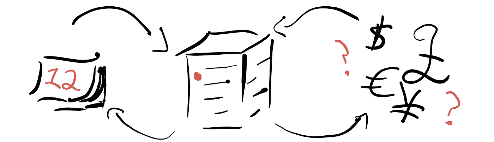

# Android 应用的订阅 101

> 原文：<https://medium.com/androiddevelopers/subscriptions-101-for-android-apps-b7005a7e93a6?source=collection_archive---------3----------------------->

[订阅 Google Play 账单](https://developer.android.com/google/play/billing/billing_subscriptions)是拓展业务的绝佳方式。然而，在你的 Android 应用程序和后端服务器之间进行协调可能会令人生畏。

[订阅 101 视频系列](https://www.youtube.com/playlist?list=PLWz5rJ2EKKc9J8ylTbNo1mnwciEyMbxZG)将帮助您了解订阅难题的所有部分是如何组合在一起的，包括基本的服务器设置、[实时开发者通知](https://developer.android.com/google/play/billing/realtime_developer_notifications)、[升级和降级](https://developer.android.com/google/play/billing/billing_subscriptions#Allow-upgrade)、 [linkedPurchaseToken](/androiddevelopers/implementing-linkedpurchasetoken-correctly-to-prevent-duplicate-subscriptions-82dfbf7167da) 、[宽限期](https://developer.android.com/google/play/billing/billing_subscriptions#account-hold---subscription_on_hold)等等。

# 了解订阅

第一个视频概述了将在整个视频系列中使用的术语，并描述了您将需要的各种组件，包括:您的 Android 应用程序、后端服务器、 [Google Play 计费库](https://developer.android.com/google/play/billing/billing_library_overview)、 [Google Play 开发者 API](https://developers.google.com/android-publisher/) 和 [Google Cloud Pub/Sub](https://developer.android.com/google/play/billing/realtime_developer_notifications) 。

# 订阅购买流程

此视频描述了订阅的购买流程。使用 [Google Play 计费库](https://developer.android.com/google/play/billing/billing_library_overview)，你可以[检查现有订阅](https://developer.android.com/reference/com/android/billingclient/api/BillingClient#queryPurchases(java.lang.String))和[启动新注册的计费流程](https://developer.android.com/reference/com/android/billingclient/api/BillingClient#launchBillingFlow(android.app.Activity,%20com.android.billingclient.api.BillingFlowParams))。购买成功后，您将获得一个[购买令牌](https://developer.android.com/google/play/billing/billing_overview#purchase-tokens-and-order-ids)和[订单 ID](https://developer.android.com/google/play/billing/billing_overview#purchase-tokens-and-order-ids) ，分别代表用户的权限和与 Google 的交易。在您的安全后端服务器上跟踪这些信息，以便正确授予对您的产品或服务的访问权限。

# 实时开发者通知

[实时开发者通知(RTDN)](https://developer.android.com/google/play/billing/realtime_developer_notifications) 允许您通过 [Google Cloud Pub/Sub](https://cloud.google.com/pubsub/docs/) 向您的服务器发送通知，了解最新的订阅状态。

当您收到 RTDN 通知时，验证该通知中包含的购买令牌，并使用 [Google Play 开发者 API](https://developers.google.com/android-publisher/) 检索关于该订阅的[详细信息](https://developers.google.com/android-publisher/api-ref/purchases/subscriptions)。

# 升级和降级

你可以让用户[使用](https://developer.android.com/google/play/billing/billing_subscriptions#Allow-upgrade) [Google Play 计费库](https://developer.android.com/google/play/billing/billing_library_overview)在你的应用中升级和降级订阅。首先，验证用户是否拥有当前对 [queryPurchases()](https://developer.android.com/reference/com/android/billingclient/api/BillingClient#queryPurchases(java.lang.String)) 的订阅。然后使用将被替换的订阅的 Sku 调用 [setOldSku()](https://developer.android.com/reference/com/android/billingclient/api/BillingFlowParams.Builder.html#setOldSku(java.lang.String)) 。最后，使用新的 Sku 套餐调用 [setSku()](https://developer.android.com/reference/com/android/billingclient/api/BillingFlowParams.Builder.html#setOldSku(java.lang.String)) 。这将返回代表升级或降级订阅的新购买令牌。确保[正确处理 linkedPurchaseToken](/androiddevelopers/implementing-linkedpurchasetoken-correctly-to-prevent-duplicate-subscriptions-82dfbf7167da) 。

# 宽限期

本视频介绍了如何为订阅设置一个[宽限期](https://developer.android.com/google/play/billing/billing_subscriptions#user-is-in-a-grace-period---subscription_in_grace_period)，在续订失败的情况下，允许用户在短时间内修改支付信息，从而帮助您留住用户。

在 Google Play 控制台中，启用宽限期，并在每个订阅的设置中选择其时间长度。当您收到通知您用户处于宽限期的 RTDN 时，请使用 [Google Play 开发者 API](https://developers.google.com/android-publisher/) 验证订阅状态。然后，在你的应用程序中给用户提供一个通知，通知中有一个[到](https://developer.android.com/google/play/billing/billing_subscriptions#deep-links-manage-subs)[订阅中心](https://play.google.com/store/account/subscriptions)的深度链接，这样他们就可以轻松地修改他们的支付设置。请记住，在宽限期内，用户应该保留对订阅的访问权限。

# 账户持有

该视频介绍了[账户持有](https://developer.android.com/google/play/billing/billing_subscriptions#account-hold---subscription_on_hold)，这是一种用户支付方式有问题时无需重新订阅即可轻松恢复应用内容的方式。这样可以增加用户留存。

通过在 Google Play 控制台的应用内产品部分的订阅选项卡中展开订阅设置菜单，为所有应用的订阅启用帐户保留。在你的后端，当你收到一个 RTDN 通知你一个用户的帐户被保留，使用 [Google Play 开发者 API](https://developers.google.com/android-publisher/) 验证订阅状态。然后你应该阻止对订阅的访问，让用户知道他们的支付方式有问题，提供一个[到](https://developer.android.com/google/play/billing/billing_subscriptions#deep-links-manage-subs)[订阅中心](https://play.google.com/store/account/subscriptions)的深度链接，这样他们就可以轻松地修改他们的支付设置。

# 取消并恢复

允许用户在取消订阅后轻松恢复订阅有助于重新获得和保留以前活跃的用户。用户取消订阅后，他们将保留对您的应用程序内容的访问权限，直到订阅期到期。在此期间，他们可以在 [Google Play 订阅中心](https://play.google.com/store/account/subscriptions)轻松恢复订阅。

在收到 RTDN 通知您用户已取消订阅后，您可能希望在您的应用程序中显示一个关于即将到期日期的礼貌提醒，并提供一个到订阅中心的[深层链接](https://developer.android.com/google/play/billing/billing_subscriptions#deep-links-manage-subs)，以便他们轻松恢复订阅。

# 延期计费

[推迟计费日期](https://developer.android.com/google/play/billing/billing_subscriptions#Defer)是向用户免费提供临时接入的一种简单方法，作为一种促销活动，或者如果他们经历了服务中断。使用 [Google Play 开发者 API](https://developers.google.com/android-publisher/api-ref/purchases/subscriptions/defer) ，你可以提前订阅用户的计费日期，让他们在指定的时间内免费使用你的服务。订阅更新日期将进行调整，以反映传递给 API 的新计费日期。

# 准备好了吗？走吧。

希望这些视频能帮助你了解如何在你的 app 中实现订阅！准备好了吗？走吧。

# 资源

*   [订阅 101 YouTube 播放列表](https://www.youtube.com/playlist?list=PLWz5rJ2EKKc9J8ylTbNo1mnwciEyMbxZG)
*   [Google Play 计费库](https://developer.android.com/google/play/billing/billing_library_overview)
*   [来自 Google Play 开发者 API 的 Subscriptions.purchase 资源](https://developers.google.com/android-publisher/api-ref/purchases/subscriptions#resource)
*   实现 [linkedPurchaseToken](/androiddevelopers/implementing-linkedpurchasetoken-correctly-to-prevent-duplicate-subscriptions-82dfbf7167da)
*   [Classy Taxi](https://github.com/android/play-billing-samples) ，一款端到端订阅样本 app