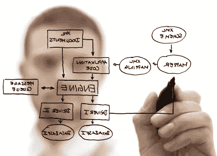
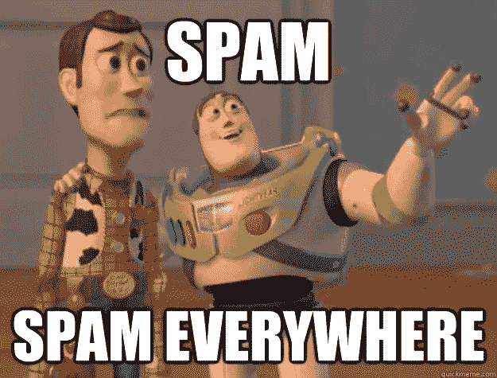
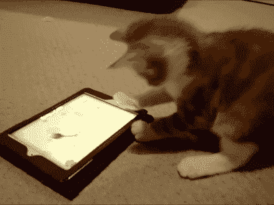
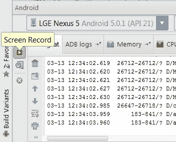
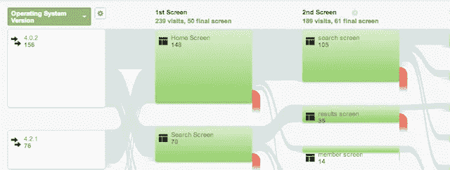

# Google Play 的成功:不仅仅是开发的问题——第二部分

> 原文：<https://medium.com/google-developer-experts/success-on-google-play-not-just-a-matter-of-development-part-2-70e6f9892fd0?source=collection_archive---------1----------------------->

## 多任务处理如何帮助独立 Android 开发者在 Google Play 上取得成功

在[Google Play 上的成功:不仅仅是开发的问题——第一部分](/technology-invention-and-more/success-on-google-play-not-just-a-matter-of-development-part-1-d895978026bb)中，我们开始分析**多任务处理**如何以及为什么对开发者在 Google Play 上取得成功至关重要。了解 Google Play 的皮毛，设计、测试和优化我们的应用程序，并提供客户服务，可以真正帮助我们的应用程序**成长，并达到良好的收视率和下载率**。

然而，开发者可以采取更多的步骤来改进他的应用程序，并在 Google Play 上引起注意，同样，这都是关于多任务的。

一个功能全面的开发者不仅仅是一个优秀的程序员，他也是一个能够理解用户想要什么以及用户如何与他的应用交互的人。

了解用户的**实际需求**有助于开发者改进应用的**一般方法。这是一个非常强大的工具，也是赢得用户芳心的关键之一。**

首先，**用户想知道你的 app** 到底是什么用途，它的**主要特点**是什么，app 的**表现如何**。这些信息驱使用户想要尝试一款应用，这是吸引他们的第一步。

所有这些都有一个**位置**，这是 Google Play 上的**应用描述，您可以使用 **Google Play 开发者控制台**插入。**

然而，在开始写下你的应用程序的所有酷功能之前，请记住**避免垃圾描述。**

为了有一个**你不应该做什么的好例子**，这里有一个来自 **Google Play 最佳实践和政策**页面的摘录:

> Gems X 来了！现在开始收集稀有的宝石和珠宝。今天就加入稀有珠宝的探索吧！
> 
> 宝石 X:稀有珠宝的匹配——收藏家传奇自由不是一个精简版，但提供所有功能供您享受。具有全触摸滑动控制，就像糖果这个游戏是甜的，你会在任何时间迷恋上这个游戏。
> 
> 因此，暂时停止成为购物狂或纽约模特般生活方式的时尚偶像，放松下来，加入收集稀有宝石的世界。没有购物压力，只是纯粹的放松！加入珠宝探索，成为珠宝大师！
> 
> 这个游戏允许你收集钻石，并保留自己的收藏。这不仅仅是一个钻石 dash，这是一个钻石(红宝石)Dash 集合，允许您买卖您最喜爱的钻石(宝石/珠宝/红宝石)来制作一个完整的集合。
> 
> 我们开发的其他 A 级游戏包括《泡泡部队》、《泡泡老爹 X》、《选举游戏 2014》等等。你最喜欢哪个？立即为您的 Android 设备和迷宫突围获取此糖果！
> 
> Lunagames 正在进行中/即将推出:玛丽的珠宝店；床头童话(可爱宠物版 Tap Saga)，龙链碾压银河！宝石破折号。
> 
> 我们的球员怎么说:
> 
> Cindy98:正在寻找“朋友的宝石”——但是我喜欢这个游戏。我的最爱之一连同糖果粉碎传奇，“龙宝石”和海难，切断时间旅行的绳子…保持下去！
> 
> 辛迪:顶级游戏喜欢收集珠宝！这和《割断绳子:时间旅行》&《4 图 1 错》《流动狂潮》+ blenduko +俄罗斯方块是我的最爱！找不到 Stratego？感恩节快乐。
> 
> 法蒂玛:当然是最好的宝石般的游戏连同“龙宝石”和“大理石爆破”。我对☺上瘾了
> 
> Johnny26:喜欢。这个游戏很有冲击力！爱收藏一族！我最喜欢的是《宝石 XXL》、《4 图 1 错》、《俄罗斯方块闪电战》、《blendoku》、《极速赛车联盟》、《明星宝石》，还有那个叫 Fragger 的小游戏。
> 
> 杰基世嘉:宝石与朋友 zynga &宝石迷阵 3 是好的，但这是一个炸弹；多棒啊！宝石 XXL rules☺
> 
> 吉米:太有趣了。像“宝石闪电战”，但选择收集和免费宝石！这场比赛是一个全垒打，它击败了公园！！就像新的海滩世界。j .宗加
> 
> 黑社会先生:五星游戏。面包店
> 
> 莎拉:周二收到——两周后仍在播放——伟大的故事☺
> 
> 打破和爆炸日常链，移动你的战利品，加入银河系和更远的地方最有趣的图腾！今天就加入钻石收藏体验，打造属于你自己的珠宝收藏。在办公室、餐厅、地铁或公园；无论在哪里，你都会爱上 Gems X！
> 
> 今天就加入我们的游戏吧！没有作弊！联系我们。
> 
> 关键词:游戏，游戏，乐趣，有趣，孩子，孩子，孩子，益智，益智游戏，声音，乌龟，海龟，海龟，乌龟，乌龟，乌龟，乌龟，乌龟，乌龟，乌龟，乌龟，乌龟，乌龟，乌龟，乌龟，乌龟，乌龟，乌龟，乌龟，乌龟，乌龟
> 
> 这款游戏像《愤怒的小鸟》一样令人上瘾，比脸书和推特更具社交性，它的配乐让人想起凯蒂·佩里和 Lady Gaga。

哇，连我都没有读完上面的所有内容！你不想这么做，对吧？

如您所见，在之前的描述中，我们有**多个问题**:

1.  **太 Loooooooong 了！记住:保持简短。用户不想花 10 分钟详细阅读你的应用程序的所有功能。**简短的描述是解释你的应用程序功能的最佳方式**。关注你的 app 的主要功能。**
2.  **关键词。**在描述的最后，您会看到一个关键词列表。这是让你的应用被踢出谷歌 Play 商店的最好方法。**别这样。**每一次设置应用描述以操纵 Google Play 中的排名和列表的尝试都**违背了你注册 Google 开发者账户时接受的开发者政策**。这只会导致 Play Store 迅速禁止退货。
3.  **App 描述中的用户评论。在谷歌 Play 商店的详细页面上有一个评论区，对吗？因此，这是你的用户寻找其他用户评级的地方，而不是在你的应用程序描述中。你的应用程序被**在非常重要的博客/报纸上**展示过？**挑一个**，就这么加。没有人在乎你挑选的其他用户的评论，这只会适得其反。如果你的描述是“马克:哇，这是我用过的最好的应用程序！”你的应用评分是 1 星，还有一堆不好的评论？**
4.  **著名应用/服务/贵宾的参考:**

> 这款游戏像《愤怒的小鸟》一样令人上瘾，比脸书和推特更具社交性，它的配乐让人想起凯蒂·佩里和 Lady Gaga。

你认为阅读此类文章的人需要多长时间才能意识到你只是想做 Google Play SEO？避免这个。

总结一下:在你的应用描述中，要简短、信息量大、有创意，最重要的是，要诚实。

还有其他方法让你的潜在用户了解你的应用程序的主要特点。

你可能听说过，有时候

Android 应用程序更是如此。

使用**截图**。

在上一篇文章中，我们强调了提供不同屏幕尺寸的**截图**是一种很好的方式，可以确保使用低端和高端设备的人对应用程序在他们的手机/平板电脑上的外观有一个正确的想法。

我们还有另一个好的准备，那就是视频。

If cats are your target-customers, a video of a cat using your app is a good start.

视频是展示一个应用的主要酷功能的好方法。一段**既有趣又酷**的视频打破了我们的用户至少**尝试我们的应用程序的欲望(这正是我们想要的)。**

制作一个应用程序的视频乍看起来很容易，但实际上这是营销和应用程序最困难和最耗时的任务之一。

幸运的是，我们有一些**嵌入式工具**，让我们的应用程序截图变得超级容易。

如果你有 4.0 以上版本的设备，**你可以使用 Android Studio** 中的嵌入式屏幕录制工具轻松录制你的应用程序的 screencats 视频。

Screen Record is embedded in Android Studio

您也可以通过在终端上调用以下命令来完成此操作:

*亚行壳牌 screen record/SD card/demo . MP4*

如果你没有 4.0+的设备，也有很好的替代品，比如 [**DroidAtScreen**](http://droid-at-screen.ribomation.com/) 或者 [**Genymotion**](https://www.genymotion.com/#!/) 。

一件好事可能是**后期制作你的视频**使用视频编辑工具给你的视频添加**音乐、过渡效果和更多信息**。没有特定的工具可以做到这一点，请使用您最喜欢的工具。

除了展示你的应用程序的功能。一个后期制作的视频显示**你对你的应用**投入了努力和信任，你关心它，你认为它是一个好产品。发布原始的、未经制作的视频版本会给你的用户带来很差的体验，所以考虑一下吧。

当你创建一个后期制作的视频时，请记住你也需要尊重所有关于版权内容的政策。所以对你使用的图片/音乐要小心，如果需要的话要注明出处。

如果你想寻找**知识共享内容**，一个很好的起点是[**cc search**](http://search.creativecommons.org/)**(即将被新工具取代)。**

最后，将你的视频发布到 **YouTube** ，并将该视频嵌入到你的应用描述中(有一个**特定字段**)。

在 YouTube 上有你的应用程序的视频是一件好事，不仅因为你的应用程序描述中有一个视频。**你可以在多个社交渠道**上分享你的视频，将链接发送到 **Android 相关博客**，发送到**报纸**，发送到你的奶奶，让她感到骄傲，等等。

**分享你的视频，**不要害羞。

既然你已经为你的应用程序描述提供了**很酷的图形资产**，漂亮的**截图**和**做得很好的后期制作视频**，我们可以正式地说**你的潜在用户很可能会对你的应用程序做了什么**。

任务完成了？

嗯，不完全是！

现在你的用户已经知道了你的应用**，是时候让你了解你的用户**。

一种方法是通过**用户评论**，我们在本系列的第一部分中分析了这个任务。了解用户对你的应用的评价是改进你的应用的重要资源。

用户评论是一个很好的“主动”工具，他们可以向你提供反馈，但还有其他绝对**更少侵入性和更“被动”的方式**来了解用户如何与你的应用程序互动。

我说的是**谷歌分析**。

分析为你提供了**大量的工具，你可以用来了解更多关于你的应用影响**。

你可以追踪谁下载了你的应用(当然是匿名信息，你不会得到真实的名字！)、**从哪里下载**，最重要的是**他们如何使用它。**

我不会详细介绍所有的分析设置和功能列表，如果你有兴趣了解更多，这里有一个 [**链接，链接到非常好的分析文档**](https://developers.google.com/analytics/) 和好文章 [**解锁谷歌移动分析的力量**](/its-an-app-world/unlock-the-power-of-google-analytics-for-mobile-249d77578e70) **。**

我在这里感兴趣讨论的是分析的一个非常具体的特性，即**用户行为流。**

User Behaviour Flow on Google Analytics

你可以在你的 Android 活动中嵌入真正的**小片段**，以**发送用户已经访问了那个特定“屏幕”的指示**。这些信息将通过分析进行阐述，然后你会得到一个流程图，就像你上面看到的那样。

这张图表是了解用户如何与你的应用程序互动的最好工具之一。

你可以在那里看到**趋势**，你可以了解**有些屏幕根本没有被访问，**你可以看到用户的退出点。

例如，你可能会注意到，在访问主屏幕后，70%的用户会离开你的应用程序。那是什么意思？你需要提高用户在主屏幕上的参与度。用户在你的应用上花了很多时间，但他们从来没有接触过某个特定的活动？那么**这个活动可能很难被发现，或者是没有用的**。诸如此类。

换句话说，**用户行为流**是一个超级有效的工具，可以让**更好地了解你的应用**中的用户体验，如果它有效，如果它无效，它的**致命弱点是什么。**

如果你想了解更多关于用户行为流程的信息，这里有[到文档](https://support.google.com/analytics/answer/2785577?hl=en)的链接。

综上所述，在**在 Google Play 上的成功**的第二部分中，我们讨论了如何**通过应用描述、截图和视频向你的用户**提供更多关于你的应用的信息，以及如何**通过分析和用户行为流从你的用户**那里获得更多信息。

你提供的信息越多，**你的用户在试用、购买和使用你的应用时就会越有安全感**。你获得越多合适的信息，你就越能改进你的应用程序，以适应用户的需求。

感谢阅读！

*如果你喜欢这篇文章，* [***在 Google+***](https://plus.google.com/+MarioViviani/posts) *或**[***Twitter***](https://twitter.com/Mariuxtheone)**上关注我，了解更多关于* ***Android 的信息！*****

***敬请期待* ***第三部*** *！***