# 糖勒索软件，一个新的 RaaS

> 原文：<https://medium.com/walmartglobaltech/sugar-ransomware-a-new-raas-a5d94d58d9fb?source=collection_archive---------0----------------------->

作者:约书亚·普拉特、乔纳森·麦凯和杰森·里维斯


一名参与者最近启动了一个 RaaS 解决方案，该解决方案似乎主要关注个人计算机而不是整个企业，但也重用其他勒索软件家族的对象。关于这种勒索软件的讨论并不多，但在我们的研究中，我们确实发现了一条提到其中一个样本的推文[3]。

# 密码器

我们将检查正在使用的密码器，因为它具有来自勒索软件本身的代码重用，这使得它比典型的密码器有趣得多。该密码器最初看起来像是 RC4 加密，导致 APLib 解压缩，但当我们挖掘它原来是 RC4 的修改版本。

可以看到编码后的数据，该数据前有一个密钥:

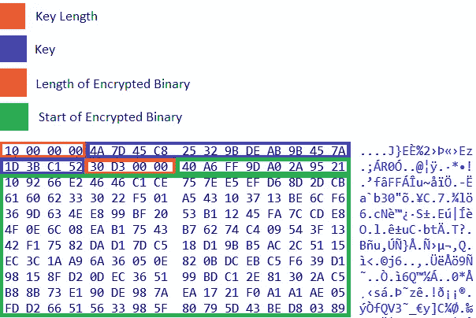

正如我们上面提到的加密算法首先看起来像 RC4，它设置了 SBOX:

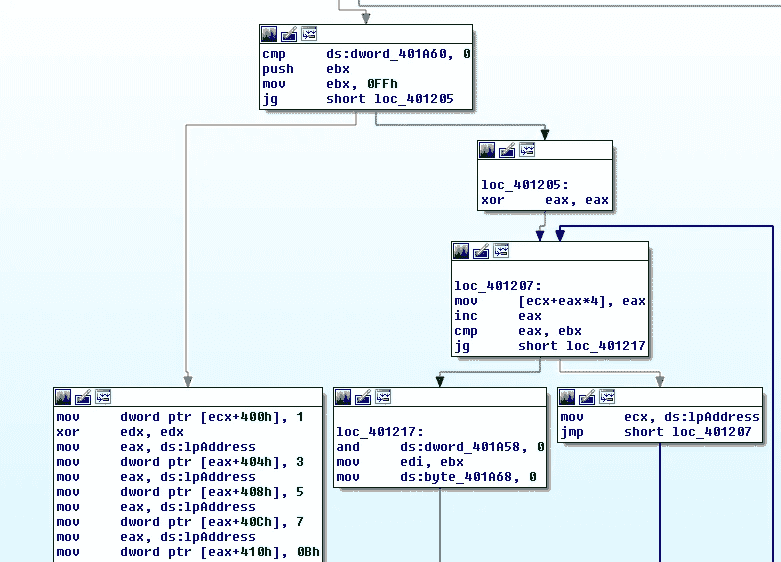

SBOX initialization

然而，从 KSA 街区开始，事情发生了变化:

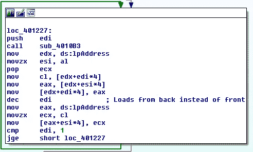

Custom KSA

该算法在 KSA 期间从后向前循环通过 SBOX，它还利用简单的按位“或”循环来构建一个值，该值用于对来自键的工作值进行按位“与”,如果该值大于或等于当前 SBOX 迭代，则它将继续到键中的下一个值。之后，它开始一个定制版本的 PRGA，包括一些额外的洗牌，基于来自后 KSA SBOX 的四个值。

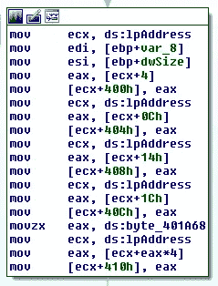

After custom KSA

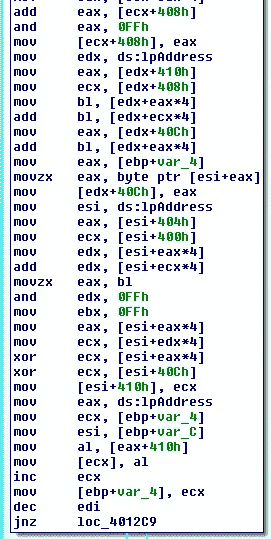

Custom PRGA

解包代码:

```
import yara
from pefile import PE
from struct import unpack
from aplib import Decompress
from io import BytesIO
from sys import argvdef main():
    filepath = argv[1]
    readbin = open(filepath, 'rb').read()

    rule = yara.compile(
        source='rule sugar_RaaS_crypter { strings: '
        '$57B = { C7 [1] 08 04 00 00 05 00 00 00 A1 [4] C7 [1] 0C 04 00 00 07 00 00 00 A1 [4] C7 [1] 10 04 00 00 0B 00 00 00 A1 } '
        '$EP = { C2 04 00 6A 00 E8 [4] 33 [1] C2 04 } '
        '$AP = { E8 2C 00 00 00 3D 00 7D 00 00 73 0A 80 FC 05 73 06 83 F8 7F } '
        'condition: filesize < 200KB and uint16(0) == 0x5A4D and uint32(uint32(0x3C)) == 0x4550 and $57B and $EP at (entrypoint-3) and $AP }'
    )
    yara_match = rule.match(data=readbin)if yara_match != {}:
        try:
            pe = PE(filepath)
        except:
            print('not valid PE')
            exit() dsect = [
            pe.sections[i].get_data() for i in range(len(pe.sections)) if pe.sections[i].Name.rsplit(b'\x00')[0] == b'.data'
            ][0]

        klen = unpack('I', dsect[:4])[0]
        key = dsect[4:4+klen]
        elen = unpack('I', dsect[4+klen:8+klen])[0]
        ebin = dsect[klen+8:klen+8+elen]

        apbin = custom_decryption(key, ebin)
        decrypted_bin = Decompress(BytesIO(apbin)).do()

        fspl = filepath.split('/')[-1]
        fn = fspl.split('.')[0] + '_unpacked.' + fspl.split('.')[1] if '.' in fspl else fspl + '_unpacked'
        fp = '/'.join(filepath.split('/')[:-1]) + '/' + fn        
        out = open(fp, 'wb')
        out.write(decrypted_bin)def custom_decryption(key, data):
    sbox = [i for i in range(256)]
    kb = [key[i % len(key)] for i in range(256)] c = 255
    j = 0
    t = 0
    o = b''

    while c > 0:
        v = 1

        while v < c:
            v = (v|1) + v d = (t + kb[j % 256]) % 256
        b = (d & v) % 256
        j += 1

        if b > c:
            t = d                        
            continue sbox[c], sbox[b] = sbox[b], sbox[c]

        t = d
        c -= 1 eb = sbox + [sbox[1]] + [sbox[3]] + [sbox[5]] + [sbox[7]] + [sbox[t]] for i in range(len(data)):
        eb[257] = (eb[257] + eb[eb[256]]) % 256
        eb[256] = (eb[256] + 1) % 256
        b1 = eb[eb[260]]        
        eb[eb[260]] = eb[eb[257]]        
        eb[eb[257]] = eb[eb[259]]
        eb[eb[259]] = eb[eb[256]]        
        eb[eb[256]] = b1
        eb[258] = (eb[b1] + eb[258]) % 256
        b1 = (((eb[eb[258]] + eb[eb[259]]) % 256) + eb[eb[260]]) % 256
        eb[260] = data[i]
        v = (eb[eb[256]] + eb[eb[257]]) % 256
        x1 = eb[v] ^ eb[eb[b1]]
        x2 = x1 ^ data[i]
        eb[259] = x2
        o += bytes([x2])

    return omain()
```

# **勒索软件样本**

该恶意软件是用 Delphi 编写的，但从 re 的角度来看，有趣的部分是重用来自密码器的相同例程作为恶意软件中字符串解码的一部分，这将使我们相信他们有相同的 dev，密码器可能是构建过程的一部分或主要参与者向其附属机构提供的一些服务。

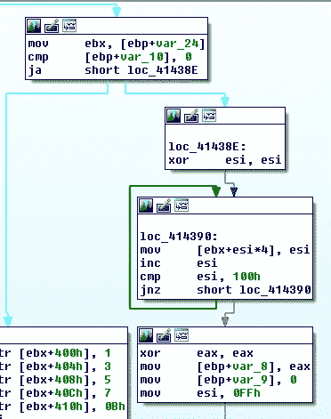

在 SBOX 初始化后，正如我们之前在 crypter 中所讨论的，我们可以看到为 RC4·KSA 和 PRGA 执行的相同的定制过程，如 crypter 部分所示。

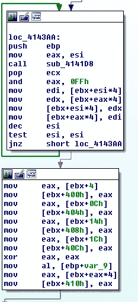

Custom KSA

因为 Delphi 设计他们的字符串的方式，解码它们是一个非常简单的过程，使用和密码相同的代码，我们只需要找到每个字符串和密钥对。

```
if __name__ == "__main__":
 data = open(sys.argv[1], 'rb').read()
 curr = 0
 t = data.find(b'\xff\xff\xff\xff')
 done = False
 while not done and t:
  curr += t
  (a,b) = struct.unpack_from('<II', data[curr:])
  if b > 1000:
   continue
  key = data[curr+8:curr+8+b]
  next = data[curr+8+b:].find(b'\xff\xff\xff\xff')
  curr += 8+b+next
  (a2,b2) = struct.unpack_from('<II', data[curr:])
  if b2 > 1000:
   continue
  blob = data[curr+8:curr+8+b2]
  curr += 8+b2
  try:
   print(decode_data(key,data))
  except:
   pass
  t = data[curr:].find(b'\xff\xff\xff\xff')
  if t == -1:
   done = True
```

将以上转换为 python3

解码字符串:

```
browser
Software\Microsoft\Windows\CurrentVersion\Run
notepad.exe
desktop
--c=show
--net=0
[+] Process started.
software\
.txt
single
network
-data=
\cmd.txt
c:\
Your ID: 
Your support onion(TOR) url: 
[+] Preconfig done: 
    Work type - 
[+] Network communication started - 1.
[+] Network communication started - 2.
[+] Main encryption started.
```

# 赎金票据比较

勒索信与 Revil[1]有一些惊人的相似之处，但也有一些差异和拼写错误:

```
---=== Welcome. Again. ===---

[-] Whats HapPen? [-]

Your files are encrypted, and currently unavailable. You can check it: all files on your system has extension csruj.
By the way, everything is possible to recover (restore), but you need to follow our instructions. Otherwise, you cant return your data (NEVER).

[+] What guarantees? [+]

Its just a business. We absolutely do not care about you and your deals, except getting benefits. If we do not do our work and liabilities - nobody will not cooperate with us. Its not in our interests.
To check the ability of returning files, You should go to our website. There you can decrypt one file for free. That is our guarantee.
If you will not cooperate with our service - for us, its does not matter. But you will lose your time and data, cause just we have the private key. In practice - time is much more valuable than money.

[+] How to get access on website? [+]

You have two ways:

1) [Recommended] Using a TOR browser!
  a) Download and install TOR browser from this site: 
  b) Open our website: 

2) If TOR blocked in your country, try to use VPN! But you can use our secondary website. For this:
  a) Open your any browser (Chrome, Firefox, Opera, IE, Edge)
  b) Open our secondary website: 

Warning: secondary website can be blocked, thats why first variant much better and more available.

When you open our website, put the following data in the input form:
Key:

-----------------------------------------------------------------------------------------

!!! DANGER !!!
DON'T try to change files by yourself, DON'T use any third party software for restoring your data or antivirus solutions - its may entail damage of the private key and, as result, The Loss all data.
!!! !!! !!!
ONE MORE TIME: Its in your interests to get your files back. From our side, we (the best specialists) make everything for restoring, but please should not interfere.
!!! !!! !!!
```

这个新的 RaaS 勒索信来自样品(4a 97 BC 8111631795 CB 730 dfe 7836d 0 afac 3131 ed 8 a 91 db 81 DDE 5062 bb 8021058):

```
[+] Whats Happen? [+]
Your files are encrypted, and currently unavailable. You can check it: all files on your system has extension .encoded01.
By the way, everything is possible to recover (restore), but you need to follow our instructions. Otherwise, you cant
return your data (NEVER).
[+] What guarantees? [+]
Its just a business. We absolutely do not care about you and your deals, except getting benefits. If we do not do our
work and liabilities - nobody will not cooperate with us. Its not in our interests.
To check the ability of returning files, You should go to our website. There you can decrypt 1-5 files for free. That
our guarantee.
If you will not cooperate with our service - for us, its does not matter. But you will lose your time and data, cause
just we have the private key. In practise - time is much more valuable than money.
[+] How to get access on website? [+]
You can open our site by the shortcut &quot;SUPPORT (TOR_BROWSER)&quot; created on the desktop.
Also as the second option you can install the tor browser:
        a) Download and install TOR browser from this site: [https://torproject.org/](https://torproject.org/)
        b) Open our website. Full link will be provided below.
-----------------------------------------------------------------------------------------
!!! DANGER !!!
DONT try to change files by yourself, DONT use any third party software for restoring your data or antivirus solutions
its may entail damge of the private key and, as result, The Loss all data.
!!! !!! !!!
ONE MORE TIME: Its in your interests to get your files back. From our side, we (the best specialists) make everything
for restoring, but please should not interfere.
!!! !!! !!!
-----------------------------------------------------------------------------------------
```

我们可以找到的另一个相似之处是 Cl0p，下面是 Cl0p 解密器页面[2]。

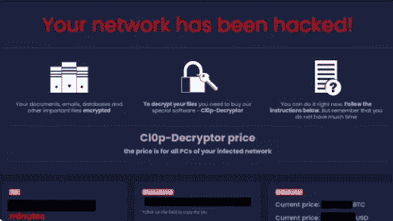

将其与这款新 RaaS 进行比较，可以发现惊人的相似之处:

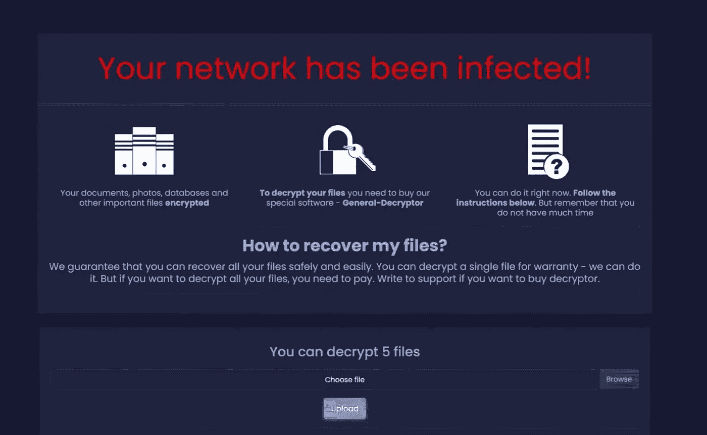

我们分析的样本的文件加密部分似乎使用了 SCOP 加密算法。

来自勒索软件示例:

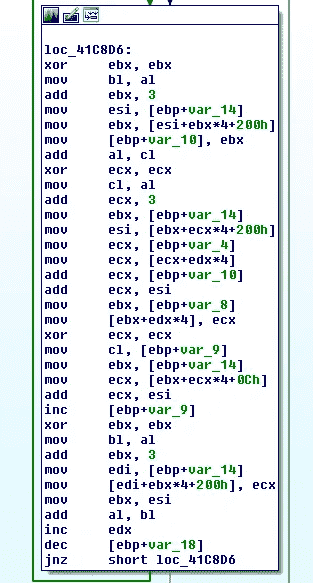

来自 GPLib[4]的 SCOP:

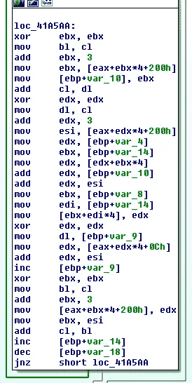

# IOCs

```
bottomcdnfiles.com
cdnmegafiles.com
179.43.160.195
chat5sqrnzqewampznybomgn4hf2m53tybkarxk4sfaktwt7oqpkcvyd.onion
82.146.53.237
sugarpanel.space15a7fb45f703d5315320eef132f3151873055161
5816a77bf4f8485bfdab1803d948885f76e0c926fed9da5ac02d94e62af8b145
320eefd378256d6e495cbd2e59b7f205d5101e7f
18cb9b218bd23e936128a37a90f2661f72c820581e4f4303326705b2103714a9
e835de2930bf2708a3a57a99fe775c48f851fa8f
1318aeaea4f2f4299c21699279ca4ea5c8fa7fc38354dd2b80d539f21836df5a
98137dd04e4f350ee6d2f5da613f365b223a4f49
aa41e33d3f184cedaaaabb5e16c251e90a6c4ff721a599642dc5563a57550822
a4854ce87081095ab1f1b26ff16817e446d786af
4a97bc8111631795cb730dfe7836d0afac3131ed8a91db81dde5062bb8021058
c31a0e58ae70f571bf8140db8a1ab20a7f566ab5
315045e506eb5e9f5fd24e4a55cda48d223ac3450037586ce6dab70afc8ddfc9
```

# 参考

1:https://raw . githubusercontent . com/cado-security/DFIR _ 资源 _ REvil _ Kaseya/main/Config/Ransomware _ note . txt

2:[https://malware warrior . com/how-to-remove-cl0p-ransomware-and-decrypt-cl0p-files/](https://malwarewarrior.com/how-to-remove-cl0p-ransomware-and-decrypt-cl0p-files/)

3:https://Twitter . com/avman 1995/status/1459915441766211601

4:【https://torry.net/pages.php?id=519 