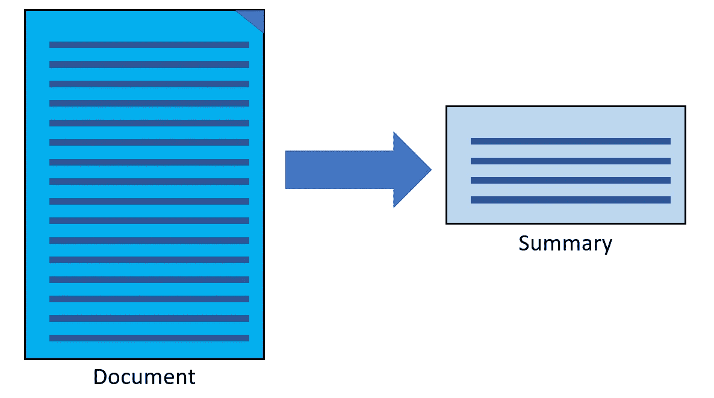
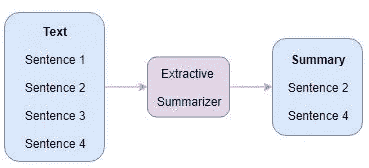
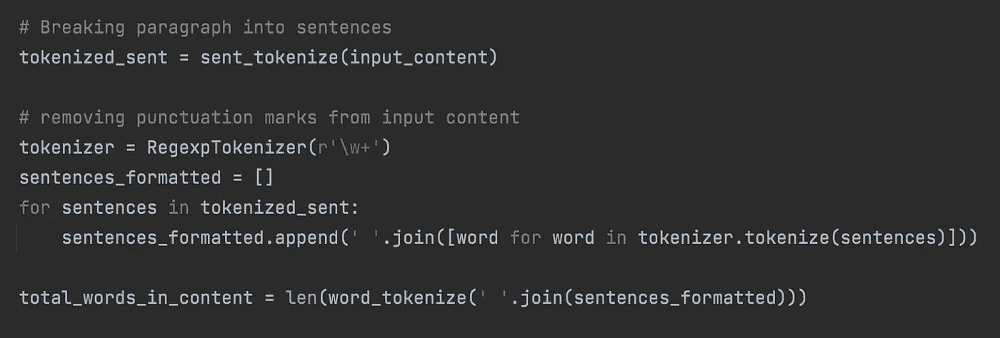
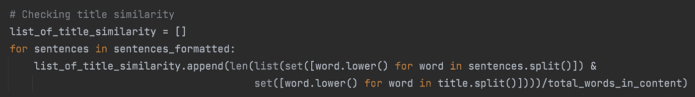
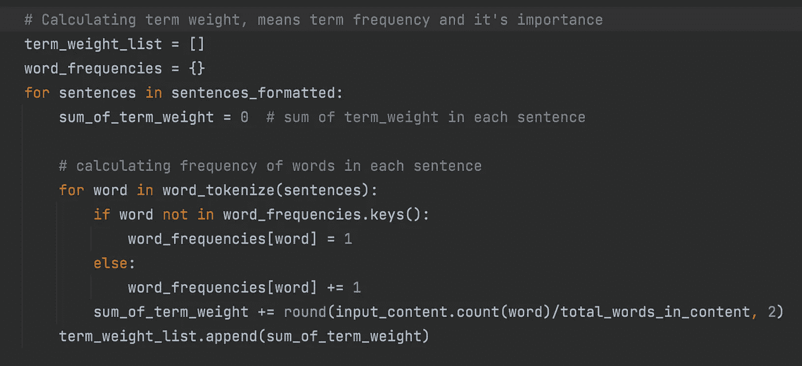
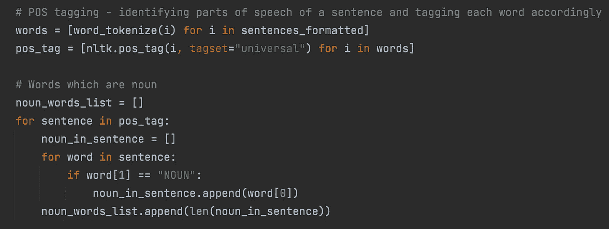
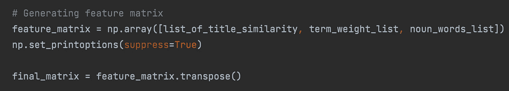
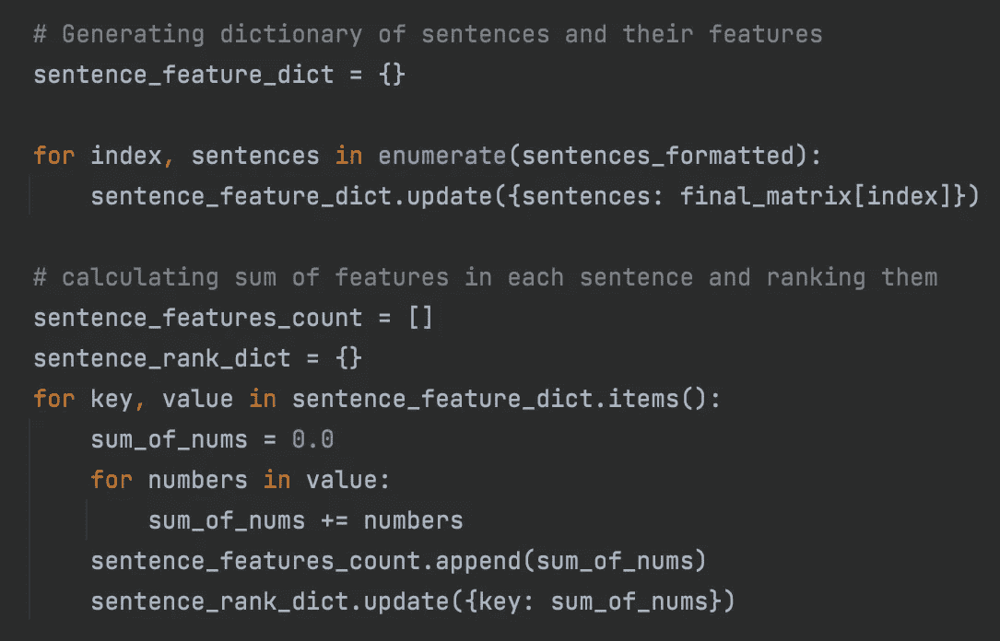
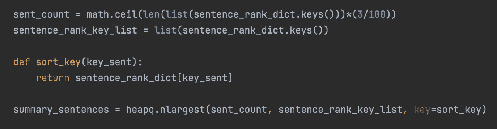

# 总结冗长的文章

> 原文：<https://medium.com/globant/summarizing-lengthy-articles-cdbe4b27ee6?source=collection_archive---------1----------------------->

source: [https://www.istockphoto.com](https://www.istockphoto.com)

## 自动摘要生成

总的来说，总结是我们试图用自己的话来解释主要观点的过程，只包括要点。如果我们读了一本书或一个故事，有人问我们，这本书/故事是关于什么的？然后，我们不把整本书/故事读给他们听，而是给出关键点，以便提供书或故事的背景。

source: [https://www.istockphoto.com](https://www.istockphoto.com)

这种由人类创建摘要的方式引入了自动摘要的概念。根据维基百科-

> 自动摘要是通过计算缩短一组数据，以创建代表原始内容中最重要或最相关信息的子集( ) 摘要)的过程。

这包括视频摘要、音频摘要、图像摘要、文本摘要等。在这篇文章中，我们将只讨论文本摘要。

## 文本摘要

文本摘要是将长篇出版物分解成易于管理的段落或句子的实践。在文本摘要中，任何冗长的文档、文章、文本、博客等。在不丢失关键信息和整体含义的情况下，转换成简洁流畅的摘要。

source: Wikipedia

## 为什么是文本摘要？

文本摘要在以下情况下很有用-

**客户反馈** —它有助于总结和缩短用户反馈中的文字。

**总结博客—** 在博客文章之后会有讨论或评论，这些是很好的信息来源，可以用来判断博客的哪些部分是重要的和有趣的。

**在科学论文摘要中** —有大量的信息，如引用的论文和会议信息，可以用来识别原始论文中的重要句子。

除了上述场景，它还可以总结演示文稿、邮件、大型 pdf、在线文章、维基百科内容或任何大型文档。

## 文本摘要的类型

有两种方法可以总结冗长的文档或文本-

1.  摘录摘要
2.  抽象概括

**摘录摘要**

这个名字本身就暗示了所遵循的方法。在这种类型的摘要中，所有重要的句子或短语都从原文中识别出来并提取出来。这些提取的句子或短语然后被组合以创建摘要。

source: Wikipedia

那么，我们如何识别哪些句子或短语是重要的，哪些是不重要的呢？句子是根据少数特征来排序的。下面是其中的一个过程——

我在这里使用了 python，但它也可以用其他编程语言来完成。对于下面的过程，确保 python 安装在系统(Windows/Mac/Linux 等)中。)

安装下面提到的 python 库/包-

*   nltk —这为自然语言处理提供了一套不同的算法。
*   **numpy** —这提供了一个多维数组对象，以及诸如掩码和矩阵之类的变体，可用于各种数学运算。
*   **heapq** —它实现了所有低级的堆操作以及一些高级的堆的公共用途。
*   **数学** —这是 Python 的内置模块，用于高级数学任务。

**遵循**的步骤-

## 第一步

在这一步，我们使用了 nltk 的 **sentence_tokenize** 函数，将段落分解成多个句子，并删除了标点符号。

## 第二步

在这一步中，我们确定了那些包含与文档标题相似的单词的句子。然后，基于在标题和文档中的句子之间出现的常用单词的数量与文档中的总单词数量的比率，给每个句子打分。如果一个句子拥有与标题相同的最大数量的单词，则该句子得分高。

这一部分在文档标题提供了文档内容的参考的情况下很有帮助。

## 第三步

在这一步中，我们计算了术语权重或术语频率。一个术语在文档中出现的次数称为其术语频率。这是文档中特定单词的计数与文档中单词总数的比率。

## 步骤 4

这里，我们确定了句子中的词类，并相应地标记了每个单词。然后根据句子中出现的名词数量对句子进行排序。

## 第五步

这是我们使用 numpy 库生成特征矩阵的步骤。使用在上述步骤中计算的特征来生成特征矩阵。这些特征是——基于句子与文档标题的相似性对句子进行排序，基于术语权重总和对句子进行排序，以及基于句子中出现的名词单词的长度对句子进行排序。

## 第六步

在这一步中，我们创建了一个句子字典和我们在步骤 5 中创建的特征矩阵，计算每个句子的特征总和，并对它们进行排序。

## 第七步

这是最后一步，我们挑选排名最高的前 30%的句子，并通过组合这些句子来创建摘要。我们在这里使用了 **heapq** 包。所选句子的百分比可以根据需要增加或减少。

## 结论

这里使用的提取摘要过程只是一个例子，说明我们如何通过减少阅读冗长文章、文档、书籍等的时间来提高效率和生产力。还有其他因素也是对句子进行排序的基础。也有现成的算法可用，它做同样的任务，我们在上述步骤，并返回给我们的总结。唯一的区别是，在这些算法中，我们不知道用于创建摘要的因素。在这里，我们可以控制因子，并且可以增加或减少所用因子的数量。

## 下一步是什么？

为了进一步探索文本摘要，请阅读我的关于[抽象摘要](/@miteshdewda783/abstractive-text-summarization-bccb4bf5851c)的文章，它简要描述了使用 HuggingFace Transformers 的过程。

## 参考

 [## 自动摘要-维基百科

### 自动摘要是通过计算缩短一组数据，以创建一个子集(摘要)的过程…

en.wikipedia.org](https://en.wikipedia.org/wiki/Automatic_summarization)  [## 你怎么能在没有阅读的情况下总结一份文件呢？

### 当你有太多的文件要看但时间不够的时候，你会怎么做？你将如何决定哪些是…

medium.com](/@kajolshah/how-can-you-summarize-a-document-even-without-reading-it-60c4a60d29d)  [## Python 自然语言工具包(NLTK)教程

### 什么是 NLTK？在 NLTK 数据预处理-标记化-标点符号删除-停用词删除中访问数据集…

www.mygreatlearning.com](https://www.mygreatlearning.com/blog/nltk-tutorial-with-python/)  [## python 中从头开始的 TF(词频)-IDF(逆文档频)。

### 从头开始创建 TF-IDF 模型

towardsdatascience.com](https://towardsdatascience.com/tf-term-frequency-idf-inverse-document-frequency-from-scratch-in-python-6c2b61b78558)