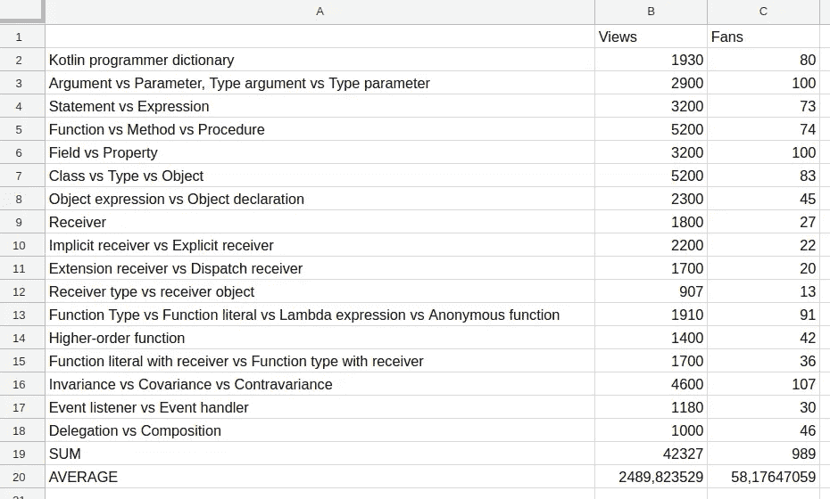

# 科特林程序员词典概要

> 原文：<https://blog.kotlin-academy.com/summary-of-kotlin-programmer-dictionary-7dfd7bf3956d?source=collection_archive---------6----------------------->

在过去的几个月里，卡帕头。Academy 一直在发布名为 [Kotlin 程序员词典](https://blog.kotlin-academy.com/kotlin-programmer-dictionary/home)的文章。16 篇文章解释了超过 35 个常见的混淆术语，由两位作者发表，并由包括伟大作家 Dmitry Jemerov 在内的更多程序员审阅。到目前为止，他们已经有超过 42 000 的浏览量和近 1000 名粉丝。

不仅浏览量和粉丝数量显示了这些文章对读者来说是多么有趣。文章得到了很多很好的反馈和大量的转发。其中一些文章还被收录在《科特林周报》上。谁也没想到会有这么大的兴趣！记住这是[只是解释术语](/kotlin-programmer-dictionary-2cb67fff1fe2)的系列。看起来这个主题对人们来说真的很有趣。

为什么这么有意思？我不能为别人说话，但对我来说，术语表，因为我是一个作者和演讲者，我需要关心它。技术文章中的错误术语通常是逻辑错误。这可能会令人困惑，而且看起来非常不专业。尽管从评论来看，我认为大多数观众都是普通的程序员，他们打开 post 是因为他们感兴趣。我认为这对他们来说很有趣，因为当我们没有足够的术语时，文档或技术文章对我们来说就更难了。有些词我们一般都知道，但我们不确定它们真正的意思。有了更好的术语知识，一切都会变得更简单，我们的工作也会更好。我想这是读者的主要动机。

解释所有这些术语非常有趣。最初的计划实现了，我相信所有最重要的条款都描述了。有了这篇文章，我正式完成这个系列。这并不意味着 Kt 上不会再发表关于这个主题的文章。学院。这意味着我们将不再定期发布它们。当我们有重要的事情要解释时，我们会发表的。我们还想邀请其他作者提出他们的文章。查看[这篇关于为 Kt 写作的文章。学院](/write-for-kotlin-academy-abebd70937ce)。现在我们需要专注于其他系列，比如多平台开发或 Kotlin 课程。

# TL；速度三角形定位法(dead reckoning)

科特林程序员词典是一个巨大的成功。系列已经完成，将不再定期出版。如果你想写下一篇关于这个主题的文章，我们非常欢迎你。我们也想[邀请你为 Kt 写其他文章。学院](/write-for-kotlin-academy-abebd70937ce)。

这篇文章是[科特林程序员词典](https://medium.com/kotlin-academy/kotlin-programmer-dictionary-2cb67fff1fe2)的最后一部分。要了解最新的新部件，只需关注这个媒体或[在 Twitter 上观察我](https://twitter.com/marcinmoskala)。如果你需要帮助，记得[我随时欢迎咨询](https://medium.com/@marcinmoskala/ive-just-opened-up-for-online-consultations-640349aaba55)。

喜欢的话记得**拍**。请注意，如果您按住鼓掌按钮，您可以留下更多的掌声。

以下是《科特林程序员词典》的其他部分:

*   [实参对形参，类型实参对类型形参](https://medium.com/kotlin-academy/programmer-dictionary-parameter-vs-argument-type-parameter-vs-type-argument-b965d2cc6929)
*   [语句 vs 表达式](https://medium.com/kotlin-academy/kotlin-programmer-dictionary-statement-vs-expression-e6743ba1aaa0)
*   [功能 vs 方法 vs 程序](https://medium.com/kotlin-academy/kotlin-programmer-dictionary-function-vs-method-vs-procedure-c0216642ee87)
*   [字段对属性](/kotlin-programmer-dictionary-field-vs-property-30ab7ef70531)
*   [类对类型对对象](/programmer-dictionary-class-vs-type-vs-object-e6d1f74d1e2e)
*   [对象表达式 vs 对象声明](/kotlin-programmer-dictionary-object-expression-vs-object-declaration-791b183ad16b)
*   [接收器](/programmer-dictionary-receiver-b085b1620890)
*   [隐式接收者 vs 显式接收者](/programmer-dictionary-implicit-receiver-vs-explicit-receiver-da638de31f3c)
*   [分机接收机 vs 调度接收机](/programmer-dictionary-extension-receiver-vs-dispatch-receiver-cd154e57e277)
*   [接收器类型与接收器对象](/programmer-dictionary-receiver-type-vs-receiver-object-575d2705ddd9)
*   [函数类型 vs 函数文字 vs Lambda 表达式 vs 匿名函数](/kotlin-programmer-dictionary-function-type-vs-function-literal-vs-lambda-expression-vs-anonymous-edc97e8873e)
*   [高阶函数](/programmer-dictionary-higher-order-function-9cadb07df94e)
*   [带接收方的函数文字与带接收方的函数类型](/programmer-dictionary-function-literal-with-receiver-vs-function-type-with-receiver-cc21dba0f4ff)
*   [不变性 vs 协方差 vs 方差](/kotlin-generics-variance-modifiers-36b82c7caa39)
*   [事件监听器 vs 事件处理器](/programmer-dictionary-event-listener-vs-event-handler-305c667d0e3c)
*   [代表团 vs 组合](/programmer-dictionary-delegation-vs-composition-3025d9e8ae3d)

**你需要 Kotlin 工作室吗？请访问我们的网站******，看看我们能为您做些什么。****

****