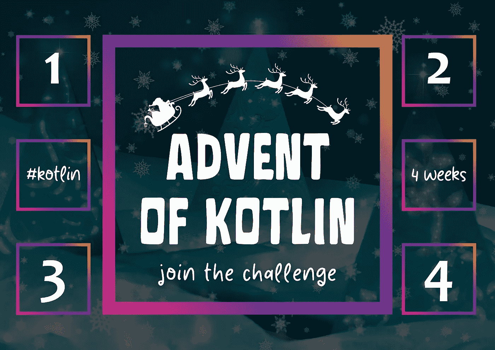
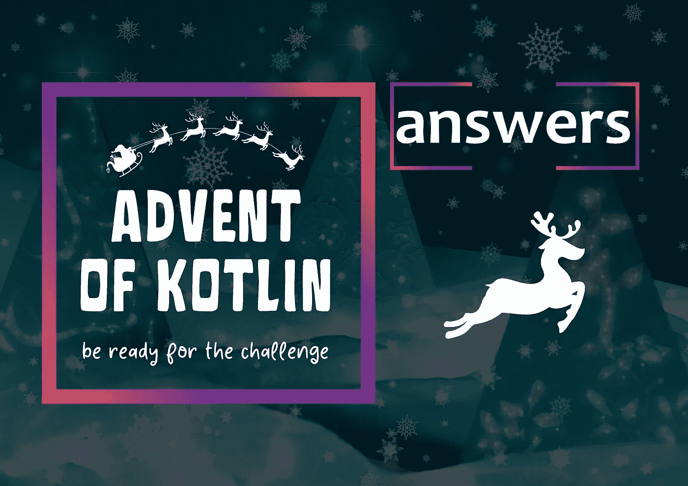

# 科特林问世综述🔥

> 原文：<https://blog.kotlin-academy.com/summary-of-the-advent-of-kotlin-d10b3ee01699?source=collection_archive---------2----------------------->

# 你好 Kotliners！

ℹ️:这是我们时事通讯的一个特殊的、为期 4 周的版本。它将只包含一个特殊的主题——科特林的降临。

**欢迎来到科特林问世总结！**🎄

新年刚刚开始。我们希望你喜欢我们从 2021 年挑选的前七篇文章。是时候总结一下去年#AdventOfKotlin 挑战赛的最新特别活动了！

感谢您抽出时间来解决我们的挑战👏

你喜欢这些任务吗？😍

让我们知道，他们是否太难和要求太多

…太简单了😅回复这封邮件！💌

我们想提醒你所有的**四项任务**，并给你**承诺的解决方案**。🥇

👉[kot Lin 降临:第 1 周:JSON stringify 和可能值括号](https://kt.academy/article/advent-2021-week1)
👉[科特林降临:第二周:树算法](https://kt.academy/article/advent-2021-week2)
👉[科特林降临:第三周:k-means 聚类](https://kt.academy/article/advent-2021-week3)
👉[kot Lin 降临:第 4 周:JSON 解析](https://kt.academy/article/advent-2021-week4)

❗ [科特林问世:解决方案](https://kt.academy/article/advent-2021-solutions) ❗

我们开始吧。我们走吧。⏬

这是热身周。不是一个复杂的挑战，而是两个简单的挑战。虽然他们还是给了你足够的空间来展现好的风格:)

**kot Lin 降临:第 1 周:JSON stringify 和可能值括号**👇

[Advent of Kotlin: Week 1: JSON stringify and possible value parentheses](https://kt.academy/article/advent-2021-week1)

我们继续解决算法问题，但是这次我们已经实现了一些**树算法**。

👉**科特林降临:第二周:树算法**

[Advent of Kotlin: Week 2: Tree algorithms](https://kt.academy/article/advent-2021-week2)

随着人工智能变得越来越重要，本周我们一直在实现一个重要的 AI 算法: **k-means 聚类**。

**科特林降临:第 3 周:k 均值聚类**👇

[Advent of Kotlin: Week 3: k-means clustering](https://kt.academy/article/advent-2021-week3)

我们从 JSON stringify 开始了这个降临节。上周，我们做了相反的事情: **JSON 解析**。

**kot Lin 的降临:第 4 周:JSON 解析**👇

[Advent of Kotlin: Week 4: JSON parsing](https://kt.academy/article/advent-2021-week4)

最后，我们答应给你**解决方案。**👌检查一下你的答案是否正确。

下面你可以找到由**马辛·莫斯卡拉**准备的👇

[Advent of Kotlin: Solutions](https://kt.academy/article/advent-2021-solutions)

🏆🏆🏆🏆🏆🏆🏆🏆🏆🏆🏆🏆🏆🏆🏆🏆🏆🏆🏆🏆🏆🏆🏆🏆🏆

卡帕头。学院组织了一场最佳解决方案竞赛。
根据规则，我们在我们的[推特](https://twitter.com/ktdotacademy/status/1478295313400094724)上宣布了结果！
祝贺你👏

还有一个…
很快我们就要庆祝**我们的生日**！🎂🥳
敬请期待！👌

卡帕头。学院团队

www: [kt.academy](https://kt.academy/)
博客:[blog.kotlin-academy.com](http://blog.kotlin-academy.com/)
Twitter EN:[@ ktdotsacademy](https://twitter.com/ktdotacademy)
Twitter PL:[@ ktdotsacademypl](https://twitter.com/ktdotacademyPL)
FB:[@ ktdotsacademy](https://www.facebook.com/KtDotAcademy)
LinkedIn:[@ Kt。学院](https://www.linkedin.com/company/kt-academy/)

