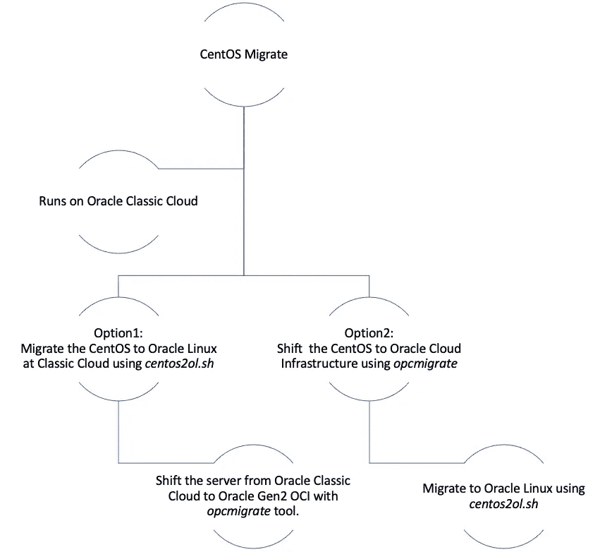

# 将 CentOS 迁移到 Oracle Linux —一种方法

> 原文：<https://medium.com/oracledevs/sunset-of-centos-migrate-from-centos-6-centos-7-centos-8-to-oracle-linux-d5c490ba299b?source=collection_archive---------1----------------------->

CentOS 宣布([https://blog.centos.org/2020/12/future-is-centos-stream](https://blog.centos.org/2020/12/future-is-centos-stream/))他们将专注于发布 CentOS Stream，它将在 Redhat Enterprise Linux 之前获得一些功能。

## 为什么这是一个问题？

主要是因为 CentOS 在过去的稳定性，Redhat 希望在 CentOS 流功能真正应用到 Redhat Enterprise Linux 之前向用户发布它。(阅读更多[https://www . zdnet . com/article/red-hat-resets-centos-Linux-and-users-are-angry/](https://www.zdnet.com/article/red-hat-resets-centos-linux-and-users-are-angry/))

这对 CentOS 用户来说是一个巨大的打击，当客户不高兴时，这样的决定将为他们带来机会，让他们像以前一样探索什么最适合他们。

这可能类似于“Whatsapp”应用程序的客户如何快速转移到“Telegram”和“Signal”等其他应用程序。客户是每个组织的核心。


CentOS Migration

如果你没有体验过其他版本的 Linux，比如 RHEL (Redhat Enterprise Linux)或 Oracle Linux，这将是一个乏味的决策过程。每种方法都有不同的优缺点，许多争论最终导致了更具体的应用决策。(了解更多[https://www . centroid . com/blog/Oracle-Linux-vs-red-hat-enterprise-Linux/](https://www.centroid.com/blog/oracle-linux-vs-red-hat-enterprise-linux/))

Oracle Linux 是免费的，只有当你需要 Oracle Linux 支持时才需要付费。是的，这就是你刚刚读到的。Oracle 在他们的 Linux 中免费提供了像 DTrace、Ksplice 这样的强大特性(GNU GPL)。(如果您需要企业支持，请阅读更多信息[https://blogs . Oracle . com/WIM/Oracle-Linux-and-Oracle-VM-pricing-guide](https://blogs.oracle.com/wim/oracle-linux-and-oracle-vm-pricing-guide))

从数据中心或其他云提供商或甲骨文 OCI 经典(OCI-C)迁移到甲骨文云基础设施(OCI)(第二代云)的客户可以考虑将 CentOS 转换为甲骨文 Linux。Oracle Linux 支持包含在 OCI 订阅中。([https://docs.oracle.com/en-us/iaas/Content/home.htm](https://docs.oracle.com/en-us/iaas/Content/home.htm))

Redhat Linux 与 Oracle Linux 的简单趋势比较——来自 Google Trends 的原始统计数据。


Trends of Oracle Linux and Redhat Linux — **the USA only**


Trends of Oracle Linux and Redhat Linux — **Worldwide**

## **了解迁移的局限性和已知问题:**

意识到任何解决方案的局限性是决定该解决方案是否可为企业扩展的一个关键因素。

*   如果有像 Foreman/Katello 这样的订阅管理员，他们也不能随着迁移一起移动。
*   安装了开放 JDK 的 CentOS 8.3，我们需要遵循一种变通方法来备份“备选方案-列表”，然后使用“备选方案-安装”手动恢复缺失的链接

在 https://github.com/oracle/centos2ol/issues[的](https://github.com/oracle/centos2ol/issues)复习更多

# **方法论概述**

第一步——001，拿个**备份！**在开始本练习之前，创建根存储设备(和/或其他卷)的快照(或所需的备份)


Typical migration approach

下一步是运行 Oracle 开发的脚本([https://raw . githubusercontent . com/Oracle/centos 2 ol/main/centos 2 ol . sh](https://raw.githubusercontent.com/oracle/centos2ol/main/centos2ol.sh))。这种自动转换过程是在正在运行的系统上执行的(有足够的备份可以恢复)。该实用程序将原始 Linux 发行版中的所有 RPM 包替换为各自的 Oracle Linux 版本。在该过程结束时，需要重新启动系统来引导 Oracle Linux 内核。

[https://raw . githubusercontent . com/Oracle/centos 2 ol/main/readme . MD](https://raw.githubusercontent.com/oracle/centos2ol/main/README.md)

> 选项
> `-r`使用 Oracle Linux RPMs 重新安装所有 CentOS RPM
> `-V`验证切换前后的 RPM 信息

下面是从 CentOS 迁移到 Oracle Linux 的快速分步方法。

在下面的场景中，我将重点介绍使用*op migrate*从 Oracle 公共云(Classic-Gen1)迁移到 Oracle 云基础架构(Gen2)的步骤(更多信息，请访问[https://docs . Oracle . com/en/Cloud/iaas-Classic/compute-iaas-Cloud/migrate-OCI/migrate-VMs-and-block-storage . html](https://docs.oracle.com/en/cloud/iaas-classic/compute-iaas-cloud/migrate-oci/migrate-vms-and-block-storage.html#GUID-7099C387-9826-4D22-A448-C3FC4ABBD094)



Migrate + Shift to Oracle Cloud Infrastructure Options

**选项 1** —使用 [*centos2ol.sh*](https://raw.githubusercontent.com/oracle/centos2ol/main/centos2ol.sh) 将 CentOS 服务器迁移到 Oracle Linux，然后使用*op Migrate*迁移到 Oracle 云基础架构(Gen2)

**选项 2** —使用*op Migrate*将 CentOS 服务器作为 CentOS 迁移到 OCI(如果不迁移，请跳过此步骤)

在这两个选项中，您需要遵循与 Linux 迁移相同的步骤，除了以下更改([https://docs . Oracle . com/en/cloud/iaas-classic/compute-iaas-cloud/migrate-OCI/migrate-VMs-and-block-storage . html # GUID-3512 ab 58–9106–47 B2–96 B2–68ce 7 f 19886 c](https://docs.oracle.com/en/cloud/iaas-classic/compute-iaas-cloud/migrate-oci/migrate-vms-and-block-storage.html#GUID-3512AB58-9106-47B2-96B2-68CE7F19886C))

**记住 hosts.yml 中的**记得把“remote_user”值改成“centos”

在 [*centos2ol.sh*](https://raw.githubusercontent.com/oracle/centos2ol/main/centos2ol.sh) 运行之前，确保源 REPO 更新到**(类似下图)*存档并更新现有 CentOS 包到最新。*

```
**# CentOS-Base.repo**[base]
name=CentOS-$releasever — Base
baseurl=https://vault.centos.org/6.10/os/$basearch/
gpgcheck=1
gpgkey=file:///etc/pki/rpm-gpg/RPM-GPG-KEY-CentOS-6**#released updates**[updates]
name=CentOS-$releasever — Updates
baseurl=https://vault.centos.org/6.10/updates/$basearch/
gpgcheck=1
gpgkey=file:///etc/pki/rpm-gpg/RPM-GPG-KEY-CentOS-6**#additional packages that may be useful**[extras]
name=CentOS-$releasever — Extras
baseurl=https://vault.centos.org/6.10/extras/$basearch/
gpgcheck=1
gpgkey=file:///etc/pki/rpm-gpg/RPM-GPG-KEY-CentOS-6**
```

*如果您需要从信任存储中删除 CentOS GPG 密钥，请在运行 [*centos2ol.sh*](https://raw.githubusercontent.com/oracle/centos2ol/main/centos2ol.sh) 时使用选项-r。*

*我使用选项 1 和选项 2 测试了 CentOS 6、CentOS 7 和 CentOS 8。除了 CentOS 8 的一些已知问题外，两者都运行良好。此外，请注意，CentOS6(三个内核中最老的内核)作为 PV(半虚拟化)迁移到 Oracle 云基础架构，以获得最佳性能优势。*

**

*Kernel-Version Migration with status*

# *执行*

```
***$wget https://raw.githubusercontent.com/oracle/centos2ol/main/centos2ol.sh**--2021-01-12 15:56:58--  [https://raw.githubusercontent.com/oracle/centos2ol/main/centos2ol.sh](https://raw.githubusercontent.com/oracle/centos2ol/main/centos2ol.sh)
Resolving raw.githubusercontent.com... 199.232.64.133
Connecting to raw.githubusercontent.com|199.232.64.133|:443... connected.
HTTP request sent, awaiting response... 200 OK
Length: 20588 (20K) [text/plain]
Saving to: “centos2ol.sh”
100%[==================================================================================================================================================================>] 20,588      --.-K/s   in 0s
2021-01-12 15:56:58 (53.5 MB/s) - “centos2ol.sh” saved [20588/20588]**$sudo bash centos2ol.sh**Checking for required packages...
Checking your distribution...
Checking for yum lock...
Checking for required python packages...
Finding your repository directory...
Learning which repositories are enabled......
<<Output Truncated>>
...Complete!
Sync successful. Switching default kernel to the UEK.
Removing yum cache
Switch complete. Oracle recommends rebooting this system.**$sudo reboot***
```

## ***参考文献:***

*关于 centos2ol 脚本的问题:
[https://github.com/oracle/centos2ol/issues](https://github.com/oracle/centos2ol/issues)*

***centos 8 到 Oracle Linux 8 屏幕输出示例**
[https://object storage . us-ash burn-1 . Oracle cloud . com/n/OCI CPM/b/blog-output/o/centos 8 _ to _ ol8 . txt](https://objectstorage.us-ashburn-1.oraclecloud.com/n/ocicpm/b/blog-output/o/centos8_to_ol8.txt)*

***如果您正在进行不特定于 Oracle 云的大规模迁移，请认真阅读**:
[http://www . soft panorama . org/Commercial _ Linux es/Oracle _ Linux/conversion _ of _ centos _ to _ Oracle _ Linux . shtml](http://www.softpanorama.org/Commercial_linuxes/Oracle_linux/conversion_of_centos_to_oracle_linux.shtml)*

***CentOS 的未来:**
[https://CentOS . org/distro-FAQ/# question-1-the Future-of-CentOS](https://centos.org/distro-faq/#question-1-what-is-the-future-of-centos)*

***Oracle Linux 参考资料:**
[https://linux.oracle.com/switch/centos/](https://linux.oracle.com/switch/centos/)
[http://www . Oracle . com/us/technologies/Linux/Oracle-Linux-ds-1985973 . pdf](http://www.oracle.com/us/technologies/linux/oracle-linux-ds-1985973.pdf)
[http://www.oracle.com/us/technologies/027615.pdf](http://www.oracle.com/us/technologies/027615.pdf)
[https://blogs . Oracle . com/scoter/switch-from-centos-to-Oracle-Linux-example](https://blogs.oracle.com/scoter/switch-from-centos-to-oracle-linux-example)
[https://blogs.oracle.com/linux/](https://blogs.oracle.com/linux/)*

***其他有用参考:**
[https://www . centroid . com/blog/Oracle-Linux-vs-red-hat-enterprise-Linux/](https://www.centroid.com/blog/oracle-linux-vs-red-hat-enterprise-linux/)
[https://linuxhint.com/oracle_linux_vs_redhat/](https://linuxhint.com/oracle_linux_vs_redhat/)
[https://en.wikipedia.org/wiki/Oracle_Linux](https://en.wikipedia.org/wiki/Oracle_Linux)*