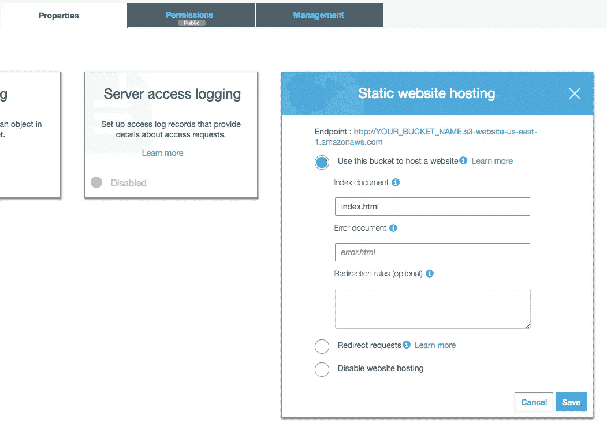
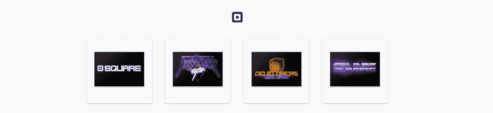

# 超级简单的无服务器电子商务

> 原文：<https://medium.com/square-corner-blog/super-simple-serverless-ecommerce-68d2792e8285?source=collection_archive---------2----------------------->

> 注意，我们已经行动了！如果您想继续了解 Square 的最新技术内容，请访问我们的新家[https://developer.squareup.com/blog](https://developer.squareup.com/blog)

许多公司已经投入使用[无服务器](https://en.wikipedia.org/wiki/Serverless_computing)来增强他们的技术堆栈(例如[诺德斯特龙](https://read.acloud.guru/serverless-event-sourcing-at-nordstrom-ea69bd8fb7cc)、[网飞](/netflix-techblog/developer-experience-lessons-operating-a-serverless-like-platform-at-netflix-a8bbd5b899a0)和[可口可乐](https://aws.amazon.com/serverless/videos/video-lambda-coca-cola/))。看起来无服务器只是一种日益增长的时尚，但这也是许多人对 Node 的想法，直到沃尔玛在黑色星期五之前推出了一个新网站。对于无服务器来说，我们可能正在接近一个类似的拐点，以快速提高 Node 已经能够实现的开发速度和规模。

如果您还没有加入无服务器潮流，现在正是时候。我们将通过一个简单的方法来创建无服务器功能，以允许客户立即结帐并从 Square 商店购买商品。我们将在 S3 上创建一个静态站点，创建 AWS Lambda 函数，并创建 AWS API 网关端点，以允许客户使用 Square Checkout API 即时结账。

> 有必要澄清一下[无服务器框架](https://serverless.com/)和[无服务器计算](https://en.wikipedia.org/wiki/Serverless_computing)之间的区别。无服务器框架只是一个工具，可用于帮助创建、部署和管理您与您想要的云提供商一起创建的无服务器功能。无服务器计算是指云提供商动态管理机器资源的分配。

在这篇文章中，我们将使用无服务器框架来更容易地创建和部署我们的功能，但我们不希望它与无服务器计算相混淆。我们将在未来的帖子中探索不同的平台和不同的工具，因为我们将在这里讨论的概念上进行构建。

建造这个需要的东西:

*   [Square 开发者账号](https://squareup.com/developers)
*   [AWS 账户](https://aws.amazon.com/)
*   [无服务器架构](https://serverless.com/)

## 使用 S3 的静态站点

我们的小商店的基本结构将是一个静态的 HTML 页面，托管在 S3 上，用 CSS 和 JavaScript 装饰。然后，我们将通过 Lambda 函数处理我们的结账，该函数允许您只购买您点击的一件商品。这是为了说明如何在 AWS 上启动和运行的超级基础——我们可以在未来的帖子中探索更高级的方法。我们将从 HTML 开始，并把它引入 S3 来创建我们的静态网站。

We’re just hard coding our item variant ID into a hidden input field to POST to our function.

通过查看产品 div 元素来了解我们的`index.html`的内容。我们将项目的[变量 id](https://docs.connect.squareup.com/api/connect/v2#endpoint-retrievecatalogobject) 硬编码到每个 div 中，并将其填充到一个隐藏的输入字段中。这将让我们很容易通过 POST 请求将它传递给我们的 Lambda 函数。我采用这种方法的主要原因完全在于它的简单性。我们不需要编写任何 JavaScript 来处理信息传递——我们可以使用表单元素的本机行为将我们的项目信息发送到我们的函数中。

如果我们放入 12 种产品，我们会得到类似于下面的结果:

The inner product tags have been removed to make this easier to read.

我们将跳过用于创建模态的样式和 jQuery，因为这不是这里的重点。我们所要做的就是将我们所有的文件上传到 S3，并启用属性中的“静态网站托管”来拥有一个可公开访问的网站。

现在我们应该有一个漂亮的页面让每个人都能看到我们的产品，但我们需要有一种方法让每个人都能购买这些产品。现在我们终于开始深入创建我们的 AWS Lambda 函数(无服务器函数)。这就是我们将要创建的放在表单“action”属性中的内容，这样我们的表单就可以发送到我们的函数中。



I should hope its clear you have your own bucket name for the URL.

通过访问 AWS 提供的 URL，您应该能够访问您的静态网站，并且您可以看到所有展出的精彩项目。

## 使用 AWS Lambda 的无服务器功能

对于我们的无服务器功能，我们将处理 Square [catalog variant ID](https://docs.connect.squareup.com/api/connect/v2#endpoint-retrievecatalogobject) ，它是从我们静态站点中的表单发送的，然后创建一个 checkout URL 来重定向我们的用户。为此，我们将在函数中使用 Square 的 [JavaScript SDK](https://github.com/square/connect-javascript-sdk) 来更容易地生成我们需要的 URL。非常欢迎您尝试使用*和* AWS 工具来创建和部署功能，但是我们将只使用[无服务器](https://serverless.com/)来管理功能的部署并将其链接到 AWS API 网关。

如果你也想使用无服务器来创建你自己的功能，这里有很棒的教程。您需要在您的机器上安装 Node 并使用`npm install -g serverless`安装 serverless(或者如果您不想全局安装它，就使用`[npx](/@maybekatz/introducing-npx-an-npm-package-runner-55f7d4bd282b)`)。

你可以运行`serverless create --template aws-nodejs`来得到一个模板，但是它创建了很多不需要的东西。你可以随意复制`handler.js`和`serverless.yml`来修改成你自己的模板。我们将从一个基本功能开始，测试我们的部署是否按预期工作，然后为我们的检查添加功能。

这只是我们要测试的例子。接下来，我们想要创建我们的`serverless.yml`文件，用于部署我们的功能和创建 AWS API 网关端点。

There are probably more elegant ways of handling your credentials if you don’t want them in your file.

现在，只需运行`serverless deploy`就可以将我们的功能发布到云中。部署时，您应该会看到类似下面的内容:

```
Serverless: Packaging service...
Serverless: Excluding development dependencies...
Serverless: Uploading CloudFormation file to S3...
Serverless: Uploading artifacts...
Serverless: Uploading service .zip file to S3 (742.81 KB)...
Serverless: Validating template...
Serverless: Updating Stack...
Serverless: Checking Stack update progress...
..............
Serverless: Stack update finished...
Service Information
service: serverless-checkout
stage: prod
region: us-east-1
stack: serverless-checkout-prod
api keys:
  None
endpoints:
  ANY - https://UNIQUE_ID.execute-api.us-east-1.amazonaws.com/prod/checkout
functions:
  checkout: serverless-checkout-prod-checkout
Serverless: Removing old service versions...
```

您应该能够在浏览器中访问无服务器退出控制台的 URL，并在浏览器中找到我们的消息`“Success! Our function is running!”`。我们只需要重构 Lambda 函数来处理目录变量 ID，以便请求我们的 checkout URL 并重定向用户。

Note that our credentials are pulled in from “`process.env”`, which can be set in the AWS console as environment variables.

在这里，我们有我们的全功能(双关语)Lambda 函数，可以创建结帐 URL，让用户购买我们的产品。

同样，值得提醒的是，这是故意最小化的实现，仅适用于像数字商品(不需要纳税)这样的东西，但演示了创建您的结账和重定向客户是多么容易，而无需启动我们自己的服务器。事实上，如果您要将目录变量 ID 作为查询字符串参数附加到函数 URL 中，您可以在函数中解析出这些内容，从而拥有自己的无服务器“立即购买”链接。此外，您可以添加一个运费项目，以轻松处理统一运费，甚至在收银台捕捉客户的运费细节(请参见[此处](https://docs.connect.squareup.com/payments/checkout/overview#create-the-post-request)了解更多详情)。



A preview of our eCommerce store. Those are our stickers we give away at developer conferences.

## 无服务器误解

关于无服务器计算及其组成，似乎存在广泛的误解。是按调用付费吗？按内存 Mb/s 付费？就像 Node 一样，serverless 也有点渴望“做所有的事情”没错，这是一项需要探索的新技术，但是出现了许多奇怪的用法，它们被视为反模式(在我看来)。Node 过去和现在都因其单线程特性而在处理 CPU 密集型任务方面表现不佳，对于使用无服务器进行面向用户的交互或 API 也是如此。用户期望事情有响应，冷启动扼杀了预期的响应。您当然可以尝试通过保持函数温暖来解决这个问题，但这听起来像是一种反模式。无服务器的全部好处是不必担心您的基础设施，然而人们正在编写更多的代码来修改他们实际上无法控制的基础设施的行为。

如果您计划将无服务器应用于面向用户的应用程序，请仔细查看您的终端用户流量模式，因为这将严重影响整体用户体验。恒定的流量相对来说没什么问题——功能会保持温暖，很少一部分用户会受到缓慢响应的影响——但如果你的流量特别大，用户体验就会受到影响，因为你的平台提供商[正在增加你的功能的额外实例](https://theburningmonk.com/2018/01/im-afraid-youre-thinking-about-aws-lambda-cold-starts-all-wrong/)来服务你的流量。

随着技术的不断成熟，使用无服务器计算有许多可能性可以探索，并且随着时间的推移，今天的问题将会减少。现在开始的真正原因是，你可以对未来所有新的无服务器采用者居高临下，告诉他们无服务器编程在你那个时代有多难。因此，现在就开始构建无服务器系统吧！

要跟进这篇文章，你需要[注册一个 Square 开发者账户](https://squareup.com/developers)。即使你不想跟进，也要注册，这是免费的！

*想要更多吗？* [*注册*](https://www.workwithsquare.com/developer-newsletter.html?channel=Online%20Social&sqmethod=Blog) *获取我们每月的开发者简讯。*