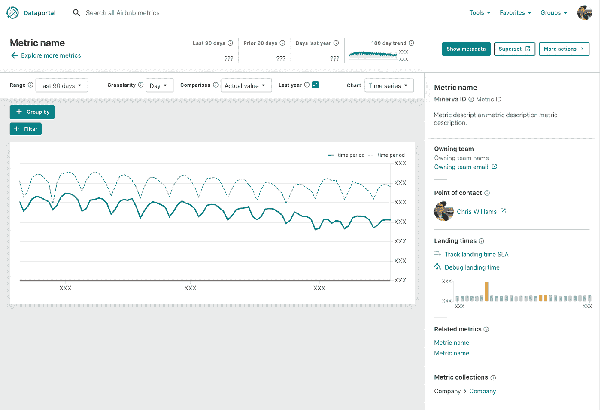

# 增压阿帕奇超集

> 原文：<https://medium.com/airbnb-engineering/supercharging-apache-superset-b1a2393278bd?source=collection_archive---------0----------------------->

## Airbnb 如何大规模定制商业智能的超集

作者:[埃里克·里特](https://github.com/etr2460)、[格雷斯·郭](https://github.com/graceguo-supercat)、[杰西·杨](/@ktmud)、[约翰·博德利](https://github.com/john-bodley)和[祖扎娜·韦杰拉兹科娃](https://www.linkedin.com/in/zuzanavejrazkova/)

# 介绍

在 Airbnb，很多员工每天都要依靠数据来完成工作。虽然有几种不同的工具用于分析，但 Airbnb 自助商业智能(BI)解决方案的核心是[Apache Superset](https://superset.apache.org/)(“Superset”)。

Superset 是一个开放源代码的数据探索和可视化平台，设计为可视化、直观和交互式的。它使用户能够使用其 SQL 编辑器分析数据，并轻松构建图表和仪表板。它于 2015 年在 Airbnb 作为黑客马拉松项目开始，于 2016 年开源，并于 2017 年 5 月加入 Apache 孵化器计划。在 Apache 孵化了近四年之后，2021 年 1 月 21 日，Apache 软件基金会[宣布](https://blogs.apache.org/foundation/entry/the-apache-software-foundation-announces70) Superset 为顶级项目。这与第一个主要版本[超集 1.0](https://github.com/apache/superset/tree/master/RELEASING/release-notes-1-0) 的正式发布相吻合，也是该项目的一个转折点。

随着 Superset 的发展，Airbnb 一直是该项目的持续贡献者。过去，我们讨论了[这一旅程是如何开始的](/airbnb-engineering/caravel-airbnb-s-data-exploration-platform-15a72aa610e5)和[新产品功能的引入](/airbnb-engineering/superset-scaling-data-access-and-visual-insights-at-airbnb-3ce3e9b88a7f)。这篇文章将涵盖高级技术细节，介绍我们如何将 Superset 扩展为支持企业用例的成熟 BI 工具，以及如何与社区合作，使我们能够构建与其他企业工具和系统的定制集成。

# 系统地

作为运行时间最长的超集环境，Airbnb 在过去五年中一直与开源贡献者密切合作，以建立一个与公司一起扩展和增长的产品。这最终形成了支持数量惊人的数据驱动智能的能力。Airbnb 的 Superset 每周处理大约:

*   2000 名用户
*   50，000 次 SQL 实验室查询
*   分别有 6，000 和 125，000 个仪表板和图表视图

*视图被定义为唯一的(日、用户、实体)元组，图表视图包含仪表板和浏览器界面。*

我们的生态系统现在由超过 100，000 个表和虚拟数据集组成，支持超过 200，000 个图表和 14，000 个仪表板。

所有这些分析、切片和决策都是由 Airbnb 的用户在许多工作职能中完成的；超过 25%的公司每周使用 Superset。

# 我们如何扩展超集

为了支持 Airbnb 的规模，我们在 Superset 及其周围构建了几个自定义功能。这些配置选项、日常离线作业和仓库优化是扩展超集的关键。

## 缓存预热作业

在 Airbnb 每天查看的所有仪表盘中，90%被查看了不止一次。这一点，再加上目前大多数新数据每天只通过我们的 ETL(提取、转换、加载)作业登陆一次，意味着每天缓存仪表板图表的结果可以显著提高大多数用户的性能。使用 [Apache Airflow](https://airflow.apache.org/) ，我们实施了一个有效的离线缓存预热策略，重点预热最近查看的仪表板，从而使 Presto 支持的图表的缓存命中率达到 86%。由于超集本身支持在 Redis *中缓存图表请求，因此我们能够在非工作时间以编程方式加载流行的仪表板，从而在高峰时间减少我们的查询引擎 Presto 和 [Apache Druid](https://druid.apache.org/) 的负载。这将缓存图表的加载时间从未缓存时的 30 多秒缩短到了 4 秒以下。

## 域分片

在超集中加载仪表板时，仪表板上每个可见图表的单个请求会被并发触发。虽然这在请求很快且仪表板很小的情况下是可行的，但是对于包含许多图表的仪表板，我们很快就会遇到浏览器设置的问题。大多数现代浏览器将对单个域(即超集 API)的并发请求数量限制为六个，这导致了一个瓶颈，降低了大型仪表板的速度。为了解决这个问题，我们构建了[SUPERSET _ web server _ DOMAINS](https://github.com/apache/superset/blob/1.0.0/superset/config.py#L449-L454)配置选项。通过设置此选项，管理员可以允许他们的数据库引擎能够支持的尽可能多的并发仪表板查询(可能需要有效的缓存来确保引擎不会过载)。我们将四个不同的子域路由到我们的 web 服务器，在一个仪表板上支持多达 24 个并发查询。该功能是允许用户构建复杂仪表板和提高性能的关键。

## 数据库引擎负载管理

虽然超集允许大量的本机优化，但一些性能和稳定性改进只能在数据库引擎级别完成。由于复杂的业务需求和我们数据集的规模，许多仪表板触发的查询平均需要 25 秒来执行。因此，我们采取了以下步骤来确保我们的数据库引擎集群不会过载:

*   **基于重要性路由查询:**我们将查询路由到不同的集群(使用 [DB_CONNECTION_MUTATOR](https://github.com/apache/superset/blob/1.0.0/superset/config.py#L836-L851) 配置)以避免资源争用；优化的仪表板查询被发送到一个集群，而临时 SQL Lab 和 explore 查询被发送到另一个集群。
*   **限制每个用户的并发性:**我们限制每个用户在我们的数据库引擎上只能同时运行三个查询。虽然这看起来是一个小数字，但考虑到前面提到的缓存预热工作，这实际上已经足够了。在理想情况下，很少有查询真正到达我们的数据库引擎，缓存有效地返回结果，而不是重新运行查询。
*   **限制大型查询:**我们将可以运行的查询的大小限制在特定的内存大小或分区数量。这鼓励用户创建合理复杂度的高效查询。

# 超集真正闪耀的地方

作为 BI 解决方案，Superset 能够满足我们的大多数需求，尽管市场上也有许多类似的产品。我们继续使用和投资超集有很多原因——熟悉度、内容、迁移成本等。—但是超集真正让我们眼前一亮的地方是它是开源的。这使得 Airbnb 能够实现许多高级定制功能，而这些功能在商业产品中很难实现。

作为 Apache 超集项目的积极贡献者，我们能够通过以下方式调整超集以满足我们的业务需求:

*   帮助定义开源路线图
*   提议和实现开源特性
*   创建自定义的内部覆盖或变化。超集后端是用 Python 编写的，它支持通过 monkey 补丁进行简单的扩充和定制。

在评估是构建内部解决方案还是购买现成的东西时，人们会面临 80/20 难题。现成的解决方案可能会满足您 80%的需求，但最后的 20%可能会充满不可逾越的挑战。虽然 Superset 目前缺少其他 SaaS 解决方案提供的一些功能和修饰，但它通过提供潜在的定制级别，弥补了这些不足。

以下是 Airbnb 利用或增强 Superset 的几个项目，通过简化或丰富用户体验来增强用户体验。

## 度量浏览器

Metric Explorer 是[数据门户](/airbnb-engineering/democratizing-data-at-airbnb-852d76c51770) (Airbnb 的搜索和发现工具)的一个组件，可以为 Airbnb 的团队提供开箱即用的数据探索。我们的目标是让任何人都能够轻松、安全地探索经过策划的业务指标，这是由 [Minerva](/airbnb-engineering/how-airbnb-achieved-metric-consistency-at-scale-f23cc53dea70) 框架提供的，针对典型的报告期—过去 7 天、前一周等。

在设计 Metric Explorer 时，我们面临着一个两难的境地。我们希望为切片和切块指标提供高度策划和审查的体验，利用丰富的元数据和浮现的业务上下文，同时提供足够的防护。然而，我们不想构建另一个仪表板工具，也不想重新实现 Superset 的大部分功能。

我们决定通过将超集可视化的前端基础分解到[@超集-ui](https://github.com/apache-superset/superset-ui) NPM 包中来解决这个难题。这不仅解决了 Metric Explorer 用例，还支持任何超集安装来构建利用超集后端的其他定制数据应用程序。图 1 和图 2 是 Metric Explorer 屏幕截图，展示了超集集成。

**Figure 1:** Metric Explorer illustrating a collection of metrics powered by @superset-ui.

**Figure 2:** Metric Explorer illustrating a single metric where the header and left hand panel are powered by @superset-ui. Purposefully, Metric Explorer has limited slice-and-dice functionality, thus a link to Superset is also provided for more advanced analytics.

## 安全管理器和数据访问策略集成

尽管 Superset 附带了默认的安全管理器，但是 Airbnb 的数据规模和我们数据访问政策的复杂性需要一个定制的实现。限制是在基础表或指标级别定义的，而不是在超集实体(图表、仪表板等)级别定义的。

我们通过 [CUSTOM_SECURITY_MANAGER](https://github.com/apache/superset/blob/1.0.0/superset/config.py#L145) 配置选项以及一些 RESTful API 和 Flask-AppBuilder 覆盖来利用超集的自定义安全管理器功能。使用这种方法，我们能够无缝集成 Superset，以遵守 Airbnb 内部安全控制器强制执行的数据访问策略。

我们希望通过在超集中直接集成访问请求流来进一步丰富用户体验。这是通过添加前端定制以及定制安全管理器实现的，每当我们检测到*先验*(即，在实际查询运行之前)用户没有访问底层数据的相关权限时，定制安全管理器会通过流程提示用户。图 3–5 展示了超集内的数据访问策略集成。

通过在适当的位置显示访问请求，而不是让用户破译神秘的数据库错误或将它们定向到其他地方，我们能够保留用户流，同时为批准者提供关于请求的必要上下文。这种深度集成的体验很可能很难用其他可定制性较差的工具来提供。

**Figure 3:** A user is denied access if they do not have the relevant permissions to access either a datasource or a metric. Access can be requested in place (Figure 4).

**Figure 4:** The modal for requesting access to a restricted datasource or metric. In addition to being provided a reason, the approvers are also informed of the context for the request — i.e., which chart or dashboard the user is trying to access.

**Figure 5:** If the user is denied access but has a pending request the state of the request (which may require multiple approvers) is shown.

## 大众的衡量标准

如前所述，Airbnb 开发了内部 [Minerva metric framework](/airbnb-engineering/how-airbnb-achieved-metric-consistency-at-scale-f23cc53dea70) 。可以通过 Minerva API 在超集中查询数据，Minerva API 是一个以指标为中心、伪数据源无关的 SQL 数据库，由 Apache Druid 集群提供支持。为了帮助发现和增强用户体验，所有指标和维度都定义在一个不可变的虚拟超集数据源中，并带有预定义的指标表达式。因为我们的内部安全控制器支持度量级别的许可，所以从访问控制的角度来看，数据源仍然是起作用的。

这个单一的数据源现在包含了数千个指标和维度。由于大多数度量标准和维度通常都是针对产品或项目的，因此绝大多数度量标准和维度的组合都是不可行的。

为了避免用户意外选择了不可行的度量和维度组合，我们对超集的图表控件做了开源贡献，引入了一个钩子来基于用户输入异步更新控件属性。这允许我们根据用户的选择过滤掉无效的指标和维度。图 6 和图 7 展示了这种行为。

**Figure 6:** The Superset query panel and metric popover for the Minerva virtual datasource containing an immense number of metrics and dimensions. Given the vastness of the datasource, most metric-dimension combinations would be invalid without adding custom logic to determine the feasible subset (Figure 7). Numbers are shown for illustrative purposes only.

**Figure 7:** The Superset query panel. By selecting the *bookings* metric, the viable set of dimensions has reduced from 1,000 to 100\. Furthermore, by grouping by the *dim_origin_city* dimension, the viable set of dimensions further reduced to around 50 because the increased specificity had reduced the set of feasible Apache Druid datasources. Numbers are shown for illustrative purposes only.

传统的 BI 工具可能无法处理这种规模的数据，或者会导致严重的可用性问题，因为用户不清楚哪些维度适用于特定指标集的筛选或分组。

# 结论

从上面的例子可以看出，在过去的五年里，我们 Airbnb 在 Superset 上进行了大量投资。我们投入的时间和精力使我们能够创建一个 BI 生态系统，使任何员工都能够以数据知情的方式自助提供他们执行工作所需的分析。Superset 的配置和定制功能，以及通过开源构建产品路线图的能力，为 Superset 在未来几年保持相关性提供了一个稳定的基础。

在这篇文章中，我们重点介绍了我们如何为 Airbnb 的大规模需求开发 Superset，但其他公司也以不同的方式利用了 Superset。您可以在这里了解其中的一些内容:

*   **Dropbox:** [为什么我们选择 Apache Superset 作为我们的数据探索平台](https://dropbox.tech/application/why-we-chose-apache-superset-as-our-data-exploration-platform)
*   **尼尔森:** [尼尔森如何使用 Apache 超集扩展数据分析访问](https://preset.io/blog/2020-08-11-nielsen-superset/)
*   **预置:** [阿帕奇超集 1.0 出来了！](https://preset.io/blog/2021-01-18-superset-1-0/)

# 感谢

感谢所有为这篇博文做出贡献的人，特别是[克里斯·威廉姆斯](/@ccardwilliams)、[古斯塔沃·托里斯](https://github.com/gustavoatt)、[李金阳](https://www.linkedin.com/in/jinyang-li-607690143/)、[克里斯特·旺苏巴斯瓦特](https://twitter.com/kristw)、[米歇尔·托马斯](https://github.com/michellethomas)、[塞丽娜·江](https://github.com/serenajiang)和[西尔维亚·富山](https://twitter.com/SylviaTomiyama)。

Apache Superset、Apache Druid、Apache Airflow、Superset、Druid、Airflow、Apache 和 Apache Superset 徽标是 Apache Software Foundation 在美国和其他国家的注册商标或商标。

* Redis 是 Redis Labs Ltd .的商标。Redis Labs Ltd .保留其中的任何权利。Airbnb 的任何使用仅供参考，并不表明 Redis 和 Airbnb 之间有任何赞助、认可或从属关系。

所有商标、服务标志、公司名称和产品名称都是其各自所有者的财产。这些的任何使用仅用于识别目的，并不意味着赞助和认可。