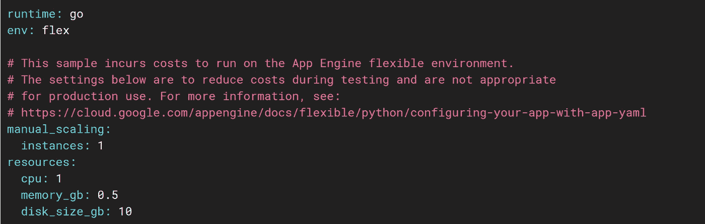

# 优化您的应用引擎实例以实现最大吞吐量

> 原文：<https://medium.com/google-developer-experts/supercharging-your-app-engine-instances-a8b2ea97e04e?source=collection_archive---------2----------------------->

在构建一个能够扩展以处理大规模数据事件的后端时，[负载平衡](https://en.wikipedia.org/wiki/Load_balancing_(computing))是开发人员经常想到的第一件事。
虽然它允许你将进入的流量分流到你的服务器的不同实例；实现负载平衡器通常很耗时，并且可能需要严格的测试来确保它按预期工作。

令人欣慰的是，谷歌云允许开发者使用[应用引擎](https://cloud.google.com/appengine/)，这是同一基础设施的托管版本，消除了与内部设置相关的所有麻烦和麻烦。

凭借每月 99.00% - 99.95%的正常运行时间保证和按需付费的定价模式，这意味着您只需为您的应用程序使用的 CPU 和 RAM 付费，这使得 App Engine 成为云开发人员的诱人选择。

App Engine 的一个关键特性是其独特的自动缩放算法，该算法根据 CPU 负载、网络流量和某些其他因素来增加或减少活动实例的数量。

然而，一旦您开始使用默认设置的 App Engine，您可能会注意到它所提供的吞吐量充其量是中等水平。
我们在[**roobits.com**](https://roobits.com/)为我们的产品部署的单个 App Engine 实例在升级到更多实例之前，每秒只能**处理 300 个请求**。

相比之下，在具有相同配置的单个本地机器上测试相同的设置能够为我们提供每秒 900 多个请求。

在深入研究这个问题的原因时，我们偶然发现了罪魁祸首，它是在`**app.yaml**`文件中指定的默认配置；其中包含 CPU 内核、RAM、磁盘大小等规格。为您的应用引擎实例。

默认情况下，您在谷歌快速入门上找到的`**app.yaml**`只指导几个参数，如下图所示:

虽然这是测试 MVP 想法的好方法，但是当你构建这个东西来衡量每一美元花费的重要性时，这个解决方案可能不是很有效。
我们遇到了这种情况，在这篇博客中，我将分享一些技巧，这些技巧可能会帮助您提高 App Engine 提供的吞吐量，从而同时节省一些费用。

> *感谢阅读本博客，如果你正在一家高成长公司工作，并且正在寻找一个* ***大规模实时数据采集平台****；看一看*[*https://roobits.com/*](https://roobits.com/)*。
> 我们可能就是你要找的人！*

# 调整自动缩放参数:

App Engine 自带选项来修改其`**app.yaml**`文件中的自动缩放算法。

默认情况下，yaml 只指定应用程序引擎应该扩展到的最小和最大实例数。
虽然这是一件好事，但还有一个名为`**target_utilization**`的参数，默认情况下不包含该参数，默认值为 0.5
，这意味着一旦您的应用引擎实例用完了 50%的 CPU，一个新的实例将会启动。

在我们的用例中，这是非常激进的，所以我们将默认值增加到 0.9，并最终将衍生实例的数量从 14 个减少到 9 个，这实质上是总成本减少了**40%**！

你可以查看`[**app.yaml**](https://cloud.google.com/appengine/docs/flexible/python/reference/app-yaml#automatic_scaling)` [参考文献](https://cloud.google.com/appengine/docs/flexible/python/reference/app-yaml#automatic_scaling)了解更多关于这个调整的细节。

# 从小实例开始:

app.yaml 文件中的`**resources**` 块允许您指定机器中内核和 RAM 的数量。

虽然您可能倾向于从 4 核和 4GB ram 的机器开始，但是不要这样做！相反，从较低的机器(1 个核心 CPU 和 1 GB RAM)开始，增加应用程序引擎应该产生的最小实例。

这将确保您的实例不会产生比所需更多的 CPU 和 RAM。

例如，假设具有 1 个内核和 1 GB ram 的单个实例可以处理 300 RPS 的网络负载。所以一台 4 核 4 GB 内存的机器理论上可以处理 1200 RPS。

如果我的应用程序收到 1500 RPS 的负载，**前一个设置将使用 5 个内核和 5GB 内存**，而**后一个设置将使用 8 个内核和 8 GB 内存。**

由于 App Engine 会根据每小时使用的内核和 RAM 数量向您收费，因此您可以**通过在较低的机器上使用前一种设置来节省高达 40%的成本**！

# 降低健康检查的频率:

默认情况下，App Engine 通过 pinging 您的实例来执行健康检查，以确保它们正常工作。
如果一个实例没有对这些健康检查返回 200 响应，则该实例被视为不健康并重新启动。

虽然这些对于确保您的实例正常运行是必要的，但默认情况下，AppEngine 每秒钟执行多次这些健康检查(在我们的用例中，App Engine 实例每秒钟接收多达 20 次检查)！

这可能会影响应用程序引擎实例每秒可以处理的请求，从而导致产生更多的实例。

虽然强烈建议不要禁用运行状况检查，但您可以降低其频率，以确保它们每 10-15 秒检查一次您的实例。

您可以查看`**app.yaml**` [参考指南](https://cloud.google.com/appengine/docs/flexible/python/reference/app-yaml#updated_health_checks)了解如何操作。

通过降低运行状况检查的频率，我们能够将产生的实例数量减少 1 个，从而每月节省 1 个实例的成本！

就是这样！

**仅仅通过调整这三个关键参数，我们就成功削减了超过 30–50%的成本**。
虽然这里提到的技巧是针对我们在[**【https://roobits.com/**](https://roobits.com/)的用例的，但我相信你也能找到一些对你自己的用例有用的技巧！

*感谢阅读！如果你喜欢这个故事，请点击**👏 ***按钮*** ***并分享*** *帮助别人找到它！欢迎随时发表评论*💬*下图。**

**有反馈吗？下面我们来连线推特上的***。***