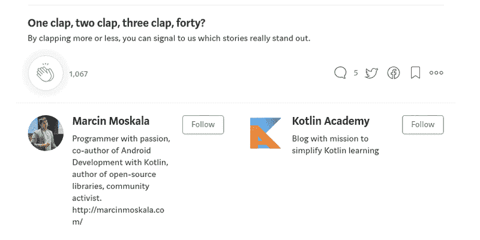

# 科特林代表团的超级大国

> 原文：<https://blog.kotlin-academy.com/superpowers-of-kotlin-delegation-e6bd9ff8026c?source=collection_archive---------6----------------------->

我被要求在 2017 年 9 月举行的俄罗斯热门会议 DevFest Siberia 上介绍 Kotlin 的高级功能。我准备了一份关于我的巨大热情——阶级和财产代表团的报告。我以这个故事开始，说明为什么这个主题对我如此重要，然后我描述了从基础到高级自定义属性委托的整个主题。40 分钟内的一切！我刚刚得到消息，这个演示终于在 YouTube 上:D 享受；)

您还可以通过转录来查看幻灯片，可从 my Slides.com 获得:

 [## 西伯利亚发展节:科特林代表团的超级力量

### 委托是科特林最不显眼的特征之一。属性委托仍然是……

slides.com](http://slides.com/marcinmoskala/superpowers-of-kotlin-delegation-3-3) 

老实说，我真的为这次演讲感到骄傲，因为这是我第一次在如此大规模的会议上表演。我真的很兴奋，因为这个演示是在最大的舞台上，在真正好的时间(这是当时唯一的英语演示)。为了做到最好，我疯狂地练习这种材料——一遍又一遍。效果是完全值得的——除了紧张的开始，我按照我的计划展示了一切。享受:)

如果你喜欢，可以和其他程序员分享。

# 链接

*   [KotlinAndroidViewBinding 库](https://github.com/MarcinMoskala/KotlinAndroidViewBindings)
*   [优先持有者库](https://github.com/MarcinMoskala/PreferenceHolder)
*   [KotlinPreferences 库](https://github.com/MarcinMoskala/KotlinPreferences)

# 关于作者

[Marcin moska za](http://marcinmoskala.com/)([@ Marcin moskala](https://twitter.com/marcinmoskala))是一名培训师和顾问，目前专注于在 Android 和高级 Kotlin 工作坊中给予**kot Lin([填写表格](https://marcinmoskala.typeform.com/to/iwKnN9)，这样我们可以谈谈你的需求)。他还是一名演讲者，撰写了关于 kot Lin Android 开发的文章和书籍。**

## 学到了什么？单击👏说“谢谢！”并帮助他人找到这篇文章。

你需要 Kotlin 工作室吗？请访问我们的网站,看看我们能为您做些什么。

了解卡帕头最新的重大新闻。学院、[订阅时事通讯](https://kotlin-academy.us17.list-manage.com/subscribe?u=5d3a48e1893758cb5be5c2919&id=d2ba84960a)、[观察 Twitter](https://twitter.com/kot_academy) 并在 medium 上关注我们。

在 Twitter 上引用我，用 [@MarcinMoskala](https://twitter.com/marcinmoskala) 。使用以下链接订阅时事通讯:

喜欢的话记得**拍**。请注意，如果您按住鼓掌按钮，您可以留下更多的掌声。

