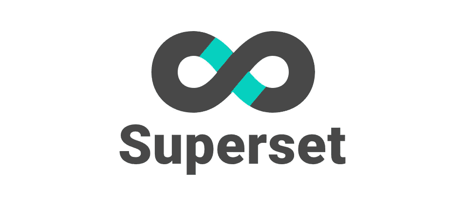
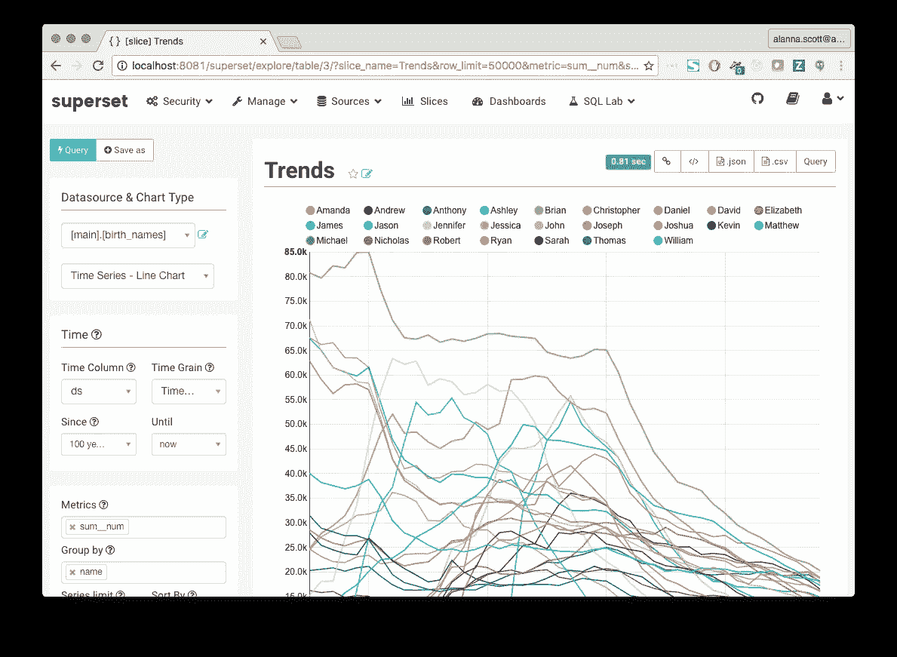
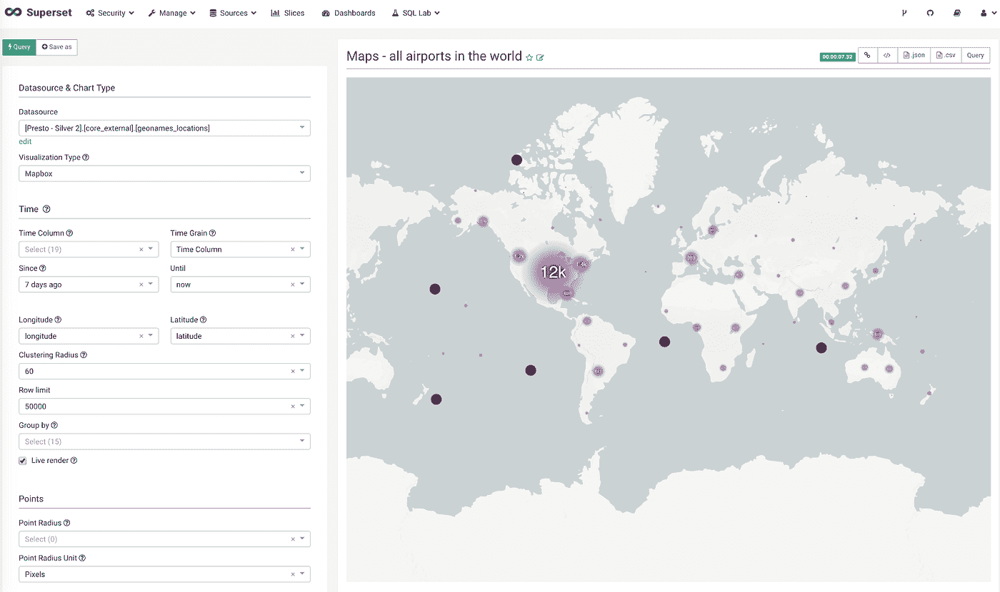
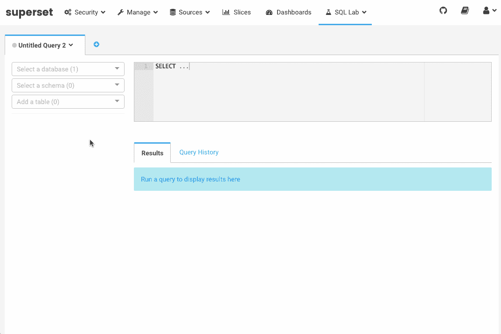

# 超集:在 Airbnb 扩展数据访问和视觉洞察

> 原文：<https://medium.com/airbnb-engineering/superset-scaling-data-access-and-visual-insights-at-airbnb-3ce3e9b88a7f?source=collection_archive---------1----------------------->

由[岚娜·斯科特](https://twitter.com/alannascott)、[波格丹一世·基里柳克](https://github.com/bkyryliuk)、[伊莱·布伦博](https://twitter.com/elibrumbaugh)、[杰夫·冯](https://twitter.com/jtfeng)、[马克斯·博彻明](https://github.com/mistercrunch)和[薇拉·刘](https://github.com/vera-liu)

# **简介**

在 Airbnb，我们的一个基本信念是数据访问应该民主化，以赋予每个员工权力，从而做出**基于数据的**决策。我们相信，基于数据的定量洞察和定性洞察(如面对面的用户研究)的决策会产生最佳的商业决策。这适用于组织的所有部分，无论是决定推出新产品功能还是分析如何提供最佳员工体验。

伴随数据民主而来的挑战之一是支持不同数据素养水平的用户访问数据。我们的许多用户都非常擅长编写 SQL，尤其是我们的数据科学、工程和业务运营团队中的用户。编写 SQL 的能力为从 Hadoop 中的数据仓库访问数据提供了极大的灵活性。然而，在我们为每个数据用户提供支持的愿景中，SQL 常常是一个过高的障碍。其次，一旦用户访问了数据，他们就面临着探索和发现见解的挑战。我们对这两个挑战的解决方案是开发[超集](https://github.com/airbnb/superset)。

# **解决方案:超集**

超集是一个数据探索和可视化平台，旨在可视化，直观和互动。它由两个主要界面组成:

1.  丰富的 SQL IDE (交互式开发环境)支持快速灵活的数据访问
2.  **数据探索界面**将数据表转换成丰富的视觉洞察

这两种接口的结合使用户能够以多种方式使用数据。用户可以直接可视化各种数据库中存储的表中的数据，包括 Presto、Hive、Impala、Spark SQL、MySQL、Postgres、Oracle、Redshift 和 SQL Server。与 [Druid](http://druid.io/) 的连接扩展了 Superset 可视化数十亿行数据的能力，这要归功于其内存中面向列的分布式架构。通过添加 SQL IDE，它为高级用户提供了编写 SQL 查询的能力，以重新构建或减少数据或跨表联合数据的大小。此外，用户可以使用超集的可视化流程立即可视化他们的查询结果。

我们首先[在 2016 年 3 月推出了 Superset 的数据探索接口](/airbnb-engineering/caravel-airbnb-s-data-exploration-platform-15a72aa610e5#.l6h0121ny)，作为用户对任何数据集执行快速直观的“切片和切块”的一种方式。从那以后，我们增加了许多主要的新功能，包括:

*   **地图和地理支持**利用[地图框](https://www.mapbox.com/)
*   **用户资料页面**，突出显示用户喜爱的仪表板/切片、创建的内容和最近的活动
*   **新的安全权限**加上“请求访问”仪表板视图的能力
*   完全**改进的设计**，用户界面/UX 和主题
*   **新的名称和标志！**我们将项目名称从 Caravel 更改为 Superset。我们被超集这个名字所吸引，因为它暗指多个数据集和数据集，同时允许用户以多种方式消费数据

Superset maps visualization leveraging Mapbox

# **超集 SQL 实验室简介**

今天，我们宣布引入“SQL Lab”，这是超集中新的 SQL IDE。将 SQL Lab 集成到超集中是有利的，因为它将任意 SQL 的流程连接到数据可视化、仪表板和知识共享。将 SQL IDE 和 Data Exploration 接口集成在一起还有一个好处，就是可以在一个工具中管理身份验证、角色和权限。SQL Lab 作为超集的一部分，使我们能够为超集支持的所有数据库提供后端查询支持(除了不是基于 SQL 的 Druid)。

See SQL Lab in action

SQL Lab 打包了许多强大的特性，包括(完整列表请参见[超集文档](http://airbnb.io/superset/)):

*   多个选项卡作为不同的工作区
*   每个标签的查询历史，使人们能够迭代不同的查询
*   表和列元数据浏览，在创作查询时提供参考
*   查看和搜索您的查询结果
*   使用超集的可视化流程从任意 SQL 创建丰富可视化的工作流
*   支持长时间运行的后台 sql 语句，如“创建表为”
*   运行大多数数据库后端，包括 Presto、Hive、Impala、Spark SQL、MySQL、Postgres、Oracle、Redshift 和 SQL Server
*   SQL 查询搜索引擎——这使用户能够查找任何内容，从任何用户的历史查询到查看谁查询了您创建的表
*   在 SQL 中支持 [Jinja 模板](http://jinja.pocoo.org/)语法，允许参数化查询元素和[调用宏](http://airbnb.io/superset/sqllab.html#available-macros)
*   对 Presto 的高级支持:显示进度条，显示分区字段周围的额外元数据和最新的分区值

计算密集型、长时间运行的查询在数据的“Pb 时代”很常见，SQL Lab 旨在为此用例提供一个良好的工作流。对于有异步后端可用的部署，SQL Lab 将自动默认异步运行查询以支持大型查询。此外，借助 Create Table As (CTAS)功能，SQL Lab 允许用户将查询结果存储在新创建的表中。有了这个表，用户就可以查询和可视化刚刚创建的汇总表中的数据。

SQL Lab 还可以轻松管理一组员工对任何内部数据库的访问。管理员可以使用简单的流程向超集添加新的数据库，同时通过角色向用户授予权限。用户可以被授予每个数据库连接的访问权限，以及每个表的访问权限。在应用按表访问的情况下，超集会检查查询并识别 SQL 中引用的表。

# **下一步是什么？**

Superset 最初是一个黑客马拉松数据可视化项目，但是现在它是一个成熟的开源项目。自 2016 年 3 月我们推出 Superset 以来，它已经发展成为最受欢迎的开源数据可视化应用之一，在 GitHub 上拥有超过 10，000 名明星和 100 名贡献者。Airbnb 工程师和社区贡献者每周都会添加新功能和错误修复。随着 SQL Lab 的加入，我们相信数据用户会从这个项目中发现更多的用处。我们很高兴看到这个项目随着时间的推移不断发展和完善。近期路线图中的一些功能包括:

*   更流畅的“可视化流程”,智能默认值
*   更好地支持 Hive，显示进度条和链接到查询日志
*   呈现更多特定于数据库引擎的元数据
*   一种按需表探查器服务，可以显示表中数据的相关信息
*   社交功能:收藏夹、标签、评论、表格用户

Airbnb 喜欢开源，超集团队的所有工作都是公开的。来加入我们的 Github 社区吧！或者，如果你真的对我们的愿景感到兴奋，并想加入这个团队，[我们正在招聘](https://www.airbnb.com/careers)软件工程师来彻底改变数据可视化的未来。

加入我们的社区:【https://github.com/airbnb/superset 