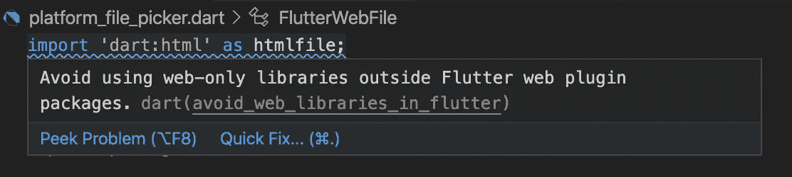
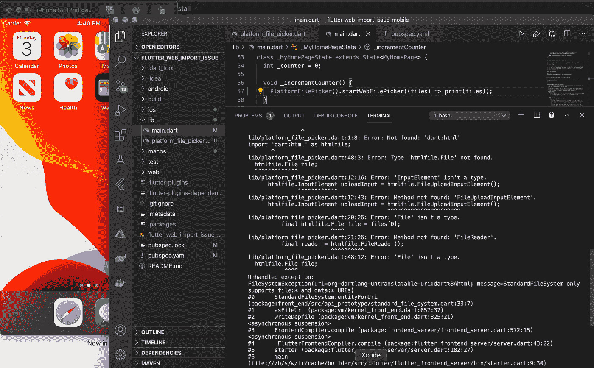
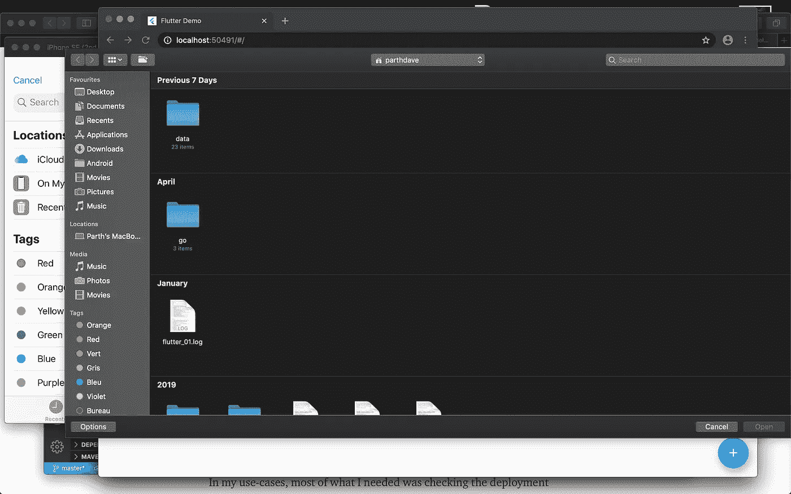

# 支持跨平台颤振

> 原文：<https://medium.com/globant/support-flutter-cross-platform-b55ea3cccf41?source=collection_archive---------0----------------------->

这篇文章是我上一篇文章的延续

[](/globant-mobile-studio-india/flutter-web-problem-deliberation-2f7cb05565f9) [## 颤振腹板问题的研究

### Flutter Web 文件选择器，Dart 到 JS，以及 JS 到 Dart 函数调用等诸多问题解决方案。发布您的问题…

medium.com](/globant-mobile-studio-india/flutter-web-problem-deliberation-2f7cb05565f9) 

> 请务必阅读或浏览一下这篇文章，因为这篇文章引用了那个邮政编码和问题陈述。

我们讨论的是在真正的跨平台开发过程中可能会遇到的一些问题。这一次，如果我们的插件只支持一两种技术，我们将覆盖支持跨平台。



html import tip

我们不能运行 dart:html 导入的代码来飘动移动或桌面。这是我们将得到的错误。



error to run html imported code on flutter mobile

我们想做什么？
1。根据平台导入特定包
2。根据平台运行一组功能

够了吧？让我们开始吧。

我们在上一篇文章中已经检查了这个要点:

```
if (kIsWeb) {
      htmlfile.InputElement uploadInput = htmlfile.FileUploadInputElement();
      uploadInput.click();

      uploadInput.onChange.listen((e) {
        // read file content as dataURL
        final files = uploadInput.files;
        //was just checking for single file but you can check for multiple one
        if (files.length == 1) {
          final htmlfile.File file = files[0];
          final reader = htmlfile.FileReader();

          reader.onLoadEnd.listen((e) {
            //to upload file we will be needing file bytes as web does not work exactly like path thing
            //and to fetch file name we will be needing file object
            //so created custom class to hold both.
            pickerCallback([FlutterWebFile(file, reader.result)]);
          });
          reader.readAsArrayBuffer(file);
        }
      });
    } else {
      File file = await FilePicker.getFile();
      pickerCallback([file.path]);
    }
```

> 注意:假设 file_picker 是不支持 flutter web 的插件，你需要自己的逻辑在按钮被点击时运行，类似于运行 javascript 或任何东西，并将结果返回给 flutter。现在 file_picker 也支持 web。

让我们从我们需要做的步骤开始

**1。根据平台导入特定的包** dart 支持这样的条件导入

```
import “package_file.dart” if (condition) “other_package_file.dart”;
```

**2。根据平台运行一组功能**

为此，我们需要理解存根结构。
存根是一段代码，用于替代其他一些编程功能。这里的意思是说，如果这是一个移动平台，那么我们将存根这个代码和其他代码。

存根创建:

为了创建存根，我们将创建抽象类，并根据情况导入。

```
import 'platform_file_picker_stub.dart'
if(dart.library.io) 'mobile_file_picker.dart'
if(dart.library.html) 'web_file_picker.dart';

typedef CallBackForFilePicker = Function(List<dynamic> files);

abstract class PlatformFilePicker{

  factory PlatformFilePicker() => createPickerObject();

  void startWebFilePicker(CallBackForFilePicker pickerCallBack);

  String getFileName(dynamic file);

}
```

在这里，我们为存根导入存根实现将基于此导入。

在 stub 中，我们将只创建一个函数，该函数只有用于 stub 实现的抽象方法。

```
import 'platform_file_picker.dart';

PlatformFilePicker createPickerObject() => throw UnsupportedError(
  'Cannot create a client without dart:html or dart:io',
);
```

现在，dart 将尝试根据条件导入实现，如果库有 dart:io，则它将导入移动版本，否则它将导入 web 版本实现。

```
///mobile_file_picker.dart
import 'dart:io';
import 'package:file_picker/file_picker.dart';
import 'platform_file_picker.dart';

PlatformFilePicker createPickerObject() => IOFilePicker();

class IOFilePicker implements PlatformFilePicker{
  @override
  String getFileName(file) {
      return file.path.substring(file.lastIndexOf(Platform.pathSeparator) + 1);
    }

    @override
    void startWebFilePicker(pickerCallBack) async {
    File file = await FilePicker.getFile();
    pickerCallBack([file.path]);
  }
}///web_file_picker.dartimport 'dart:html' as htmlfile;
import 'platform_file_picker.dart';

PlatformFilePicker createPickerObject() => WebFilePicker();

class WebFilePicker implements PlatformFilePicker{
  @override
  String getFileName(file) {
      return file.file.name;
    }

    @override
    void startWebFilePicker(pickerCallBack) {
    htmlfile.InputElement uploadInput = htmlfile.FileUploadInputElement();
    uploadInput.click();

    uploadInput.onChange.listen((e){
      final files = uploadInput.files;
      //just checking for single file here you can for multiple files
      if(files.length == 1){
        final htmlfile.File file = files[0];
        final reader = htmlfile.FileReader();

        reader.onLoadEnd.listen((event) {
          pickerCallBack([FlutterWebFile(file, reader.result)]);
        });
        reader.readAsArrayBuffer(file);
      }
    });
  }

}
```

终于可以安装在 iOS 和 flutter web 上了。



下面是 GitHub 代码:

[](https://github.com/parthdave93/FlutterWebImportIssue) [## part hdave 93/flutter web importissue

### 一个新的颤振项目。这个项目是颤振应用的起点。一些帮助您入门的资源…

github.com](https://github.com/parthdave93/FlutterWebImportIssue) 

希望你喜欢。

你知道你可以按拍手吗👏按钮 50 次？你走得越高，就越能激励我写更多的东西！

你好，我是帕斯·戴夫。noob 开发者和 noob 摄影师。你可以在 [Linkedin](https://in.linkedin.com/in/parth-dave-907b8177) 上找到我，或者在 [GitHub](https://github.com/parthdave93) 上跟踪我，或者在 [Twitter](https://twitter.com/the_parth_dave) 上关注我？

祝你有一个愉快的飞行日！