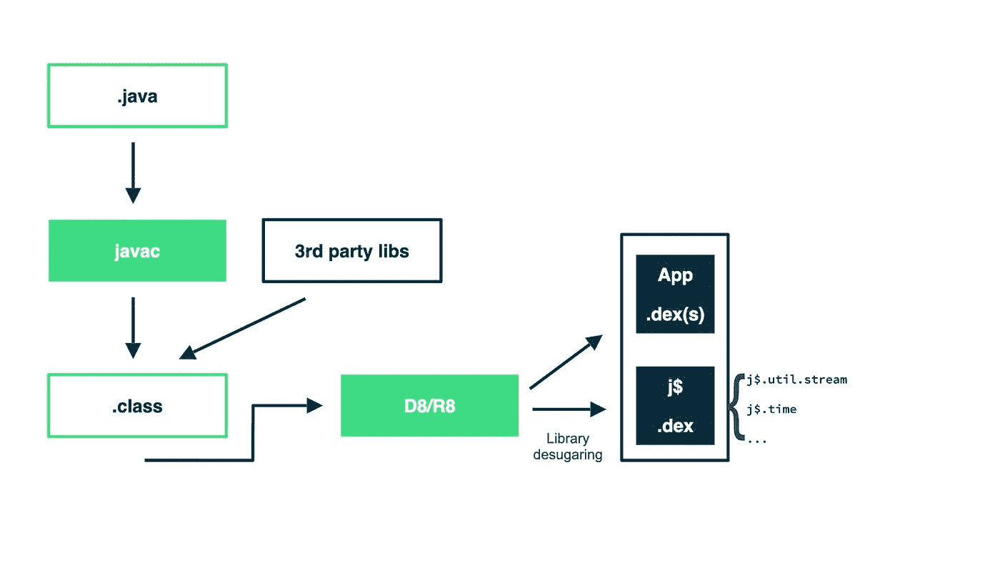

# 支持较新的 Java 语言 API

> 原文：<https://medium.com/androiddevelopers/support-for-newer-java-language-apis-bca79fc8ef65?source=collection_archive---------0----------------------->

想象开发一个需要处理时间计算的应用程序。在谷歌搜索了一番之后，您很可能会找到 java.time 包的优秀示例！然而，在发布您的应用程序后，您突然收到成千上万个 API < 26 的崩溃和用户投诉！

想知道原因吗？观看视频或阅读下面的博客。

原因是遇到问题的设备根本没有安装必要的类，因为那时这些类还不是 Android 的一部分。

随着每一个新版本的 Android 增加了 java。* APIs 从 OpenJDK 添加到 Android。在 Android 11 中，我们添加了对从较新的 OpenJDK 版本到版本 13 的许多 API 的支持，包括对 List、Set、Map 和新的 java.time API 的添加。虽然我们不断地向每个平台版本添加新的 Java APIs，但我们也希望这些 API 能为旧设备所用。

如果我告诉你，当你使用 Android Gradle Plugin 4.0.0 和更新版本时，你现在可以使用来自更新 OpenJDK 版本的数百个 API，并且你的应用程序可以在任何 Android 设备上工作，会怎么样？Android 11 中的一些较新的 Java APIs 通过反向移植得到支持，而其他 API 也可以通过在 Android 平台没有运行时 API 的旧设备上解糖来获得。

如果你想知道这怎么可能，让我们来谈谈脱糖。

# D8/R8 脱糖

Android Gradle 插件 4.0 为使用某些 Java 语言 API 和使用它们的第三方库提供了内置支持。以前，这些 API 仅在较新的 Android 版本上受支持，但随着 AGP 4.0 的推出，它们现在几乎在所有 Android 版本上都受支持。

D8/R8 表演的“去糖”技巧使这种支持成为可能。当您使用这些新的 Java APIs 构建应用程序时，Java 编译器首先将 Java 源代码转换成 Java 字节码。然后，工具链通过在您的应用(包括您的应用使用的任何第三方库)上执行字节码转换来实现新的 API，并将它们转换为 dex 代码，同时为缺少这些运行时类的设备添加必要的 Java 8 运行时代码作为单独的 dex 库。

这个过程被称为去糖，它使一组 Java 8 APIs 能够在所有现有设备上工作，除了并行设备，并行设备受 API 级别 21 的支持。

# 使用较新的 Java APIs

要开始使用新的 Java APIs，请将 Android Gradle 插件更新到 4.0 或更高版本，并在模块的`build.gradle`文件中添加以下配置。

*   设置`coreLibraryDesugaringEnabled`标志。
*   将 Java 源和目标兼容性设置为 Java 8。
*   添加`coreLibraryDesugaring`作为附属物。
*   启用`multidex`。为了支持这些语言 API，插件会编译一个单独的 DEX 文件，其中包含缺失 API 的实现，并将其包含在您的应用程序中

既然您已经了解并启用了 Java 8+去糖，那么让我们来看看新的 API。

# java.time

时间 API 有一些缺点。`java.util.Date`和`java.util.Calendar`类是可变的，这会导致并发问题。此外，API 不是很一致，也不容易使用。举个简单的例子，在 Date 对象中，day 从 1 开始，month 从 0 开始，可能会比较混乱。

`Date date = new Date(2, 3, 1); *//Tue Apr 01 00:00:00 PST 1902*`

在 OpenJDK 第 8 版中，java 中添加了一个新的 Java 时间 API Java . Time package。新的 java.time 基于流行的库`JodaTime`。所有核心`java.time` 类都是不可变的，并且没有 setter 方法，所以它们不会引入任何并发问题。此外，新的`java.time` API 使得处理时区变得更加容易。让我们看看新的日期和时间类。

首先，如果您不需要日期和时间对象的时区数据，`java.time`有两个新的类，`LocalDate`和`LocalTime`。这两个类表示相对于用户的日期和时间，比如闹钟或计时器，而不用担心时区。

如果您的用例需要时区，您可以使用`ZonedDateTime`或`OffsetDateTime`类。先说`ZonedDateTime`。`ZonedDateTime`是`DateTime`的不可变表示，包含一个`LocalDateTime`、一个`ZoneId`和已解析的`ZoneOffset`。

可以使用`ZoneId`类以时区的缩写或长文本形式设置时区。

当您需要存储日期和时间而不依赖于特定设备或应用程序的上下文时,`ZonedDateTime`特别有用。`ZonedDateTime`可以在任何时间点解析到任何时区。

您可以使用`ZoneOffsets`来计算当前时区和格林威治/UTC 之间的时差。

`OffsetDateTime`与`ZonedDateTime`相似，但保持与格林威治/UTC 的偏差，而不是`ZoneId`。

总结一下`ZonedDateTime`和`OffsetDateTime`的区别，`ZonedDateTime`非常适合显示时区敏感的日期时间数据。`OffsetDateTime`最适合将日期时间数据存储到数据库，以及其他需要序列化数据的用例。

新的`java.time` API 有两个新的类，`Period`和`Duration`，分别定义日期范围或时间长度。

# java .实用程序.流

流允许您对集合执行函数式操作。流不存储数据或修改底层数据结构，并提供更好的可读性。

流有大量内置的中间和终端操作。中间操作是懒惰的，总是返回一个新的流。终端操作是急切的，一旦被调用，它们就完成了数据源的遍历，流就不能再使用了。由于在调用终端操作之前不会评估中间操作，因此在处理大型数据源时，流*可能会*执行得更好。

要使用 streams，您可以调用集合上的`stream()`方法，或者使用`Stream.of()`并传递您的数据源，或者使用`Stream.Builder()`。

# 其他 java.util APIs

在`java.util`包中增加了新的映射、集合和比较器接口。

编写一个比较器并不难，但是需要大量的样板代码，在这些代码中你很容易出错。在 Java 8 中，可以使用简单的链式代码来编写比较器。在方法句柄和 lambdas 的帮助下，Java 8 中的比较器看起来就像这样简单。

对`java.util`包的另一个有趣的添加是可选类及其原始对应物`OptionalInt`、`OptionalLong`和`OptionalDouble`。Optional 帮助您使用实类型而不是空引用。可选的可以用“缺少值”来表示 null。您可以使用实用程序方法将值处理为“可用”或“不可用”，而不是检查空值。

可选类有多种实用方法，如`orElse()`、`orElseThrow()`、`filter()`等，帮助您轻松处理空检查和空情况。

# `java.util.concurrent`

Java 8+还在`java.util.concurrent.atomic`包中引入了关于`AtomicInteger`、`AtomicLong`和`AtomicReference`的新方法。`java.util.concurrent`包中的另一个更新是对`ConcurrentHashMap`的错误修复，这是`HashMap`的线程安全替代方案。`ConcurrentHashMap`一直是安卓的一部分。然而，在 API 级别 21 和 22 上，实现有一个[错误](https://bugs.openjdk.java.net/browse/JDK-8028564)。一个新的固定实现是去糖库的一部分，通过库去糖，该实现将在你的应用中使用，代替平台中可能有 bug 的实现。

如果您不熟悉`ConcurrentHashMap`，这个类允许任意数量的线程执行 get 操作，但是对于 update 和 insert 操作，执行线程必须锁定数据被修改或插入的特定段。尽管任何线程都可以执行 get 操作，但是这个锁可能会阻止试图访问锁定段中的数据的 get 操作。由于同步，`ConcurrentHashMap`的执行速度可能比`HashMap`慢。

> 请注意，在 Android Studio 4.0 中，不支持在测试中使用这些库去糖类型。

升级您的项目以充分利用所有较新的 Java 语言 API。Streams、Optionals 和新的时间 API 帮助您在使用现代语言 API 时编写更少的代码和引入更少的错误。请务必查看受支持的 Java 8+API 的完整列表。

> *本页内容和代码样本受* [*内容许可*](https://developer.android.com/license) *中所述许可的约束。Java 是 Oracle 和/或其附属公司的注册商标。*