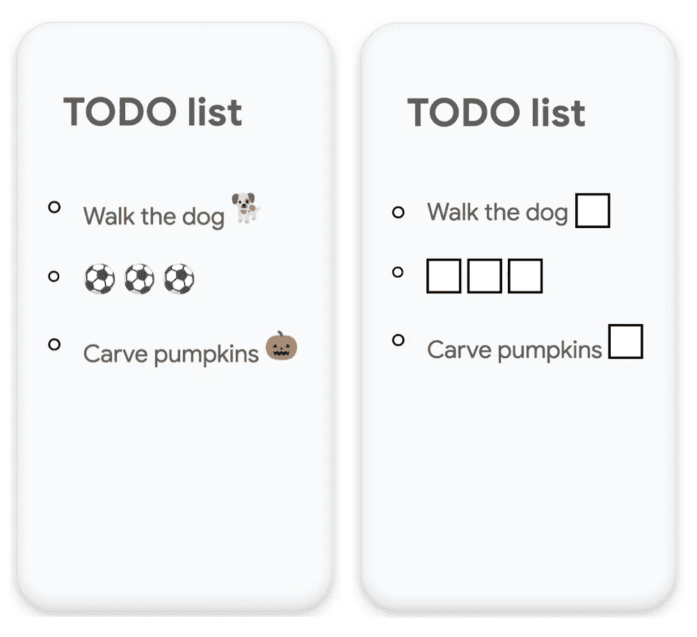
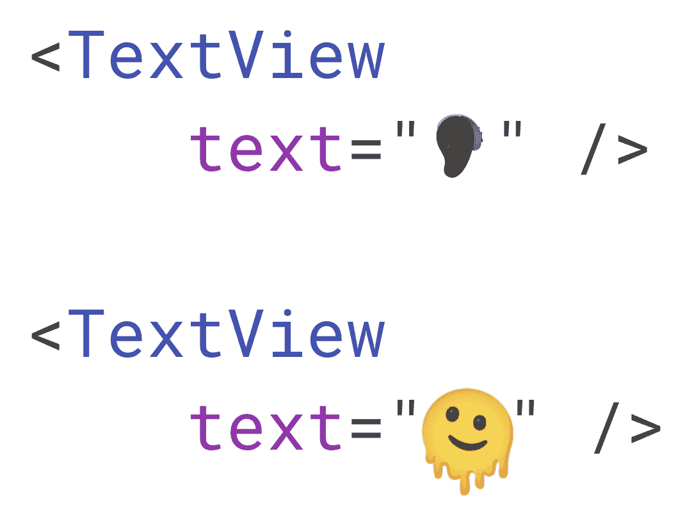
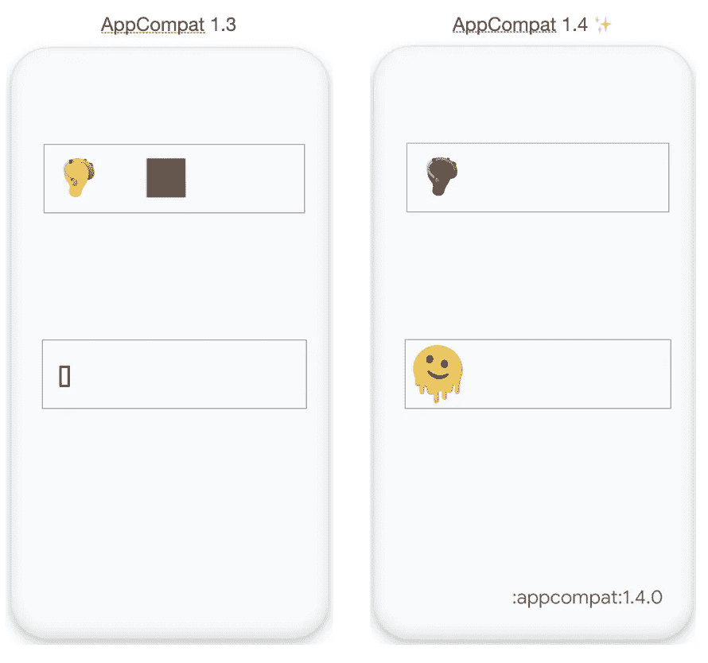
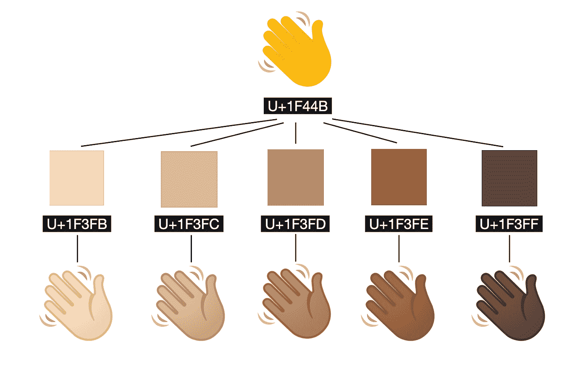
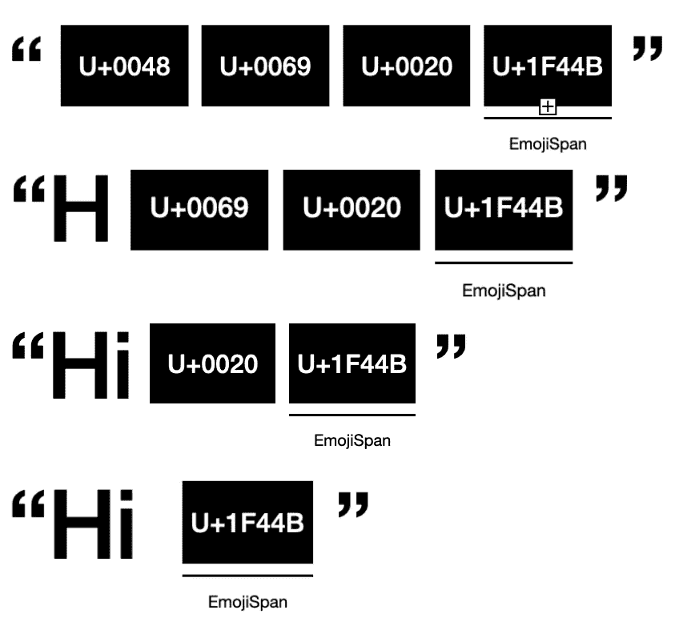

# 支持现代表情符号

> 原文：<https://medium.com/androiddevelopers/support-modern-emoji-99f6dea8e57f?source=collection_archive---------4----------------------->

表情符号！他们无处不在！自从它们发行以来，它们已经成为我们语言的一大部分。它们是一种用语言无法表达的方式有效表达自己的方式。虽然你可能不认为银行应用、健身应用或送餐应用需要支持表情符号，但它们确实需要！表情符号已经超越了短信或信使应用程序，现在是我们语言中常见的一部分。如果你的应用程序有任何文本视图，那么它应该支持表情符号，继续阅读，看看为什么。🥳

# 那么问题出在哪里？😖

当你的应用不处理表情符号时，旧版本的 Android 可能不知道如何渲染它们。最常见的是，会出现一个空白的盒子，我们称之为豆腐。如果表情符号显示在没有正确设置来处理表情符号的应用程序中，这可能会导致混乱。当用户添加🐶在编辑文本中，用户看到豆腐而不是狗会非常困惑，他们会认为你的应用程序有问题。

为了让表情符号更有趣，在许多情况下，一个表情符号将是其他表情符号的组合。举个例子，💪🏾是以下各项的组合💪还有🟫.

如果你尝试输入弯曲的手臂，它会显示一个手臂和一个颜色框，这不仅是一个混淆的问题，也是对各种肤色的误解，这导致了你的应用程序体验不佳。

随着语言的变化，表情符号也在变化。作为新 Android 版本的一部分，Unicode 每年都会添加新的表情符号，但不幸的是，没有办法将新的表情符号字体传输到 s 之前的旧版本 Android。

# 那么解决办法是什么呢？

AppCompat 1.4 中集成了[表情 2](https://developer.android.com/jetpack/androidx/releases/emoji2) 库，这意味着您只需更新到 AppCompat1.4，就可以在 API 19 及更高版本上显示现代表情了！AppCompat 中的所有 TextViews 都是默认工作的，因为我们添加了自动配置，所以它可以自行配置以加载正确的 emoji 字体。如果需要，您可以在 XML 或代码中为特定的文本视图禁用它。

我们来看看这些表情符号在 AppCompat 1.3 vs AppCompat 1.4 中是如何渲染的。

简单来说，图形表情符号实际上只是一个显示文本的🖼️。它由一个 unicode 代码点表示，就像字母“e”一样，但是 unicode 指定当这些代码点显示时，它们应该显示一个表情图像，而不是“e”。图片实际上只是一个字体文件中的 png(你可以在这里找到我们为 Android [制作的表情符号字体](https://github.com/googlefonts/noto-emoji))。通常你可能会认为字体包含字符“e ”,这是用笔画定义的，但字体实际上非常强大，可以包含位图、png、SVG，甚至完整的程序——有人甚至完全用字体制作了游戏[🤯。](https://www.coderelay.io/fontemon.html#player)

当新的表情符号由 Unicode 添加时，新的表情符号需要新的[字形](https://en.wikipedia.org/wiki/Glyph)或可打印字符添加到表情符号字体中，并更新表格，以便字体知道哪个代码点显示该字形。

当平台获得一个输入字符串时，EmojiCompat.process 需要将其转换为一个[表情图标](https://developer.android.com/reference/androidx/emoji/text/EmojiSpan)，它基本上告诉 Android 不要呈现字符串的一部分。表情符号理解如何渲染表情符号。

[EmojiCompat.process](https://developer.android.com/reference/androidx/emoji/text/EmojiCompat#process(java.lang.CharSequence,%20int,%20int,%20int,%20int)) 遍历字符串并找到所有表情符号，为任何表情符号添加表情符号 Span。一个 EmojiSpan 基本上告诉 Android 不要呈现字符串的一部分，而是调用 draw 方法。EmojiCompat.process 使用 trie 查找与已知表情匹配的所有子字符串。

trie 是一种有趣的数据结构，非常擅长高效地在字典中查找单词(或表情符号)。EmojiCompat 遍历字符串，根据 trie 检查每个代码点。每当它在 trie 中找到一个完整的表情符号，它就会检查平台是否不知道如何呈现该表情符号，并添加一个表情符号。你可以把 EmojiCompat 想象成使用字典在字符串中查找表情符号，定义就是如何使用一个表情符号 Span 来渲染表情符号。

现在我们知道了 EmojiCompat 是如何检索表情符号的，让我们来谈谈如何呈现字符串“Hi”

字符串只是一组代码点，这些代码点是表示像字母“m”或数字“1”这样的字形的数字。表情符号也被分配了代码点——你可以在[表情百科](https://emojipedia.org/)上看到它们，包括我们现在正在渲染的[挥手表情符号](https://emojipedia.org/waving-hand/)。

最后，调用 draw 函数，直接从字体文件中绘制表情符号，这样你就有了——你的字符串！🥳🥳🥳

# 最后…

表情符号不仅很棒，而且是我们语言的重要组成部分。要为您的用户提供包括现代表情符号在内的最佳体验，请使用 AppCompat 1.4。

在这里看看围绕表情符号[的新玩法政策。](https://support.google.com/googleplay/android-developer/answer/11190649?hl=en)

在🥳保持冷静和表情符号🦄