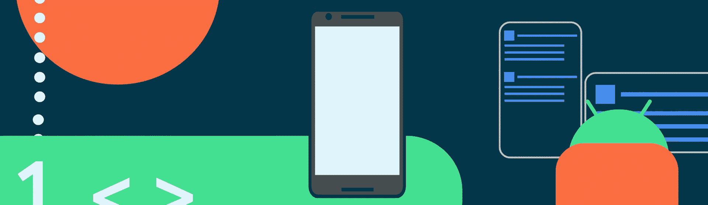
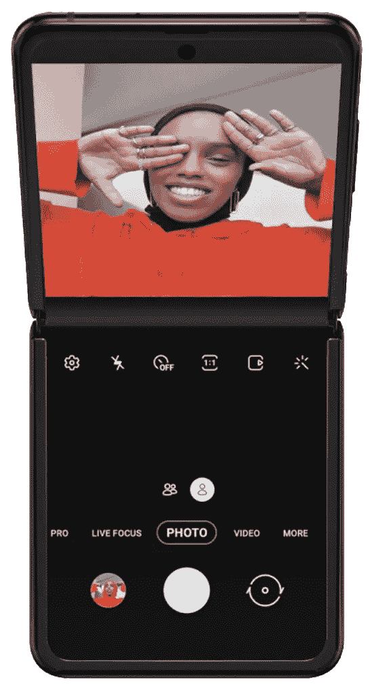
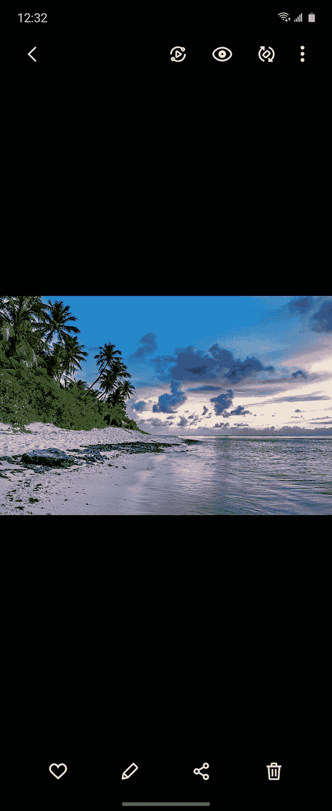
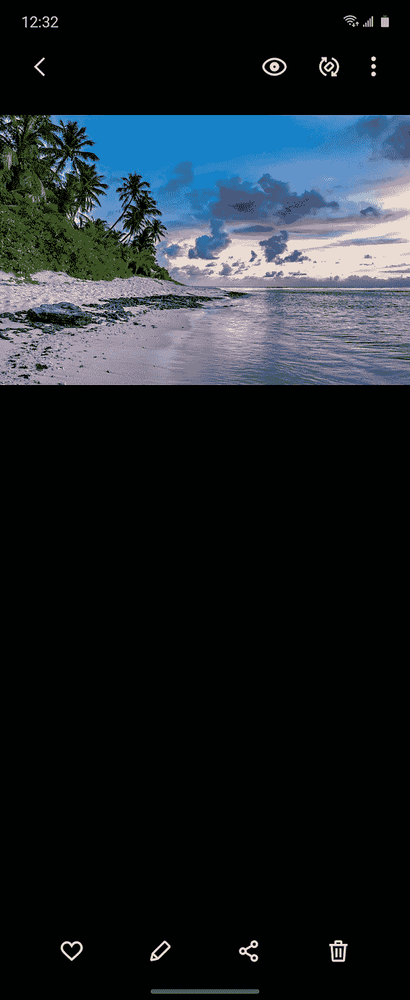
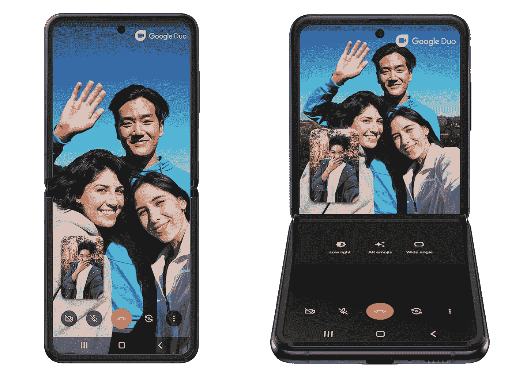

# 通过新的 Jetpack WindowManager 库支持新的外形

> 原文：<https://medium.com/androiddevelopers/support-new-form-factors-with-the-new-jetpack-windowmanager-library-4be98f5450da?source=collection_archive---------4----------------------->

Image by [Gus Winkelman](http://guswinkelman.com/)

由肯尼斯·福特和安德里·库连发布

WindowManager 是最近添加到 [Android Jetpack](https://developer.android.com/jetpack) 中的，旨在帮助应用程序开发人员支持新的设备外形，并为新旧平台版本上的不同窗口管理器功能提供一个通用的 API 表面。最初的版本针对可折叠设备，未来的版本将扩展到支持更多的显示类型和窗口功能。

# 我为什么需要它？

市场上出现了新的可折叠设备，它们提供了一组独特的硬件功能。针对这些新设备和外形优化您的应用，让您带来与众不同的体验，并让您的用户充分利用他们使用的任何设备。

例如，三星 Galaxy Z Flip 是一款[翻盖式](https://en.wikipedia.org/wiki/Clamshell_design)设备，支持折叠和部分折叠状态(三星称之为 [Flex 模式](https://www.samsung.com/us/support/answer/ANS00086025/))。当设备处于部分折叠状态时，该应用程序可以优化其布局，并将底部的控件与顶部的其余内容分开。

Example of how a camera or photo viewer app may adjust (image copyright by Samsung)

用户可以将手机放在平坦的地方，如桌子上，并使用屏幕的下半部分来导航和与应用程序交互。

Google Duo and Youtube screenshots shown during Samsung Galaxy Unpacked 2020

Jetpack WindowManager 库的目标是为进入市场的不同类型的可折叠设备提供单一的 API 表面，以便应用程序开发人员可以针对所有类别的设备，而不是单一的型号。

在版本 [1.0.0](https://developer.android.com/jetpack/androidx/releases/window#version_100_2) 中，该库提供了关于可折叠设备的两个物理属性的信息——显示功能和设备状态。

# 显示特征

单个显示面板或多显示器配置可以具有不同的特征，这些特征在连续屏幕表面中产生中断。这些例子可以是折叠、铰链、弯曲区域或切口。如果应用程序窗口中存在这种中断，则可以调整窗口中内容的布局和位置以避开这种区域，或者利用它们并将其用作自然分隔符。

每个显示特征区域可以通过其在窗口坐标空间中的边界矩形及其类型来表征。矩形将指示特征的物理边界。特征的类型将有助于定义如何对待它。例如，一些特征可以创建物理分隔和/或非交互区域(例如，两个显示面板之间的铰链、显示剪切)，而其他特征可以用作逻辑分隔(例如，折叠)。

支持库的第一个版本只包括两种类型的特性:`TYPE_FOLD`和`TYPE_HINGE`。

对于`TYPE_FOLD`来说，边界矩形应该是零高(0，y，width，y)或零宽(x，0，x，height)。这表明不存在不可访问的区域，但它仍然在屏幕上报告位置。

# 设备状态

取决于铰链硬件设计，不同的可折叠设备可以具有几种中间状态:闭合、部分打开、完全打开(平面)或翻转。使用该库，应用程序可以根据这些设备状态提供不同的功能。这些状态被定义为不同的姿势:

每个设备可以根据它们的硬件和期望的 UX 来报告上面定义的姿态的任何子集

# 我如何使用它？

要添加对窗口管理器的依赖，您必须将 [Google Maven 资源库](https://android.devsite.corp.google.com/studio/build/dependencies?skip_cache=true#google-maven)添加到您的项目中。

在您的应用程序或模块的`build.gradle`文件中添加您需要的工件的依赖关系:

Google Duo on the Samsung Galaxy Z Flip

比方说，你想要像可折叠设备上的 Google Duo 一样拆分你的应用程序的 UI。通常，在设备的物理配置和状态为用户创建了逻辑分离的情况下，这样做是有意义的。例如，Galaxy Z Flip 在“弯曲”或“半折叠”模式下会产生这样的逻辑分离。因此，你需要知道折叠在应用程序窗口中的位置以及设备的状态。

首先，从一个活动中获取一个`androidx.window.WindowManager`的实例。

注意这里的参数。

首先，上下文用于初始化并将`WindowManager`的实例连接到屏幕上的可视实体。所以一定是目测`Context`，也就是说不是`Activity`就是一个左右的`ContextWrapper`。

其次，窗口后端是支持库的信息提供者。在这里传递`null`意味着将使用默认的设备信息，并且当应用程序在普通手机上运行时，库将报告没有显示功能和未知的设备状态。然而，您也可以传递一个定制的`androidx.window.WindowBackend`实现来模拟任何种类的可折叠设备，而无需访问物理硬件。我们在示例应用程序中展示了一个[例子。](https://github.com/android/user-interface-samples/blob/master/WindowManager/app/src/main/java/com/example/windowmanagersample/backend/MidScreenFoldBackend.kt)

由于只有在逻辑硬件分离的情况下分离 UI 才有意义，因此有两种情况需要这样做:

1.  显示特征的类型是`TYPE_HINGE`，并且在活动窗口内总是有物理分隔。
2.  或者显示特征类型为`Type_Fold`，屏幕状态不平坦(例如不是`POSTURE_OPENED`)。具体到 Galaxy Z Flip，我们会对`POSTURE_HALF_OPENED`感兴趣。

对于折叠的情况，我们需要了解设备姿态的变化，因此我们需要注册一个`DeviceState`变化监听器:

在回调中，如果需要，您可以更改设备状态并更新 UI。

最后，我们需要获得位于活动窗口中的实际显示特性。

根据您的活动如何处理(或不处理)配置变更，您可能需要在活动生命周期的不同点询问它。在窗口装饰视图的布局上请求它将确保它在活动状态改变后总是最新的:

注意，显示特征的位置是相对于活动窗口坐标空间计算的。因此，它只能在将活动附加到窗口后提供。在此之前请求信息将引发异常。

我们强烈建议探索图书馆的演示应用程序。它还包含计算视图层次结构中显示特性的[位置的示例、](https://github.com/android/user-interface-samples/blob/master/WindowManager/app/src/main/java/com/example/windowmanagersample/SampleTools.kt)和[一个如果发现分割显示特性则自动分割内容的布局示例](https://github.com/android/user-interface-samples/blob/master/WindowManager/app/src/main/java/com/example/windowmanagersample/SplitLayout.kt)。