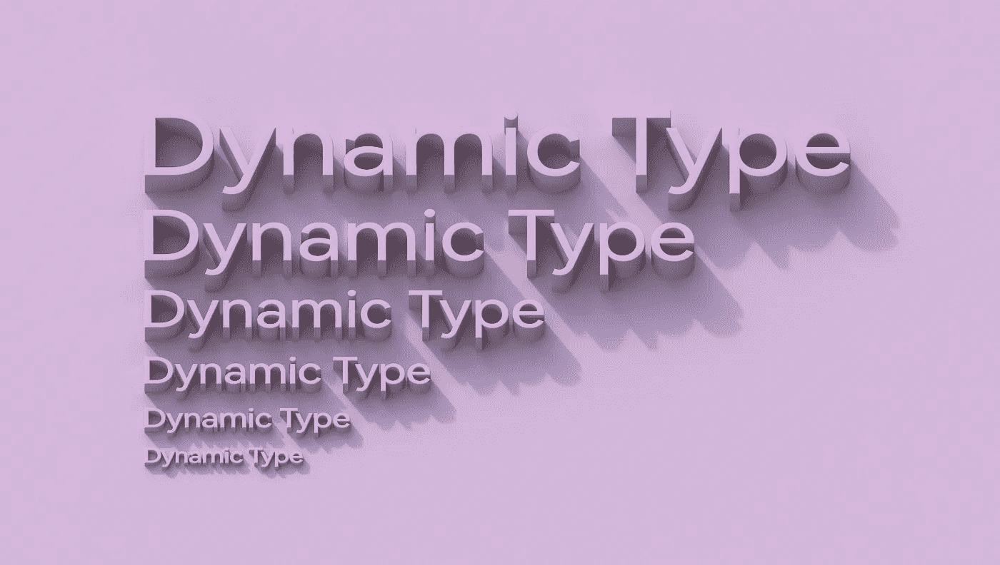
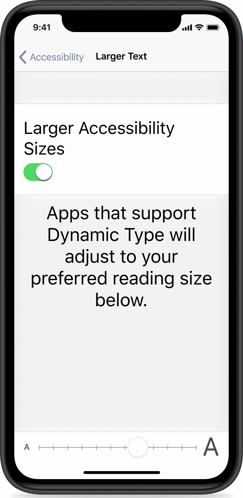
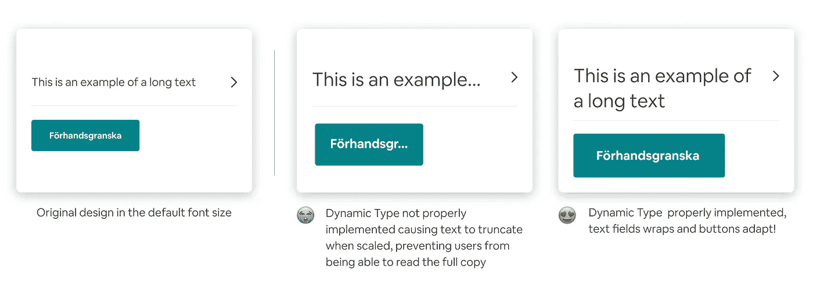
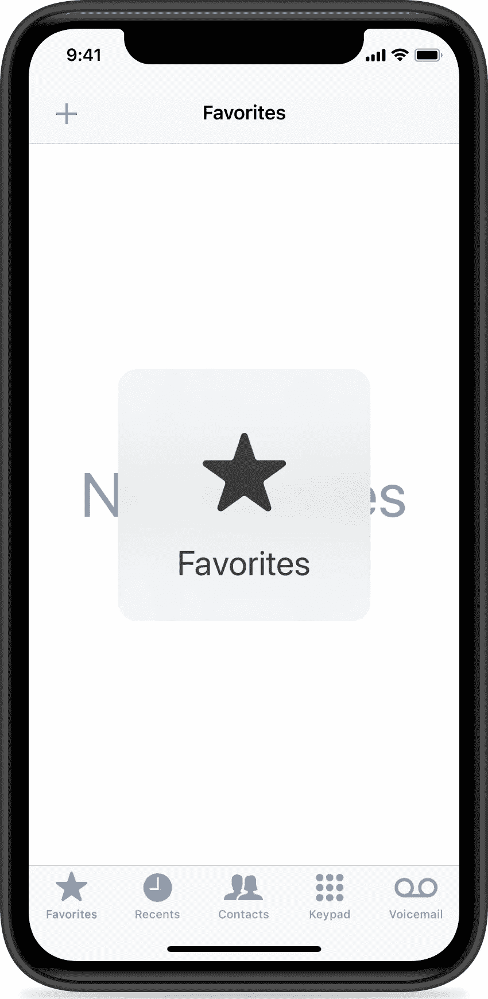
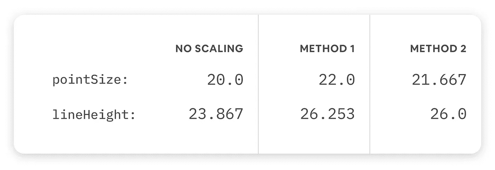
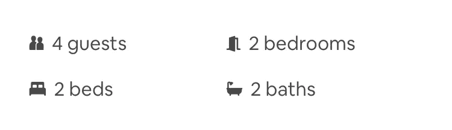
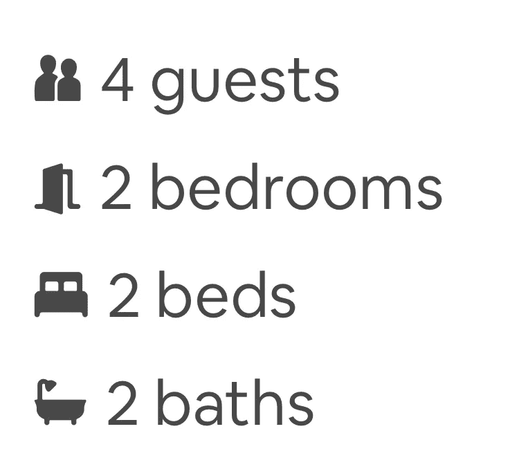

# 在 Airbnb 支持动态类型

> 原文：<https://medium.com/airbnb-engineering/supporting-dynamic-type-at-airbnb-b47c68b0c998?source=collection_archive---------1----------------------->

## 概述我们在将动态类型引入 Airbnb 时学到的流程、技巧和陷阱。供您在应用程序中支持动态类型时参考！

由[诺亚马丁](https://twitter.com/sond813) & [雨果阿尔贝里](https://twitter.com/hugoahlberg)



# 背景

自 iOS 7 以来，动态字体允许用户为手机选择喜欢的字体大小。在 Airbnb，我们试图建立一个我们整个社区都可以使用的应用程序——因为动态类型是一个关键的辅助功能，我们知道支持它会让更多人能够有效地使用我们的应用程序，其中一些人可能是第一次使用。为了验证这一功能的重要性，我们检查了数据，发现多达 30%的人在使用我们的应用程序时使用了非默认的首选字体大小。这种用法并不倾向于特定的大小，而是平均分布在比默认值更大和更小的大小上。

> 30%使用该应用程序的人喜欢的字体大小不是默认的。

事实证明，支持这种偏好创建了用户会注意到的跨操作系统的一致体验。在 Airbnb 应用程序的单个功能上尝试动态类型，导致参与度显著增加，有助于提高我们的底线指标。如果你花时间在你的应用程序中支持动态类型，用户肯定会感谢你的！



Font size selection in iOS

# 为什么重要？

除了度量标准之外，对动态类型的支持将您的 UI 组件保持在更高的质量水平。布局需要足够健壮，以处理各种各样的偏好，类似于由本地化和设备屏幕大小造成的变化。由于我们的大部分开发时间都花在了单个设备和语言上，所以只能在特定配置中重现的错误往往会被忽略。幸运的是，在动态类型测试过程中，许多这样的问题都被发现了。如果你已经通过 [UITraitCollection](https://developer.apple.com/documentation/uikit/uitraitcollection) 和不同长度字符串的翻译支持不同的屏幕尺寸，那么很有可能你已经完成了支持动态类型的大部分工作。

# 设计

当使用大字体时，我们遇到的大多数错误都与文本不适合其容器有关。为了解决这些问题，我们提出了一些设计建议。首先，宽度和高度变得灵活，允许文本扩展到多行。在许多情况下，这应该已经完成，因为一些语言可能比我们在设计模拟中包含的英语单词长得多。



第二，我们必须确保字体缩放正确的数量。这是通过给每个文本分配一个相应的 [UIFont 来实现的。文本样式](https://developer.apple.com/documentation/uikit/uifont/textstyle)。使用较大的 TextStyle 表明你的字体已经很大了，所以它不需要增加太多的大小。

第三，我们必须修复一些改变尺寸的标签，即使它们不应该有资格缩放。我们的建议是，屏幕上可滚动区域的所有部分都应该缩放，其他部分应该保持静态。然而，任何启用了大型动态类型的人仍然需要一种方法来查看较小容器(如标签栏)中的文本。如果使用所有标准 UIKit 元素，这将由大型内容查看器处理:



我们向苹果公司提交了一份错误报告，要求一个新的 API 来从自定义视图中显示这些弹出窗口。这项功能已经包含在 iOS 13 测试版中，所以你很快就可以在 Airbnb 应用程序中看到它。

# 工程

iOS 主要为系统字体提供自动动态类型 API，但 Airbnb 应用程序使用自定义字体，[谷物](https://airbnb.design/cereal/)。为了支持动态类型，我们依靠 [UIFontMetrics](https://developer.apple.com/documentation/uikit/uifontmetrics) 。这个类处理字体大小、行高和跟踪的缩放。

这些属性中的每一个都以两种形式存在:

1.  以默认字体大小显示给用户的未缩放单位，是我们在创建字体属性时设置的值。
2.  符合`[preferredContentSizeCategory](https://developer.apple.com/documentation/uikit/uitraitcollection/1771746-preferredcontentsizecategory)`的缩放单位是我们在运行时读取的。

在内部，特性将请求一个使用以未缩放单位表示的属性的字体，并将接收一个包含各种函数的对象，这些函数用于显示总是以缩放单位返回值的文本。这确保了任何计算(如文本的边界框)都将使用缩放单位。我们看到的一些最常见的错误是由于在布局计算中使用未缩放单位而不是缩放单位造成的。

有两种方法可以使用 UIFontMetrics 将未缩放单位转换为缩放单位。

[方法#1:](https://developer.apple.com/documentation/uikit/uifontmetrics/2877389-scaledfont)

```
func scaledFont(for font: UIFont, compatibleWith traitCollection: UITraitCollection?) -> UIFont
```

[方法#2:](https://developer.apple.com/documentation/uikit/uifontmetrics/2877388-scaledvalue)

```
func scaledValue(for value: CGFloat, compatibleWith traitCollection: UITraitCollection?) -> CGFloat
```

这些方法有细微的差别。考虑以下示例，每个示例都使用不同的 UIFontMetrics 方法:

根据您运行的设备，我们观察到如下结果:



结果并不完全一致，但是因为我们用 NSParagraphStyle 定制了行高，所以我们需要使用 CGFloat scale 函数。直接缩放未缩放磅值的 UIFont，以获得调整后的 UIFont。以下是缩放非属性字符串的完整示例:

完全支持动态类型的最后一步是鼓励跨所有特性的验证，包括开发中的特性。我们知道开发人员的时间是有限的，所以我们尽可能地自动支持动态类型。 [Happo](https://happo.io) ，我们用于 UI 回归检测的工具，已经对现有组件进行了快照。我们添加了一个额外的步骤来渲染 accessibilityExtraExtraExtraLarge 大小。

没有可用的 API 来以编程方式改变模拟器的动态类型设置，所以避免使用`UIApplication.shared.preferredContentSize`。更易测试的方法是查询 UIView 的 trait 集合。在 Happo 测试的 UIWindow 中，traitCollection 被配置为包含一个定制的内容大小。最终结果是这样的快照:



Default (large) preferred content size



AccessibilityExtraExtraExtraLarge preferredContentSize

由于 iOS 应用程序的每次代码更改都会生成快照，开发人员可以轻松了解新功能是否支持动态类型，并轻松检测回归。

感谢[李正吉·奎恩](https://www.linkedin.com/in/amiekweon/)、[迪伦·哈里斯](https://www.linkedin.com/in/dylanharris/)、[布林·博达伊尔](https://twitter.com/brynbodayle)、[泰勒·亨德里克](https://medium.com/u/c93af7c0720f?source=post_page-----b47c68b0c998--------------------------------)和[基拉杰·穆米克](https://www.linkedin.com/in/kierajmumick/)对这个项目的支持！

要亲自体验这些功能，请在[应用商店](https://itunes.apple.com/us/app/airbnb/id401626263)下载 Airbnb 应用。如果你对这样的项目和 iOS 开发充满热情，我们鼓励你申请我们开放的[职位](https://careers.airbnb.com/?gh_src=1cb1ce351)！