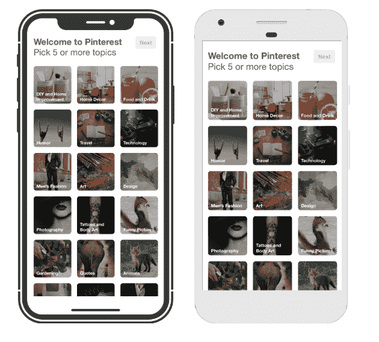
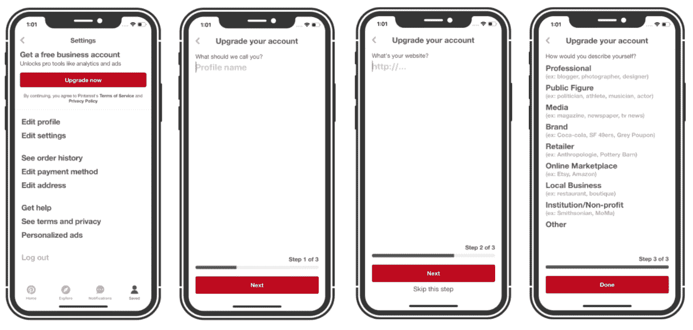

# 支持 Pinterest 的 Native reaction

> 原文：<https://medium.com/pinterest-engineering/supporting-react-native-at-pinterest-f8c2233f90e6?source=collection_archive---------1----------------------->

文晏| Pinterest 工程师，增长

去年初，一小群工程师开始研究在 Pinterest 采用 React Native 的可能性。自从生态系统在 2015 年首次开放以来，我们一直饶有兴趣地关注着它。从那时起，一个强大的社区围绕着它发展，它已经被整个[行业](https://facebook.github.io/react-native/showcase.html)的公司整合。我们决定认真研究一下在 Pinterest 使用这项技术的商业案例。

我们从旅程本身中学到了很多。在接下来的两节中，我们将从技术和组织的角度分享我们开发的评估流程，并讨论我们为 Pinterest 找到的特别优势。请继续阅读，了解支持 React Native 的最终判决。

# **技术评估流程**

技术评估分为两个阶段:

1.  内部评估
2.  收集真实世界的数据

第一阶段是内部评估，我们计划在两个平台上制作一个小型表面原型。我们进行了广泛的性能测试，并致力于减轻关键指标的影响，如应用启动时间。

我们原型化了一个范围小但影响大的表面——主题选择器视图。该视图在 Pinners 注册后显示给他们，是他们入职过程中的关键屏幕。屏幕也有很高的迭代需求，团队经常测试用户界面优化。

内部原型给了我们一个早期的迹象，共享代码确实为开发者速度带来了巨大的好处。通常，我们发现每个平台上的本机实现需要相同的时间，因为没有代码可以重用，并且客户工程师需要花时间在技术细节和边缘案例上共享上下文。使用 React Native，iOS 的初始实施耗时约 10 天，包括引导所有集成到我们现有的基础架构中。然后，我们能够在两天内将屏幕移植到 Android 平台上，平台之间 100%共享 UI 代码，节省了一周多的实现时间。展望未来，我们预计更多功能可以更快构建，因为基础设施基础已经到位。

在尽可能多地从内部分析了这个特性之后，是时候在野外进行测试了。我们首先在每个平台上做了一个仔细监控的发布，只有框架(没有功能代码)来评估对二进制文件大小和安装速度的影响。在确定对安装的影响最小后，我们在每个平台上运行了一个 A/B 实验，使用完全相同的 UI 设计和功能，只比较底层的本机实现和反应本机实现。我们跟踪了绩效和参与数据，以了解新框架是否对用户行为产生了影响。

尽管[被警告 Android](https://news.ycombinator.com/item?id=13568381) 上的 [性能问题，但我们的内部测试显示，React Native 的性能与 Native 一样好。实验结果也支持这一发现，性能和关键指标没有下降。主题选择器功能的参与度持平或略有上升，这让我们有信心继续探索 React Native 在 Pinterest 的功能。](https://blog.discordapp.com/using-react-native-one-year-later-91fd5e949933)

# **组织评估流程**

我们在 Pinterest 的核心原则之一是“编织”我们相信，当来自不同团队和学科的个人一起合作时，最好的产品就会被制造出来。从一开始，评估团队就由代表增长、核心产品和平台团队的工程师组成。此外，在整个技术评估过程中，我们通过与团队领导和高级移动工程师会面来讨论他们关注的问题并收集宝贵的见解，从而收集关于 React Native 的内部反馈。

在一次公司黑客马拉松中，我们邀请了对 React Native 感兴趣的工程师，他们给了我们关于开发者体验和平台支持需求的实际反馈。我们特别征求了那些想尝试开发移动功能的 web 工程师的反馈。这只是我们收集的众多有用数据中的一个:

> “我很乐意看到 React Native 在 Pinterest 成长，并获得更多功能。它有很大的潜力在一些原型上迭代。在网络方面工作，很容易上手。” — Pinterest 网站工程师

根据内部反馈，我们看到了进一步拉近我们平台之间距离的机会。Pinterest web 应用程序使用 [Gestalt](https://github.com/pinterest/gestalt) ，这是我们的一组开源 React UI 组件，符合 Pinterest 设计语言。因为 React Native 共享相同的 React 范式，所以我们可以通过构建共享相同完形 API 的 React Native 组件，使 web 工程师更容易实现移动特性。我们还确保使用与 Pinterest web 应用程序相同的工具和测试框架，这样我们就可以在公司现有知识的基础上进行构建。

最后，我们通过联系其他公司从事 React Native 的工程师，利用了这个强大的社区。他们的经历是很好的案例研究，说明我们应该如何处理采用流程，并帮助我们了解如何在 Pinterest 内发展和支持 React 本地社区。

# **React Native 的好处**

在整个评估过程中，我们对 React Native 在 Pinterest 的工作方式有了清晰的认识。在原生移动平台上编写 JavaScript 并做出反应的能力有许多理论上的积极因素，但是这些表现比我们现有的工程能力更好吗？

对我们来说，最大的潜在好处是开发速度的提高。React Native 使我们能够在平台之间共享代码。代码共享不仅意味着可以节省实现时间，当您需要多个特定于平台的工程师处理同一个特性时，它还可以减少共享上下文的认知开销。换句话说，站立和[会议](/@Pinterest_Engineering/three-day-no-meeting-schedule-for-engineers-fca9f857a567)所需的时间更少，平台之间的不一致性也更少。

我们对潜在的速度增益感到兴奋，因为 React Native 允许我们创建一个感觉完全本机的 UI，所以不会为了迭代速度而牺牲用户体验。此外，由于代码共享的速度优势是主要动机，我们得出结论，如果我们不能在 iOS 和 Android 上集成该技术，我们不会采用 React Native。

如果该技术在任何一个平台上的性能都有所下降，那么它将会成为一个阻碍因素。我们知道 React Native 不是专门为滚动视图的高性能而构建的。这尤其令人担忧，因为性能对于 Pinterest 至关重要，尤其是对于我们标志性的图像网格。2016 年，我们[重新架构了我们的 iOS 应用](/@Pinterest_Engineering/re-architecting-pinterest-039-s-ios-app-e0a2d34a6ac2)，使用异步 UI 渲染，以实现高响应性和滚动流畅度。React Native 不太可能击败我们现有的优化系统。在没有高度优化的性能需求的屏幕上，在 React Native 中构建最有意义。

React Native 的一些采用者发现[代码推送](https://github.com/Microsoft/react-native-code-push)极大地提高了速度，这是一种从服务器动态更新 UI 代码的能力，但我们认为这对于我们最初的采用来说是不必要的。我们的 Android 团队已经每周发布新的应用程序版本，我们最近在 iOS 上切换到相同的一周发布周期。我们可能最终会通过使用代码推送来加快部署时间，但并不认为它是工程能力中阶跃函数改进的主要驱动力。

# **决定:支持 React Native**

基于我们发现的 Pinterest 的优势，我们明确将 React Native 作为我们工程工具箱中的一个额外工具，与我们在 iOS 和 Android 上现有的原生代码功能一起使用。转变成一个完全反应的本地应用程序并不是最终目标。相反，我们专注于为特性团队确定具体的用例，以及采用 React Native 会产生的实际成本。

去年年底，我们成功完成了评估阶段，现在在我们的 iOS 和 Android 应用程序中支持 React Native。React Native 版本的主题选择器视图是 100%交付的。

我们最近还在 React Native 中构建了我们的业务注册流程。展望未来，我们将探索更多使用 React Native 的界面，并发展和扩展我们在 Pinterest 的 React Native 基础。

在未来的博客文章中，我们将概述我们在最初采用时面临的具体技术挑战，以及我们如何解决这些问题。如果你对我们正在做的工作感到兴奋，[加入我们](https://careers.pinterest.com/careers/engineering)！

*鸣谢:React Native evaluation and integration 是文晏、Michael Schneider 和 Thorben Primke 的合作成果。商业签约由李瑱、沙鲁兹·塔瓦科利、瑞恩·施和蒂芙尼·布莱克创建。特别感谢 Shana Hu，Zachary Westlake，Chris Lloyd，Garrett Moon，Rahul Malik，Brandon Kase，Dom Bhuphaibool，，Jon Parise 和 Bill Kunz。*