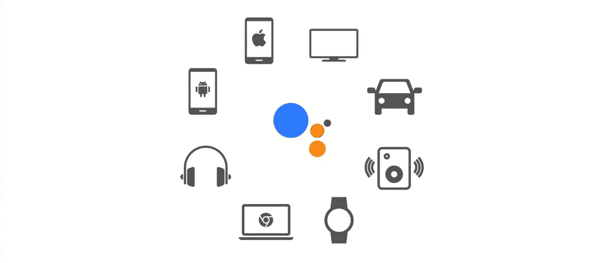
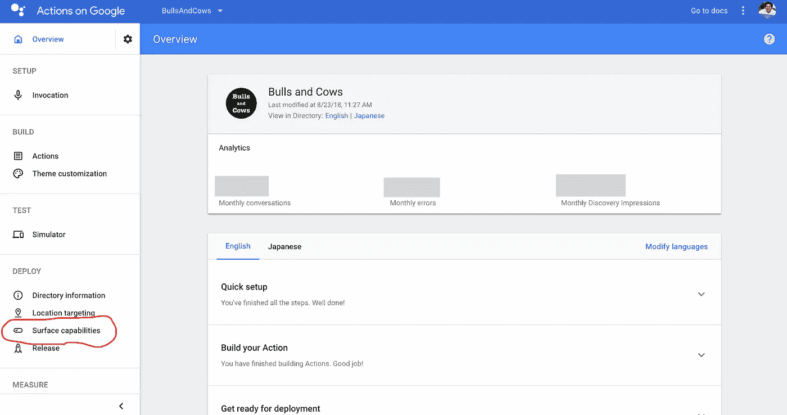
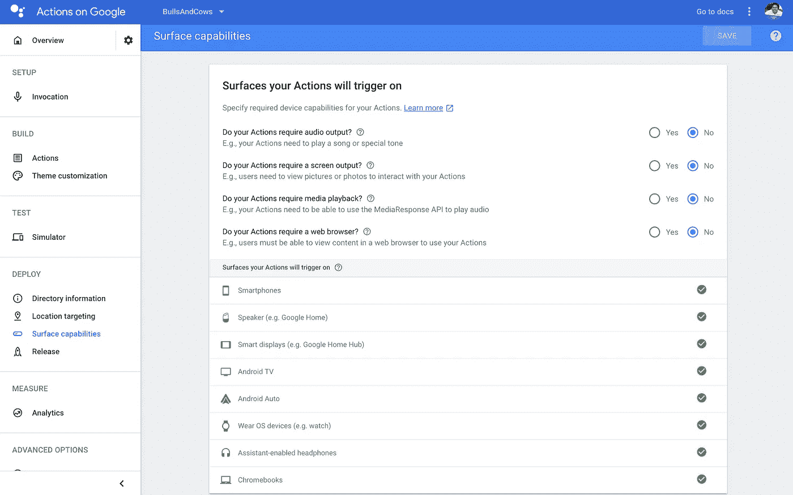

# 地面功能配置页面

> 原文：<https://medium.com/google-developer-experts/surface-capabilities-configuration-page-7f307c8410f7?source=collection_archive---------5----------------------->

你可以在很多设备上遇到谷歌助手。这些设备是……像 Android 和 iOS 这样的智能手机，Wear OS，像 Google Home 这样的智能扬声器，像 Google Home Hub 这样的智能显示器，Android TV，Android Auto 等等。哦，我忘了 Chromebooks。未来，我们将能够使用更多谷歌助手支持的其他设备类型。我等不及了。

顺便说一下，这些设备各有各的功能特点。其特征如下:

*   设备是否有音频输出？
*   设备是否有屏幕？

不仅上述特征，媒体控件和 Web 浏览器的存在也是要点。这些特征的不同意味着每种设备可以做的功能的不同。例如，如果您构建的操作具有显示某个图像的功能，那么使用没有屏幕的设备的用户就看不到该图像。也就是说，动作开发者需要做以下事情:

*   实现检查逻辑以了解用户设备的特性并控制输出(例如是否像基本卡一样发送丰富的响应)。
*   将您的操作配置为只能在特定设备上使用(例如您的操作可以在有屏幕的设备上工作)。

在谷歌的行动中，这样的设备特征被称为“表面能力”。本文向您介绍了如何在 Google 上为您的操作配置 surface 功能。

# 配置页面在哪里？

在 Google 控制台的操作的左侧菜单中，有一个菜单项可以打开 surface capabilities 配置页面。

单击菜单项时，您应该会看到如下所示的配置页面:

# 页面由什么组成？

地面功能的配置页面有两个部分:

*   打开/关闭每个表面功能的部分。
*   所选功能支持的设备列表。

例如，如果您的操作需要一个屏幕，您需要选择“您的操作需要屏幕输出吗？”。此外，如果您的操作必须输出一些音频，则有必要在“您的操作需要音频输出吗？”中选择“是”。选择后，按页面顶部的“保存”按钮，将选择反映到您的操作中。

# 根据表面功能选择，您的操作可以支持哪些设备？

每个选定地面功能支持的设备列表如下:

## 如果您的操作需要“音频输出”

所有设备都可用。这意味着谷歌助手工作的所有设备都可以输出音频或显示文本作为后备。

## 如果您的操作需要“屏幕输出”

支持以下设备:

*   智能手机、智能显示屏、安卓电视、穿戴式操作系统设备和 Chromebooks

另一方面，不支持以下设备:

*   扬声器、Android Auto 和带助手功能的耳机

注意，这种情况下不支持 Android Auto。我以为 Android Auto 的大部分设备都有屏幕，但似乎 Android Auto 的设备没有这个功能，只有音频输出的能力。

## 如果您的操作需要“媒体播放”

如果您的操作使用 [MediaResponse API](https://developers.google.com/actions/assistant/responses#media_responses) 来播放和控制音频，您需要打开“您的操作需要媒体播放吗？”。如果将此配置设置为“是”，则支持以下设备:

*   智能手机、扬声器、智能显示屏和 Chromebooks

但是，这种情况下不支持以下设备:

*   Android TV、Android Auto、Wear OS 设备和支持助手的耳机

我想知道这种支持状态。我猜这些不受支持的设备被许多人用来听音乐。我希望在不久的将来，所有的设备都能够支持 MediaResponse API。

## 如果您的操作需要“网络浏览器”

丰富响应的一部分需要网络浏览器。例如，[浏览转盘](https://developers.google.com/actions/assistant/responses#browsing_carousel)使用网络浏览器打开每张卡片分配的 URL。如果您的操作使用浏览转盘，您需要为“您的操作需要 web 浏览器吗？”选择“是”。如果打开配置，则支持以下设备:

*   智能手机和 Chromebooks

也就是说，Android、iOS 和 ChromeOS 只提供了一个网页浏览器，因此，你需要网页浏览器的动作只能在这些操作系统上运行。就个人而言，我希望我们能够在智能显示器上使用网络浏览器。

# 每个设备支持哪些表面功能？

这里我改变了轴。下表列出了每个设备支持的表面功能:

*   智能手机:所有表面功能。
*   扬声器:音频输出和媒体播放。
*   智能显示:音频输出、屏幕输出和媒体播放。
*   安卓电视:音频输出和屏幕输出。
*   Android Auto:仅音频输出。
*   佩戴 OS 设备:音频输出和屏幕输出。
*   启用助理的耳机:仅音频输出。
*   Chromebooks:所有表面功能。

# 结论

为了将你的动作构建成多模态的，正确处理表面功能是非常重要的。当然，最好在你的动作上支持所有的能力，但是有时候支持几个能力会更好。

使用地面功能配置页面是限制支持的地面功能的最简单方法。