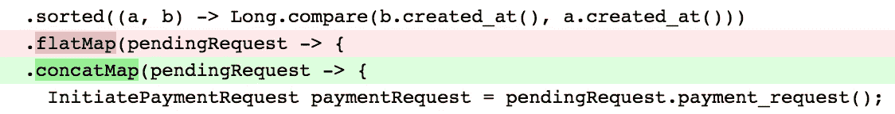
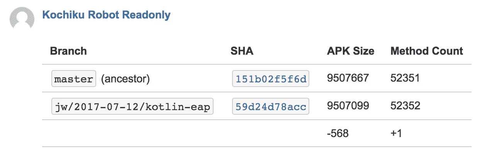
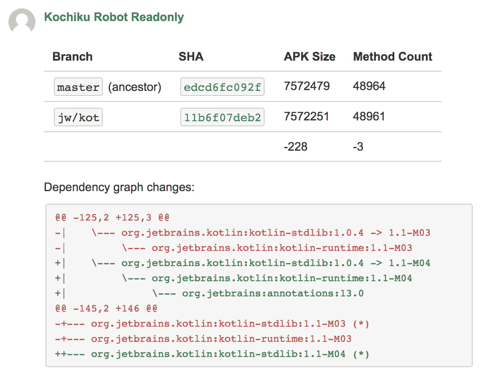
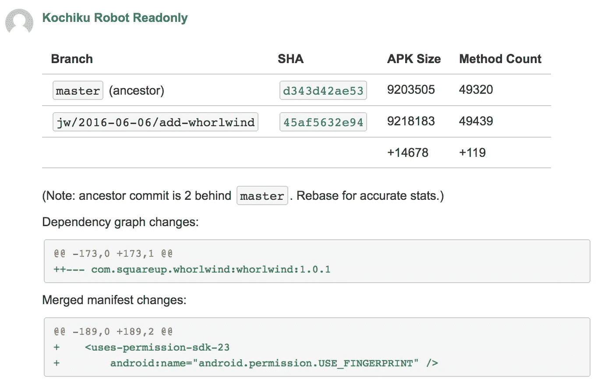
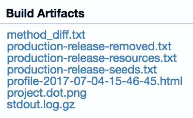

# 显示拉取请求的隐藏更改

> 原文：<https://medium.com/square-corner-blog/surfacing-hidden-change-to-pull-requests-6a371266e479?source=collection_archive---------2----------------------->

> 注意，我们已经行动了！如果您想继续了解 Square 的最新技术内容，请访问我们在 https://developer.squareup.com/blog[的新家](https://developer.squareup.com/blog)

编程经常处理可见的变化:代码中的逻辑、声明的依赖项、公开的 API。然而，有相当多的相关隐藏更改:可传递的依赖关系、生成的代码和清单文件。

在代码审查中，我们关注可见的东西，因为那是在差异中呈现给我们的东西。

A visible logic change in a pull request.

同样重要的是，在代码审查期间要注意隐藏的变化。可传递的依赖关系更改或生成的代码更改可能会使生成的二进制文件膨胀或降低性能。清单更改可能会导致下游不兼容。这些问题通常在发布过程的后期才被发现，需要进行调查以找到原因。

在 Cash Android 团队中遇到一些隐藏更改的问题后，我们决定在它们更改的地方提升它们的可见性:拉请求。

APK size and method count diff on an automatic PR comment.

在每个 CI 构建中，我们计算有趣的数据片段，如二进制大小和方法计数(Android 应用程序的一个重要指标)，并将它们写入共享存储。当 CI 构建为 pull 请求运行时，我们会计算出这些值与主服务器上的祖先提交的值之间的差异。这些数字以注释的形式发送回 pull 请求，以确保作者和任何审阅者都得到通知。

这些重要的度量现在明确地呈现出来，以确保结果是您想要的。这个新的依赖项仅仅增加了 10 个方法，还是增加了 10，000 个方法？那个新英雄形象是只加 20KB 还是占 2MB？

A full dependency graph diff is included when a dependency changes.

除了这些简单的数字统计之外，我们还捕获了应用程序和 Gradle 的构建脚本(构建系统依赖项)的整个依赖图。

在这里，我们将 Kotlin 从 1.0.4 升级到了 1.1 里程碑。我们不仅保存了 3 个方法，而且我们可以看到它们从`kotlin-runtime`工件向 JetBrains 的`annotations`工件添加了一个依赖项。

Android 构建使用所谓的清单合并来创建应用程序的最终清单。它将您定义的清单与您使用的库中嵌入的清单合并在一起。从 Android 操作系统的角度来看，这个合并的清单本质上是应用程序的公共 API，定义了入口点、公开的服务和所需的权限等内容。跟踪清单中的变化非常重要，因为这可能会在升级时导致不兼容。

A merged manifest diff is included when something changes.

Square 的开源库 [Whorlwind](https://github.com/square/whorlwind) 简化了向应用程序添加指纹支持。它的清单中包含了使用指纹识别器的权限。当将库添加到 Cash 中时，该权限最终出现在我们的合并清单中，因此显示在 pull 请求注释中。

虽然这个示例是无害的，但意外的权限或错误公开的组件可能会合并进来，并为您的用户带来升级问题或安全漏洞。

并不是所有隐含的信息都应该直接暴露在这个注释中。例如，方法计数的变化总是引起我的兴趣，我想看看各个方法的实际差异。这些计数有时数以千计，这将使评论无法使用和恼人的。我们没有在注释中直接显示方法 diff，而是将 diff 呈现到一个文件中，该文件作为附件包含在 CI 构建中。

More detailed information on what changed is attached to CI shards.

当您想了解评论中包含的更多详细信息时，您只需点击 CI 服务器。此示例显示了一个提供完整方法 diff 的构建碎片，一个 ProGuard 删除内容的报告，一个 resource shrinker 删除内容的报告，一个显示构建速度的 Gradle profile，以及一个项目模块图的图像呈现。其他碎片包括像 Android 的 Lint 报告或测试执行摘要之类的东西。

您选择在注释或 CI 中包含的内容取决于您的项目。对于现金机器人，这些是我们认为最有价值的东西。目标应该是一样的:表面信息很重要，但是隐藏起来看不见。