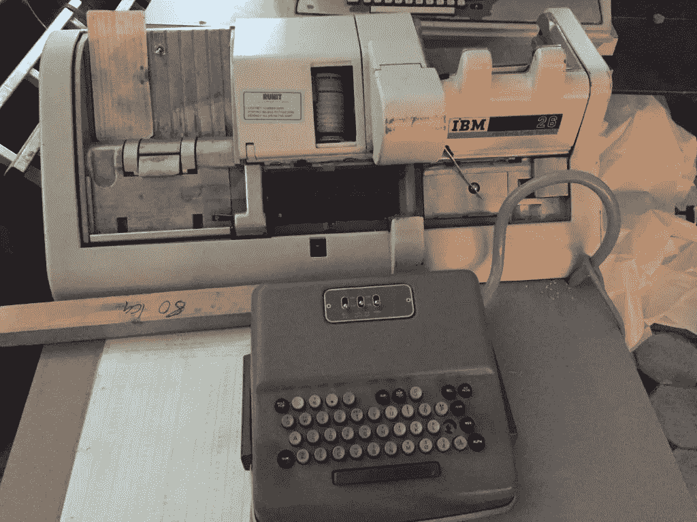
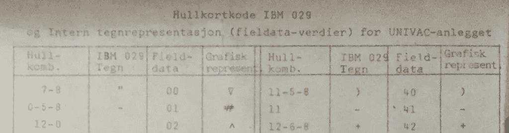
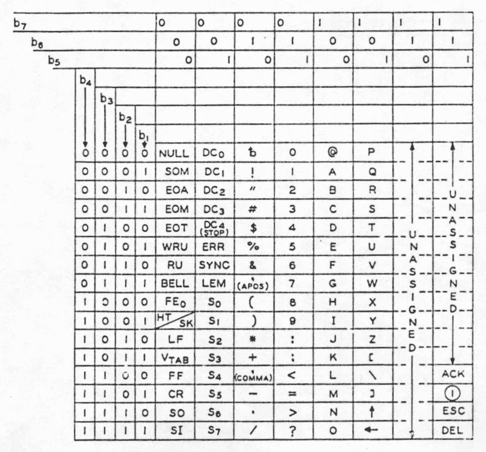
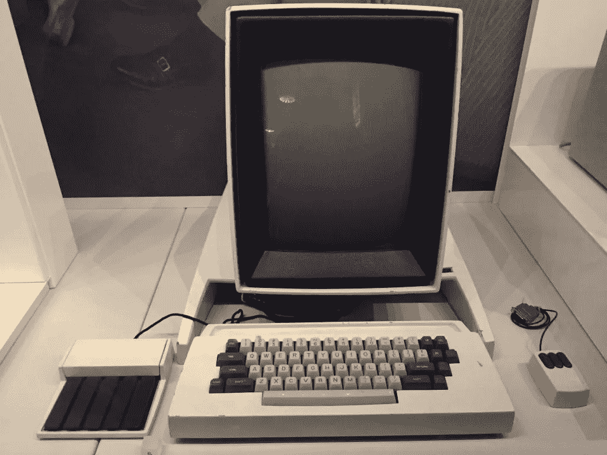

# Surr med skilletegn

> 原文：<https://medium.com/compendium/surr-med-skilletegn-6f1665f3440b?source=collection_archive---------0----------------------->

## Det er ikke alltid lett å gjøre de riktige tingene…

**Før eller siden sitter man der. Med en legacy-backend basert på hullkort og heksekunst, eller en monster-monolitt skrevet rett i maskinkode. I et anfall av panisk pragmatisme besluttet opprinnelig utvikler å representere all personinformasjon som en eneste lang streng, strukturert etter** [**Voynich-metoden**](https://no.wikipedia.org/wiki/Voynich-manuskriptet) **. Noen har fått nyss om at e-post er siste skrik innen EDB, og du har fått den utakknemlige jobben med å utvide systemet til å håndtere e-postadresser.**

Det eneste humane ville vært å ta med seg hele det gamle systemet bak på serverrommet, stryke det forsiktig en siste gang over de groteske abstraksjonene over, for så å ta ladegrep på hagla. Denne muligheten har dessverre ikke du, og av ulike økonomiske, tidsmessige eller politiske grunner er du stuck med å få dette til å fungere innenfor eksisterende tekniske rammer.



Pensjonert hullkort-punch fra Rjukan (foto: Teodor A. Elstad)

Navn og e-postadresse er jo bare strenger tenker du, og griper etter siste halmstrå. Hva om man slår sammen navn-strengen og epost-strengen med et skilletegn? Da kan det gamle systemet lagre dataene som før, og du kan skjule splitte- og sammenslåingsgalskapen bak mer eller mindre organisert kode. Men hvilket skilletegn skal man velge? Hvilke tegn er det som ikke finnes i et navn eller en e-postadresse?

Du velger til slutt [tilde](https://en.wikipedia.org/wiki/Email_address#Examples) ( ~ ) og krysser fingrene når det oppdaterte systemet går i produksjon.

## X3.4–1963

La oss skru tiden tilbake til 1963\. Valentina Tereshkova ble første kvinne i rommet med Vostok 6, i Norge sang Nora Brockstedt «Solverv», og i statene ble det i stillhet utgitt en ganske revolusjonerende standard med det klingende navnet [American Standard Code for Information Interchange, ASA X3.4–1963](http://worldpowersystems.com/archives/codes/X3.4-1963/index.html) .

Å håndtere tekst i dataprogrammer var utfordrende på 50-tallet. De fleste var enige om det grunnleggende. Ta et tegn, eksempelvis «T», og definer at dette tegnet skal representeres av et passende antall nuller og enere, eksempelvis 1010100 (84 i titallsystemet). Gjør dette med alle tegnene du har tenkt til å bruke. Du har nå et sett med kodede tegn, eller tegnsett som det gjerne kalles. Sett disse kodede tegnene etter hverandre i en streng, og vips, kan du representere vilkårlig tekst.

Den store ulempen var at ulike datamaskiner var uenige om hvilke nuller og enere som skulle representere hvilke tegn. Det var så ille at IBM lenge produserte flere ulike maskiner som brukte ulike tegnsett. Problemet ble bare forsterket av at man hadde begynt å koble flere og flere av disse maskinene sammen i håp om at de skulle kunne kommunisere.



Hullkortkoder fra det gamle UNIVAC-anlegget på Rjukan (foto: Teodor A. Elstad)

Standardisering var blitt forsøkt tidligere og hadde i stor grad ledet til krangel, men i starten av 60-tallet nedsatte American Standards Association (ASA, i dag [American National Standards Institute](https://www.ansi.org/about_ansi/introduction/history) , ANSI) komiteen X3.2 med ansvaret for å utarbeide et standard tegnsett for kommunikasjon mellom datamaskiner. Første utgave av den nye standarden ble utgitt i 1963 og tittelen «American Standard Code for Information Interchange» ble i dagligtale raskt forkortet til ASCII.

ASCII ble en kjempesuksess, og gjennomgikk flere revisjoner i takt med at bruksområdet ble utvidet fra kommunikasjon mellom datamaskiner til generell representasjon av tekst. Selv i dag er tilbakekompatibilitet med ASCII bevart i mange moderne tegnsett, blant annet UTF-8 (og Unicode implementert over UTF-8).

## Du ville høre mer om tegnsett fra 60-tallet sa du?

Hvis vi ser på den opprinnelige ASCII-tabellen fra 1963 ser vi at X3.2 komiteen valgte å bruke 7 bit for å representere hvert tegn. I appendikset til standarden er det beskrevet at 7 bit er valgt fordi 6 bit ikke kunne representere mange nok ulike tegn, mens 8 bit kunne representere langt flere tegn enn det som trengtes. X3.2 komiteen lot seg med andre ord inspirere av eventyret om Gullhår og de tre bjørnene.

Man kan finne frem til koden for hvert tegn i tabellen ved å ta de tre nullene og enerne i hver kolonne, og sette sammen med tilhørende fire nuller og enere for hver rad. Eksempelvis blir tegnet «T» til tallet 101 0100.



ASCII-tabell fra American Standard Code for Information Interchange, ASA X3.4–1963 (Wikipedia)

En liten overraskelse er at tabellen ikke inneholder små bokstaver, men i stedet har flere felter som er markert som «unassigned». Disse feltene blir etter revisjon av standarden i 1965 fylt ut med blant annet små bokstaver. Før man besluttet å legge til små bokstaver, ble det debattert ganske lenge om man ikke heller skulle fylle de ledige plassene med flere kontrolltegn. Med moderne øyne virker det unektelig ganske rart at man skulle droppe små bokstaver til fordel for enda flere kontrolltegn, men det er ikke like rart hvis man tenker på at standarden opprinnelig ble laget for kommunikasjon mellom datamaskiner, og ikke representasjon av tekst for brukere av datamaskinene.

Hvem vet hva som hadde skjedd med populariteten til ASCII hvis X3.2 komiteen hadde valgt å sløyfe små bokstaver?

## Men hva med skilletegnene?

Nederst i kolonne to av ASCII-tabellen fra 1963 finner vi åtte tegn med de kryptiske navnene S0, S1, S2 … S7\. I appendikset er det beskrevet at disse åtte tegnene er reservert for «informasjons-skilletegn». Videre står det at disse skal implementeres slik at man kan bruke de for hierarkisk å separere ulike informasjonselementer. Det er med andre ord snakk om tegn, uten en visuell representasjon, spesielt reservert for å være skilletegn mellom andre strenger!

Fra 1965 og frem til i dag er S4 — S7 videre standardisert som *File Separator* (FS — kode 28), *Group Separator* (GS — kode 29), *Record Separator* (RS — kode 30) og *Unit Separator* (US — kode 31). Disse separatorene har beholdt den opprinnelige hierarkiske inndelingen. Det betyr at man kan skille ulike elementer i en entitet med Unit Separator. Eksempelvis kan entiteten person representeres som Teodor Ande[US]Elstad[US]tae@computas.com. En samling av slike entiteter kan skilles med Record Separator, eksempelvis person1[RS]person2\. Samlinger av ulike entiteter kan skilles med Group Separator, eksempelvis personer[GS]biler, og hvis man da ikke har hierarki nok, kan man bruke File Separator.

```
Teodor Ande[US]Elstad[US][tae@computas.com](mailto:tae@computas.com)[RS]
Jan[US]Johansen[US][jah@aol.com](mailto:jah@aol.com)
[GS]
Volvo 240[US]1974[RS]
Volvo Amazon[US]1956[RS]
Ford Mustang[US]1965
```

Det er litt artig å tenke på at problemet med å velge et unikt skilletegn ble påtenkt allerede i første utgave av ACSII-standarden fra 1963, og at skilletegn var en del av standarden før små bokstaver (!)

## En retro redning

Hvis man har muligheten, er det stort sett alltid bedre å representere data på en annen måte enn å slå sammen strenger med skilletegn imellom. Til og med hvis man har behov for å dumpe store mengder data til en tekstfil kan det være en fordel å bruke mer menneskevennlige tegn som komma og linjeskift, hvis brukeren kan komme til å titte i fila i etterkant.

***Men* , hvis du virkelig trenger et skilletegn som ikke finnes i annen tekst, kan redningen være å børste støvet av fire tegn fra 1963\.**



Xerox Alto fra Science Museum i London (foto: Teodor A. Elstad)

## Kilder:

*   [ANSI: Historical Overview](https://www.ansi.org/about_ansi/introduction/history)
*   [American Standard Code for Information Interchange, ASA X3.4–1963](http://worldpowersystems.com/archives/codes/X3.4-1963/index.html)
*   [Encyclopedia of Computer Science and Technology: Volume 2](https://books.google.no/books?id=nn5ym7HaEa4C&pg=PA273&dq=USA+Standard+Code+for+Information+Interchange,+USAS+X3.4-1967&hl=no&sa=X&ved=0ahUKEwi16diEtvnRAhWGC5oKHdVMAX8Q6AEILzAA#v=onepage&q=USA%20Standard%20Code%20for%20Information%20Interchange%2C%20USAS%20X3.4-1967&f=false)
*   [ASCII — Wikipedia](https://en.wikipedia.org/wiki/ASCII)

*Teodor Ande Elstad er senior kunnskapsingeniør hos Computas. Når han ikke graver seg ned i gamle tegnsett, jobber han med å få til skjønn harmoni mellom gamle og nye datasystemer hos Utlendingsdirektoratet. Han brenner for automatisering, og tror at man må forstå hvor man kommer fra for å vite hvor man skal videre. Du kan finne han på* [*twitter*](https://twitter.com/_teodoran) *.*