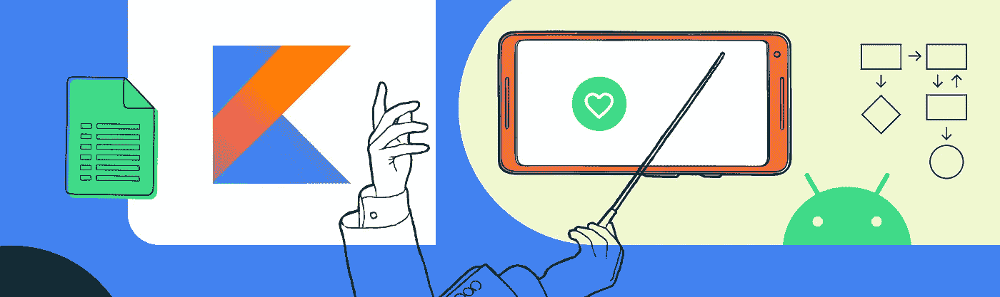
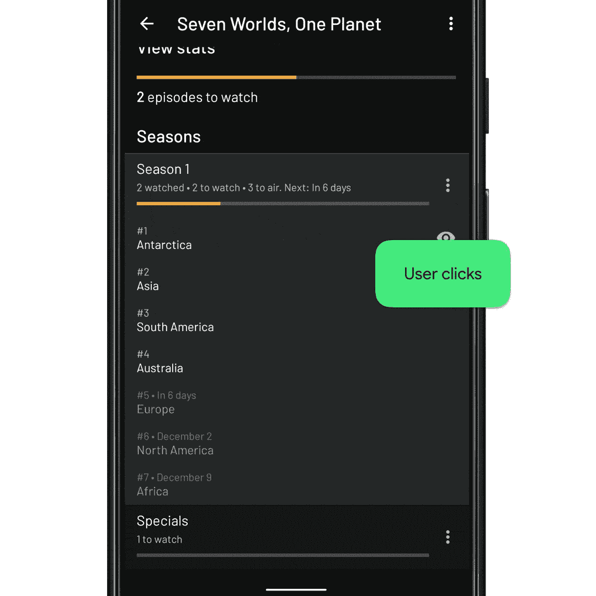
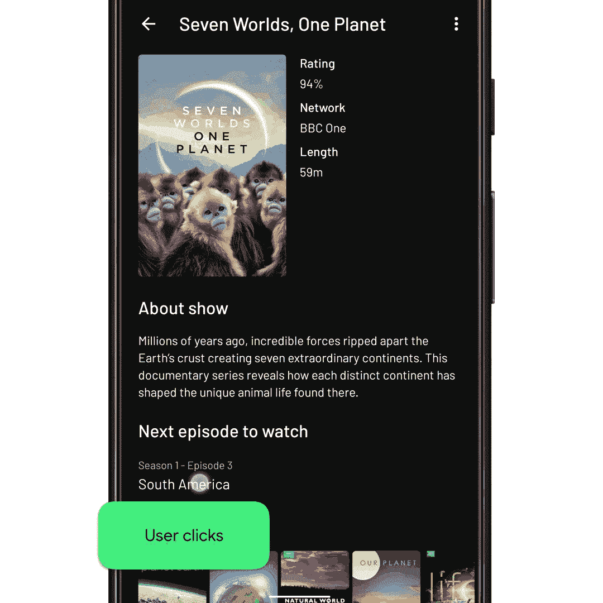

# 在视图上暂停—示例

> 原文：<https://medium.com/androiddevelopers/suspending-over-views-example-260ce3dc9100?source=collection_archive---------2----------------------->



Illustration by [Virginia Poltrack](/@VPoltrack)

## 一个来自 [Tivi](https://tivi.app) 应用的工作示例

这篇博客文章是探索协程如何让您以更简单的方式编写复杂的异步 UI 操作的两篇文章中的第二篇。第一篇文章介绍了理论，而这篇文章展示了他们是如何解决问题的。

如果你想回顾第一篇文章，你可以在这里找到:

[](/androiddevelopers/suspending-over-views-19de9ebd7020) [## 在视图上暂停

### Android view 系统爱回调；喜欢试镜。给你一个想法，目前有 80+…

medium.com](/androiddevelopers/suspending-over-views-19de9ebd7020) 

让我们把我们在上一篇文章中学到的东西应用到一个真实的应用用例中。

# 问题是

这里我们有来自 [Tivi](https://tivi.app/) 示例应用程序的电视节目细节用户界面。除了关于这部剧的信息，它还列出了该剧的季节和剧集。当用户单击其中一集时，该集的详细信息会使用动画显示，该动画会展开所单击的项目:



Episode expanding (20% speed)

应用程序使用[**InboxRecyclerView**](https://github.com/saket/InboxRecyclerView)库来处理上面展开的动画:

`InboxRecyclerView`由我们提供项目 ID 的工作视图来展开。然后，它从`RecyclerView`项中找到匹配的视图，并在其上执行动画。

现在让我们来看看我们试图解决的问题。在同一个用户界面的顶部附近是一个不同的项目，它向用户显示他们要观看的下一集。它使用与上面显示的单个剧集项目相同的视图类型，但具有不同的项目 ID。

为了帮助开发，我很懒，对这个项目使用了同样的`onEpisodeItemClicked()`。不幸的是，这导致点击时动画中断。



Wrong item expanding (20% speed)

库不会展开被点击的项目，而是在顶部展开一个看似随机的项目。这不是我们想要的效果，是由一些潜在的问题造成的:

1.  我们在 click listener 中使用的 ID 直接取自`Episode`类。该 ID 映射到季节列表中的单个剧集项目。
2.  剧集条目可能不附属于`RecyclerView`。用户将需要扩展季节*和*滚动，以便项目在视口中，视图存在于`RecyclerView`中。

由于这些问题，库退回到扩展第一项。

# 理想溶液

那么什么是预期的行为呢？理想情况下，我们应该有这样的东西(放慢速度:


The ideal result (20% speed)

在伪代码中，它可能看起来有点像这样:

然而在现实中，它需要看起来更像这样:

正如您所看到的，我们一直在等待异步事件的发生！⏳

这里的伪代码看起来并不复杂，但是当你开始实现它时，我们很快就陷入了回调地狱。下面是一个使用链式回调编写框架解决方案的尝试:

这段代码并不是特别好，可能也不起作用，但是它很好地说明了回调是如何让 UI 编程变得非常复杂的。通常，此代码有几个问题:

## 紧密耦合

因为我们必须使用回调来编写过渡，所以每个“动画”必须知道接下来要调用什么:回调#1 调用动画 2，回调#2 调用动画#3，等等。这些动画彼此没有关系，但我们不得不将它们结合在一起。

## 难以维护/更新

写完这篇文章的两个月后，你的动作设计师要求你在中间添加淡入淡出过渡。您需要跟踪过渡，检查每个回调以找到触发新动画的正确回调。那么你需要测试它…

## 测试

无论如何，测试动画是很难的，但是依赖这种混乱的回调会使它变得更加困难。你的测试需要考虑所有不同的动画类型，回调它自己来断言某个东西运行了。在本文中，我们并没有真正触及测试，但是协程使测试变得更加容易。

# 营救🦸的协管员

在第一篇文章中，我们学习了如何将回调 API 封装到挂起函数中。让我们利用这些知识将我们丑陋的回调代码变成这样:

这有多大的可读性？！💘

新的 await 挂起函数隐藏了所有的复杂性，产生了一个函数调用的顺序列表。让我们深入了解细节…

# motion layout . awaittranspotioncomplete()

目前没有可用的 [MotionLayout](https://developer.android.com/reference/android/support/constraint/motion/MotionLayout) ktx 扩展，`[MotionLayout](https://developer.android.com/reference/android/support/constraint/motion/MotionLayout)`也缺少一次添加多个监听器的能力([特性请求](https://issuetracker.google.com/issues/144714753))。这意味着`awaitTransitionComplete()`函数的实现比其他一些函数要复杂一些。

我们使用了`[MotionLayout](https://developer.android.com/reference/android/support/constraint/motion/MotionLayout)`的一个子类，它增加了对多个监听器的支持:`[MultiListenerMotionLayout](https://gist.github.com/chrisbanes/a7371683c224464bf6bda5a25491aee0)`。

我们的`awaitTransitionComplete()`函数被定义为:

# Adapter.awaitItemIdExists()

这个功能可能很小众，但也很有用。在上面的电视节目示例中，它实际上处理几种不同的异步状态:

```
// Make sure that the season is expanded, with the episode attached
viewModel.expandSeason(nextEpisodeToWatch.seasonId)**// 1\. Wait for new data dispatch
// 2\. Wait for RecyclerView adapter to diff new data set**// Scroll the RecyclerView so that the episode is displayed
recyclerView.scrollToItemId(nextEpisodeToWatch.id)
```

该函数使用 RecyclerView 的 [AdapterDataObserver](https://developer.android.com/reference/androidx/recyclerview/widget/RecyclerView.AdapterDataObserver.html) 实现，每当适配器的数据集发生变化时都会调用该函数:

# RecyclerView.awaitScrollEnd()

最后一个要突出显示的函数是`[RecyclerView](https://developer.android.com/reference/androidx/recyclerview/widget/RecyclerView.html).awaitScrollEnd()`函数，它等待任何滚动完成:

希望现在这段代码看起来很普通。这个函数的棘手之处在于在执行快速失效检查之前需要使用`awaitAnimationFrame()`。正如评论中提到的，这是因为一个`[SmoothScroller](https://developer.android.com/reference/androidx/recyclerview/widget/RecyclerView.SmoothScroller.html)`实际上在下一个动画帧开始，所以我们需要在检查滚动状态之前等待它发生。

`awaitAnimationFrame()`是`[postOnAnimation()](https://developer.android.com/reference/android/view/View.html#postOnAnimation(java.lang.Runnable))`的包装器，它允许我们等待下一个动画时间步，这通常发生在下一次显示渲染时。它的实现类似于第一篇文章中的`doOnNextLayout()`示例:

# 决赛成绩

最后，操作序列如下所示:


Solution, broken down into steps (20% speed)

# 打破回调链⛓️

转移到协程导致我们的代码能够脱离庞大的回调链，这很难维护和测试。

将回调/监听器/观察器 API 包装成一个挂起函数的方法对于所有 API 来说基本上都是一样的。希望我们在这篇文章中展示的函数现在看起来很重复。因此，向前迈进，释放回调链的 UI 代码🔨。