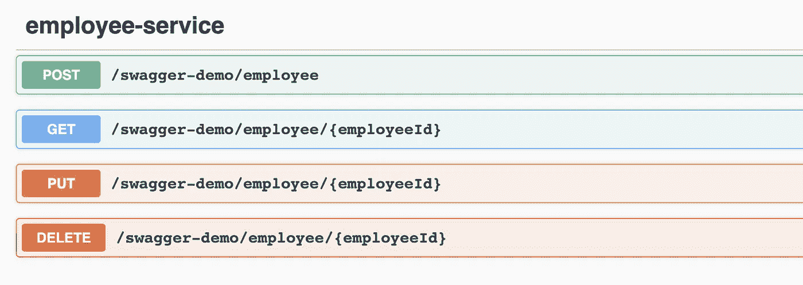

# Webflux 函数式编程模型的 Swagger 实现

> 原文：<https://medium.com/walmartglobaltech/swagger-implementation-for-webflux-functional-programming-model-8ac55bfce2be?source=collection_archive---------0----------------------->


# 1.概观

## 什么是霸气？

[***Swagger***](https://swagger.io/)是一套围绕 OpenAPI 规范构建的开源工具，可以帮助你设计、构建、文档化和消费 REST APIs。它有助于构建交互式 API 文档，并作为 API 的测试工具。它还提供了一个 UI 来测试您的 API。

**什么是 OpenAPI？**

[***OpenAPI 规范***](https://swagger.io/docs/specification/about/) (原 Swagger 规范)是 REST APIs 的一种 API 描述格式。

OpenAPI 文件允许您描述整个 API，包括:

*   可用端点(/员工，/工作)
*   每个端点上的操作(GET /employees、POST / employee、PUT /employee、DELETE /employee)
*   每个操作的操作参数输入和输出
*   标题及其默认值
*   API 的描述

# 2.范围

本文主要关注使用 spring Webflux 函数式编程模型将 swagger 与 API 集成。Webflux 项目的创建不在本文的讨论范围之内。有关创建项目的更多信息，请点击[链接](https://spring.io/guides/gs/reactive-rest-service/)查看相关文档。

> 我们已经使用了[**springdoc-open API-webflux**](https://mvnrepository.com/artifact/org.springdoc)依赖项来为我们的 web flux 项目集成 swagger。

# 3.添加 Maven 依赖项

要使 Springdoc 支持基于 Spring WebFlux 的反应式应用程序，必须包含以下两个库。

```
<dependency>
  <groupId>org.springdoc</groupId> 
  <artifactId>springdoc-openapi-webflux-core</artifactId>
  <version>1.4.3</version>
</dependency><dependency>
  <groupId>org.springdoc</groupId> 
  <artifactId>springdoc-openapi-webflux-ui</artifactId>
  <version>1.4.3</version>
</dependency>
```

可以根据需要使用相同或更高的依赖版本。

> **注意:**与 SpringFox 库相比，SpringDoc OpenAPI 库对使用 WebFlux 构建的 Spring reactive API 有更多的支持。我们也可以根据需要启用 SpringFox 和 Springdoc-openapi。

# 4.将 OpenAPI 集成到项目中

## 4.1.`@OpenAPIDefinition`

添加一般应用程序/api 信息(联系信息、版本、描述等)、标签、服务器、安全性和外部文档的注释。

**@Info:** 注释用于填充 OpenAPI 文档的 Info 部分。`info`部分包含 API 信息:`title`、`description`(可选)、`version`。

*   `title-`应用程序/Api 名称。
*   关于 API 的扩展信息。
*   `version-`指定 API 的版本

`info`还支持联系信息、许可证、服务条款和其他细节的其他关键字。

> **注意**:这个博客包含一个基本用例所需的元素。@ OpenAPIDefination 注释中所有支持的元素都可以在这里找到。

下面的代码示例将批注添加到主类中，其中包含有关应用程序的信息和 API 信息的特定方法。

```
@SpringBootApplication@OpenAPIDefinition(info = @Info(title = "Swagger Demo"**,** version = "1.0"**,** description = "Documentation APIs v1.0"))public class SwaggerDemoApplication {
//..
}
```

将标题、版本和描述添加到应用程序后，Swagger UI 标题将类似于下图。


Header Section of Swagger UI

## 4.2.`@RouterOperation`

从版本 1.3.8 开始，增加了对功能端点的支持。为此添加了两个主要注释:`@RouterOperations`和`@RouterOperation`。

只有带有`@RouterOperations`和`@RouterOperation`的 REST APIs 可以显示在 swagger-ui 上。

`**@RouterOperation**`:如果路由器 bean 包含一个与 REST API 相关的路由，应该使用这个注释。它可以引用-

*   spring Bean (beanClass 属性)
*   路径(API 路径)
*   请求方法(GET、POST 等)
*   基础方法(beanMethod 属性)

Springdoc-openapi 然后将检查这个方法和这个方法级别上的 swagger 注释。

> **注意** : `beanClass`和`beanMethod`是允许 Springdoc 检查`Service`和解析 API 合同所必需的。

`**@RouterOperations**`:

如果路由器 bean 包含多个路由，则应该使用此注释。使用 RouterOperations 时，必须填写 path 属性。

`**@Operation**`:对文档响应状态代码、响应对象、请求正文、请求参数等的注释。


Code Snippet - @RouterOperation Usage

# 5.`Advanced Configuration`

## 5.1.**对 Api 进行分组**

基于请求映射对 API 进行分组。在项目属性中包含以下属性以启用组 API。

```
*springdoc.api-docs.groups.enabled=true*
```

在 Swagger 配置文件中配置 GroupedOpenAPI，如下面的代码片段所示，其中创建了两个分组 API。所有公共路径为" */swagger-demo/employee/* 的 API 将被归入一个组，而路径为"/swagger-demo/department/"的 API 将归入另一个组。

## 5.2.**记录公共标题**

*   `*OpenApiCustomiser*`:用于自定义 openAPI 对象。
*   要包含通用头文件，您可以编写自己的`***OpenApiCustomiser***` *实现，如下文的*。
*   将每个表头作为参数项添加到操作中。可以通过添加“*强制添加表头。必选(true)* “并通过添加”为标题分配默认值。架构(新的 StringSchema()。例(“测试”))”。

Swagger Configuration

# 6.Swagger UI

**Swagger UI** 默认会在[http://localhost:8080/Swagger-UI . html #/](http://localhost:8080/swagger-ui.html#/)曝光。

> **注意**:要更改 swagger UI url 的默认上下文路径，请在属性文件中添加以下属性并提供所需路径。

```
springdoc.swagger-ui.path=/swagger-doc/swagger-ui.html
springdoc.api-docs.path=/swagger-doc/v3/api-docs
```

## 6.1.`TEST`

现在我们已经设置好了一切，让我们看看我们的 Swagger UI。

I)我们已经配置了两个分组 API 的下拉菜单


GroupedOpenAPI for Employee and Department Service

ii)这些都是我们向 Swagger 展示的员工服务 API



iii)这是我们的请求部分的外观。它包含有关请求正文样本、必填字段、标题、必填标记及其默认值的信息。我们可以尝试使用默认值的 API。


Header And Request Body Schema


Header And Request Body Example Value

IV)API 的响应代码


All Response Code and Objects

# 7.结论

Swagger 是一个非常强大的工具。它为自动化 API 文档过程提供了绝对的灵活性。在本文中，我们展示了如何使用 **OpenAPI** **规范将我们的 Weblux 应用程序与函数式编程模型集成到 Swagger 文档中。**

# 8.参考资料:

1.  github[https://github . com/springdoc/springdoc-openapi/tree/master/springdoc-openapi-web flux-core](https://github.com/springdoc/springdoc-openapi/tree/master/springdoc-openapi-webflux-core)
2.  Spring WebFlux 文档:[https://springdoc.org/](https://springdoc.org/)