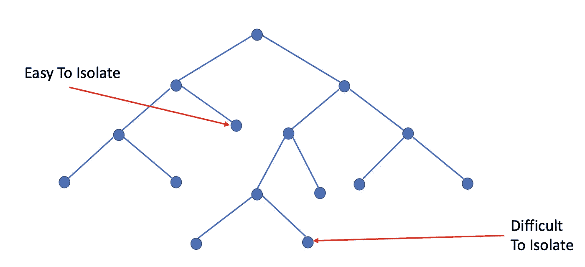
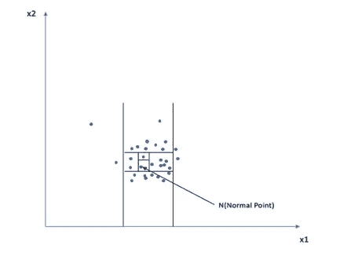
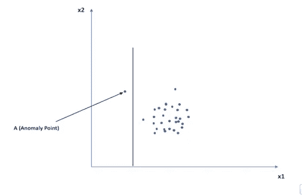
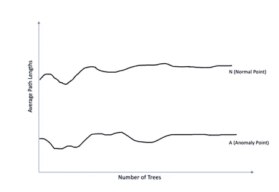
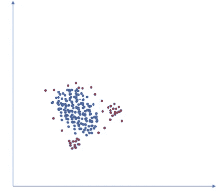
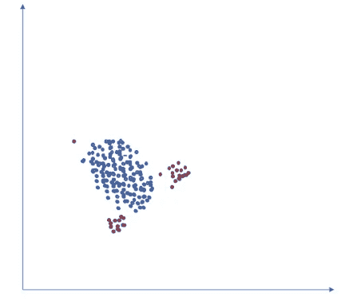

# 异常探测中的淹没和掩蔽:隔离森林中的二次抽样如何有助于减轻这种情况？

> 原文：<https://medium.com/walmartglobaltech/swamping-and-masking-in-anomaly-detection-how-subsampling-in-isolation-forests-helps-mitigate-bb192a8f8dd5?source=collection_archive---------1----------------------->

**与大多数异常检测算法不同，隔离森林以非常小的子采样尺寸实现了高效率的高异常检测性能，在大多数异常检测算法中，采样尺寸越大，检测性能越好。**

我最近的工作任务之一是识别与在线购物的退货和退款相关的欺诈模式。我处理的测试数据集接近 200 万个客户和 40 个特性。数据中可用的功能包括与退款交易的价值和数量、退货产品类别、退货背后的原因、送货和账单地址之间的距离、订单使用的支付渠道、订单和退货时间戳等相关的统计数据。我尝试了无监督学习技术，如 [K 均值聚类](https://en.wikipedia.org/wiki/K-means_clustering)和 [DBSCAN](https://en.wikipedia.org/wiki/DBSCAN) (基于密度的聚类)，在我的 16GB 内存 MacbookPro 上收敛需要 20 多分钟。

然后，我在同一个数据集上尝试隔离森林，速度提高了 10 倍。但是，我们在这里就不多谈执行速度了。我将在另一篇博客中讨论隔离林如何通过实时性能统计更快地收敛。除了执行速度之外，我还观察到了高检测性能。这让我对这个算法进行了更多的探索。

关于隔离森林算法工作的文章/博客已经很少了。你可以在这里和[这里](https://towardsdatascience.com/anomaly-detection-with-isolation-forest-visualization-23cd75c281e2)了解更多。然而，有助于减少淹没和遮蔽的二次采样特性并没有被过多讨论。我还在本博客的第 3 节中简要介绍了隔离森林算法。

在下面的部分中，我将介绍异常检测中的沼泽和掩蔽问题，以及隔离林设置如何帮助有效地处理这些问题。本博客中解释的大部分概念都是基于费托尼刘，汀和的原始隔离森林研究论文。

**1)什么是异常检测？**

[异常检测](https://en.wikipedia.org/wiki/Anomaly_detection)(也称异常检测)是对罕见项目、事件或观察结果的识别。

**2)什么是淹没和掩蔽？**

异常是罕见的事件，这使得很难高精度地标记它们。**淹没**是将正常事件贴上异常标签的现象。

当使用聚类算法时，如果数据集中的片段(包括异常片段)的数量未知，则属于不同聚类的数据点会合并到一个聚类中。这导致异常值聚类合并到具有正常数据点的聚类中。基本上，离群值不会被检测到。这叫做**掩蔽。**当数据集规模较大时，淹没和遮蔽更为常见。这从下一节分享的例子中可以明显看出。任何异常检测技术都应该对淹没和掩蔽具有鲁棒性。

**3)隔离森林算法简述**

隔离林基于随机选择的要素的随机分界点在数据集上构建树的集合。这些树隔离每个点，并且所有树隔离这些点的平均路径长度有助于识别异常。平均路径越短，数据实例越不规则。让我们以具有两个特征 x1 和 x2 的数据集为例。隔离林遵循决策树的基本原则，将在 x1 和 x2 的值上创建分割，以定义(隔离)这些点。从下图中可以看出，法线点 N 是通过在特征 x1 和 x2 上进行多次分割而分离出来的。路径长度很长。

然而，异常点 A 仅被 x1 上的一个分裂所隔离。

因此，与 n 相比，A 被赋予了更高的隔离分数。我将在以后的另一篇博客中讨论更多关于隔离分数的计算。

平均路径长度(隔离一个点所需的平均分裂数)随着树数量的增加而收敛。在上图中，与正常点(N)相比，异常点(A)的平均路径长度较短

**4)使用子采样处理的淹没和遮罩！！**

大多数异常检测算法在处理大量数据实例时表现良好。大量的训练数据有助于更好地描述正常实例，与这些描述不一致的实例被标记为异常值。

隔离林不需要生长树来隔离每个正常数据实例，因为异常数据点比正常数据实例更早被隔离。正常数据实例构成了大多数训练数据点。

当使用小的取样量时，隔离林的效果最好。当样本量较大时，正常实例与异常实例过于接近。这从下面的解释中显而易见。

**Original Data Set with Normal Points in Blue and Anomaly points in Red**

当样本大时，每个隔离树隔离异常实例所需的分区数量增加。这增加了所有(异常和非异常)实例的平均路径长度。区分异常数据点更加困难和耗时。

这导致淹没(将正常实例标记为异常)和屏蔽(存在太多异常)。使用大量记录来识别异常是淹没和掩蔽背后的主要原因。隔离林在数据的不同子样本上生长单独的树。

*1)所使用的子样本具有不太密集的数据点，使得检测异常点更容易。既不是明显异常也不是非异常的数据点数量非常少。由于二次采样是随机的，排除该类别中大部分点的概率很高，使得这两类之间的区别很困难。*

*2)此外，由于每棵树使用不同的子样本，每棵树也识别不同的异常集合。*

**Subsampled Data Set with Normal Points in Blue and Anomaly points in Red**

如上图所示，这个子样本有两个集合和一个独立的异常实例。只有通过去除正常和异常实例的混乱和混合，才有可能隔离异常实例。在这里，除了树的数量之外，被认为生长每棵树的子样本的数量也成为一个调整参数。我将在下一篇博客中尝试用不同的子样本分享算法的实时性能。

我希望您对隔离森林算法有一个很好的直觉，以及它如何通过利用子采样技术减少淹没和掩蔽来实现高异常检测性能。

**5)参考文献:**

[https://cs . nju . edu . cn/Zhou zh/Zhou zh . files/publication/icdm 08 b . pdf？q =隔离-森林](https://cs.nju.edu.cn/zhouzh/zhouzh.files/publication/icdm08b.pdf?q=isolation-forest)

[https://en.wikipedia.org/wiki/Anomaly_detection](https://en.wikipedia.org/wiki/Anomaly_detection)

[http://www . matias-CK . com/files/papers/Extended _ Isolation _ forest . pdf](http://www.matias-ck.com/files/papers/Extended_Isolation_Forest.pdf)