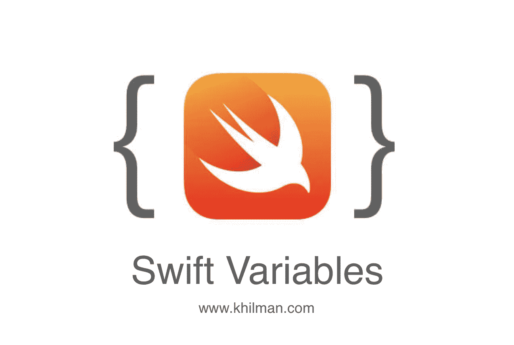

# Swift : Mengenal Variable #Belajar-iOS

> 原文：<https://medium.easyread.co/swift-mengenal-variable-belajar-ios-58cf5f645976?source=collection_archive---------8----------------------->



Variable merupakan tempat untuk menampung suatu data atau nilai. Jika kita lihat dari sisi bahasanya, ‘ ***Vari-able’*** yang memungkinkan menampung tipe data yang bervariasi atau bermacam-macam.

Dimasa-masa SMP/SMA pasti sudah pernah mengenal konsep Al-Jabar kan ? dimana suatu huruf dapat mewakili sebuah nilai.

Dalam konsep Al-jabar kita mengenal :

***a = 1
b = 2 + a***

maka dalam bahasa program dapat kita buat dalam bentuk yang sama :

**a = 1
b = 2 + a**

Hanya saja menulis variable dalam sebuah bahasa program harus di awali oleh pre-fix. Setiap bahasa program memiliki ciri khas pre-fix yang berbeda-beda (dalam berapa bahasa program pre-fix tidak diperlukan). Contohnya dalam swift sebuah variable didefinisikan oleh **var** yang artinya **variable** . Sehingga hasilnya seperti berikut :

**var a = 1
var b = 2 + a**

Variable tidak hanya dapat menampung nilai yang dapat dihitung tapi bisa juga menamping data string / karakter huruf. Nah untuk menampung data string syaratnya harus diapit oleh tanda kutip.

```
**var name = “Rizal”
var job = “iOS Developer”** *// variable ber-isi variable* ***var nick_name = name*** *// menggabungkan 2 variable string* **var profile =** “Hi, my name’s “ + ***nick_name*** + “ i’m “ **+ job**
```

> **double slash (//)** dalam bahasa program dimaksudkan sebagai komentar yang artinya tidak akan di eksekusi oleh program, bisa kita manfaatkan untuk membuat catatan atau penanda ketika kode kita sudah sangat banyak.

## Mencetak Nilai Variable

Untuk mencetak nilai suatu variable kita dapat menggunakan fungsi `print()` . Contohnya seperti berikut:

```
**var** fullName = “Rizal Hilman”
print(fullName)**var** age = 20
age = 17 *// mengubah isi variable menjadi 17*
print(age)**var** departement = “Software Engineering”
print(departement)**var** isMaried = **true** print(isMaried)**var** jobTitle: String? *// default nil, boleh bernilai kosong* jobTitle = “iOS Develoepr”
print(jobTitle)
```

> ***Info :*** `*var jobTitle:* ***String***` ***,*** adalah variable sama seperti variable lainnya. Bedanya di variable `jobTitle` kita tentukan tipe data variable tersebut secara eksplisit atau jelas. Perlu diketahui bahwa dalam bahasa Swift pendefinisian tipe data adalah *opsional,* artinya boleh ada boleh tidak. Tapi terkadang ada kondisi dimana kita perlu untuk mendefenisikan tipe data. Nantikan pemabahasan lebih lengkap soal tipe data di artikel berikutnya
> 
> Contoh lain :
> `var age: Int = 20
> var price: Double = 96.000
> var productName: = “iPhone X”`

## Variable : var vs let

Ternyata variable juga dapat didefinisikan dengan **let** , contohnya seperti ini :

```
**let** cardNumber = “331110200200303”
**let** creditCardNumber = “3123123123123”
```

Lalu dimana perbedaanya ? Sederhananya let digunakan untuk mendefinisikan sebuah konstanta yang artinya nilainya tetap dan tidak dapat diubah.

```
**var** name = “Rizal Hilman”
name = “Robert Hilman” 
print(name) *// Robert Hilman***let** creditCardNumber = “3123123123123”
print(creditCardNumber) *// 3123123123123***let** cardNumber = “121001200303”
cardNumber = “2939919231” *// error, nilai tidak bisa diubah*
print(cardNumber) *// error, nilai tidak bisa diubah*
```

Sekian catatan belajar kali ini, sampai jumpa di artikel berikutnya. Semoga bermanfaat.

[www.khilman.com](http://www.khilman.com)

> Artikel berikutnya dalam #Belajas-iOS, [**Swift: Mengenal Tipe Data #Belajar-iOS**](https://medium.com/@rizal_hilman/swift-tipe-data-belajar-ios-fbefc39005d) **.** [https://medium.com/@rizal_hilman/swift-tipe-data-belajar-ios-fbefc39005d](https://medium.com/@rizal_hilman/swift-tipe-data-belajar-ios-fbefc39005d)