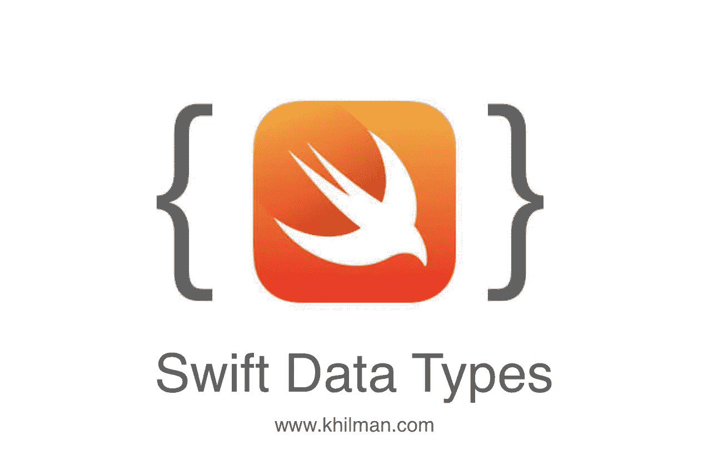
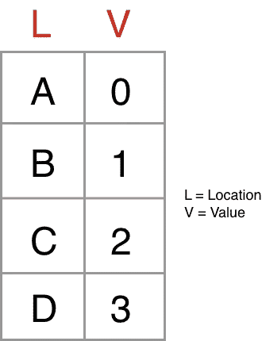

# Swift: Mengenal Tipe Data #Belajar-iOS

> 原文：<https://medium.easyread.co/swift-tipe-data-belajar-ios-fbefc39005d?source=collection_archive---------6----------------------->



Menyambung pembahasan sebelumnya soal [***variable di Swift***](https://medium.com/@rizal_hilman/swift-mengenal-variable-belajar-ios-58cf5f645976) . Kali ini kita akan membahas soal tipe data bro, sesuatu yang sangat mendasar dalam programming tapi seringkali bikin mereka yang baru ngoding kebingungan.

Jadi gini, coba kamu bayangkan Tuhan menciptakan semua buah-buahan dengan **bentuk** , **warna** & **ukuran** yang sama tetapi memiliki **isi** dan **rasa** yang berbeda.

Kira-kira kalau **tukang jus** diminta untuk membuat jus alpukat berapa lama waktu yang dihabiskan si **mamang jus** untuk mencari manakah buah **alpukat** ( *dengan asumsi buahnya ngga dikasih label* ) ? mungkin bakal ketemu tapi waktu yang dihabiskan terlalu banyak.

Untungya Tuhan menciptakan itu semua dengan bentuk, warna & rasa yang berbeda, jadi si mamang jus akan menemukan buah yang dimaksud dengan lebih cepat dan mudah.

Nah, bila kita asumsikan hal ini dalam sebuah program komputer maka pengkategorian tipe data akan sangat berkaitan dengan kecepatan dan efisiensi pemprosesan kode program.

# Yuk ikuti channel YouTube saya untuk terus update tutorial keren !!

[https://www.youtube.com/c/RizalHilman](https://www.youtube.com/c/RizalHilman)

Kenapa bisa begitu ? sebenarnya setiap variable yang kita buat akan disimpan ke dalam memori terlebih dahulu sebelum kode tersebut dieksekusi/dijalankan. Ketika kita melakukan pemanggilan variable, komputer akan mencari variable kita didalam memory apakah ada atau tidak.

Untuk lebih jelasnya berikut adalah ilustrasi bagaimana memory komputer di disain.



How Memroy Works

## Macam-macam tipe data di Swift

*   **Int** , digunakan untuk menampilkan angka dalam bilangan bulat dengan ukuran 32bit (UInt32) atau 64bit (UInt64). Contoh :
    `var angka: Int = 123456`
*   **Float** , menampung angka pecahan dengan ukuran 32-bit mulai dari **-3.40282e+38** hingga **3.40282e+38** . Contoh :
    `var angka: Float = 3.14159`
*   **Double** , menampung angka pecahan dengan ukuran 64-bit mulai dari **-2.2250738585072e-308** hingga **1.79769313486232e+308** . Contoh :`var angka: Double = 15.3162`
*   **String** , menampung data karakter huruf, misalkan “Hello World”. Contoh :
    `var nama: String = “Rizal Hilman”`
*   **Character** , menampung data karakter huruf literal (satu karakter), misalkan “C”. Contoh :
    `var jenisKelamin: Character = “L”`
*   **Bool** , boolean digunakan untuk menampung penyataan **true** atau **false** .
    `var isEmailValid: Bool = true`
*   **Optional** , digunakan untuk merepresentasikan sebuah variable dapat memiliki nilai atau tidak memiliki nilai sama sekali. Contoh :
    `var nama: String? = nil`
    `var namaLengkap: String? = “Rizal Hilman”`
    *Note : nil = null = kosong = tidak memiliki nilai apapun.*
*   **Tuple,** sekumpulan tipe data yang di digabungkan menjadi 1, tipe data penyusunnya bisa apa aja.
    `var myProfile: (String, String, Int, Bool) = (firstName: “Rizal”, lastName: “Hilman”, age: 17, isJomblo: true)`

Berikut kode yang dapat anda coba di Playground :

```
//: Playground — noun: a place where people can playimport Foundation// Integer
var angkaInteger: Int = 123456// Float
var angkaFloat: Float = 3.14159// Double
var angkaDouble: Double = 15.3162// String
var namaLengkap: String = “Rizal Hilman”// Character
var jenisKelamin: Character = “L”// Boolean
var isStatusJomblo: Bool = true// Optional
var nama: String? = nil
var namaPanggilan: String? = “Rizal Hilman”// Tuple
var myProfile: (String, String, Int, Bool) = (firstName: “Rizal”, lastName: “Hilman”, age: 17, isJomblo: true)// Cetak semua data
print(angkaInteger)
print(angkaFloat)
print(angkaDouble)
print(namaLengkap)
print(jenisKelamin)
print(isStatusJomblo)
print(nama)
print(namaPanggilan)
print(myProfile)
```

Baik, sekian pembahasan tentang Tipe data di Swift. Semoga bermanfaat, sampai ketemu di artikel berikutnya.

Terimakasih :)

# Yuk ikuti channel YouTube saya untuk terus update tutorial keren !! Kamu juga bisa request tutorial di kolom komentar loh!

[](https://www.youtube.com/c/RizalHilman) [## Rizal Hilman

### Make coding simple.

www.youtube.com](https://www.youtube.com/c/RizalHilman)